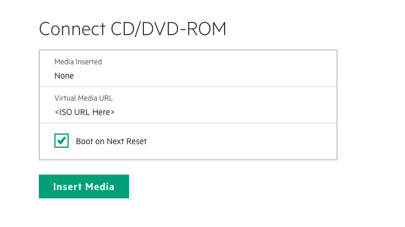
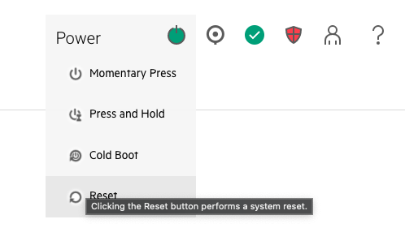

# Booting Directly From A Virtual ISO

With BMCs like ILO or Gigabyte it is possible to boot directly to an ISO rather than requiring a local USB stick.

After booting you can then setup Pre-Install Toolkit configs directly on the OS rather than requiring a USB with a PITDATA pre-populated with configs.

## Requirements:

1. Access to a pre-built PIT ISO. Either web hosted, such as on artifactory (for ILO BMCs) or a local ISO (for Gigabyte BMCs)
2. Access to stash/bitbucket
3. All other requirements in [LiveCD Creation](002-LIVECD-CREATION.md) and [LiveCD Setup](004-LIVECD-SETUP.md) for creating and populating configs

## Booting

### ILO

ILO BNCs allow for booting directly from an HTTP accessible ISO location. This can be done either from the web interface or a helper script

**Web Interface**

Access your BMC's web interface and navigate to the `Remote Console & Media` page and then the `Virtual Media` tab.

Here you can insert the Virtual Media URL, select Boot on Next Reset, and click Insert Media



Next go ahead and reboot by select reset in the top right menu control option



Finally you can open up the virtual terminal by choosing the `HTML5 Console` option when clicking the terminal image in the bottom left corner.

**Helper Script**

There is also a helper script located at `../cray-pre-install-toolkit/scripts/boot-to-iso-ilo.sh`.

This will prompt for the BMC password, connect to the BMC over ssh, mount the ISO, reboot the machine, and drop you in an ipmitool terminal

```bash
../cray-pre-install-toolkit/scripts/boot-to-iso-ilo.sh <ISO URL> <BNC Hostname or IP>
```

> **`NOTE`** It may appear that the boot is stalled at a line of `EXT4-fs (loop1): mounted ...` or `Starting dracut pre-mount hook...`. This is the step when it actually begins downloading the ISO's squashfs root filesystem and can take a few minutes

## Configuring

At this point you're booted into a bare PIT OS and can begin configuring it.

> **`NOTE`** The root OS `/` directory is writeable, but with an in-memory overlay on top of the ISO. This means that restarting the machine will result in all changes being lost. So be sure to follow the `Backing up the Overlay COW FS` section after you finish configuring or making changes.
>
>Likewise, if you are here after previously backing up the overlay directory you can follow the section `Restoring from an Overlay COW FS Backup` section and not have to reconfigure this OS

1. Set the initial password to `!nitial0` following the [LiveCD USB Boot](020-LIVECD-USB-BOOT.md) section
2. Follow the `Gather / Create Seed Files` section of [LiveCD Creation](002-LIVECD-CREATION.md)
3. Change directory to `cd /var/www/ephemeral/prep` and follow the section `Configuration Payload` of [LiveCD Creation](002-LIVECD-CREATION.md)
4. Follow the applicable sections of [LiveCD Setup](002-LIVECD-SETUP.md)

### Next: Deploy the NCNs

Now you can now pass GO, collect $200, and begin the [NCN Boots](005-NCN-BOOTS.md) page...

## Backing up the Overlay COW FS

You can backup the writeable overlay uperdir so that your changes are not lost after a reboot or when updating your ISO.

This requires that you have a location that you can SSH at tarball to as a backup.

```bash
tar czf /run/overlay.tar.gz -C /run/overlayfs/rw .
scp /run/overlay.tar.gz <somelocation>
```
> **`NOTE`** If you want to reduce the size of the backup you can also delete any squashfs files first or exclude them in the tar command `--exclude='*.squashfs'`. You will then need to re-populate those after you restore your backup


## Restoring from an Overlay COW FS Backup

Restore a backed up tarball from the previous command with

```bash
 scp <somelocation> /run/overlay.tar.gz
tar xf /run/overlay.tar.gz -C /run/overlayfs/rw
mount -o remount /
```

If you excluded the `squashfs` files from the backup you will also want to repopulate them following the configuration section.
