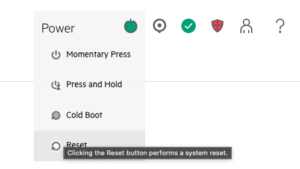

# LiveCD Virtual ISO Boot

This page will walk-through booting the LiveCD `.iso` file directly onto a BMC.

* [Requirements](#requirements)
* [BMCs' Virtual Mounts](#bmcs-virtual-mounts)
  * [HPE iLO BMCs](#hpe-ilo-bmcs)
  * [Gigabyte BMCs](#gigabyte-bmcs)
  * [Intel BMCs](#intel-bmcs)
* [Configuring](#configuring)
   * [Backing up the Overlay COW FS](#backing-up-the-overlay-cow-fs)
   * [Restoring from an Overlay COW FS Backup](#restoring-from-an-overlay-cow-fs-backup)


<a name="requirements"></a>   
## Requirements

A Cray Pre-Install Toolkit ISO is required for this process. This ISO can be obtained from:

- The Cray Pre-Install Toolkit ISO included in a CSM release tarball.
- Internal endpoints (HPE Artifactory)

<a name="bmcs-virtual-mounts"></a>
# BMCs' Virtual Mounts

Most BMCs offer a **Web Interface** for controlling your server and for providing access to its BIOS and firmware. 

Refer to the following pages based on your server vendor for help mounting an ISO image:

* [HPE iLO BMCs](#hpe-ilo-bmcs)
* [Gigabyte](#gigabyte-bmcs)
* [Intel](#intel-bmcs)

<a name="hpe-ilo-bmcs"></a>
### HPE iLO BMCs

ILO BMCs allow for booting directly from an HTTP accessible ISO location.

> Here you can insert the Virtual Media URL, select Boot on Next Reset, and click Insert Media


> Next go ahead and reboot by select reset in the top right menu control option



> Open up the virtual terminal by choosing the `HTML5 Console` option when clicking the terminal image in the bottom left corner.

> **`NOTE`** It may appear that the boot is stalled at a line of `EXT4-fs (loop1): mounted ...` or `Starting dracut pre-mount hook...`. This is the step when it actually begins downloading the ISO's squashfs root filesystem and can take a few minutes

<a name="gigabyte-bmcs"></a>
### Gigabyte BMCs

Gigabyte BMCs allow for booting over NFS or HTTP.

Go to the BMC settings and setup the remote ISO for your protocol and server.


**Web Interface**

Access your BMC's web interface and navigate to `Settings -> Media Redirection Settings -> General Settings`.

Enable `Remote Media Support` and `Mount CD/DVD` and then fill in the server IP or DNS name and the path to server.


> **`NOTE`** The gigabyte url appears to not allow certain characters and has a limit on path length. So you may need to move or rename the ISO to a location with a smaller file name.

Next head to `Image Redirection -> Remote Images` and click on the `Start` button to start the Virtual ISO mount.


Finally, reboot the server and select the `Virtual CDROM` option from the manual boot options.


<a name="intel-bmcs"></a>
### Intel BMCs

Intel BMCs allow for booting with direct ISO mounts.

> Go to the virtual media menu.


> Choose your ISO file:


> Click `mount` to make it available.


> **`NOTE`** Do not close the virtual media window or main BMC page until done.

<a name="configuring"></a>
## Configuring

* [Configuring](#configuring)
   * [Backing up the Overlay COW FS](#backing-up-the-overlay-cow-fs)
   * [Restoring from an Overlay COW FS Backup](#restoring-from-an-overlay-cow-fs-backup)


After attaching and booting into the ISO, the password will need to be changed at least before using 
the booted OS.

1. The ISO boots with no password, requiring one be set on first login. Enter blank as the password and
   follow the prompts.
2. You can no use the LiveCD to look around, or you may continue setting the LiveCD up for [a CSM installation](004-CSM-REMOTE-LIVECD.md).

> **`NOTE`** The root OS `/` directory is writeable without persistence. This means that restarting the machine will result in all changes being lost. Before restarting, consider following [Backing up the Overlay COW FS](#backing-up-the-overlay-cow-fs) and the accompanying [Restoring from an Overlay COW FS Backup](#restoring-from-an-overlay-cow-fs-backup) section.

<a name="backing-up-the-overlay-cow-fs"></a>
### Backing up the Overlay COW FS

You can backup the writeable overlay upper-dir so that your changes are not lost after a reboot or when updating your ISO.

This requires that you have a location that you can SSH at tar-ball to as a backup.

```bash
tar czf /run/overlay.tar.gz -C /run/overlayfs/rw .
scp /run/overlay.tar.gz <somelocation>
```
> **`NOTE`** If you want to reduce the size of the backup you can also delete any squashfs files first or exclude them in the tar command `--exclude='*.squashfs'`. You will then need to re-populate those after you restore your backup


<a name="restoring-from-an-overlay-cow-fs-backup"></a>
### Restoring from an Overlay COW FS Backup

Restore a backed up tarball from the previous command with

```bash
scp <somelocation> /run/overlay.tar.gz
tar xf /run/overlay.tar.gz -C /run/overlayfs/rw
mount -o remount /
```

If you excluded the `squashfs` files from the backup you will also want to repopulate them following the configuration section.
