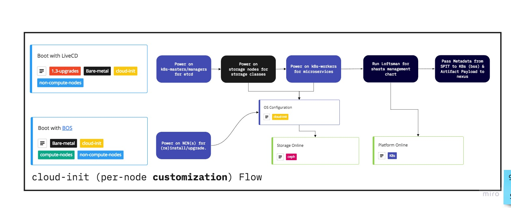

# Booting

Non-compute nodes boot two ways:
- Network/PXE booting
- Disk Booting

Each way has its own purpose.


### How can I tell if I booted via disk or pxe?

Two ways, one may be easier depending on your env.

1. `cat /proc/cmdline` if it starts with `kernel` then the node network booted. If it starts with `BOOT_IMAGE=(` then it disk booted.
2. `efibootmgr`, see what it says for `BootCurrent` and match that value to the list beneath to see if it lines up with a networking option or a `cray sd*)` option for disk boots.

### How can I reset/configure the default boot order?

Easily confiigure the default bootorder through `ipmitool`:
```bash                         
username=root
password=??????

# ALWAYS PXE BOOT; sets a system to PXE
ipmitool -I lanplus -U $username -P $password -H ncn-s001-mgmt chassis bootdev pxe options=efiboot,persistent
ipmitool -I lanplus -U $username -P $password -H ncn-s002-mgmt chassis bootdev pxe options=efiboot,persistent
ipmitool -I lanplus -U $username -P $password -H ncn-s003-mgmt chassis bootdev pxe options=efiboot,persistent
ipmitool -I lanplus -U $username -P $password -H ncn-m001-mgmt chassis bootdev pxe options=efiboot,persistent
ipmitool -I lanplus -U $username -P $password -H ncn-m002-mgmt chassis bootdev pxe options=efiboot,persistent
ipmitool -I lanplus -U $username -P $password -H ncn-m003-mgmt chassis bootdev pxe options=efiboot,persistent
ipmitool -I lanplus -U $username -P $password -H ncn-w003-mgmt chassis bootdev pxe options=efiboot,persistent
ipmitool -I lanplus -U $username -P $password -H ncn-w002-mgmt chassis bootdev pxe options=efiboot,persistent

# ONE TIME BOOT INTO DISK; rebooting again will PXE; can run this everytime to reboot to disk for developers.
ipmitool -I lanplus -U $username -P $password -H ncn-s001-mgmt chassis bootdev disk options=efiboot
ipmitool -I lanplus -U $username -P $password -H ncn-s002-mgmt chassis bootdev disk options=efiboot
ipmitool -I lanplus -U $username -P $password -H ncn-s003-mgmt chassis bootdev disk options=efiboot
ipmitool -I lanplus -U $username -P $password -H ncn-m001-mgmt chassis bootdev disk options=efiboot
ipmitool -I lanplus -U $username -P $password -H ncn-m002-mgmt chassis bootdev disk options=efiboot
ipmitool -I lanplus -U $username -P $password -H ncn-m003-mgmt chassis bootdev disk options=efiboot
ipmitool -I lanplus -U $username -P $password -H ncn-w003-mgmt chassis bootdev disk options=efiboot
ipmitool -I lanplus -U $username -P $password -H ncn-w002-mgmt chassis bootdev disk options=efiboot
```

### Bootstrap

> Responsibility: **LiveCD (`pit.nmn`)**

1. NCNs will network boot using PXE and fetch an x86_64-secureboot iPXE binary.
2. The iPXE binary chains to a final script, defining HTTP endpoints for kernel and initrd locations.
3. Artifacts download and write to disk (squashFS).
4. System pivots to boot from local squashFS.
5. Cloud-init installs a bootloader (grub2) which 

The disk-write is for two reasons:
- Running the squashFS from disk frees memory, vs. running it in memory
- The local image serves as a fallback with a Grub2 bootlader
- Persistence; runniing in memory is ephemeral 

### Installed

> Responsibility: **BOS**

1. NCNs will network boot using PXE.
2. cray-tftp replies with a compiled iPXE binary pointing to the next chain..
3. cray-bss replies with a final script to point the node to its artifacts (squashFS).
4. iPXE script runs and fetches from S3.
5. Artifacts dowload and write to disk (squashFS), if new.
6. System pivots to local squashFS.
7. Cloud-init provides personalization.

### Flow

The effective flow is basically this:
1. Check for S3, if reachable then download the new/current image. Otherwise..
2. Check for the pre-install toolkit, if reachable then download the new/current image..
3. Boot the new image from disk, or if nothing was reachable boot the last image.

Install will follow this general flow, for updates follow the link (click the image for more).

[](https://miro.com/app/board/o9J_kmgYTe4=/?moveToWidget=3074457349632214094&cot=12)
