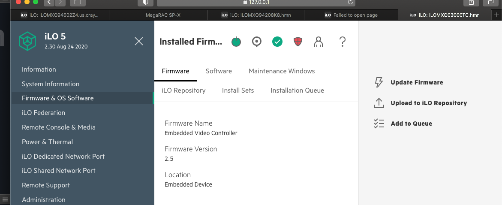
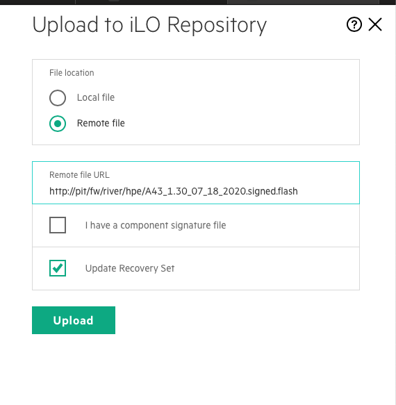
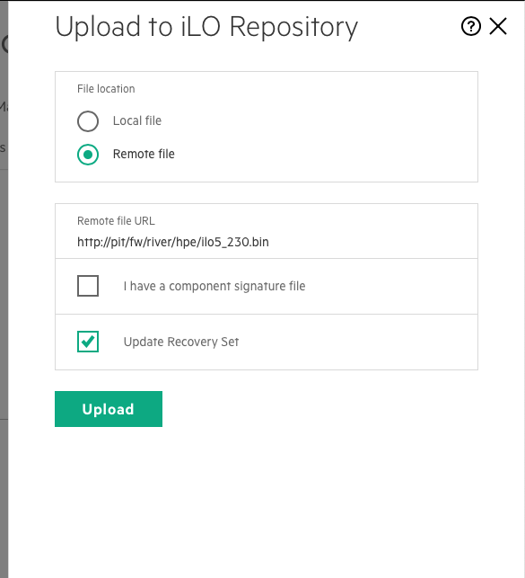

# Node Firmware

This page details the minimum specification for servers, and their components (such as PCIe cards).

> **`NOTE`** New items may be added to this page over time.

* [Servers](#servers)
    * [HPE (iLO) Upgrades](#hpe-(ilo)-upgrades)
        * [Pre-Reqs](#pre-reqs)
        * [GUI](#gui)
        * [Redfish](#redfish)
    * [Intel Upgrades](#intel-upgrades)
    * [Gigabyte Upgrades](#gigabyte-upgrades)
* [PCIe Cards](#pcie-cards)
    * [Marvell Upgrades](#marvell-upgrades)
    * [Mellanox Upgrades](#mellanox-upgrades)
        * [Requirement: Enable Tools](#requirement:-enable-tools)
        * [Check Current Firmware](#check-current-firmware)
        * [Upgrade from the LiveCD](#upgrade-from-the-livecd)
        * [Upgrade from the Internet](#upgrade-from-the-internet)

<a name="servers"></a>
## Servers

| Vendor | Model | Version |
| :--- | :--- | ---: |
| HPE | A41 DL325 Gen10 | [10/18/2019 2.30][1] | 
| HPE | A42 DL385 Gen10+ | [07/18/2020 1.30][2] | 
| HPE | A43 DL325 Gen10+ | [07/18/2020 1.30][2] | 
| Intel | S2600WFT | [02.01.0012][3] |
| Gigabyte | MZ32-AR0-00 | [12.84][4] |

[1]: https://support.hpe.com/hpsc/swd/public/detail?swItemId=MTX-ba30df44427f4e099b2f652829
[2]: https://downloadcenter.intel.com/download/29753/Intel-Server-Board-S2600WF-Family-BIOS-and-Firmware-Update-Package-for-UEFI
[3]: https://support.hpe.com/hpsc/swd/public/detail?swItemId=MTX_5ed1b5a914b844caab3780d293
[4]: https://pubs.cray.com/bundle/Gigabyte_Node_Firmware_Update_Guide_S-8010/page/About_the_Gigabyte_Node_Firmware_Update_Guide.html

Find more information for each vendor below:

- [HPE (iLO) Upgrades](#marvell-upgrades)
- [Intel Upgrades](#mellanox-upgrades)
- [Gigabyte Upgrades](#mellanox-upgrades)


<a name="hpe-(ilo)-upgrades"></a>
### HPE (iLO) Upgrades

Firmware is located on the LiveCD (versions 1.4.6 or higher).

<a name="pre-reqs"></a>
#### Pre-Reqs

- BMCs are reachable; dnsmasq is setup and BMCs show in `/var/lib/misc/dnsmasq.leases`
- Servers can be `off`
- Static entries in dnsmasq are a bonus; helpful but unnecessary.

Verify the firmwares available for the procedure:
```bash
pit:~ # ls -1 /var/www/fw/river/hpe/
A41_2.42_07_17_2020.signed.flash
A42_1.30_07_18_2020.signed.flash
A43_1.30_07_18_2020.signed.flash
ilo5_230.bin
```

<a name="gui"></a>
#### GUI

1. From the administrators own machine, SSH tunnel (`-L` creates the tunnel, and `-N` prevents a shell and stubs the connection). One at a time, or all together.
    ```bash
    ssh -L 6443:ncn-m002-mgmt:443 -N bigbird-ncn-m001
    ssh -L 7443:ncn-m003-mgmt:443 -N bigbird-ncn-m001
    ssh -L 8443:ncn-w001-mgmt:443 -N bigbird-ncn-m001
    ssh -L 9443:ncn-w002-mgmt:443 -N bigbird-ncn-m001
    ssh -L 10443:ncn-w003-mgmt:443 -N bigbird-ncn-m001
    ssh -L 11443:ncn-s001-mgmt:443 -N bigbird-ncn-m001
    ssh -L 12443:ncn-s002-mgmt:443 -N bigbird-ncn-m001
    ssh -L 13443:ncn-s003-mgmt:443 -N bigbird-ncn-m001
    ```
2. One at a time in (to prevent log-outs from duplicate SSL/CA) open each and run through the nested steps:

         https://127.0.0.1:6443
         https://127.0.0.1:7443
         https://127.0.0.1:8443
         https://127.0.0.1:9443
         https://127.0.0.1:10443
         https://127.0.0.1:11443
         https://127.0.0.1:12443
         https://127.0.0.1:13443

      1. Login with the default credentials.
      2. On the _Left_, select "Firmware & OS Software"  
      3. On the _Right_, select "Upload to ILO Repository"
      4. Select "Remote File", and then choose your firmware file:
         ```bash
         # A43 example
         http://pit/fw/river/hpe/A43_1.30_07_18_2020.signed.flash
         ```
         
      5. Press **`Upload`** and wait for the upload to complete.
      6. Now grab the iLO5 Firmware the same way:
         1. On the _Right_, select "Upload to ILO Repository"
         2. Select "Remote File", and then choose your firmware file:
         ```bash
         # A43 example
         http://pit/fw/river/hpe/ilo5_230.bin
         ```
         
         3. Press **`Upload`** and wait for the upload to complete.
      7. Cold boot the server, or momentarily press the button (GUI button) to power it on

Now the node(s) are upgraded to minimum spec. for booting.

<a name="redfish"></a>
#### Redfish


> **THIS IS A STUB** There are untested instructions in this section. This will be removed when `mfw` has been tested (a.k.a. `/root/bin/ncnfw`).

1. Set login vars for redfish™
    ```bash
   export username=root
   export password= 
   ```
2. Invoke `mfw` with the matching firmware (check `ls 1 /var/www/fw/river/hpe` for a list)
    ```bash
    pit# /root/bin/mfw A43_1.30_07_18_2020.signed.flash
    ```

3. Watch status:
    ```bash
    pit# curl -sk -u $username:$password https://$1/redfish/v1/UpdateService | jq |grep -E 'State|Progress|Status'"
    ```


<a name="intel-upgrades"></a>
### Intel Upgrades

> **THIS IS A STUB** There are no instructions on this page, this page is place-holder.

<a name="gigabyte-upgrades"></a>
### Gigabyte Upgrades

> **THIS IS A STUB** There are no instructions on this page, this page is place-holder.

<a name="pcie-cards"></a>
## PCIe Cards

| Vendor | Model | PSID | Version |
| :--- | :--- | --- | ---: |
| Marvell | QL41232HQCU-HC | | [08.50.78][5] | 
| Mellanox | MCX416A-BCAT | `MT_2130111027` | [12.28.2006][8] |
| Mellanox | MCX515A-CCAT | `MT_0000000011` | [16.28.4000][6] |
| Mellanox | MCX515A-CCAT | `MT_0000000591` | [16.28.4000][7] |

> Note: The Mellanox firmware can be updated to minimum spec. using `mlxfwmanager`. The `mlxfwmanager` will fetch updates from online, or it can use a local file (or local web server such as http://pit/).

Find more information for each vendor below:

- [Marvell Upgrades](#marvell-upgrades)
- [Mellanox Upgrades](#mellanox-upgrades)

<a name="marvell-upgrades"></a>
##### Marvell Upgrades

> **THIS IS A STUB** There are no instructions on this page, this page is place-holder.

<a name="mellanox-upgrades"></a>
##### Mellanox Upgrades

Shasta 1.4 NCNs are # Print name and current state; on an NCN or on the liveCD.

<a name="requirement:-enable-tools"></a>
###### Requirement: Enable Tools

MST needs to be started for the tools to work.

```bash
linux:~ # mst status
Starting MST (Mellanox Software Tools) driver set
Loading MST PCI module - Success
Loading MST PCI configuration module - Success
Create devices
Unloading MST PCI module (unused) - Success
```

<a name="check-current-firmware"></a>
###### Check Current Firmware

Print out the current firmware versions or all Mellanox cards:

```bash
linux:~ # mlxfwmanager
Querying Mellanox devices firmware ...

Device #1:
----------

  Device Type:      ConnectX5
  Part Number:      MCX515A-CCA_Ax
  Description:      ConnectX-5 EN network interface card; 100GbE single-port QSFP28; PCIe3.0 x16; tall bracket; ROHS R6
  PSID:             MT_0000000011
  PCI Device Name:  /dev/mst/mt4119_pciconf0
  Base GUID:        ec0d9a03007da71e
  Base MAC:         ec0d9a7da71e
  Versions:         Current        Available
     FW             16.26.4012     N/A
     PXE            3.5.0805       N/A
     UEFI           14.19.0017     N/A

  Status:           No matching image found

Device #2:
----------

  Device Type:      ConnectX4
  Part Number:      MCX416A-BCA_Ax
  Description:      ConnectX-4 EN network interface card; 40GbE dual-port QSFP28; PCIe3.0 x16; ROHS R6
  PSID:             MT_2130111027
  PCI Device Name:  /dev/mst/mt4115_pciconf0
  Base GUID:        506b4b030013982e
  Base MAC:         506b4b13982e
  Versions:         Current        Available
     FW             12.26.4012     N/A
     PXE            3.5.0805       N/A
     UEFI           14.19.0017     N/A

  Status:           No matching image found

```

<a name="upgrade-from-the-livecd"></a>
###### Upgrade from the LiveCD

If the LiveCD is reachable, firmware can be downloaded for local install:

```bash
curl -O http://pit/fw/pcie/firmware.img
mlxfwmanager -u -i ./firmware.img
```

<a name="upgrade-from-the-internet"></a>
###### Upgrade from the Internet

If external queries can be made by the node, it can update firmware from the Internet:

```bash
mlxfwmanager -u --online
```

[5]: https://www.marvell.com/products/hpe/hpe-industry-standard-adapters.html
[6]: http://15.213.147.156/HPC_Fabric/Mellanox/Mellanox%20HDR/ConnectX-6%20EN%20network%20interface%20card%20100GbE%20single-port%20QSFP28%20MCX515A-CCAT%20(Cray%20E1000)/
[7]: http://15.213.147.156/HPC_Fabric/Mellanox/Mellanox%20EDR/HPE%20Ethernet%20100Gb%201-port%20QSFP28%20MCX515A-CCAT%20PCIe3%20x16%20Adapter%20P313246-H21%20(Oku)/16.28.4000%20GA/
[8]: https://www.mellanox.com/support/firmware/connectx4en
