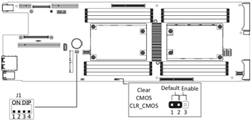
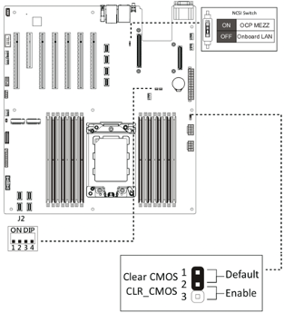
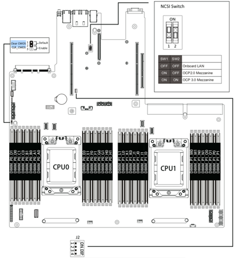

# Gigabyte Firmware Bug

Due to a bug in the Gigabyte firmware, the Shasta 1.4 install may negatively impact Gigabyte motherboards when attempting to boot using bonded Mellanox network cards.  The result is a board that is unusable until a CMOS clear is physically done via a jumper on the board itself.

A patched firmware release is expected to be available for a future release of Shasta.  It's recommended that Gigabyte users wait for this new firmware before attempting an installation of Shasta 1.4.  The procedure to recover the boards is included below.

## Clear BIOS settings by jumper

1. Pull the power cables or blade server from the chassis, and open the system top cover.
2. Move the Clear CMOS Jumper to 2-3, and wait 2~3 seconds.
3. Move the Clear CMOS Jumper to 1-2.

### Motherboard MZ62-HD0-00/-YF for H262 chassis

### Motherboard MZ32-AR0-00/-YF for R272 chassis

### Motherboard MZ92-FS0-00/-YF for R282 chassis

