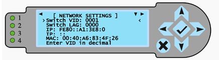

# Management Network Access Port configurations.

# Requirements
- Access to switches
- SHCD

# Configuration

- This configuration describes the edge port configuration, you'll find these in the NMN/HMN/Mountain-TDS Management Tab of the SHCD.
- Typically these are ports that are connected to iLOs (BMCs), gateway nodes, or compute nodes/CMM switches.

```
sw-leaf-001(config)#  interface 1/1/28
sw-leaf-001(config)# no shutdown 
sw-leaf-001(config)# mtu 9198
sw-leaf-001(config)# description HMN
sw-leaf-001(config)# no routing
sw-leaf-001(config)# vlan access 4
```

- This configuration describes the ports that go to the Node Management Network (NMN/VLAN2).
- You can Identify these ports by referencing the NMN tab on the SHCD.

```
sw-leaf-001(config)# interface 1/1/6
sw-leaf-001(config)# no shutdown 
sw-leaf-001(config)# mtu 9198
sw-leaf-001(config)# description NMN
sw-leaf-001(config)# no routing
sw-leaf-001(config)# vlan access 2
```

# UAN port configuration
- UANs are going to have the same network connections as shasta 1.3.
- One connection will go to a NMN(VLAN2) access port, this is where the UAN will pxe boot and communicate with internal systems. (see SHCD for UAN cabling).
- One Bond (two connections) will be going to the MLAG/VSX pair of switches. This will be a TRUNK port for the CAN connection.

Aruba UAN NMN Configuration
```
interface 1/1/16
    no shutdown
    mtu 9198
    no routing
    vlan access 2
    spanning-tree bpdu-guard
    spanning-tree port-type admin-edge
    exit
```

Aruba UAN CAN Configuration

Port Configuration is the same on both switches.
```
interface lag 17 multi-chassis
    no shutdown
    no routing
    vlan trunk native 1
    vlan trunk allowed 7
    lacp mode active
    lacp fallback
    exit
```

# Gigabyte/Intel NCN Worker port configuration
The cabling guidelines for all servers can be found here [MGMT-NET-CABLING](416-MGMT-NET-CABLING.md).

Mellanox Port Config
```
sw-spine-002 [gamora-mlag-domain: master] # show run int ethernet 1/1
interface ethernet 1/1 speed 40G force
interface ethernet 1/1 mtu 9216 force
interface ethernet 1/1 mlag-channel-group 1 mode active
```
Mellanox MLAG config
```
sw-spine-002 [gamora-mlag-domain: master] # show run int mlag-port-channel 1
interface mlag-port-channel 1
interface mlag-port-channel 1 mtu 9216 force
interface mlag-port-channel 1 switchport mode hybrid
interface mlag-port-channel 1 no shutdown
interface mlag-port-channel 1 switchport hybrid allowed-vlan add 2
interface mlag-port-channel 1 switchport hybrid allowed-vlan add 4
interface mlag-port-channel 1 switchport hybrid allowed-vlan add 7
interface mlag-port-channel 1 switchport hybrid allowed-vlan add 10
```

# HPE NCN Worker port configuration
Aruba Port Config
```
sw-spine02# show run int 1/1/7
interface 1/1/7
    no shutdown
    mtu 9198
    lag 4
    exit
```
Aruba LAG Configuration
```
sw-spine02# show run int lag 4
interface lag 4 multi-chassis
    no shutdown
    no routing
    vlan trunk native 1
    vlan trunk allowed 1-2,4,7,10
    lacp mode active
    lacp fallback
    exit
```

# Gigabyte/Intel NCN Master port configuration
Mellanox Port config
```
sw-spine-002 [gamora-mlag-domain: master] # show run int ethernet 1/1
interface ethernet 1/1 speed 40G force
interface ethernet 1/1 mtu 9216 force
interface ethernet 1/1 mlag-channel-group 1 mode active
```

Mellanox MLAG port config
```
sw-spine-002 [gamora-mlag-domain: master] # show run int mlag-port-channel 1
interface mlag-port-channel 1
interface mlag-port-channel 1 mtu 9216 force
interface mlag-port-channel 1 switchport mode hybrid
interface mlag-port-channel 1 no shutdown
interface mlag-port-channel 1 switchport hybrid allowed-vlan add 2
interface mlag-port-channel 1 switchport hybrid allowed-vlan add 4
interface mlag-port-channel 1 switchport hybrid allowed-vlan add 7
interface mlag-port-channel 1 switchport hybrid allowed-vlan add 10
```

# HPE NCN Master port configuration
Aruba Port Config
```
sw-spine02# show run int 1/1/7
interface 1/1/7
    no shutdown
    mtu 9198
    lag 4
    exit
```
Aruba LAG Configuration
```
sw-spine02# show run int lag 4
interface lag 4 multi-chassis
    no shutdown
    no routing
    vlan trunk native 1
    vlan trunk allowed 1-2,4,7,10
    lacp mode active
    lacp fallback
    exit
```

# Gigabyte/Intel NCN Storage port configuration
Mellanox Port config
```
sw-spine-002 [gamora-mlag-domain: master] # show run int ethernet 1/7
interface ethernet 1/7 speed 40G force
interface ethernet 1/7 mtu 9216 force
interface ethernet 1/7 mlag-channel-group 7 mode active
```
Mellanox MLAG port config
```
sw-spine-002 [gamora-mlag-domain: master] # show run int mlag-port-channel 7
interface mlag-port-channel 7
interface mlag-port-channel 7 mtu 9216 force
interface mlag-port-channel 7 switchport mode hybrid
interface mlag-port-channel 7 no shutdown
interface mlag-port-channel 7 switchport hybrid allowed-vlan add 2
interface mlag-port-channel 7 switchport hybrid allowed-vlan add 4
interface mlag-port-channel 7 switchport hybrid allowed-vlan add 7
interface mlag-port-channel 7 switchport hybrid allowed-vlan add
```

# HPE NCN Storage port configuration

Aruba Port Config
```
sw-spine02# show run int 1/1/7
interface 1/1/7
    no shutdown
    mtu 9198
    lag 4
    exit
```
Aruba LAG Configuration
```
sw-spine02# show run int lag 4
interface lag 4 multi-chassis
    no shutdown
    no routing
    vlan trunk native 1
    vlan trunk allowed 1-2,4,7,10
    lacp mode active
    lacp fallback
    exit
```
Aruba Storage port configuration (future use)
These will be configured, but the ports will be shut down until needed.
```
sw-spine02# show run int 1/1/7
interface 1/1/7
    shutdown
    mtu 9198
    lag 4
    exit
```
Aruba LAG Configuration
```
sw-spine02# show run int lag 4
interface lag 4 multi-chassis
    shutdown
    no routing
    vlan access 10
    lacp mode active
    lacp fallback
    exit
```
# CMM port configuration.

- This configuration describes the ports that go to the Mountain CMMs/Computes.
- This is for Aruba switches only.
- The CDU switches have two cables (10Gb RJ45) connecting to each CMM, we will setup a static MC-LAG.
- This LAG is currently used for improved throughput, redundancy is not yet offered.
- The CEC will need to be programmed to have the "switch LAG" setting to be set to "0001"



First Aruba CDU configuration.
```
sw-cdu-001(config)# int lag 2 multi-chassis static
sw-cdu-001(config-lag-if)# vsx-sync vlans
sw-cdu-001(config-lag-if)# no shutdown
sw-cdu-001(config-lag-if)# description CMM_CAB_1000
sw-cdu-001(config-lag-if)# no routing
sw-cdu-001(config-lag-if)# vlan trunk native 2000
sw-cdu-001(config-lag-if)# vlan trunk allowed 2000,3000,4091
sw-cdu-001(config-lag-if)# exit

sw-cdu-001(config)# int 1/1/2
sw-cdu-001(config-if)# no shutdown
sw-cdu-001(config-if)# lag 2
sw-cdu-001(config-if)# exit
```

Second Aruba CDU configuration
```
sw-cdu-002(config)# int lag 2 multi-chassis static
sw-cdu-002(config-lag-if)# vsx-sync vlans
sw-cdu-002(config-lag-if)# shutdown
sw-cdu-002(config-lag-if)# description CMM_CAB_1000
sw-cdu-002(config-lag-if)# no routing
sw-cdu-002(config-lag-if)# vlan trunk native 2000
sw-cdu-002(config-lag-if)# vlan trunk allowed 2000,3000,4091
sw-cdu-002(config-lag-if)# exit

sw-cdu-002(config)# int 1/1/2
sw-cdu-002(config-if)# no shutdown
sw-cdu-002(config-if)# lag 2
sw-cdu-002(config-if)# exit
```