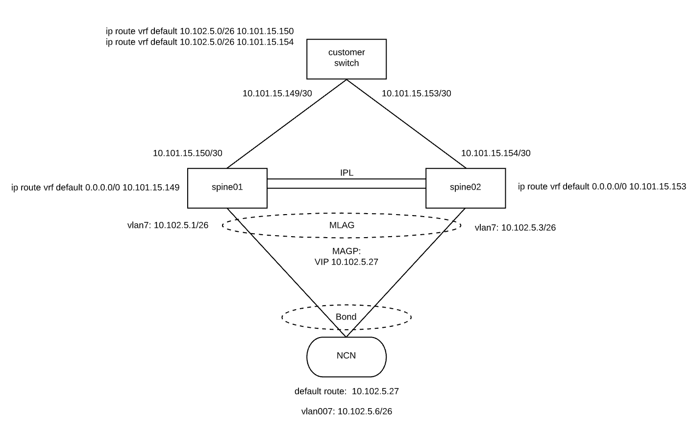

# Management Network CAN setup

Access from the customer site to the system over shared networks is known as the Customer Access Network (CAN)

# Requirements
Access to switches

SHCD

# Configuration

To access the Shasta nodes and services from the customer network, there is minimal configuration needed on the spine switch and the customer switch connected upstream from the spine switch to allow the customer_access_network subnet to be routed to the Shasta system.

The customer's switch must be connected to the spine switches with a p2p subnet for each switch.  In the example below, these two p2p subnets are 10.11.15.148/30 and 10.101.15.152/30.   The subnets used are up to the customer.

There are two routes configured on the customer's switch to route traffic for the CAN subnet to each of the spine switches.   ECMP will load balance the traffic across each of the switches when both links are up and only use the active link when one of the links goes down.

The CAN is connected between each spine switch and the NCNs through vlan 7 running over the physical connections between the spines and the port on the NCN.  This is the same physical connection used for the NMN and HMN on the NCNs.

The two physical connections between the NCN and spines is MLAG'ed.   MAGP/VSX is used to provide a single virtual router gateway that can be used as the default route on each of the NCNs.



This is an example of the p2p configuration on the spine switches.   The IP address should be replaced with the IP chosen by the customer matching the customer's switch configuration.

Mellanox
```
interface ethernet 1/11 speed auto force
interface ethernet 1/11 description to-can
interface ethernet 1/11 no switchport force
interface ethernet 1/11 ip address 10.101.15.150/30 primary
```
Aruba
```
interface 1/1/36
    no shutdown
    description to-can
    ip address 10.101.15.150/30
    exit
```

There must then be two routes on the customer's switch directing traffic for the customer_access_network subnet to the endpoint on the spine switch.   

This is an example of the route configuration on the customer switch.
These addresses/subnets are generated from CSI and can be found in ```CAN.yaml```
Example Snippet from CAN.yaml.
```
- full_name: CAN Bootstrap DHCP Subnet
  cidr:
    ip: 10.101.8.0
    mask:
    - 255
    - 255
    - 255
    - 0
```
Customer switch example config.
```
ip route vrf default 10.101.8.0/24 10.101.15.150
ip route vrf default 10.101.8.0/24 10.101.15.154
```

Going the other direction, there must be a default route on each spine switch directing traffic not matching other routes to the endpoint on the customer's switch.

This is an example of the route configuration on sw-spine-001.
Mellanox
```
ip route vrf default 0.0.0.0/0 10.101.15.149
```
Aruba
```
ip route 0.0.0.0/0 10.101.15.149
```

The spine switch must also have the customer_access_gateway IP address assigned to the vlan 7 interface on the switch.  This provides a gateway for the default route on the NCNs and UANs as well as a direct route to the customer_access_network from the spine switch.
Mellanox
```
interface vlan 7 ip address 10.101.8.2/26 primary
```
Aruba
```
sw-spine-002(config)# int vlan 7
sw-spine-002(config-if-vlan)# ip address 10.102.11.3/24
```

# Verification of CAN Configuration

After completing this configuration you should be able to ping and log in to all of the NCNs at the external CAN IP address from a device on the customer network.

```
external> ping 10.101.8.6
PING 10.101.8.6 (10.101.8.6): 56 data bytes
64 bytes from 10.101.8.6: icmp_seq=0 ttl=58 time=61.445 ms
64 bytes from 10.101.8.6: icmp_seq=1 ttl=58 time=70.263 ms
64 bytes from 10.101.8.6: icmp_seq=2 ttl=58 time=59.270 ms
^C
--- 10.101.8.6 ping statistics ---
3 packets transmitted, 3 packets received, 0.0% packet loss
round-trip min/avg/max/stddev = 59.270/63.659/70.263/4.753 ms
external> ssh root@10.101.8.6
The authenticity of host '10.101.8.6 (10.101.8.6)' can't be established.
ECDSA key fingerprint is SHA256:jnMGZnMcdPQ9QleyJADbI9AQAvo4DfGz0SOYbe3lraI.
Are you sure you want to continue connecting (yes/no)? yes
Warning: Permanently added '10.101.8.6' (ECDSA) to the list of known hosts.
Password:
 
ncn-w001#
```
