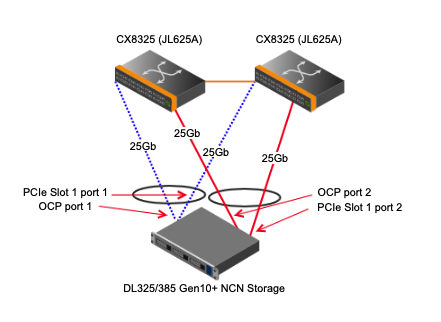
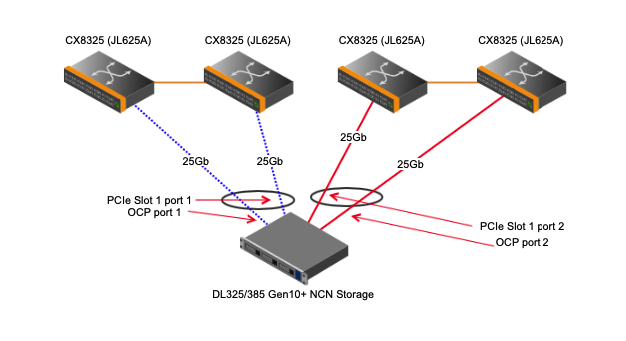
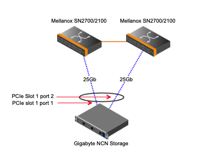

# Cabling
* [HPE Hardware](##hpe-hardware)
* [Gigabyte Hardware](##gigabyte-hardware)

## HPE Hardware

### HPE DL385

* The OCP Slot is noted (number 7) in the image above.  
  * This is the bottom middle slot to the left of the VGA port.
  * Ports are numbered left-to-right:  the far left port is port 1.
* The PCIe Slot 1 is on the top left side of the image above (under number 1).
  * Ports are numbered left-to-right:  the far left port is port 1.

### HPE DL325

* The OCP Slot is noted (number 9) in the image above.
  * This is the slot on the bottom left of the node.
  * Ports are numbered left-to-right:  the far left port is port 1.
* The PCIE Slot 1 is on the top left side of the image above (under number 1).
  * Ports are numbered left-to-right:  the far left port is port 1.

### NCN Worker Cabling

| Server Port        | Management Network Port        | Speed | Use / Configuration            |
|--------------------|--------------------------------|-------|--------------------------------|
| OCP port 1         | spine or aggr pair, switch 1/2 | 25Gb  | Management Network NMN/HMN/CAN |
| OCP port 2         | NONE                           | NONE  | NONE                           |
| PCIe Slot 1 port 1 | spine or aggr pair, switch 2/2 | 25Gb  | Management Network NMN/HMN/CAN |
| PCIe Slot 1 port 2 | NONE                           | NONE  | NONE                           |

#### SHCD Example

|hostname|Source         |Destination   |Destination |
|--------|---------------|--------------|------------|
| wn01	 | x3000u04ocp-j1 | x3000u12-j7 | sw-25g01   |
| wn01	 | x3000u04ocp-j2 | x3000u13-j7	| sw-25g02   |

### NCN Master Cabling
#### Single Card Installations

| Server Port        | Management Network Port        | Speed | Use / Configuration            |
|--------------------|--------------------------------|-------|--------------------------------|
| OCP port 1         | spine or aggr pair, switch 1/2 | 25Gb  | Management Network NMN/HMN/CAN |
| OCP port 2         | NONE                           | NONE  | NONE                           |
| PCIe Slot 1 port 1 | spine or aggr pair, switch 2/2 | 25Gb  | Management Network NMN/HMN/CAN |
| PCIe Slot 1 port 2 | NONE (See note below for ncn-m001) | NONE  | Site (See note below for ncn-m001) |

#### Dual Card Installations
A dual card configuration is much less common, but can occur based on customer requirements.  The table below describes the cabling of dual card configurations.  Also read notes in this section to see other possible customer-based configurations.

| Server Port        | Management Network Port        | Speed | Use / Configuration            |
|--------------------|--------------------------------|-------|--------------------------------|
| OCP port 1         | spine or aggr pair, switch 1/2 | 25Gb  | Management Network NMN/HMN/CAN |
| OCP port 2         | NONE                           | NONE  | NONE                           |
| PCIe Slot 1 port 1 | spine or aggr pair, switch 2/2 | 25Gb  | Management Network NMN/HMN/CAN |
| PCIe Slot 1 port 2 | NONE (See note below for ncn-m001) | NONE  | Site (See note below for ncn-m001) |

#### SHCD Example

|hostname|Source         |Destination   |Destination |
|--------|---------------|--------------|------------|
| mn01	 | x3000u01ocp-j1 | x3000u12-j1 | sw-25g01   |
| mn01	 | x3000u01s1-j1  | x3000u13-j1	| sw-25g02   |

**NOTE**: Master 1 (ncn-m001) is required to have a site connection for installation and non-CAN system access.  This can have several configurations depending on customer requirements/equipment:

* Dual 10/25Gb card configurations as described in the table above should use PCIe Slot 1, Port 2 as a site connection if the customer supports 10/25Gb.
* If the customer does not support 10/25Gb speeds (or connection type) and requires RJ45 copper or 1Gb, then a new and separate card will be installed on ncn-m001 and that card will provide site connectivity.
* Another possibility (non-HPE hardware mainly) is that a built-in 1Gb port will be used if available (similar to Shasta v1.3 PoR on Gigabyte hardware).

### NCN Storage Cabling

| Server Port        | Management Network Port        | Speed | Use / Configuration            |
|--------------------|--------------------------------|-------|--------------------------------|
| OCP port 1         | spine or aggr pair, switch 1/2 | 25Gb  | Management Network NMN/HMN/CAN |
| OCP port 2         | spine or aggr pair, switch 1/2 | 25Gb  | Storage SUN (future use)                           |
| PCIe Slot 1 port 1 | spine or aggr pair, switch 2/2 | 25Gb  | Management Network NMN/HMN/CAN |
| PCIe Slot 1 port 2 | spine or aggr pair, switch 2/2 | 25Gb  | Storage SUN (future use) |

#### SHCD Example

|hostname|Source         |Destination   |Destination |
|--------|---------------|--------------|------------|
| sn01	 | x3000u17s1-j2 | x3000u34-j14	| sw-25g02   |
| sn01	 | x3000u17s1-j1 | x3000u34-j8	| sw-25g02   |
| sn01	 | x3000u17ocp-j2| x3000u33-j14	| sw-25g01   |
| sn01	 | x3000u17ocp-j1| x3000u33-j8	| sw-25g01   |

For systems that include 4 aggregation switches the cabling will look like the following.

#### SHCD Example with four aggregation switches. 
|hostname|Source          |Destination   |Destination |
|--------|----------------|--------------|------------|
| sn01	 | x3000u10ocp-j2 | x3000u36-j5	 | sw-25g04   |
| sn01	 | x3000u10s1-j2  | x3000u35-j5	 | sw-25g03   |
| sn01	 | x3000u10ocp-j1 | x3000u34-j6	 | sw-25g02   |
| sn01	 | x3000u10s1-j1  | x3000u33-j6	 | sw-25g01   |

### UAN Cabling

| Server Port        | Management Network Port        | Speed | Use / Configuration         |
|--------------------|--------------------------------|-------|-----------------------------|
| OCP port 1         | spine or aggr pair, switch 1/2 | 25Gb  | Management Network NMN      |
| OCP port 2         | spine or aggr pair, switch 1/2 | 25Gb  | Management Network CAN bond |
| PCIe Slot 1 port 1 | spine or aggr pair, switch 2/2 | 25Gb  | NONE (Shasta v1.4)          |
| PCIe Slot 1 port 2 | spine or aggr pair, switch 2/2 | 25Gb  | Management Network CAN bond |

#### SHCD Example

|hostname|Source         |Destination   |Destination |
|--------|---------------|--------------|------------|
| uan01	 | x3000u17s1-j2 | x3000u34-j14	| sw-25g02   |
| uan01	 | x3000u17s1-j1 | x3000u34-j8	| sw-25g02   |
| uan01	 | x3000u17ocp-j2| x3000u33-j14	| sw-25g01   |
| uan01	 | x3000u17ocp-j1| x3000u33-j8	| sw-25g01   |

## Gigabyte/Intel Hardware

### NCN Worker Cabling

| Server Port        | Management Network Port        | Speed | Use / Configuration            |
|--------------------|--------------------------------|-------|--------------------------------|
| PCIe Slot 1 port 1 | spine or aggr pair, switch 1/2 | 40Gb  | Management Network NMN/HMN/CAN |
| PCIe Slot 1 port 2 | spine or aggr pair, switch 2/2 | 40Gb  | Management Network NMN/HMN/CAN |

#### SHCD Example

|hostname|Source         |Destination   |Destination |
|--------|---------------|--------------|------------|
| wn01	 | x3000u07s1-j1 | x3000u24L-j4 | sw-smn02   |
| wn01	 | x3000u07s1-j2 | x3000u24R-j4	| sw-smn03   |

**NOTE**: Cabling of ncn-w001 has changed in Shasta v1.4.  Please see ncn-m001 note below.

### NCN Master Cabling

| Server Port        | Management Network Port        | Speed | Use / Configuration            |
|--------------------|--------------------------------|-------|--------------------------------|
| PCIe Slot 1 port 1 | spine or aggr pair, switch 1/2 | 40Gb  | Management Network NMN/HMN/CAN |
| PCIe Slot 1 port 2 | spine or aggr pair, switch 2/2 | 40Gb  | Management Network NMN/HMN/CAN |
| LAN0 port 1        | NONE (See note below for ncn-m001) | NONE  | Site (See note below for ncn-m001) |

#### SHCD Example

|hostname|Source         |Destination   |Destination |
|--------|---------------|--------------|------------|
| mn01	 | x3000u01s1-j1 | x3000u24L-j1 | sw-smn02   |
| mn01	 | x3000u01s1-j2 | x3000u24R-j1	| sw-smn03   |

**NOTE**: Master 1 (ncn-m001) is required to have a site connection for installation and non-CAN system access.  In Shasta versions <=1.3 this connection was on ncn-w001.  This can have several configurations depending on customer requirements/equipment:

* The default configuration for Gigabyte systems uses the built-in 1Gb lan0 port for site connection on ncn-m001.
* If the customer requires connectivity greater than 1Gb (or a different connection type), then a new and separate card will be installed on ncn-m001 and that card will provide site connectivity.

### NCN Storage Cabling

| Server Port        | Management Network Port        | Speed | Use / Configuration            |
|--------------------|--------------------------------|-------|--------------------------------|
| PCIe Slot 1 port 1 | spine or aggr pair, switch 1/2 | 40Gb  | Management Network NMN/HMN/CAN |
| PCIe Slot 1 port 2 | spine or aggr pair, switch 2/2 | 40Gb  | Management Network NMN/HMN/CAN |

#### SHCD Example

|hostname|Source         |Destination   |Destination |
|--------|---------------|--------------|------------|
| sn01	 | x3000u13s1-j1 | x3000u24L-j7 | sw-smn02   |
| sn01	 | x3000u13s1-j2 | x3000u24R-j7	| sw-smn03   |

### UAN Cabling

| Server Port        | Management Network Port        | Speed | Use / Configuration         |
|--------------------|--------------------------------|-------|-----------------------------|
| LAN0 port 1        | leaf (see note)                |  1Gb  | Management Network NMN      |
| PCIe Slot 1 port 1 | spine or aggr pair, switch 1/2 | 40Gb  | Management Network CAN bond |
| PCIe Slot 1 port 2 | spine or aggr pair, switch 2/2 | 40Gb  | Management Network CAN bond |

#### SHCD Example

|hostname|Source         |Destination   |Destination |
|--------|---------------|--------------|------------|
| uan01	 | x3000u27s1-j1 | x3000u24L-j10| sw-smn02   |
| uan01	 | x3000u27s1-j2 | x3000u24R-j10| sw-smn03   |

NOTE that there are a couple configurations possible for LAN0:
* Existing Gigabyte systems on Dell and Mellanox network hardware will use the (existing) Dell leaf port.
* Any Gigabyte system on Aruba network hardware will use a Aruba 6300 (for the 1Gb port).
* Optionally a 10/25Gb card could be added in an Aruba hardware system to match the HPE UANs.
