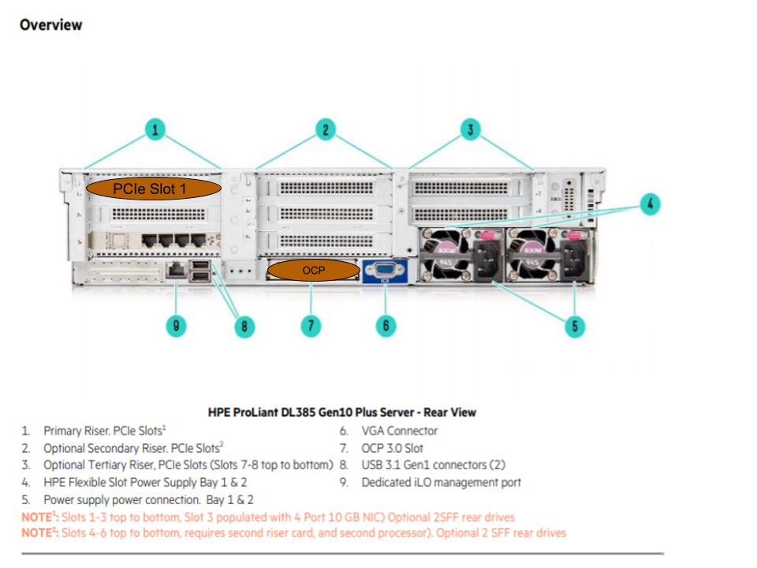
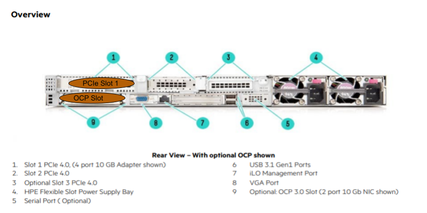

# Cabling

## HPE DL385

* The OCP Slot is noted (number 7) in the image above.  
  * This is the bottom middle slot to the left of the VGA port.
  * Ports are numbered left-to-right:  the far left port is port 1
* The PCIe Slot 1 is on the top left side of the image above (under number 1).
  * Ports are numbered left-to-right:  the far left port is port 1

## HPE DL325

* The OCP Slot is noted (number 9) in the image above.
  * This is the slot on the bottom left of the server.
  * Ports are numbered left-to-right:  the far left port is port 1
* The PCIE Slot 1 is on the top left side of the image above (under number 1).
  * Ports are numbered left-to-right:  the far left port is port 1

## NCN Worker Cabling

| Server Port        | Management Network Port        | Speed | Use / Configuration            |
|--------------------|--------------------------------|-------|--------------------------------|
| OCP port 1         | spine or aggr pair, switch 1/2 | 25Gb  | Management Network NMN/HMN/CAN |
| OCP port 2         | NONE                           | NONE  | NONE                           |
| PCIe Slot 1 port 1 | spine or aggr pair, switch 2/2 | 25Gb  | Management Network NMN/HMN/CAN |
| PCIe Slot 1 port 2 | NONE                           | NONE  | NONE                           |

## NCN Master Cabling

| Server Port        | Management Network Port        | Speed | Use / Configuration            |
|--------------------|--------------------------------|-------|--------------------------------|
| OCP port 1         | spine or aggr pair, switch 1/2 | 25Gb  | Management Network NMN/HMN/CAN  |
| OCP port 2         | NONE                           | NONE  | NONE                           |
| PCIe Slot 1 port 1 | spine or aggr pair, switch 2/2 | 25Gb  | Management Network NMN/HMN/CAN |
| PCIe Slot 1 port 2 | NONE                           | NONE  | NONE (See note below for m001) |a

**NOTE**: Master 1 (m001) is required to have a site connection for installation and non-CAN system access.  This can have several configurations depending on customer requirements/equipment:

* Dual 10/25Gb card configurations as described in the table above should use PCIe Slot 1, Port 2 as a site connection if the customer supports 10/25Gb.
* If the customer does not support 10/25Gb speeds (or connection type) and requires RJ45 copper or 1Gb, then a new and separate card will be installed on m001 and that card will provide site connectivity.
* Another possibility (non-HPE hardware mainly) is that a built-in 1Gb port will be used if available (similar to Shasta v1.3 PoR on Gigabyte hardware).

## UAN Cabling

| Server Port        | Management Network Port        | Speed | Use / Configuration        |
|--------------------|--------------------------------|-------|----------------------------|
| OCP port 1         | spine or aggr pair, switch 1/2 | 25Gb  | Managment Network NMN      |
| OCP port 2         | spine or aggr pair, switch 1/2 | 25Gb  | Managment Network CAN bond |
| PCIe Slot 1 port 1 | spine or aggr pair, switch 2/2 | 25Gb  | NONE (Shasta v1.4)         |
| PCIe Slot 1 port 2 | spine or aggr pair, switch 2/2 | 25Gb  | Managment Network CAN bond |

