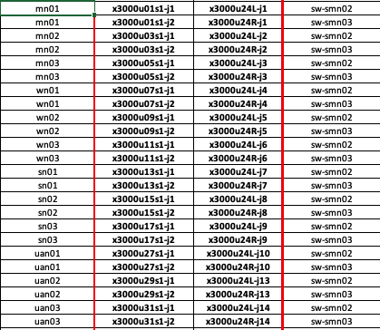

# 1.4 Management network cabling checklist

This page is designed to be a guide on how all nodes in a Shasta system are wired to the management network.

- Prerequisites
 - System SHCD
 - PoR Cabling Docs [MGMT-NET-CABLING](416-MGMT-NET-CABLING.md)

## Steps

- Open the SHCD
- Go to the ```Device Diagrams``` Tab.
    - There you will see what type of hardware is on the system.
    - Take note of the hardware.
- go to the ```25G_10G``` or ```40G_10G``` tab, this will depend on the SHCD.
    - we'll be looking at this part of the page.

    - Based on the vendor of the nodes and the name in the first column we can determine how it's supposed to be cabled. 
    - We can use ```mn01``` as an example, this is a gigabyte master node, we noted the vendor in the ```device diagrams``` tab.
    - Once you have those two pieces of information you can open the [MGMT-NET-CABLING](416-MGMT-NET-CABLING.md) page.
    - Locate ```NCN Gigabyte Master``` and make sure that it's cabled correctly.
    
- Complete the previous steps for all nodes listed on the SHCD.
    - UANs
    - NCNs Workers
    - NCNs Masters
    - NCNs Storage
    - Application nodes
    
## Checklist

| Hardware Type | Step      | Complete?     |
| ----------- | ----------- | ------------- |
| UAN/Application Node         |             |               |
|             | Open the SHCD from the system |             |
|             | Go to the ```Device Diagrams``` tab, take note of the type of hardware on the system        |          |
|             | Depending on the hardware, open either the **25G_10G** tab or the **40G_10G** tab. |        |
|             | Locate the nodes named ```mn``` |        |
|             | Based on the vendor of the node and the name in the first column we can determine how it's supposed to be cabled.  |         |
|             | Check cabling against the [MGMT-NET-CABLING](416-MGMT-NET-CABLING.md) page.            |               |
|             | If it's cabled correctly you are done.            |               |
|             | If it's cabled incorrectly, contact the team in charge of cabling and request a change.             |               |
| NCN-Master         |             |               |
|             | Open the SHCD from the system |             |
|             | Go to the ```Device Diagrams``` tab, take note of the type of hardware on the system        |          |
|             | Depending on the hardware, open either the **25G_10G** tab or the **40G_10G** tab. |        |
|             | Locate the nodes named ```mn0x``` |        |
|             | Based on the vendor of the node and the name in the first column we can determine how it's supposed to be cabled.  |         |
|             | Check cabling against the [MGMT-NET-CABLING](416-MGMT-NET-CABLING.md) page.            |               |
|             | If it's cabled correctly you are done.            |               |
|             | If it's cabled incorrectly, contact the team in charge of cabling and request a change.             |               |
| NCN-Worker         |             |               |
|             | Open the SHCD from the system |             |
|             | Go to the ```Device Diagrams``` tab, take note of the type of hardware on the system        |          |
|             | Depending on the hardware, open either the **25G_10G** tab or the **40G_10G** tab. |        |
|             | Locate the nodes named ```wn0x``` |        |
|             | Based on the vendor of the node and the name in the first column we can determine how it's supposed to be cabled.  |         |
|             | Check cabling against the [MGMT-NET-CABLING](416-MGMT-NET-CABLING.md) page.            |               |
|             | If it's cabled correctly you are done.            |               |
|             | If it's cabled incorrectly, contact the team in charge of cabling and request a change.             |               |
| NCN-Storage         |             |               |
|             | Open the SHCD from the system |             |
|             | Go to the ```Device Diagrams``` tab, take note of the type of hardware on the system        |          |
|             | Depending on the hardware, open either the **25G_10G** tab or the **40G_10G** tab. |        |
|             | Locate the nodes named ```sn0x``` |        |
|             | Based on the vendor of the node and the name in the first column we can determine how it's supposed to be cabled.  |         |
|             | Check cabling against the [MGMT-NET-CABLING](416-MGMT-NET-CABLING.md) page.            |               |
|             | If it's cabled correctly you are done.            |               |
|             | If it's cabled incorrectly, contact the team in charge of cabling and request a change.             |               |
