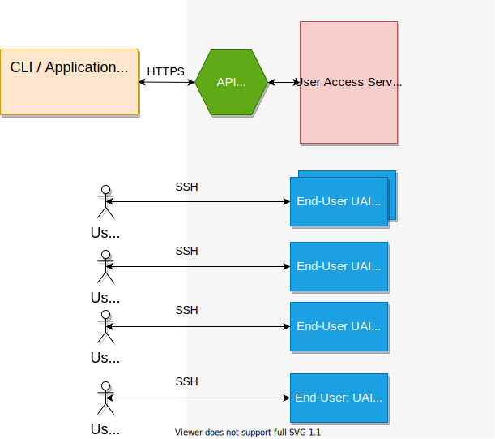
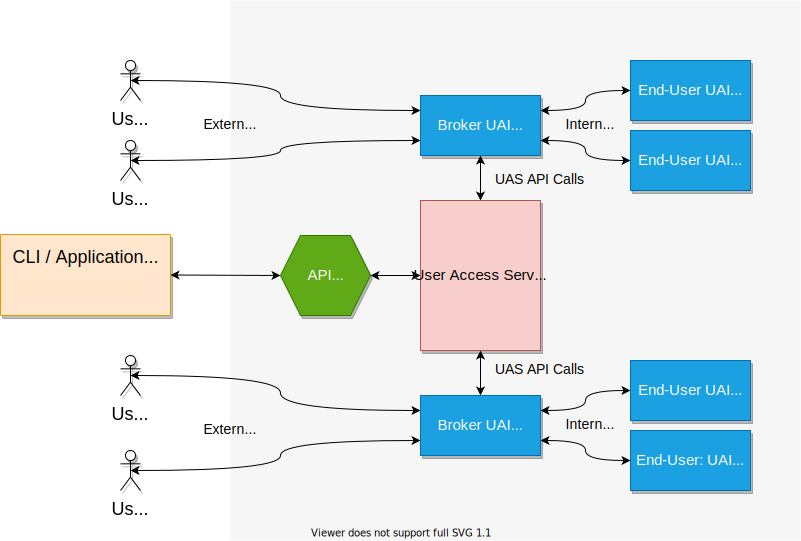

# The Shasta User Access Service <a name="main"></a>

1. [The Shasta User Access Service](#main)
    1. [Concepts](#main-concepts)
        1. [End-User UAIs](#main-concepts-enduser)
        2. [Special Purpose UAIs](#main-concepts-specialpurpose)
        3. [Elements of a UAI](#main-concepts-elements)
        4. [UAI Host Nodes](#main-concepts-hostnodes)
        5. [UAI Network Attachments (macvlans)](#main-concepts-netattach)
    2. [UAI Host Node Selection](#main-hostnodes)
        1. [Identifying UAI Host Nodes](#main-hostnodes-identifying)
        2. [Specifying UAI Host Nodes](#main-hostnodes-specifying)
        3. [Maintaining an HSM Group for UAI Host Nodes](#main-hostnodes-hsmgroup)
    3. [UAI Network Attachments](#main-netattach)
        1. [CSI Localization Data](#main-netattach-localization)
        2. [Contents of customizations.yaml](#main-netattach-customizations)
        3. [UAS Helm Chart](#main-netattach-helm)
        4. [UAI Network Attachment in Kubernetes](#main-netattach-kubernetes)
    4. [UAS Configuration to Support UAI Creation](#main-uasconfig)
        1. [UAI Images](#main-uasconfig-images)
            1. [Listing Registered UAI Images](#main-uasconfig-images-list)
            2. [Registering UAI Images](#main-uasconfig-images-add)
            3. [Examining a UAI Image Registration](#main-uasconfig-images-examine)
            4. [Updating a UAI Image Registration](#main-uasconfig-images-update)
            5. [Deleting a UAI Image Registration](#main-uasconfig-images-delete)
        2. [Volumes](#main-uasconfig-volumes)
            1. [Listing UAS Volumes](#main-uasconfig-volumes-list)
            2. [Adding a UAS Volume](#main-uasconfig-volumes-add)
            3. [Examining a UAS Volume](#main-uasconfig-volumes-examine)
            4. [Updating a UAS Volume](#main-uasconfig-volumes-update)
            5. [Deleting a UAS Volume](#main-uasconfig-volumes-delete)
        3. [Resource Specifications](#main-uasconfig-resources)
            1. [Listing Resource Specifications](#main-uasconfig-resources-list)
            2. [Adding a Resource Specification](#main-uasconfig-resources-add)
            3. [Examining a Resource Specification](#main-uasconfig-resources-examine)
            4. [Updating a Resource Specification](#main-uasconfig-resources-update)
            5. [Deleting a Resource Specification](#main-uasconfig-resources-delete)
        4. [UAI Classes](#main-uasconfig-classes)
            1. [Listing UAI Classes](#main-uasconfig-classes-list)
            2. [Adding a UAI Class](#main-uasconfig-classes-add)
            3. [Examining a UAI Class](#main-uasconfig-classes-examine)
            4. [Updating a UAI Class](#main-uasconfig-classes-update)
            5. [Deleting a UAI Class](#main-uasconfig-classes-delete)
    5. [UAI Management](#main-uaimanagement)
        1. [Administrative Management of UAIs](#main-uaimanagement-adminuai)
            1. [Listing UAIs](#main-uaimanagement-adminuai-list)
            2. [Creating UAIs](#main-uaimanagement-adminuai-create)
            3. [Examining UAIs](#main-uaimanagement-adminuai-examine)
            4. [Deleting UAIs](#main-uaimanagement-adminuai-delete)
        2. [Legacy Mode UAI Management](#main-uaimanagement-legacymode)
            1. [Configuring A Default UAI Class for Legacy Mode](#main-uaimanagement-legacymode-defaultclass)
                1. [Example Minimal Default UAI Class](#main-uaimanagement-legacymode-defaultclass-minimalexample)
                2. [Example Default UAI Class with Slurm Support](#main-uaimanagement-legacymode-slurmexample)
            2. [Creating and Using Default UAIs in Legacy Mode](#main-uaimanagement-legacymode-defaultcreate)
            3. [Listing Available UAI Images in Legacy Mode](#main-uaimanagement-legacymode-list)
            4. [Creating UAIs From Specific UAI Images in Legacy Mode](#main-uaimanagement-legacymode-imagecreate)
        3. [The UAI Broker Based Mode](#main-uaimanagement-brokermode)
            1. [Configuring End-User UAI Classes for Broker Mode](#main-uaimanagement-brokermode-enduserclasses)
            2. [Configuring a Broker UAI class](#main-uaimanagement-brokermode-brokerclasses)
                1. [An Example of Volumes to Connect broker UAIs to LDAP](#main-uaimanagement-brokermode-brokerclasses-ldap)
            3. [Starting a Broker UAI](#main-uaimanagement-brokermode-startbroker)
            4. [Logging In Through a Broker UAI](#main-uaimanagement-brokermode-loginbroker)
    6. [UAI Images](#main-uaiimages)
        1. [The Provided Broker UAI Image](#main-uaiimages-providedbroker)
            1. [Customizing the Broker UAI Image](#main-uaiimages-providedbroker-customizingbroker)
                1. [Customizing the Broker UAI Entrypoint Script](#main-uaiimages-providedbroker-customizingbroker-entrypoint)
                2. [Customizing the Broker UAI SSH Configuration](#main-uaiimages-providedbroker-customizingbroker-sshconfig)
        2. [The Provided End-User UAI Image](#main-uaiimages-providedenduser)
        3. [Custom End-User UAI Images](#main-uaiimages-customenduser)
            1. [Building a Custom End-User UAI Image](#main-uaiimages-customenduser-build)
                1. [Query BOS for a sessiontemplate ID](#main-uaiimages-customenduser-build-templateid)
                2. [Download a Compute Node squashfs](#main-uaiimages-customenduser-build-squashfs)
                3. [Mount the squashfs and Create a tarball](#main-uaiimages-customenduser-build-tarball)
                4. [Create and Push the Container Image](#main-uaiimages-customenduser-build-image)
                5. [Register the New Container Image With UAS](#main-uaiimages-customenduser-build-register)
                6. [Cleanup the Mount Directory and tarball](#main-uaiimages-customenduser-build-cleanup)
    7. [Troubleshooting](#main-trouble)
        1. [Getting Log Output from UAS](#main-trouble-uaslogs)
        2. [Getting Log Output from UAIs](#main-trouble-uailogs)
        3. [Stale Brokered UAIs](#main-trouble-staleuais)
        4. [Stuck UAIs](#main-trouble-stuckuais)
        5. [Duplicate Mount Paths in a UAI](#main-trouble-dupmounts)
        6. [Missing or Incorrect UAI Images](#main-trouble-images)
        7. [Administrative Access to UAIs for Diagnosis](#main-trouble-adminaccess)
        8. [Common Mistakes to Check for When Making a Custom End-User UAI Image](#main-trouble-customuais)

## Concepts <a name="main-concepts"></a>

The User Access Service (UAS) is responsible for managing User Access Instances (UAIs) and their associated configuration.  A UAI is a lightweight, disposable platform that runs under Kubernetes orchestration.  Most UAIs are reachable through SSH, and the most common use of UAIs is to facilitate short-term interactive logins for users of the Shasta system.

### End-User UAIs <a name="main-concepts-enduser"></a>

UIAs used for interactive logins are called end-user UAIs.  End-user UAIs can be seen as lightweight User Access Nodes (UANs), but there are important differences between UAIs and UANs.  First, end-user UAIs are not dedicated hardware like UANs.  They are implemented as containers orchestrated by Kubernetes, which makes them subject to Kubernetes scheduling and resource management rules.  One key element of Kubernetes orchestration is impermanence.  While end-user UAIs are often long running, Kubernetes can re-schedule or re-create them as needed to meet resource and node availability constraints.  UAIs can also be removed administratively.  When either of these things happen, a new UAI may be created, but that new UAI reverts to its initial state, discarding any internal changes that might have been made in its previous incarnation.  An administratively removed end-user UAI may or may not ever be re-created, and an end-user UAI that is preempted because of resource pressure may become unavailable for an extended time until the pressure is relieved.

The impermanence of end-user UAIs makes them suitable for tasks that are immediate and interactive over relatively short time frames, such as building and testing software or launching workloads.  It makes them unsuitable for unattended activities like executing cron jobs or monitoring progress of a job in a logged-in shell unless those activities are built into the UAI image itself (more on custom UAI images later).  These kinds of activities are more suited to UANs, which are more permanent and, unless they are re-installed, retain modified state through reboots and so forth.

Another way end-user UAIs differ from UANs is that any given end-user UAI is restricted to serving a single user.  This protects users from interfering with each other within UAIs and means that any user who wants to use a UAI has to arrange for the UAI to be created and assigned.  Once a user has an end-user UAI assigned, the user may initiate any number of SSH sessions to that UAI, but no other user will be recognized by the UAI when attempting to connect.

### Special Purpose UAIs  <a name="main-concepts-specialpurpose"></a>

While most UAIs are end-user UAIs, [UAI classes](#main-uasconfig-classes) make it possible to construct UAIs to serve special purposes that are not strictly end-user oriented.  One kind of special purpose UAI is the [broker UAI](#main-uaimanagement-brokermode) which provides on demand end-user UAI launch and management.  While no other specialty UAI types currently exist, other applications are expected to arise and users are encouraged to innovate as needed.

### Elements of a UAI <a name="main-concepts-elements"></a>

All UAIs can have the following attributes associated with them:

* A required [container image](#main-uasconfig-images)
* An optional set of [volume](#main-uasconfig-volumes)
* An optional [resource specification](#main-uasconfig-resources)
* An optional [collection of smaller configuration items](#main-uasconfig-classes)

The container image for a UAI (UAI image), defines the basic environment including the flavor of operating system, the installed packages, and so forth available to the user.  UAI images can be customized by a site and added to the UAS configuration to be used in UAI creation.  Any number of UAI images can be configured in the UAS, though only one will be used by any given UAI.  The UAS comes with some pre-defined UAI images that make it possible to set up UAIs and run many common tasks without further customization. Later in this document there is a [procedure for making custom UAIs](#main-uaiimages-customenduser) as needed.

The volumes defined for a UAI provide for external access to data provided by the host system.  Examples of this range from Kubernetes "configmaps" and "secrets" to external file systems used for persistent storage or external data access.  Anything that can be defined as a volume in a Kubernetes pod specification can be configured in UAS as a volume and used within a UAI.

Resource requests and limits tell Kubernetes how much memory and CPU a given UAI wants all the time (request) and how much memory and CPU a UAI can ever be given (limit).  Resource specifications configured into UAS contain resource requests and / or limits that can be associated with a UAI.  Any resource request or limit that can be set up on a Kubernetes pod can be set up as a resource specification under UAS.

The smaller configuration items control things like whether the UAI can talk to compute nodes over the high-speed network (needed for workload management), whether the UAI presents a public facing or private facing IP address for SSH, Kubernetes scheduling priority and others.

All of the above can be customized on a given set of UAIs by defining a UAI class.  UAI classes are templates used to create UAIs, and provide access to fine grained configuration and selection of image, volumes and resource specification.  While an end-user UAI can be created by simply specifying its UAI image and the user's public key, to make more precisely constructed UAIs a UAI class must be used.

### UAI Host Nodes <a name="main-concepts-hostnodes"></a>

UAIs run on Kubernetes worker nodes.  There is a mechanism using Kubernetes labels to prevent UAIs from running on a specific worker node, however.  Any Kubernetes node that is not labeled to prevent UAIs from running on it is considered to be a UAI host node.  The administrator of a given site may control the set of UAI host nodes by labeling kubernetes worker nodes appropriately.

### UAI Network Attachments (macvlans) <a name="main-concepts-netattach"></a>

UAIs need to be able to reach compute nodes across the node management network (NMN).  When the compute node NMN is structured as multiple subnets, this requires routing form the UAIs to those subnets.  The default route in a UAI goes to the public network through the customer access network (CAN) so that will not work for reaching compute nodes.  To solve this problem, UAS installs Kubernetes network attachments within the Kubernetes `user` namespace, one of which is used by UAIs.  The type of network attachment used on Shasta hardware for this purpose is a `macvlan` network attachment, so this is often referred to on Shasta systems as "macvlans".  This network attachment integrates the UAI into the NMN on the UAI host node where the UAI is running and assigns the UAI an IP address on that network.  It also installs a set of routes in the UAI that are used to reach the compute node subnets on the NMN.

## UAI Host Node Selection <a name="main-hostnodes"></a>

When selecting UAI host nodes, it is a good idea to take into account the amount of combined load users and system services will bring to those nodes.  UAIs run by default at a lower priority than system services on worker nodes which means that, if the combined load exceeds the capacity of the nodes, Kubernetes will eject UAIs and / or refuse to schedule them to protect system services.  This can be disruptive or frustrating for users.  This section explains how to identify the currently configured UAI host nodes and how to adjust that selection to meet the needs of users.

### Identifying UAI Host Nodes <a name="main-hostnodes-identifying"></a>

Since UAI host node identification is an exclusive activity, not an inclusive one, it starts by identifying the nodes that could potentially be UAI host nodes by their Kubernetes role:

```
ncn-m001-pit# kubectl get nodes | grep -v master
NAME       STATUS   ROLES    AGE   VERSION
ncn-w001   Ready    <none>   10d   v1.18.6
ncn-w002   Ready    <none>   25d   v1.18.6
ncn-w003   Ready    <none>   23d   v1.18.6
```

On this system, there are 3 nodes known by Kubernetes that are not running as Kubernetes master nodes.  These are all potential UAI host nodes.  Next, identify the nodes that are excluded from eligibility as UAI host nodes:

```
ncn-m001-pit# kubectl get no -l uas=False
NAME       STATUS   ROLES    AGE   VERSION
ncn-w001   Ready    <none>   10d   v1.18.6
```

    NOTE: given the fact that labels are textual not boolean, it is a good idea to try various common spellings of false. The ones that will prevent UAIs from running are 'False', 'false' and 'FALSE'.  Repeat the above with all three options to be sure.

Of the non-master nodes, there is one node that is configured to reject UAIs, `ncn-w001`.  So, `ncn-w002` and `ncn-w003` are UAI host nodes.

### Specifying UAI Host Nodes <a name="main-hostnodes-specifying"></a>

UAI host nodes are determined by tainting the nodes against UAIs, so the following:

```
ncn-m001-pit# kubectl label node ncn-w001 uas=False --overwrite
```

Please note here that setting `uas=True` or any variant of that, while potentially useful for local book keeping purposes, does NOT transform the node into a UAS host node.  With that setting the node will be a UAS node because the value of the `uas` flag is not in the list `False`, `false` or `FALSE`, but unless the node previously had one of the false values, it was a UAI node all along.  Perhaps more to the point, removing the `uas` label from a node labeled `uas=True` does not take the node out of the list of UAI host nodes.  The only way to make a non-master Kubernetes node not be a UAS host node is to explicitly set the label to `False`, `false` or `FALSE`.

### Maintaining an HSM Group for UAI Host Nodes <a name="main-hostnodes-hsmgroup"></a>

When it comes to customizing non-compute node (NCN) contents for UAIs, it is useful to have a Hardware State Manager (HSM) node group containing the NCNs that are UAI hosts nodes.  The `hpe-csm-scripts` package provides a script called `make_node_groups` that is useful for this purpose.  This script is normally installed as `/opt/cray/csm/scripts/node_management/make_node_groups`.  It can create and update node groups for management master nodes, storage nodes, management worker nodes, and UAI host nodes.  The following summarizes its use:

```
ncn-m001# /opt/cray/csm/scripts/node_management/make_node_groups --help
getopt: unrecognized option '--help'
usage: make_node_groups [-m][-s][-u][w][-A][-R][-N]
Where:
  -m - creates a node group for managment master nodes

  -s - creates a node group for management storage nodes

  -u - creates a node group for UAI worker nodes

  -w - creates a node group for management worker nodes

  -A - creates all of the above node groups

  -N - executes a dry run, showing commands not running them

  -R - deletes existing node group(s) before creating them
```

Here is an example of a dry-run that will create or update a node group for UAI host nodes:

```
ncn-m001# /opt/cray/csm/scripts/node_management/make_node_groups -N -R -u
(dry run)cray hsm groups delete uai
(dry run)cray hsm groups create --label uai
(dry run)cray hsm groups members create uai --id x3000c0s4b0n0
(dry run)cray hsm groups members create uai --id x3000c0s5b0n0
(dry run)cray hsm groups members create uai --id x3000c0s6b0n0
(dry run)cray hsm groups members create uai --id x3000c0s7b0n0
(dry run)cray hsm groups members create uai --id x3000c0s8b0n0
(dry run)cray hsm groups members create uai --id x3000c0s9b0n0
```

Notice that when run in dry-run (`-N` option) mode, the script only prints out the CLI commands it will execute without actually executing them.  When run with the `-R` option, the script removes any existing node groups before recreating them, effectively updating the contents of the node group.  The `-u` option tells the script to create or update only the node group for UAI host nodes.  That node group is named `uai` in the HSM.

So, to create a new node group or replace an existing one, called `uai`, containing the list of UAI host nodes, use the following command:

```
# /opt/cray/csm/scripts/node_management/make_node_groups -R -u
```

## UAI Network Attachments <a name="main-netattach"></a>

The UAI network attachment configuration flows from the CRAY Site Initializer (CSI) localization data through `customizations.yaml` into the UAS Helm chart and, ultimately, into Kubernetes in the form of a "network-attachment-definition".  This section describes the data at each of those stages to show how the final network attachment gets created.

### CSI Localization Data <a name="main-netattach-localization"></a>

The details of CSI localization are beyond the scope of this guide, but here are the important settings, and the values used in the following examples:

- The interface name on which the Kubernetes worker nodes reach their NMN subnet: `vlan002`
- The network and CIDR configured on that interface: `10.252.0.0/17`
- The IP address of the gateway to other NMN subnets found on that network: `10.252.0.1`
- The subnets where compute nodes reside on this system:
    - `10.92.100.0/24`
    - `10.106.0.0/17`
    - `10.104.0.0/17`

### Contents of customizations.yaml <a name="main-netattach-customizations"></a>

When CSI runs it produces the following data structure in the `spec` section of `customizations.yaml`:

```
spec:

  ...
  
  wlm:
  
    ...
    
    macvlansetup:
      nmn_subnet: 10.252.2.0/23
      nmn_supernet: 10.252.0.0/17
      nmn_supernet_gateway: 10.252.0.1
      nmn_vlan: vlan002
      # NOTE: the term DHCP here is misleading, this is merely
      #       a range of reserved IPs for UAIs that should not
      #       be handed out to others because the network
      #       attachment will hand them out to UAIs.
      nmn_dhcp_start: 10.252.2.10
      nmn_dhcp_end: 10.252.3.254
      routes:
      - dst: 10.92.100.0/24
        gw:  10.252.0.1
      - dst: 10.106.0.0/17
        gw:  10.252.0.1
      - dst: 10.104.0.0/17
        gw: 10.252.0.1
```

The `nmn_subnet` value shown here is not of interest to this discussion.

These values, in turn, feed into the following translation to UAS Helm chart settings:

```
      cray-uas-mgr:
        uasConfig:
          uai_macvlan_interface: '{{ wlm.macvlansetup.nmn_vlan }}'
          uai_macvlan_network: '{{ wlm.macvlansetup.nmn_supernet }}'
          uai_macvlan_range_start: '{{ wlm.macvlansetup.nmn_dhcp_start }}'
          uai_macvlan_range_end: '{{ wlm.macvlansetup.nmn_dhcp_end }}'
          uai_macvlan_routes: '{{ wlm.macvlansetup.routes }}'
```

### UAS Helm Chart <a name="main-netattach-helm"></a>

The inputs above tell the UAS Helm chart how to install the network attachment for UAIs.  While the actual template used for this is more complex, here is a simplified view of the template used to generate the network attachment (if you are reading this document from the UAS source code, you can find the real template in the Helm chart there):

```
apiVersion: "k8s.cni.cncf.io/v1"
kind: NetworkAttachmentDefinition
...
spec:
  config: '{
      "cniVersion": "0.3.0",
      "type": "macvlan",
      "master": "{{ .Values.uasConfig.uai_macvlan_interface }}",
      "mode": "bridge",
      "ipam": {
        "type": "host-local",
        "subnet": "{{ .Values.uasConfig.uai_macvlan_network }}",
        "rangeStart": "{{ .Values.uasConfig.uai_macvlan_range_start }}",
        "rangeEnd": "{{ .Values.uasConfig.uai_macvlan_range_end }}",
        "routes": [
{{- range $index, $route := .Values.uasConfig.uai_macvlan_routes }}
  {{- range $key, $value := $route }}
           {
              "{{ $key }}": "{{ $value }}",
           },
  {{- end }}
{{- end }}
        ]
      }
  }'
```

The `range` templating in the `routes` section expands the routes from `customizations.yaml` into the network attachment routes.

### UAI Network Attachment in Kubernetes <a name="main-netattach-kubernetes"></a>

All of this produces a network attachment definition in Kubernetes called `macvlan-uas-nmn-conf` which is used by UAS.  Here are the contents that would result from the above data:

```
apiVersion: v1
items:
- apiVersion: k8s.cni.cncf.io/v1
  kind: NetworkAttachmentDefinition
  ...
  spec:
    config: '{
      "cniVersion": "0.3.0",
      "type": "macvlan",
      "master": "vlan002",
      "mode": "bridge",
      "ipam": {
        "type": "host-local",
        "subnet": "10.252.0.0/17",
        "rangeStart": "10.252.124.10",
        "rangeEnd": "10.252.125.244",
        "routes": [
          {
            "dst": "10.92.100.0/24",
            "gw":  "10.252.0.1"
          },
          {
            "dst": "10.106.0.0/17",
            "gw":  "10.252.0.1"
          },
          {
            "dst": "10.104.0.0/17",
            "gw": "10.252.0.1"
          }
        ]
      }
    }'
...
```

The above tells Kubernetes to assign UAI IP addresses in the range `10.252.2.10` through `10.252.3.244` on the network attachment, and permits those UAIs to reach compute nodes on any of four possible NMN subnets:

- directly through the NMN subnet hosting the UAI host node itself (`10.252.0.0/17` here)
- through the gateway in the local NMN subnet (`10.252.0.1` here) to
    - `10.92.100.0/24`
    - `10.106.0.0/17`
    - `10.104.0.0/17`

## UAS Configuration to Support UAI Creation <a name="main-uasconfig"></a>

Options for the elements of a UAI are maintained in the UAS configuration.  The following can be configured in the UAS:

* UAI images
* Volumes
* Resource specifications
* UAI Classes

To configure the UAS a user needs to be defined as an administrator in the Shasta system and logged in using the Shasta CLI (`cray` command).  This can be done from a LiveCD node or from any system with the Shasta CLI installed that can reach the Shasta API Gateway.  The following sections illustrate creating, updating, examining and removing configuration items from the UAS. More information on configuring and authenticating through the Shasta CLI can be found in the Shasta installation and administration guides.

### UAI Images <a name="main-uasconfig-images"></a>

UAS provides two stock UAI images when installed.  The first is a standard end-user UAI Image that has the necessary software installed in it to support a basic Linux distribution login experience.  This image also comes with with the Slurm and PBS Professional workload management client software installed, allowing users to take advantage of one or both of these if the underlying support is installed on the host system.  The second image is a broker UAI image.  Broker UAIs are a special type of UAIs used in the ["broker based" operation model](#main-uaimanagement-brokermode).  Broker UAIs present a single SSH endpoint that responds to each SSH connection by locating or creating a suitable end-user UAI and redirecting the SSH session to that end-user UAI.

UAS also permits [creation and registration of custom UAI images](#main-uaiimages-customenduser).

#### Listing Registered UAI Images <a name="main-uasconfig-images-list"></a>

To see what UAI images have been registered with UAS, use the following Shasta CLI command:

```
ncn-m001-pit# cray uas admin config images list
```

Here is a sample execution of that command:
```
ncn-m001-pit# cray uas admin config images list
[[results]]
default = true
image_id = "08a04462-195a-4e66-aa31-08076072c9b3"
imagename = "registry.local/cray/cray-uas-sles15:latest"

[[results]]
default = false
image_id = "f8d5f4da-c910-421c-92b6-794ab8cc7e70"
imagename = "registry.local/cray/cray-uai-broker:latest"

[[results]]
default = false
image_id = "8fdf5d4a-c190-24c1-2b96-74ab98c7ec07"
imagename = "registry.local/cray/custom-end-user-uai:latest"
```

The output shown above shows three image registrations.  Each has an `imagename` indicating the image to be used to construct a UAI.

    NOTE: simply registering a UAI image name does not make the image available. The image must also be created and stored in the container registry.  This is covered in [???where???].

There is also a `default` flag.  If this flag is `true` the image will be used  whenever a UAI is created without specifying an image or UAI class as part of the creation.  Finally, there is an `image_id`, which identifies this image registration for later inspection, update, or deletion and for linking the image to a [UAI class](#main-uasconfig-classes).

#### Registering UAI Images <a name="main-uasconfig-images-add"></a>

To register a UAI image with UAS, here is the minimum required CLI command form:

```
ncn-m001-pit# cray uas admin config images create --imagename <image_name>
```

To register the image `registry.local/cray/custom-end-user-uai:latest`, the stock end-user UAI image, use:

```
ncn-m001-pit# cray uas admin config images create --imagename registry.local/cray/custom-end-user-uai:latest
```

In addition to registering an image UAS allows the image to be set as the default image.  There can be at most one default image defined at any given time, and setting an image as default causes any previous default image to cease to be default.  To register the above image as the default image, use:

```
ncn-m001-pit# cray uas admin config images create --imagename registry.local/cray/custom-end-user-uai:latest --default yes
```

to register the image explicitly as non-default:

```
ncn-m001-pit# cray uas admin config images create --imagename registry.local/cray/custom-end-user-uai:latest --default no
```

The last command is usually not necessary, because when the `--default` option is omitted, images are registered as non-default.

#### Examining a UAI Image Registration <a name="main-uasconfig-images-examine"></a>

Once an image is registered, it can be examined using a command of the form

```
cray uas admin config images describe <image-id>
```

For example:

```
cray uas admin config images describe 8fdf5d4a-c190-24c1-2b96-74ab98c7ec07

[[results]]
default = false
image_id = "8fdf5d4a-c190-24c1-2b96-74ab98c7ec07"
imagename = "registry.local/cray/custom-end-user-uai:latest"
```

#### Updating a UAI Image Registration <a name="main-uasconfig-images-update"></a>

Once an image is registered, it can be updated using a command of the form

```
ncn-m001-pit# cray uas admin config images update [options] <image_id>
```

Use the `--default` or `--imagename` options as specified when registering an image to update those specific elements of an existing image registration.  For example, to make the `registry.local/cray/custom-end-user-uai:latest` image shown above the default image, use:

```
ncn-m001-pit# cray uas admin config images update --default yes 8fdf5d4a-c190-24c1-2b96-74ab98c7ec07
```

#### Deleting a UAI Image Registration <a name="main-uasconfig-images-delete"></a>

To delete a UAS image registration, use the following form:

```
ncn-m001-pit# cray uas admin config images delete <image_id>
```

For example, to delete the above image registration:
```
ncn-m001-pit# cray uas admin config images delete 8fdf5d4a-c190-24c1-2b96-74ab98c7ec07
```

### Volumes <a name="main-uasconfig-volumes"></a>

Volumes provide a way to connect UAIs to external data, whether they be Kubernetes managed objects, external file systems or files, host node files and directories, or remote networked data to be used within the UAI.  Some examples of how volumes are commonly used by UAIs are:

* To connect UAIs to configuration files like `/etc/localtime` maintained by the host node
* To connect end-user UAIs to Slurm or PBS Professional Workload Manager configuration shared through Kubernetes
* To connect end-user UAIs to Programming Environment libraries and tools hosted on the UAI host nodes
* To connect end-user UAIs to Lustre or other external storage for user data
* To connect broker UAIs to a [directory service](#main-uaimanagement-brokermode-brokerclasses-ldap) or [SSH configuration](#main-uaiimages-providedbroker-customizingbroker) needed to authenticate and redirect user sessions.

Any kind of volume recognized by the Kubernetes installation can be installed as a volume within UAS and will be used when creating UAIs.  There is more information on Kubernetes volumes <a href="https://kubernetes.io/docs/concepts/storage/volumes" target="_blank">here</a>.

    NOTE: as with UAI images, registering a volume with UAS creates the configuration that will be used to create a UAI.  If the underlying object referred to by the volume does not exist at the time the UAI is created, the UAI will, in most cases, wait until the object becomes available before starting up.  This will be visible in the UAI state which will eventually move to `waiting`.

#### Listing UAS Volumes <a name="main-uasconfig-volumes-list"></a>

To list volumes in UAS, use the following Shasta CLI command:

```
ncn-m001-pit# cray uas admin config volumes list
```

Here is an example of the output from this command:

```
ncn-m001-pit# cray uas admin config volumes list

[[results]]
mount_path = "/lus"
volume_id = "2b23a260-e064-4f3e-bee5-3da8e3664f29"
volumename = "lustre"

[results.volume_description.host_path]
path = "/lus"
type = "DirectoryOrCreate"
[[results]]
mount_path = "/etc/slurm"
volume_id = "53ea3f18-b202-455f-a8ec-79f9463aeb7b"
volumename = "slurm-config"

[results.volume_description.config_map]
name = "slurm-map"
[[results]]
mount_path = "/root/slurm_config/munge"
volume_id = "656aed94-fb5a-4b94-bcb7-19607bd8670f"
volumename = "munge-key"

[results.volume_description.secret]
secret_name = "munge-secret"
[[results]]
mount_path = "/etc/pbs"
volume_id = "7ee2bbe9-6428-43c8-b626-0d2316f3aff8"
volumename = "pbs-config"

[results.volume_description.config_map]
name = "pbs-config"
[[results]]
mount_path = "/opt/forge_license"
volume_id = "99e705a2-9bde-48cf-934d-ae721403d8fa"
volumename = "optforgelicense"

[results.volume_description.host_path]
path = "/opt/forge_license"
type = "DirectoryOrCreate"
[[results]]
mount_path = "/opt/forge"
volume_id = "de224953-f5de-42f4-9d18-638855799dba"
volumename = "opt-forge"

[results.volume_description.host_path]
path = "/opt/forge"
type = "DirectoryOrCreate"
[[results]]
mount_path = "/etc/localtime"
volume_id = "ef4be476-79c4-4b76-a9ba-e6dccf2a16db"
volumename = "timezone"

[results.volume_description.host_path]
path = "/etc/localtime"
type = "FileOrCreate"

```

This TOML formatted output can be challenging to read, so it may be more reasonable to obtain the information in YAML format:

```
ncn-m001-pit# cray uas admin config volumes list --format yaml

- mount_path: /lus
  volume_description:
    host_path:
      path: /lus
      type: DirectoryOrCreate
  volume_id: 2b23a260-e064-4f3e-bee5-3da8e3664f29
  volumename: lustre
- mount_path: /etc/slurm
  volume_description:
    config_map:
      name: slurm-map
  volume_id: 53ea3f18-b202-455f-a8ec-79f9463aeb7b
  volumename: slurm-config
- mount_path: /root/slurm_config/munge
  volume_description:
    secret:
      secret_name: munge-secret
  volume_id: 656aed94-fb5a-4b94-bcb7-19607bd8670f
  volumename: munge-key
- mount_path: /etc/pbs
  volume_description:
    config_map:
      name: pbs-config
  volume_id: 7ee2bbe9-6428-43c8-b626-0d2316f3aff8
  volumename: pbs-config
- mount_path: /opt/forge_license
  volume_description:
    host_path:
      path: /opt/forge_license
      type: DirectoryOrCreate
  volume_id: 99e705a2-9bde-48cf-934d-ae721403d8fa
  volumename: optforgelicense
- mount_path: /opt/forge
  volume_description:
    host_path:
      path: /opt/forge
      type: DirectoryOrCreate
  volume_id: de224953-f5de-42f4-9d18-638855799dba
  volumename: opt-forge
- mount_path: /etc/localtime
  volume_description:
    host_path:
      path: /etc/localtime
      type: FileOrCreate
  volume_id: ef4be476-79c4-4b76-a9ba-e6dccf2a16db
  volumename: timezone
```

or JSON format:

```
ncn-m001-pit# cray uas admin config volumes list --format json

[
  {
    "mount_path": "/lus",
    "volume_description": {
      "host_path": {
        "path": "/lus",
        "type": "DirectoryOrCreate"
      }
    },
    "volume_id": "2b23a260-e064-4f3e-bee5-3da8e3664f29",
    "volumename": "lustre"
  },
  {
    "mount_path": "/etc/slurm",
    "volume_description": {
      "config_map": {
        "name": "slurm-map"
      }
    },
    "volume_id": "53ea3f18-b202-455f-a8ec-79f9463aeb7b",
    "volumename": "slurm-config"
  },
  {
    "mount_path": "/root/slurm_config/munge",
    "volume_description": {
      "secret": {
        "secret_name": "munge-secret"
      }
    },
    "volume_id": "656aed94-fb5a-4b94-bcb7-19607bd8670f",
    "volumename": "munge-key"
  },
  {
    "mount_path": "/etc/pbs",
    "volume_description": {
      "config_map": {
        "name": "pbs-config"
      }
    },
    "volume_id": "7ee2bbe9-6428-43c8-b626-0d2316f3aff8",
    "volumename": "pbs-config"
  },
  {
    "mount_path": "/opt/forge_license",
    "volume_description": {
      "host_path": {
        "path": "/opt/forge_license",
        "type": "DirectoryOrCreate"
      }
    },
    "volume_id": "99e705a2-9bde-48cf-934d-ae721403d8fa",
    "volumename": "optforgelicense"
  },
  {
    "mount_path": "/opt/forge",
    "volume_description": {
      "host_path": {
        "path": "/opt/forge",
        "type": "DirectoryOrCreate"
      }
    },
    "volume_id": "de224953-f5de-42f4-9d18-638855799dba",
    "volumename": "opt-forge"
  },
  {
    "mount_path": "/etc/localtime",
    "volume_description": {
      "host_path": {
        "path": "/etc/localtime",
        "type": "FileOrCreate"
      }
    },
    "volume_id": "ef4be476-79c4-4b76-a9ba-e6dccf2a16db",
    "volumename": "timezone"
  }
]
```

    NOTE: The JSON format above will be useful in figuring out how to add or update a volume in the UAS configuration because that is the form in which the volume description is applied to the volume.

Looking at the above output, each volume has a `mount_path`, `volume_description`, 'volume_name` and `volume_id` entry.  The `mount_path` specifies where in the UAI the volume will be mounted.

    NOTE: While it is acceptable to have multiple volumes configured in UAS with the same `mount_path` any given UAI will fail creation if it has more than one volume specified for a given mount path.  If multiple volumes with the same mount path exist in the UAS configuration all UAIs must be created using UAI classes that specify a workable subset of volumes.  A UAI created without a UAI Class under such a UAS configuration will try to use all configured volumes and creation will fail.

The `volume_description` is the JSON description of the volume, specified as a dictionary with one entry, whose key identifies the kind of Kubernetes volume is described (i.e. `host_path`, `configmap`, `secret`, etc.) whose value is another dictionary containing the Kubernetes volume description itself.  See Kubernetes documentation for details on what goes in various kinds of volume descriptions.

The `volumename` is a string the creator of the volume may chose to describe or name the volume.  It must be comprised of only lower case alphanumeric characters and dashes ('-') and must begin and end with an alphanumeric character. It is used inside the UAI pod specification to identify the volume that is mounted in a given location in a container. It is required and administrators are free to use any name that meets the requirements.  Volume names do need to be unique within any given UAI and are far more useful when searching for a volume if they are unique across the UAS configuration.

The `volume_id` is a unique identifier used to identify the UAS volume when examining, updating or deleting a volume and when linking a volume to a UAI class.

#### Adding a UAS Volume <a name="main-uasconfig-volumes-add"></a>

To add a UAS volume use a command of the form:

```
ncn-m001-pit# cray uas admin config volumes create --mount-path <path in UAI> --volume-description '{"<volume-kind>": <k8s-volume-description>}' --volumename '<string>'
```

For example:

```
ncn-m001-pit# cray uas admin config volumes create --mount-path /host_files/host_passwd --volume-description '{"host_path": {"path": "/etc/passwd", "type": "FileOrCreate"}}' --volumename 'my-volume-with-passwd-from-the-host-node'
```

will create a directory `/host_files` in every UAI configured to use this volume and mount the file `/etc/passwd` from the host node into that directory as a file named `host_passwd`.  Notice the form of the `--volume-description` argument. It is a JSON string encapsulating an entire `volume_description` field as shown in the JSON output in the previous section.

#### Examining a UAS Volume <a name="main-uasconfig-volumes-examine"></a>

Once a UAS volume has been configured, it can be examined individually using a command of the form

```
ncn-m001-pit# cray uas admin config volumes describe <volume-id>
```

The `--format` option can be used here to obtain formats other than TOML that may be easier to read.  For example:

```
ncn-m001-pit# cray uas admin config volumes describe a0066f48-9867-4155-9268-d001a4430f5c --format json
{
  "mount_path": "/host_files/host_passwd",
  "volume_description": {
    "host_path": {
      "path": "/etc/passwd",
      "type": "FileOrCreate"
    }
  },
  "volume_id": "a0066f48-9867-4155-9268-d001a4430f5c",
  "volumename": "my-volume-with-passwd-from-the-host-node"
}
```

#### Updating a UAS Volume <a name="main-uasconfig-volumes-update"></a>

Once a UAS volume has been configured, any part of it except for the `volume_id` can be updated with a command of the form

```
cray uas admin config volumes update [options] <volume-id>
```

For example:

```
ncn-m001-pit# cray uas admin config volumes update --volumename 'my-example-volume' a0066f48-9867-4155-9268-d001a4430f5c
```

The `--volumename`, `--volume-description`, and `--mount-path` options may be used in any combination to update the configuration of a given volume.

#### Deleting a UAS Volume <a name="main-uasconfig-volumes-delete"></a>

To delete a UAS Volume use a command of the form

```
ncn-m001-pit# cray uas admin config volumes delete <volume-id>
```

For example:

```
ncn-m001-pit# cray uas admin config volumes delete a0066f48-9867-4155-9268-d001a4430f5c
```

### Resource Specifications <a name="main-uasconfig-resources"></a>

Kubernetes uses <a href="https://kubernetes.io/docs/tasks/configure-pod-container/assign-memory-resource" target="_blank">resource limits and resource requests</a>, to manage the system resources available to pods.  Since UAIs run as pods under Kubernetes, UAS takes advantage of Kubernetes to manage the system resources available to UAIs.  In the UAS configuration, resource specifications contain that configuration.  A UAI that is assigned a resource specification will use that instead of the default resource limits / requests on the Kubernetes namespace containing the UAI.  This can be used to fine-tune resources assigned to UAIs.

#### Listing Resource Specifications <a name="main-uasconfig-resources-list"></a>

To list the available resource specifications, use the following:

```
ncn-m001-pit# cray uas admin config resources list
```

for example:

```
ncn-m001-pit# cray uas admin config resources list
[[results]]
comment = "my first example resource specification"
limit = "{\"cpu\": \"300m\", \"memory\": \"250Mi\"}"
request = "{\"cpu\": \"300m\", \"memory\": \"250Mi\"}"
resource_id = "85645ff3-1ce0-4f49-9c23-05b8a2d31849"

[[results]]
comment = "my second example resource specification"
limit = "{\"cpu\": \"4\", \"memory\": \"1Gi\"}"
request = "{\"cpu\": \"4\", \"memory\": \"1Gi\"}"
resource_id = "eff9e1f2-3560-4ece-a9ce-8093e05e032d"
```

There are three configurable parts to a resource specification, a `limit` which is a JSON string describing a Kubernetes resource limit, a `request` which is a JSON string describing a Kubernetes resource request and an optional `comment` which is a free form string containing any information an administrator might find useful about the resource specification.  There is also a `resource-id` that can be used for examining, updating or deleting the resource specification as well as linking the resource specification into a UAI class.

#### Adding a Resource Specification <a name="main-uasconfig-resources-add"></a>

Add a new resource specification using a command of the form

```
ncn-m001-pit # cray uas admin config resources create [--limit <k8s-resource-limit>] [--request <k8s-resource-request>] [--comment '<string>']
```

For example:

```
ncn-m001-pit# cray uas admin config resources create --request '{"cpu": "300m", "memory": "250Mi"}' --limit '{"cpu": "300m", "memory": "250Mi"}' --comment "my first example resource specification"
```

This specifies a request / limit pair that requests and is constrained to 300 mili-CPUs (0.3 CPUs) and 250 MiB of memory (`250 * 1024 * 1024` bytes) for any UAI created with this limit specification.  By keeping the request and the limit the same, this ensures that a host node will not be oversubscribed by UAIs.  It is also legitimate to request less than the limit, though that risks over-subscription and is not recommended in most cases.  If the request is greater than the limit, UAIs created with the request specification will never be scheduled because they will not be able to provide the requested resources.

All of the configurable parts are optional when adding a resource specification.  If none are provided, an empty resource specification with only a `resource_id` will be created.

#### Examining a Resource Specification <a name="main-uasconfig-resources-examine"></a>

To examine a particular resource specification use a command of the form

```
ncn-m001-pit# cray uas admin config resources describe <resource-id>
```

for example:

```
ncn-m001-pit# cray uas admin config resources describe 85645ff3-1ce0-4f49-9c23-05b8a2d31849
comment = "my first example resource specification"
limit = "{\"cpu\": \"300m\", \"memory\": \"250Mi\"}"
request = "{\"cpu\": \"300m\", \"memory\": \"250Mi\"}"
resource_id = "85645ff3-1ce0-4f49-9c23-05b8a2d31849"
```

#### Updating a Resource Specification <a name="main-uasconfig-resources-update"></a>

To modify an existing resource specification use a command of the form

```
cray uas admin config resources update [options] <resource-id>
```

for example:

```
ncn-m001-pit# cray uas admin config resources update --limit '{"cpu": "100m", "memory": "10Mi"}' 85645ff3-1ce0-4f49-9c23-05b8a2d31849
```

#### Deleting a Resource Specification <a name="main-uasconfig-resources-delete"></a>

To delete a resource specification use a command of the form

```
ncn-m001-pit# cray uas admin config resources delete <resource-id>
```

for example:

```
ncn-m001-pit# cray uas admin config resources delete 7c78f5cf-ccf3-4d69-ae0b-a75648e5cddb
```

### UAI Classes <a name="main-uasconfig-classes"></a>

A UAI class is a template from which UAIs can be created.  At a minimum, a UAI class must contain the `image_id` on which UAIs of that class are constructed.  The complete list of configuration that can be put in a UAI class is:

* The UAI image to be used when creating UAIs of the class -- required configuration, no default
* A comment describing the purpose of the class -- no default
* A default flag indicating whether the class is the default UAI class -- default is `false`
* The name of the Kubernetes namespace in which UIAs of the class are created -- default is `user`
* A list of optional ports that will be opened in UAIs of the class -- default is an empty list
* A Kubernetes priority class name to be applied to UAIs of the class -- default is `uai-priority`
* A flag indicating whether UAIs of the class are reachable on a public IP address -- default is `false`
* A flag indicating whether UAIs of the class can reach the compute network -- default is `true`
* A resource identifier used for UAIs of the class -- not present by default, in which case the namespace resource limits and requests are used
* A list of volume identifiers used as volumes in UAIs of the class -- default is an empty list

#### Listing UAI Classes <a name="main-uasconfig-classes-list"></a>

To list available UAI classes, use the following command:

```
ncn-m001-pit# cray uas admin config classes list
```

for example (using JSON format because it is a bit easier to read):

```
ncn-m001-pit# cray uas admin config classes list --format json
[
  {
    "class_id": "05496a5f-7e35-435d-a802-882c6425e5b2",
    "comment": "UAI Broker Class",
    "default": false,
    "namespace": "uas",
    "opt_ports": [],
    "priority_class_name": "uai-priority",
    "public_ip": true,
    "resource_config": null,
    "uai_compute_network": false,
    "uai_creation_class": "a623a04a-8ff0-425e-94cc-4409bdd49d9c",
    "uai_image": {
      "default": false,
      "image_id": "c5dcb261-5271-49b3-9347-afe7f3e31941",
      "imagename": "registry.local/cray/cray-uai-broker:latest"
    },
    "volume_mounts": [
      {
        "mount_path": "/etc/localtime",
        "volume_description": {
          "host_path": {
            "path": "/etc/localtime",
            "type": "FileOrCreate"
          }
        },
        "volume_id": "55a02475-5770-4a77-b621-f92c5082475c",
        "volumename": "timezone"
      },
      {
        "mount_path": "/lus",
        "volume_description": {
          "host_path": {
            "path": "/lus",
            "type": "DirectoryOrCreate"
          }
        },
        "volume_id": "9fff2d24-77d9-467f-869a-235ddcd37ad7",
        "volumename": "lustre"
      }
    ]
  },
  {
    "class_id": "a623a04a-8ff0-425e-94cc-4409bdd49d9c",
    "comment": "UAI User Class",
    "default": false,
    "namespace": "user",
    "opt_ports": [],
    "priority_class_name": "uai-priority",
    "public_ip": false,
    "resource_config": null,
    "uai_compute_network": true,
    "uai_creation_class": null,
    "uai_image": {
      "default": true,
      "image_id": "ff86596e-9699-46e8-9d49-9cb20203df8c",
      "imagename": "registry.local/cray/cray-uai-sles15sp1:latest"
    },
    "volume_mounts": [
      {
        "mount_path": "/etc/localtime",
        "volume_description": {
          "host_path": {
            "path": "/etc/localtime",
            "type": "FileOrCreate"
          }
        },
        "volume_id": "55a02475-5770-4a77-b621-f92c5082475c",
        "volumename": "timezone"
      },
      {
        "mount_path": "/lus",
        "volume_description": {
          "host_path": {
            "path": "/lus",
            "type": "DirectoryOrCreate"
          }
        },
        "volume_id": "9fff2d24-77d9-467f-869a-235ddcd37ad7",
        "volumename": "lustre"
      },
      {
        "mount_path": "/root/slurm_config/munge",
        "volume_description": {
          "secret": {
            "secret_name": "munge-secret"
          }
        },
        "volume_id": "7aeaf158-ad8d-4f0d-bae6-47f8fffbd1ad",
        "volumename": "munge-key"
      },
      {
        "mount_path": "/etc/slurm",
        "volume_description": {
          "config_map": {
            "name": "slurm-map"
          }
        },
        "volume_id": "ea97325c-2b1d-418a-b3b5-3f6488f4a9e2",
        "volumename": "slurm-config"
      }
    ]
  },
  {
    "class_id": "bb28a35a-6cbc-4c30-84b0-6050314af76b",
    "comment": "Non-Brokered UAI User Class",
    "default": false,
    "namespace": "user",
    "opt_ports": [],
    "priority_class_name": "uai-priority",
    "public_ip": true,
    "resource_config": null,
    "uai_compute_network": true,
    "uai_creation_class": null,
    "uai_image": {
      "default": true,
      "image_id": "ff86596e-9699-46e8-9d49-9cb20203df8c",
      "imagename": "registry.local/cray/cray-uai-sles15sp1:latest"
    },
    "volume_mounts": [
      {
        "mount_path": "/etc/localtime",
        "volume_description": {
          "host_path": {
            "path": "/etc/localtime",
            "type": "FileOrCreate"
          }
        },
        "volume_id": "55a02475-5770-4a77-b621-f92c5082475c",
        "volumename": "timezone"
      },
      {
        "mount_path": "/lus",
        "volume_description": {
          "host_path": {
            "path": "/lus",
            "type": "DirectoryOrCreate"
          }
        },
        "volume_id": "9fff2d24-77d9-467f-869a-235ddcd37ad7",
        "volumename": "lustre"
      },
      {
        "mount_path": "/root/slurm_config/munge",
        "volume_description": {
          "secret": {
            "secret_name": "munge-secret"
          }
        },
        "volume_id": "7aeaf158-ad8d-4f0d-bae6-47f8fffbd1ad",
        "volumename": "munge-key"
      },
      {
        "mount_path": "/etc/slurm",
        "volume_description": {
          "config_map": {
            "name": "slurm-map"
          }
        },
        "volume_id": "ea97325c-2b1d-418a-b3b5-3f6488f4a9e2",
        "volumename": "slurm-config"
      }
    ]
  }
]
```

In the above output, there are three UAI classes:

* [A UAI broker class](#main-uaimanagement-brokermode-brokerclasses)
* [A brokered end-user UAI class](#main-uaimanagement-brokermode-enduserclasses)
* [A non-brokered end-user UAI class](#main-uaimanagement-legacymode)

Taking apart the non-brokered end-user UAI class, the first part is:

```
    "class_id": "bb28a35a-6cbc-4c30-84b0-6050314af76b",
    "comment": "Non-Brokered UAI User Class",
    "default": false,
    "namespace": "user",
    "opt_ports": [],
    "priority_class_name": "uai-priority",
    "public_ip": true,
    "resource_config": null,
    "uai_compute_network": true,
    "uai_creation_class": null,
```

The `class_id` field is the identifier used to refer to this class when examining, updating and deleting this class as well as when using this class with the

```
ncn-m001-pit# cray uas admin uais create
```

command.  The `comment` field is a free form string describing the UAI class.  The `default` field is a flag indicating whether this class is the default class.  The default class will be applied, overriding both the default UAI image and any specified image name, when the

```
ncn-m001-pit# cray uas create
```

command is used to create an end-user UAI for a user.  Setting a class to default gives the administrator fine grained control over the behavior of end-user UAIs that are created by authorized users in [legacy mode](#main-uaimanagement-legacymode).  The `namespace` field specifies the Kubernetes namespace in which this UAI will run.  It has the default setting of `user` here.  The `opt_ports` field is an empty list of TCP port numbers that will be opened on the external IP address of the UAI when it runs.  This controls whether services other than SSH can be run and reached publicly on the UAI.  The `priority_class_name` `"uai_priority"` is the default <a href="https://kubernetes.io/docs/concepts/configuration/pod-priority-preemption/#priorityclass">Kubernetes priority class</a> of UAIs.  If it were a different class, it would affect both Kubernetes default resource limit / request assignments and Kubernetes scheduling priority for the UAI.  The `public_ip` field is a flag that indicates whether the UAI should be given an external IP address LoadBalancer service so that clients outside the Kubernetes cluster can reach it, or only be given a Kubernetes Cluster-IP address.  For the most part, this controls whether the UAI is reachable by SSH from external clients, but it also controls whether the ports in `opt_ports` are reachable as well. The `resource_config` field is not set, but could be set to a resource specification to override namespace defaults on Kubernetes resource requests / limits.  The `uai_compute_network` flag indicates whether this UAI uses the macvlan mechanism to gain access to the Shasta compute node network.  This needs to be `true` to support workload management.  The `uai_creation_class` field is used by [broker UIAs](#main-uaimanagement-brokermode-brokerclasses) to tell the broker what kind of UAI to create when automatically generating a UAI.

After all these individual items, we see the UAI Image to be used to create UIAs of this class:

```
    "uai_image": {
      "default": true,
      "image_id": "ff86596e-9699-46e8-9d49-9cb20203df8c",
      "imagename": "registry.local/cray/cray-uai-sles15sp1:latest"
    },
```

Finally we see a list of volumes that will show up in UAIs created using this class:

```
    "volume_mounts": [
      {
        "mount_path": "/etc/localtime",
        "volume_description": {
          "host_path": {
            "path": "/etc/localtime",
            "type": "FileOrCreate"
          }
        },
        "volume_id": "55a02475-5770-4a77-b621-f92c5082475c",
        "volumename": "timezone"
      },
      {
        "mount_path": "/lus",
        "volume_description": {
          "host_path": {
            "path": "/lus",
            "type": "DirectoryOrCreate"
          }
        },
        "volume_id": "9fff2d24-77d9-467f-869a-235ddcd37ad7",
        "volumename": "lustre"
      },
      {
        "mount_path": "/root/slurm_config/munge",
        "volume_description": {
          "secret": {
            "secret_name": "munge-secret"
          }
        },
        "volume_id": "7aeaf158-ad8d-4f0d-bae6-47f8fffbd1ad",
        "volumename": "munge-key"
      },
      {
        "mount_path": "/etc/slurm",
        "volume_description": {
          "config_map": {
            "name": "slurm-map"
          }
        },
        "volume_id": "ea97325c-2b1d-418a-b3b5-3f6488f4a9e2",
        "volumename": "slurm-config"
      }
```

Here we are inheriting the timezone from the host node by importing `/etc/localtime` to the UAI.  We are picking up access to the Lustre file system mounted on the host node as `/lus` and mounting that within the UAI at the same path.  We then pick up two pieces of Slurm configuration, the munge key and the slurm configuration file, from Kubernetes and mount them as files at `/root/slurm_config/munge` and `/etc/slurm` respectively.

#### Adding a UAI Class <a name="main-uasconfig-classes-add"></a>

To add a new UAI class, use a command of the form:

```
ncn-m001-pit# cray uas admin config classes create --image-id <image-id> [options]
```

where `--image-id <image-id>` specifies the UAI image identifier of the UAI image to be used in creating UAIs of the new class.  Any number of classes using the same image id can be defined.  Options available are:

* `--image-id <image-id>` set the UAI image to be used creating UAIs of this class (included here for completeness, this option is required for creation, not for updates)
* `--volume-list '<volume-id>[,<volume-id[,...]]'` set up the list of volumes mounted by UAIs of this class
* `--resource-id <resource-id>` set a resource specification to be used for UAIs of this class
* `--uai-compute-network yes|no` set the `uai_compute_network` flag described above in the UAI class
* `--opt-ports '<port-number>[,<port-number[,...]]'` sets up TCP ports in addition to SSH on which UAIs of this class will listen on their external IP address (i.e. the address SSH is listening on).
* `-uai-creation-class <class-id>` for broker UAIs only, the class of end-user UAIs the broker will create when handling a login
* `--namespace '<namespace-name>'` sets the Kubernetes namespace where UAIs of this class will run
* `--priority-class-name '<priority-class-name>'` set the Kubernetes priority class of UAIs created with this class
* `--public-ip yes|no` specify whether UAIs created with this class will listen on a public (LoadBalancer) IP address (`yes`) or a Kubernetes private (ClusterIP) IP address (`no`)
* `--default yes|no` specify whether this UAI class should be used as a default UAI class or not (see description in the previous section)
* `--comment 'text'` set a free-form text comment on the UAI class

Only the `--image-id` option is required to create a UAI class.  In that case, a UAI class with the specified UAI Image and no volumes will be created.

#### Examining a UAI Class <a name="main-uasconfig-classes-examine"></a>

To examine an existing UAI class, use a command of the following form

```
ncn-m001-pit# cray uas admin config classes describe <class-id>
```

For example:

```
ncn-m001-pit# cray uas admin config classes describe --format yaml bb28a35a-6cbc-4c30-84b0-6050314af76b
class_id: bb28a35a-6cbc-4c30-84b0-6050314af76b
comment: Non-Brokered UAI User Class
default: false
namespace: user
opt_ports: []
priority_class_name: uai-priority
public_ip: true
resource_config:
uai_compute_network: true
uai_creation_class:
uai_image:
  default: true
  image_id: ff86596e-9699-46e8-9d49-9cb20203df8c
  imagename: dtr.dev.cray.com/cray/cray-uai-sles15sp1:latest
volume_mounts:
- mount_path: /etc/localtime
  volume_description:
    host_path:
      path: /etc/localtime
      type: FileOrCreate
  volume_id: 55a02475-5770-4a77-b621-f92c5082475c
  volumename: timezone
- mount_path: /root/slurm_config/munge
  volume_description:
    secret:
      secret_name: munge-secret
  volume_id: 7aeaf158-ad8d-4f0d-bae6-47f8fffbd1ad
  volumename: munge-key
- mount_path: /lus
  volume_description:
    host_path:
      path: /lus
      type: DirectoryOrCreate
  volume_id: 9fff2d24-77d9-467f-869a-235ddcd37ad7
  volumename: lustre
- mount_path: /etc/slurm
  volume_description:
    config_map:
      name: slurm-map
  volume_id: ea97325c-2b1d-418a-b3b5-3f6488f4a9e2
  volumename: slurm-config
```

#### Updating a UAI Class <a name="main-uasconfig-classes-update"></a>

To update an existing UAI class use a command of the form

```
ncn-m001-pit# cray uas admin config classes update [options] <class-id>
```

where `[options]` are the same options described in the previous section.  Any change made using this command affects UAIs created using the class subsequent to the change.  Existing UAIs using the class will not change.  To update UAIs after updating a class delete and re-create the UAIs.

For example:

```
ncn-m001-pit# cray uas admin config classes update --comment "a new comment for my UAI class" bb28a35a-6cbc-4c30-84b0-6050314af76b
```

would change the comment on the non-brokered UAI class examined above.

#### Deleting a UAI Class <a name="main-uasconfig-classes-delete"></a>

To delete a UAI class use a command of the form

```
ncn-m001-pit# cray uas admin config classes delete <class-id>
```

for example:

```
ncn-m001-pit# cray uas admin config classes bb28a35a-6cbc-4c30-84b0-6050314af76b
```

deletes the non-brokered UAI class examined above.

## UAI Management <a name="main-uaimanagement"></a>

UAS supports two manual methods and one automated method of UAI management.  These are:

* Direct administrative UAI management
* Legacy mode user driven UAI management
* UAI broker mode UAI management

Direct administrative UAI management is available mostly to allow administrators to set up UAI brokers for the UAI broker mode of UAI management and to control UAIs that are created under one of the other two methods.  It is unlikely that a site will choose to create end-user UAIs this way, but it is possible to do.  The administrative UAI management API  provides an administrative way to list, create, examine and delete UAIs.

The legacy mode of UAI management gives users the authority to create, list and delete UAIs that belong to them.  While this is a conceptually simple mode, it can lead to an unnecessary proliferation of UAIs belonging to a single user if the user is not careful to create UAIs only when needed.  The legacy mode also cannot take advantage of UAI classes to create more than one kind of UAI for different users' needs.

The UAI broker mode creates / re-uses UAIs on demand when a user logs into a broker UAI using SSH.  A site may run multiple broker UAIs, each configured to create UAIs of a different UAI class and each running with its own externally visible IP address.  By choosing the correct IP address and logging into the broker, a user ultimately arrives in a UAI tailored for a given use case.  Since the broker is responsible for managing the underlying end-user UAIs, users need not be given authority to create UAIs directly and, therefore, cannot cause a proliferation of unneeded UAIs. Since the broker UAIs each run separately on different IP addresses with, potentially, different user authorizations configured, a site can control which users are given access to which classes of end-user UAIs.

### Administrative Management of UAIs <a name="main-uaimanagement-adminuai"></a>

Direct administration of UAIs includes listing, manual creation (rare), examination and deletion.  Some of these activities have [legacy mode](#main-uaimanagement-legacymode) user oriented analogs.  This section focuses on administrative actions not user oriented actions.

#### Listing UAIs <a name="main-uaimanagement-adminuai-list"></a>

To list UAIs use a command of the form

```
ncn-m001-pit# cray uas admin uais list [options]
```

where `[options]` include the following selection options:
* `--owner '<user-name>'` show only UAIs owned by the named user
* `--class-id '<class-id'` show only UAIs of the specified UAI class

For example:

```
ncn-m001-pit# cray uas admin uais list --owner vers
[[results]]
uai_age = "6h22m"
uai_connect_string = "ssh vers@10.28.212.166"
uai_host = "ncn-w001"
uai_img = "registry.local/cray/cray-uai-sles15sp1:latest"
uai_ip = "10.28.212.166"
uai_msg = ""
uai_name = "uai-vers-715fa89d"
uai_status = "Running: Ready"
username = "vers"
```

#### Creating UAIs <a name="main-uaimanagement-adminuai-create"></a>

While it is rare that an an administrator would hand-craft a UAI in this way, it is possible.  This is the mechanism used to create [broker UAIs](#main-uaimanagement-brokermode-brokerclasses) for the [broker mode](#main-uaimanagement-brokermode) of UAI management. To create a UAI manually use a command of the form

```
cray uas admin uais create [options]
```

where options are:
* `--class-id <class-id>` the class of the UAI to be created.  This option must be specified unless a default UAI class exists, in which case, it can be omitted and the default will be used
* `--owner '<user-name>'` create the UAI as owned by the specified user
* `--passwd str '<passwd-string>'` specify the `/etc/password` format string for the user who owns the UAI.  This will be used to set up credentials within the UAI for the owner when the owner logs into the UAI
* `--publickey-str '<public-ssh-key>'` specify the SSH public key that will be used to authenticate with the UAI.  The key should be, for example, the contents of an `id_rsa.pub` file used by SSH.

#### Examining UAIs <a name="main-uaimanagement-adminuai-examine"></a>

To examine an existing UAI use a command of the form

```
cray uas admin uais describe <uai-name>
```

for example:

```
ncn-m001-pit# cray uas admin uais describe uai-vers-715fa89d
uai_age = "2d23h"
uai_connect_string = "ssh vers@10.28.212.166"
uai_host = "ncn-w001"
uai_img = "registry.local/cray/cray-uai-sles15sp1:latest"
uai_ip = "10.28.212.166"
uai_msg = ""
uai_name = "uai-vers-715fa89d"
uai_status = "Running: Ready"
username = "vers"

[uai_portmap]

```

#### Deleting UAIs <a name="main-uaimanagement-adminuai-delete"></a>

To delete one or more UAIs use a command of the form

```
cray uas admin uais delete [options]
```

where options may be

* `--uai-list '<list-of-uai-names>'` - delete all the listed UAIs
* `--owner <owner-name>` - delete all UAIs owned by the named owner
* `--class-id <uai-class-id>` - delete all UAIs of the specified UAI class

for example:

```
ncn-m001-pit# cray uas admin uais delete --uai-list 'uai-vers-715fa89d,uai-ctuser-0aed4970'
results = [ "Successfully deleted uai-vers-715fa89d", "Successfully deleted uai-ctuser-0aed4970",]
```

### Legacy Mode UAI Management <a name="main-uaimanagement-legacymode"></a>

In the legacy mode, users create and manage their own UAIs through the Shasta CLI.  A user may create, list and delete only UAIs owned by the user.  The user may not create a UAI for another user, nor may the user see or delete UAIs owned by another user.  Once created, the information describing the UAI gives the user the information needed to reach the UAI using SSH and log into it.

The following diagram illustrates a system running with UAIs created in the legacy mode by four users, each of whom has created at least one end-user UAI.  Notice that the user Pat has created two end-user UAIs:



In the simplest UAS configuration, there is some number of UAI images available for use in legacy mode and there is a set of volumes defined.  In this configuration, when a UAI is created, the user may specify the UAI image to use as an option when creating the UAI, or may allow a default UAI image, if one is assigned, to be used.  Every volume defined at the time the UAI is created will be mounted unconditionally in every newly created UAI if this approach is used.  This can lead to problems with [conflicting volume mount points](#main-trouble-dupmounts) and [unresolvable volumes](#main-trouble-stuckuais) in some configurations of UAS.  Unless UAI classes are used to make UAIs, care must be taken to ensure all volumes have unique mount-path settings and are accessible in the `user` Kubernetes namespace.

A slightly more sophisticated configuration approach defines a default UAI Class that is always used by legacy mode UAI creation.  When this approach is taken, the user can no longer specify the image to use, as it will be supplied by the UAI class, and the volumes mounted in any UAI created in legacy mode will be based on the specified UAI class.  As long as volumes do not conflict within the list of volumes in a given UAI class, there is no need to avoid duplicate mount-path settings in the global list of volumes when this approach is used.

#### Configuring A Default UAI Class for Legacy Mode <a name="main-uaimanagement-legacymode-defaultclass"></a>

Using a default UAI class is optional but recommended for any site using the legacy UAI management mode that wants to have some control over UAIs created by users.  UAI classes used for this purpose need to have certain minimum configuration in them:

* the `image_id` field set to identify the image used to construct UAIs
* the `volume_list` field set to the list of volumes to mount in UAIs
* the `public_ip` field set to `true`
* the `uai_compute_network` flag set to `true` (if workload management will be used)
* the `default` flag set to `true` to make this the default UAI class

To make UAIs useful, there is a minimum set of volumes that should be defined in the UAS configuration:

* `/etc/localtime` for default timezone information
* whatever directory on the host nodes holds persistent end-user storage, typically `/lus`.

In addition to this, there may be volumes defined to support a workload manager (Slurm or PBS Professional) or the Cray PE or other packages the full extent of these volumes is outside the scope of this document, but whatever list of these other volumes is needed to get a suitable end-user UAI should be included in the default UAI class configuration.

##### Example Minimal Default UAI Class <a name="main-uaimanagement-legacymode-defaultclass-minimalexample"></a>

For an example minimal system, here is an example set of volumes and an example creation of a UAI class that would use those volumes:

```
ncn-m001-pit# cray uas admin config volumes list --format json
[
  {
    "mount_path": "/etc/localtime",
    "volume_description": {
      "host_path": {
        "path": "/etc/localtime",
        "type": "FileOrCreate"
      }
    },
    "volume_id": "55a02475-5770-4a77-b621-f92c5082475c",
    "volumename": "timezone"
  },
  {
    "mount_path": "/lus",
    "volume_description": {
      "host_path": {
        "path": "/lus",
        "type": "DirectoryOrCreate"
      }
    },
    "volume_id": "9fff2d24-77d9-467f-869a-235ddcd37ad7",
    "volumename": "lustre"
  }
]

ncn-m001-pit# cray uas admin config images list
[[results]]
default = false
image_id = "c5dcb261-5271-49b3-9347-afe7f3e31941"
imagename = "dtr.dev.cray.com/cray/cray-uai-broker:latest"

[[results]]
default = false
image_id = "c5f6377a-dfc0-41da-89c9-6c88c8a2cda8"
imagename = "dtr.dev.cray.com/cray/cray-uas-sles15:latest"

[[results]]
default = true
image_id = "ff86596e-9699-46e8-9d49-9cb20203df8c"
imagename = "dtr.dev.cray.com/cray/cray-uai-sles15sp1:latest"

ncn-m001-pit# cray uas admin config classes create --image-id ff86596e-9699-46e8-9d49-9cb20203df8c --volume-list '55a02475-5770-4a77-b621-f92c5082475c,9fff2d24-77d9-467f-869a-235ddcd37ad7' --uai-compute-network yes --public-ip yes --comment "my default legacy mode uai class" --default yes
class_id = "e2ea4845-5951-4c79-93d7-186ced8ce8ad"
comment = "my default legacy mode uai class"
default = true
namespace = "user"
opt_ports = []
priority_class_name = "uai-priority"
public_ip = true
uai_compute_network = true
[[volume_mounts]]
mount_path = "/etc/localtime"
volume_id = "55a02475-5770-4a77-b621-f92c5082475c"
volumename = "timezone"

[volume_mounts.volume_description.host_path]
path = "/etc/localtime"
type = "FileOrCreate"
[[volume_mounts]]
mount_path = "/lus"
volume_id = "9fff2d24-77d9-467f-869a-235ddcd37ad7"
volumename = "lustre"

[volume_mounts.volume_description.host_path]
path = "/lus"
type = "DirectoryOrCreate"

[uai_image]
default = true
image_id = "ff86596e-9699-46e8-9d49-9cb20203df8c"
imagename = "dtr.dev.cray.com/cray/cray-uai-sles15sp1:latest"
```

##### Example Default UAI Class with Slurm Support <a name="main-uaimanagement-legacymode-slurmexample"></a>

Here is an example of a default UAI class configured for Slurm support if Slurm has been installed on the host system:

```
ncn-m001-pit# cray uas admin config volumes list --format json
[
  {
    "mount_path": "/etc/localtime",
    "volume_description": {
      "host_path": {
        "path": "/etc/localtime",
        "type": "FileOrCreate"
      }
    },
    "volume_id": "55a02475-5770-4a77-b621-f92c5082475c",
    "volumename": "timezone"
  },
  {
    "mount_path": "/root/slurm_config/munge",
    "volume_description": {
      "secret": {
        "secret_name": "munge-secret"
      }
    },
    "volume_id": "7aeaf158-ad8d-4f0d-bae6-47f8fffbd1ad",
    "volumename": "munge-key"
  },
  {
    "mount_path": "/lus",
    "volume_description": {
      "host_path": {
        "path": "/lus",
        "type": "DirectoryOrCreate"
      }
    },
    "volume_id": "9fff2d24-77d9-467f-869a-235ddcd37ad7",
    "volumename": "lustre"
  },
  {
    "mount_path": "/etc/slurm",
    "volume_description": {
      "config_map": {
        "name": "slurm-map"
      }
    },
    "volume_id": "ea97325c-2b1d-418a-b3b5-3f6488f4a9e2",
    "volumename": "slurm-config"
  }
]

ncn-m001-pit# cray uas admin config images list
[[results]]
default = false
image_id = "c5dcb261-5271-49b3-9347-afe7f3e31941"
imagename = "dtr.dev.cray.com/cray/cray-uai-broker:latest"

[[results]]
default = false
image_id = "c5f6377a-dfc0-41da-89c9-6c88c8a2cda8"
imagename = "dtr.dev.cray.com/cray/cray-uas-sles15:latest"

[[results]]
default = true
image_id = "ff86596e-9699-46e8-9d49-9cb20203df8c"
imagename = "dtr.dev.cray.com/cray/cray-uai-sles15sp1:latest"

ncn-m001-pit# cray uas admin config classes create --image-id ff86596e-9699-46e8-9d49-9cb20203df8c --volume-list '55a02475-5770-4a77-b621-f92c5082475c,9fff2d24-77d9-467f-869a-235ddcd37ad7,7aeaf158-ad8d-4f0d-bae6-47f8fffbd1ad,ea97325c-2b1d-418a-b3b5-3f6488f4a9e2' --uai-compute-network yes --public-ip yes --comment "my default legacy mode uai class" --default yes
class_id = "c0a6dfbc-f74c-4f2c-8c8e-e278ff0e14c6"
comment = "my default legacy mode uai class"
default = true
namespace = "user"
opt_ports = []
priority_class_name = "uai-priority"
public_ip = true
uai_compute_network = true
[[volume_mounts]]
mount_path = "/etc/localtime"
volume_id = "55a02475-5770-4a77-b621-f92c5082475c"
volumename = "timezone"

[volume_mounts.volume_description.host_path]
path = "/etc/localtime"
type = "FileOrCreate"
[[volume_mounts]]
mount_path = "/lus"
volume_id = "9fff2d24-77d9-467f-869a-235ddcd37ad7"
volumename = "lustre"

[volume_mounts.volume_description.host_path]
path = "/lus"
type = "DirectoryOrCreate"
[[volume_mounts]]
mount_path = "/root/slurm_config/munge"
volume_id = "7aeaf158-ad8d-4f0d-bae6-47f8fffbd1ad"
volumename = "munge-key"

[volume_mounts.volume_description.secret]
secret_name = "munge-secret"
[[volume_mounts]]
mount_path = "/etc/slurm"
volume_id = "ea97325c-2b1d-418a-b3b5-3f6488f4a9e2"
volumename = "slurm-config"

[volume_mounts.volume_description.config_map]
name = "slurm-map"

[uai_image]
default = true
image_id = "ff86596e-9699-46e8-9d49-9cb20203df8c"
imagename = "dtr.dev.cray.com/cray/cray-uai-sles15sp1:latest"
```

#### Creating and Using Default UAIs in Legacy Mode <a name="main-uaimanagement-legacymode-defaultcreate"></a>

A user creates a UAI using the default UAI image or the default UAI class in legacy mode with a command of the following form

```
user> cray uas create --public-key '<path>'
```

where `<path>` is the path to a file containing an SSH public-key matched to the SSH private key belonging to the user.  The user can then use a command of the form

```
user> cray uas list
```

to watch the UAI and see when it is ready for logins.  The user logs into the UAI over SSH to do work in the UAI.  When the user is finished with the UAI it can be deleted using a command of the form

```
user> cray uas delete --uai-list '<uai-list>'
```

Here is a sample lifecycle of a UAI showing these steps:

```
vers> cray auth login
Username: vers
Password: 
Success!

vers> cray uas list
results = []

vers> cray uas create --publickey ~/.ssh/id_rsa.pub 
uai_age = "0m"
uai_connect_string = "ssh vers@10.103.13.157"
uai_host = "ncn-w001"
uai_img = "dtr.dev.cray.com/cray/cray-uai-sles15sp1:latest"
uai_ip = "10.103.13.157"
uai_msg = "ContainerCreating"
uai_name = "uai-vers-8ee103bf"
uai_status = "Waiting"
username = "vers"

[uai_portmap]

vers> cray uas list
[[results]]
uai_age = "0m"
uai_connect_string = "ssh vers@10.103.13.157"
uai_host = "ncn-w001"
uai_img = "dtr.dev.cray.com/cray/cray-uai-sles15sp1:latest"
uai_ip = "10.103.13.157"
uai_msg = ""
uai_name = "uai-vers-8ee103bf"
uai_status = "Running: Ready"
username = "vers"


vers> ssh vers@10.103.13.157
The authenticity of host '10.103.13.157 (10.103.13.157)' can't be established.
ECDSA key fingerprint is SHA256:XQukF3V1q0Hh/aTiFmijhLMcaOzwAL+HjbM66YR4mAg.
Are you sure you want to continue connecting (yes/no/[fingerprint])? yes
Warning: Permanently added '10.103.13.157' (ECDSA) to the list of known hosts.
vers@uai-vers-8ee103bf-95b5d774-88ssd:/tmp> sinfo
PARTITION AVAIL  TIMELIMIT  NODES  STATE NODELIST 
workq*       up   infinite      4   comp nid[000001-000004] 
vers@uai-vers-8ee103bf-95b5d774-88ssd> srun -n 3 -N 3 hostname
nid000001
nid000002
nid000003
vers@uai-vers-8ee103bf-95b5d774-88ssd> exit
logout
Connection to 10.103.13.157 closed.
vers> cray uas delete --uai-list uai-vers-8ee103bf
results = [ "Successfully deleted uai-vers-8ee103bf",]
```

In this example the user logs into the CLI using `cray auth login` and a user name and password matching that user's credentials in Keycloak on Shasta.  From there the user creates a UAI. The UAI starts out in a `Pending` or `Waiting` state as Kubernetes constructs its pod and starts its container running.  Using `cray uas list` the user watches the UAI until it reaches a `Running: Ready` state.  The UAI is now ready to accept SSH logins from the user, and the user then logs into the UAI to run a simple Slurm job, and logs out.  Now finished with the UAI, the user deletes it with `cray uas delete`.  If the user has more than one UAI to delete, the argument to the `--uai-list` option can be a comma separated list of UAI names.

#### Listing Available UAI Images in Legacy Mode <a name="main-uaimanagement-legacymode-list"></a>

A user can list the UAI images available for creating a UAI with a command of the form

```
user> cray uas images list
```

For example:
```
vers> cray uas images list
default_image = "dtr.dev.cray.com/cray/cray-uai-sles15sp1:latest"
image_list = [ "dtr.dev.cray.com/cray/cray-uai-broker:latest", "dtr.dev.cray.com/cray/cray-uas-sles15:latest", "dtr.dev.cray.com/cray/cray-uai-sles15sp1:latest",]
```

#### Creating UAIs From Specific UAI Images in Legacy Mode <a name="main-uaimanagement-legacymode-imagecreate"></a>

A user can create a UAI from a specific UAI image (assuming no default UAI class exists) using a command of the form

```
user> cray uas create --publickey <path> --imagename <image-name>
```

where `<image-name>` is the name shown above in the list of UAI images.  For example:

```
vers> cray uas images list
default_image = "dtr.dev.cray.com/cray/cray-uai-sles15sp1:latest"
image_list = [ "dtr.dev.cray.com/cray/cray-uai-broker:latest", "dtr.dev.cray.com/cray/cray-uas-sles15:latest", "dtr.dev.cray.com/cray/cray-uai-sles15sp1:latest",]

vers> cray uas create --publickey ~/.ssh/id_rsa.pub --imagename dtr.dev.cray.com/cray/cray-uas-sles15:latest
uai_connect_string = "ssh vers@10.103.13.160"
uai_host = "ncn-w001"
uai_img = "dtr.dev.cray.com/cray/cray-uas-sles15:latest"
uai_ip = "10.103.13.160"
uai_msg = ""
uai_name = "uai-vers-b386d655"
uai_status = "Pending"
username = "vers"

[uai_portmap]
```

### The UAI Broker Based Mode <a name="main-uaimanagement-brokermode"></a>

A UAI broker is a special kind of UAI whose job is not to host users directly but to field attempts to reach a UAI, locate or create a UAI for the user making the attempt, and then pass the connection on to the correct UAI.  Multiple UAI brokers can be created, each serving a UAI of a different class, making it possible to set up UAIs for varying workflows and environments as needed.  The following illustrates a system using the UAI broker mode of UAI management:



Notice that, unlike in the legacy model, in this model users log into their UAIs through the UAI broker.  After that, each user is assigned an end-user UAI by the broker and the SSH session is forwarded to the end-user UAI.  This is seamless from the user's perspective, as the SSH session is carried through the UAI broker and into the end-user UAI.

To make all of this work, the administrator must define at least one UAI class containing the configuration for the end-user UAIs to be created by the UAI broker and one UAI class containing the UAI broker configuration itself.  The UAI broker should be [configured by the site to permit authentication](#main-uaimanagement-brokermode-brokerclasses-ldap) of users.  This can be carried out using volumes to place configuration files as needed in the file system namespace of the broker UAI.  Finally, once all of this is prepared, the administrator launches the broker UAI, and makes the IP address of the broker UAI available for users to log into.

#### Configuring End-User UAI Classes for Broker Mode <a name="main-uaimanagement-brokermode-enduserclasses"></a>

Each UAI broker will create and manage a single class of end-user UAIs.  Setting up UAI classes for this is similar to [configuring a default UAI class for legacy mode](#main-uaimanagement-legacymode-defaultclass) with the following exceptions:

* the `public_ip` flag for brokered UAI classes should be set to `false`
* the `default` flag for brokered UAI classes may be set to `true` or `false` but should, most likely, be set to `false`.

Everything else should be the same as it would be for a legacy mode UAI class.

#### Configuring a Broker UAI class <a name="main-uaimanagement-brokermode-brokerclasses"></a>

Configuring a broker UAI class consists of the following:

* create volumes to hold any site-specific authentication, SSH, or other configuration required
* choose the end-user UAI class for which the broker UAI will serve instances
* [add the UAI class](#main-uasconfig-classes-add) with (at a minimum)
  * `namespace` set to `uas`
  * `default` set to `false`
  * `volume_mounts` set to the list of customization volume-ids created above
  * `public_ip` set to `true`
  * `uai_compute_network` set to `false`
  * `uai_creation_class` set to the class-id of the end-user UAI class

##### An Example of Volumes to Connect broker UAIs to LDAP <a name="main-uaimanagement-brokermode-brokerclasses-ldap"></a>

Broker UAIs authenticate users in SSH and pass the SSH connection on to the selected / created end-user UAI.  To do this authentication, they need an authentication source.  For sites that use LDAP as a directory server for authentication, connecting broker UAIs to LDAP is simply a matter of replicating the LDAP configuration used by other nodes / systems at the site (UANs can be a good source of this configuration) inside the broker UAI.  This section shows how to do that using volumes, which permits the standard broker UAI image to be used out of the box and reconfigured externally.

While it would be possible to make the configuration available as files volume mounted from the host node of the broker UAI, this is difficult to set up and maintain because it means that the configuration files must be present and synchronized across all UAI host nodes.  A more practical approach to this is to install the configuration files in Kubernetes as secrets and then mount them from Kubernetes directly.  This ensures that no matter where a broker UAI runs, it has access to the configuration.

This example, uses Kubernetes secrets and assumes that the broker UAIs run in the `uas` Kubernetes namespace.  If a different namespace is used, the creation of the configmaps is different but the contents are the same.  Using a namespace other than `uas` for broker UAIs is not recommended and is beyond the scope of this document.

To configure LDAP, first determine which files need to be changed in the broker UAI and what their contents should be.  In this example, the file is `/etc/sssd/sssd.conf` and its contents are (the contents have been sanitized, substitute appropriate contents in their place):

```
[sssd]
  config_file_version = 2
  services = nss, pam
  domains = My_DC 

[nss]
  filter_users = root
  filter_groups = root

[pam]

[domain/My_DC]
  ldap_search_base=dc=datacenter,dc=mydomain,dc=com
  ldap_uri=ldap://10.1.1.5,ldap://10.1.2.5
  id_provider = ldap
  ldap_tls_reqcert = allow
  ldap_schema = rfc2307
  cache_credentials = True
  entry_cache_timeout = 60 
  enumerate = False 
```

To add the above to a secret, first create a file with the contents:

```
ncn-m001-pit# cat <<EOF > sssd.conf
[sssd]
  config_file_version = 2
  services = nss, pam
  domains = My_DC

[nss]
  filter_users = root
  filter_groups = root

[pam]

[domain/My_DC]
  ldap_search_base=dc=datacenter,dc=mydomain,dc=com
  ldap_uri=ldap://10.1.1.5,ldap://10.1.2.5
  id_provider = ldap
  ldap_tls_reqcert = allow
  ldap_schema = rfc2307
  cache_credentials = True
  entry_cache_timeout = 60
  enumerate = False
EOF
```

Next make a secret from the file:

```
ncn-m001-pit# kubectl create secret generic -n uas broker-sssd-conf --from-file=sssd.conf
```

Next make a volume for the secret in the UAS configuration:

```
ncn-m001-pit# cray uas admin config volumes create --mount-path /etc/sssd --volume-description '{"secret": {"secret_name": "broker-sssd-conf", "default_mode": 384}}' --volumename broker-sssd-config 
mount_path = "/etc/sssd"
volume_id = "4dc6691e-e7d9-4af3-acde-fc6d308dd7b4"
volumename = "broker-sssd-config"

[volume_description.secret]
default_mode = 384
secret_name = "broker-sssd-conf"
```

Two important things to notice here are:

* The secret is mounted on the directory `/etc/sssd` not the file `/etc/sssd/sssd.conf` because Kubernetes does not permit the replacement of an existing regular file with a volume but does allow overriding a directory
* The value `384` is used here for the default mode of the file instead of `0600`, which would be easier to read, because JSON does not accept octal numbers in the leading zero form

The last part that is needed is a UAI class for the broker UAI with the updated configuration in the volume list.  For this we need the image-id of the broker UAI image, the volume-ids of the volumes to be added to the broker class and the class-id of the end-user UAI class managed by the broker:

```
ncn-m001-pit# cray uas admin config images list
[[results]]
default = false
image_id = "c5dcb261-5271-49b3-9347-afe7f3e31941"
imagename = "dtr.dev.cray.com/cray/cray-uai-broker:latest"

[[results]]
default = false
image_id = "c5f6377a-dfc0-41da-89c9-6c88c8a2cda8"
imagename = "dtr.dev.cray.com/cray/cray-uas-sles15:latest"

[[results]]
default = true
image_id = "ff86596e-9699-46e8-9d49-9cb20203df8c"
imagename = "dtr.dev.cray.com/cray/cray-uai-sles15sp1:latest"

ncn-m001-pit# cray uas admin config volumes list | grep -e volume_id -e volumename
volume_id = "4dc6691e-e7d9-4af3-acde-fc6d308dd7b4"
volumename = "broker-sssd-config"
volume_id = "55a02475-5770-4a77-b621-f92c5082475c"
volumename = "timezone"
volume_id = "7aeaf158-ad8d-4f0d-bae6-47f8fffbd1ad"
volumename = "munge-key"
volume_id = "9fff2d24-77d9-467f-869a-235ddcd37ad7"
volumename = "lustre"
volume_id = "ea97325c-2b1d-418a-b3b5-3f6488f4a9e2"
volumename = "slurm-config"

ncn-m001-pit# cray uas admin config classes list | grep -e class_id -e comment
class_id = "a623a04a-8ff0-425e-94cc-4409bdd49d9c"
comment = "UAI User Class"
class_id = "bb28a35a-6cbc-4c30-84b0-6050314af76b"
comment = "Non-Brokered UAI User Class"
```

Using that information create the broker UAI class

```
ncn-m001-pit# cray uas admin config classes create --image-id c5dcb261-5271-49b3-9347-afe7f3e31941 --volume-list '4dc6691e-e7d9-4af3-acde-fc6d308dd7b4,55a02475-5770-4a77-b621-f92c5082475c,9fff2d24-77d9-467f-869a-235ddcd37ad7' --uai-compute-network no --public-ip yes --comment "UAI broker class" --uai-creation-class a623a04a-8ff0-425e-94cc-4409bdd49d9c --namespace uas
class_id = "74970cdc-9f94-4d51-8f20-96326212b468"
comment = "UAI broker class"
default = false
namespace = "uas"
opt_ports = []
priority_class_name = "uai-priority"
public_ip = true
uai_compute_network = false
uai_creation_class = "a623a04a-8ff0-425e-94cc-4409bdd49d9c"
[[volume_mounts]]
mount_path = "/etc/sssd"
volume_id = "4dc6691e-e7d9-4af3-acde-fc6d308dd7b4"
volumename = "broker-sssd-config"

[volume_mounts.volume_description.secret]
default_mode = 384
secret_name = "broker-sssd-conf"
[[volume_mounts]]
mount_path = "/etc/localtime"
volume_id = "55a02475-5770-4a77-b621-f92c5082475c"
volumename = "timezone"

[volume_mounts.volume_description.host_path]
path = "/etc/localtime"
type = "FileOrCreate"
[[volume_mounts]]
mount_path = "/lus"
volume_id = "9fff2d24-77d9-467f-869a-235ddcd37ad7"
volumename = "lustre"

[volume_mounts.volume_description.host_path]
path = "/lus"
type = "DirectoryOrCreate"

[uai_image]
default = false
image_id = "c5dcb261-5271-49b3-9347-afe7f3e31941"
imagename = "dtr.dev.cray.com/cray/cray-uai-broker:latest"
```

#### Starting a Broker UAI <a name="main-uaimanagement-brokermode-startbroker"></a>

Once the broker UAI class has been set up, all that remains is to create the broker UAI using a command of the form

```
ncn-m001-pit# cray uas admin uais create --class-id <class-id> [--owner <name>]
```

To make the broker obvious in the list of UAIs, giving it an owner name of `broker` is handy.  The owner name on a broker is used for naming and listing, but nothing else, so this is a convenient convention.  Here is an example using the class created above:

```
ncn-m001-pit# cray uas admin uais create --class-id 74970cdc-9f94-4d51-8f20-96326212b468 --owner broker
uai_connect_string = "ssh broker@10.103.13.162"
uai_img = "dtr.dev.cray.com/cray/cray-uai-broker:latest"
uai_ip = "10.103.13.162"
uai_msg = ""
uai_name = "uai-broker-11f36815"
uai_status = "Pending"
username = "broker"

[uai_portmap]
```

#### Logging In Through a Broker UAI <a name="main-uaimanagement-brokermode-loginbroker"></a>

With the broker UAI running, users can use SSH to log into it and reach their end-user UAIs on demand.  Here is the first login by the user `vers`:

```
vers> ssh vers@10.103.13.162
The authenticity of host '10.103.13.162 (10.103.13.162)' can't be established.
ECDSA key fingerprint is SHA256:k4ef6vTtJ1Dtb6H17cAFh5ljZYTl4IXtezR3fPVUKZI.
Are you sure you want to continue connecting (yes/no/[fingerprint])? yes
Warning: Permanently added '10.103.13.162' (ECDSA) to the list of known hosts.
Password: 
Creating a new UAI...

The authenticity of host '10.21.138.52 (10.21.138.52)' can't be established.
ECDSA key fingerprint is SHA256:TX5DMAMQ8yQuL4YHo9qFEJWpKaaiqfeSs4ndYXOTjkU.
Are you sure you want to continue connecting (yes/no)? yes
Warning: Permanently added '10.21.138.52' (ECDSA) to the list of known hosts.
```

There are several things to notice here.  First, the first time the user logs in the broker UAI's SSH host key is unknown, as is normal for SSH.  Next, the user is asked for a password in this example.  If the user's home directory, as defined in LDAP had been mounted in the broker UAI and a `.ssh/authorized_keys` entry had been present, there would not have been a password prompt.  Home directory trees can be mounted as volumes just as any other directory can.  Next, the broker mechanism in the broker UAI creates a new UAI since `vers` has never logged into this broker UAI before.  Finally, there is a second prompt to acknowledge an unknown host which is, in this case, the end-user UAI itself.  The broker UAI constructs a public/private key pair for the hidden SSH connection between the broker and the end-user UAI shown in the [overview figure](#main-uaimanagement-brokermode) above.

The next time `vers` logs in, it looks more like this:

```
vers> ssh vers@10.103.13.162
Password: 
vers@uai-vers-ee6f427e-6c7468cdb8-2rqtv> 
```

Only the password prompt appears now, since the hosts are all known and the end-user UAI exists but there is no `.ssh/authorized_keys` known yet by the broker UAI for `vers`.

## UAI Images <a name="main-uaiimages"></a>

There are three kinds of UAI images used by the UAS:

* A pre-packaged broker UAI image provided with the UAS
* A pre-packaged basic end-user UAI Image provided with the UAS
* Custom end-user UAI images created on site, usually based on compute node contents

This section describes how to manage and customize these images.

### The Provided Broker UAI Image <a name="main-uaiimages-providedbroker"></a>

The broker UAI image that comes with UAS is the image used to construct broker UAIs.  The key pieces of the broker UAI image are:

* an entrypoint shell script that initializes the container and starts the SSH daemon running
* an SSH configuration that forces logged in users into the `switchboard` command which creates / selects end-user UAIs and redirects connections

#### Customizing the Broker UAI Image <a name="main-uaiimages-providedbroker-customizingbroker"></a>

The primary way to customize the broker UAI image is by defining volumes and connecting them to the broker UAI class for a given broker.  An example of this is configuring the broker for LDAP shown [above](#main-uaimanagement-brokermode-brokerclasses-ldap).  Some customizations may require action that cannot be covered simply by using a volume.  Those cases can be covered either by volume mounting a customized entrypoint script, or volume mounting a customized SSH configuration.  Both of these are shown below.

##### Customizing the Broker UAI Entrypoint Script <a name="main-uaiimages-providedbroker-customizingbroker-entrypoint"></a>

The broker UAI entrypoint script runs once every time the broker UAI starts.  It resides at `/app/broker/entrypoint.sh` in the broker UAI image.  The entrypoint script is the only file in that directory, so it can be overridden by creating a Kubernetes config-map in the `uas` namespace containing the modified script and creating a volume using that config-map with a mount point of `/app/broker`.  There is critical content in the entrypoint script that should not be modified.  Here is a tour the unmodified script:

```
#!/bin/bash

# Copyright 2020 Hewlett Packard Enterprise Development LP

echo "Configure PAM to use sssd..."
pam-config -a --sss --mkhomedir

echo "Generating broker host keys..."
ssh-keygen -A

echo "Checking for UAI_CREATION_CLASS..."
if ! [ -z $UAI_CREATION_CLASS ]; then
    echo UAI_CREATION_CLASS=$UAI_CREATION_CLASS >> /etc/environment
fi

echo "Starting sshd..."
/usr/sbin/sshd -f /etc/switchboard/sshd_config

echo "Starting sssd..."
sssd

sleep infinity
```

Starting at the top, `pam_config ...` can be customized to set up PAM as needed.  The configuration here assumes the broker is using SSSD to reach a directory server for authentication and that, if a home directory is not present for a user at login, one should be made on the broker.  The `ssh-keygen...` part is needed to set up the SSH host key for the broker and should be left alone.  The `UAI_CREATION_CLASS` code should be left alone, as it sets up information used by `switchboard` to create end-user UAIs.  The `/usr/sbin/sshd...` part starts the SSH server on the broker and should be left alone.  Configuration of SSH is covered in the next section and is done by replacing `/etc/switchboard/sshd_config` not by modifying this line.  The `sssd` part assumes the broker is using SSSD to reach a directory server, it can be changed as needed.  The `sleep infinity` prevents the script from exiting which keeps the broker UAI running.  It should not be removed or altered.  As long as the basic flow and contents described here are honored, other changes to this script should work without compromising the broker UAI's function.

Here is an example of replacing the entrypoint script with a new entrypoint script that changes the SSSD invocation to explicitly specify the `sssd.conf` file path (the standard path is used here, but a different path might make customizing SSSD for a given site simpler under some set of circumstances):

```
# Notice special here document form to prevent variable substitution in the file

ncn-m001-pit# cat <<-"EOF" > entrypoint.sh
#!/bin/bash

# Copyright 2020 Hewlett Packard Enterprise Development LP

echo "Configure PAM to use sssd..."
pam-config -a --sss --mkhomedir

echo "Generating broker host keys..."
ssh-keygen -A

echo "Checking for UAI_CREATION_CLASS..."
if ! [ -z $UAI_CREATION_CLASS ]; then
    echo UAI_CREATION_CLASS=$UAI_CREATION_CLASS >> /etc/environment
fi

echo "Starting sshd..."
/usr/sbin/sshd -f /etc/switchboard/sshd_config

echo "Starting sssd..."
# LOCAL MODIFICATION
# change the normal SSSD invocation
# sssd
# to specify the config file path
sssd --config /etc/sssd/sssd.conf
# END OF LOCAL MODIFICATION

sleep infinity
EOF

ncn-m001-pit# kubectl create configmap -n uas broker-entrypoint --from-file=entrypoint.sh

# Notice that the `default_mode` setting, which will set the mode on the file
# /app/broker/entrypoint.sh is decimal 493 here instead of octal 0755.
# The octal notation is not permitted in a JSON specification. Decimal
# numbers have to be used.

ncn-m001-pit# cray uas admin config volumes create --mount-path /app/broker --volume-description '{"config_map": {"name": "broker-entrypoint", "default_mode": 493}}' --volumename broker-entrypoint
mount_path = "/app/broker"
volume_id = "1f3bde56-b2e7-4596-ab3a-6aa4327d29c7"
volumename = "broker-entrypoint"

[volume_description.config_map]
default_mode = 493
name = "broker-entrypoint"

ncn-m001-pit# cray uas admin config classes list | grep -e class_id -e comment
class_id = "74970cdc-9f94-4d51-8f20-96326212b468"
comment = "UAI broker class"
class_id = "a623a04a-8ff0-425e-94cc-4409bdd49d9c"
comment = "UAI User Class"
class_id = "bb28a35a-6cbc-4c30-84b0-6050314af76b"
comment = "Non-Brokered UAI User Class"

ncn-m001-pit# cray uas admin config classes describe 74970cdc-9f94-4d51-8f20-96326212b468 --format yaml
class_id: 74970cdc-9f94-4d51-8f20-96326212b468
comment: UAI broker class
default: false
namespace: uas
opt_ports: []
priority_class_name: uai-priority
public_ip: true
resource_config:
uai_compute_network: false
uai_creation_class: a623a04a-8ff0-425e-94cc-4409bdd49d9c
uai_image:
  default: false
  image_id: c5dcb261-5271-49b3-9347-afe7f3e31941
  imagename: dtr.dev.cray.com/cray/cray-uai-broker:latest
volume_mounts:
- mount_path: /etc/sssd
  volume_description:
    secret:
      default_mode: 384
      secret_name: broker-sssd-conf
  volume_id: 4dc6691e-e7d9-4af3-acde-fc6d308dd7b4
  volumename: broker-sssd-config
- mount_path: /etc/localtime
  volume_description:
    host_path:
      path: /etc/localtime
      type: FileOrCreate
  volume_id: 55a02475-5770-4a77-b621-f92c5082475c
  volumename: timezone
- mount_path: /lus
  volume_description:
    host_path:
      path: /lus
      type: DirectoryOrCreate
  volume_id: 9fff2d24-77d9-467f-869a-235ddcd37ad7
  volumename: lustre

ncn-m001-pit# cray uas admin config classes update --volume-list '4dc6691e-e7d9-4af3-acde-fc6d308dd7b4,55a02475-5770-4a77-b621-f92c5082475c,9fff2d24-77d9-467f-869a-235ddcd37ad7,1f3bde56-b2e7-4596-ab3a-6aa4327d29c7' --format yaml 74970cdc-9f94-4d51-8f20-96326212b468
class_id: 74970cdc-9f94-4d51-8f20-96326212b468
comment: UAI broker class
default: false
namespace: uas
opt_ports: []
priority_class_name: uai-priority
public_ip: true
resource_config:
uai_compute_network: false
uai_creation_class: a623a04a-8ff0-425e-94cc-4409bdd49d9c
uai_image:
  default: false
  image_id: c5dcb261-5271-49b3-9347-afe7f3e31941
  imagename: dtr.dev.cray.com/cray/cray-uai-broker:latest
volume_mounts:
- mount_path: /etc/sssd
  volume_description:
    secret:
      default_mode: 384
      secret_name: broker-sssd-conf
  volume_id: 4dc6691e-e7d9-4af3-acde-fc6d308dd7b4
  volumename: broker-sssd-config
- mount_path: /etc/localtime
  volume_description:
    host_path:
      path: /etc/localtime
      type: FileOrCreate
  volume_id: 55a02475-5770-4a77-b621-f92c5082475c
  volumename: timezone
- mount_path: /lus
  volume_description:
    host_path:
      path: /lus
      type: DirectoryOrCreate
  volume_id: 9fff2d24-77d9-467f-869a-235ddcd37ad7
  volumename: lustre
- mount_path: /app/broker
  volume_description:
    config_map:
      default_mode: 493
      name: broker-entrypoint
  volume_id: 1f3bde56-b2e7-4596-ab3a-6aa4327d29c7
  volumename: broker-entrypoint
```

With the broker UAI class updated, all that remains is to clear out any existing end-user UAIs (existing UAIs won't work with the new broker because the new broker will have a new key-pair shared with its UAIs) and the existing broker UAI (if any) and create a new broker UAI.

    NOTE: clearing out existing UAIs will terminate any user activity on those UAIs, make sure that users are warned of the disruption.

```
ncn-m001-pit# cray uas admin uais delete --class-id a623a04a-8ff0-425e-94cc-4409bdd49d9c
results = [ "Successfully deleted uai-vers-ee6f427e",]

ncn-m001-pit# cray uas admin uais delete --class-id 74970cdc-9f94-4d51-8f20-96326212b468
results = [ "Successfully deleted uai-broker-11f36815",]

ncn-m001-pit# cray uas admin uais create --class-id 74970cdc-9f94-4d51-8f20-96326212b468 --owner broker
uai_connect_string = "ssh broker@10.103.13.162"
uai_img = "dtr.dev.cray.com/cray/cray-uai-broker:latest"
uai_ip = "10.103.13.162"
uai_msg = ""
uai_name = "uai-broker-a50407d5"
uai_status = "Pending"
username = "broker"

[uai_portmap]
```

##### Customizing the Broker UAI SSH Configuration <a name="main-uaiimages-providedbroker-customizingbroker-sshconfig"></a>

The SSH configuration used on broker UAIs resides in `/etc/switchboard/sshd_config` and contains the following:

```
Port 30123
AuthorizedKeysFile	.ssh/authorized_keys
UsePAM yes
X11Forwarding yes
Subsystem	sftp	/usr/lib/ssh/sftp-server
AcceptEnv LANG LC_CTYPE LC_NUMERIC LC_TIME LC_COLLATE LC_MONETARY LC_MESSAGES
AcceptEnv LC_PAPER LC_NAME LC_ADDRESS LC_TELEPHONE LC_MEASUREMENT
AcceptEnv LC_IDENTIFICATION LC_ALL
AcceptEnv UAI_ONE_SHOT
UseDNS no

Match User !root,*
	PermitTTY yes
	ForceCommand /usr/bin/switchboard broker --class-id $UAI_CREATION_CLASS
```
Important content here  is as follows:

* `Port 30123` tells sshd to listen on a port that can be reached through port forwarding by the publicly visible Kubernetes service,
* The `UseDNS no` avoids any DNS issues resulting from the broker UAI running in the Kubernetes network space.
* The `permitTTY yes`  setting permits interactive UAI logins
* The `ForceCommand ...` statement ensures that users are always sent on to end-user UAIs or drop out of the broker UAI on failure, preventing users from directly accessing the broker UAI.
* The `AcceptEnv UAI_ONE_SHOT` setting is not required, but it allows a user to set the UAI_ONE_SHOT variable which instructs the broker to delete any created end-user UAI after the user logs out.

These should be left unchanged.  The rest of the configuration can be customized as needed.

The following is an example that follows on from the previous section and configures SSH to provide a pre-login banner.  Both a new `banner` file and a new `sshd_config` are placed in a Kubernetes configmap and mounted over `/etc/switchboard`:

```
# Notice special here document form to prevent variable substitution in the file

ncn-m001-pit# cat <<-"EOF" > banner
Here is a banner that will be displayed before login on
the broker UAI

EOF

# Notice special here document form to prevent variable substitution in the file

ncn-m001-pit# cat <<-"EOF" > sshd_conf
Port 30123
AuthorizedKeysFile	.ssh/authorized_keys
UsePAM yes
X11Forwarding yes
Subsystem	sftp	/usr/lib/ssh/sftp-server
AcceptEnv LANG LC_CTYPE LC_NUMERIC LC_TIME LC_COLLATE LC_MONETARY LC_MESSAGES
AcceptEnv LC_PAPER LC_NAME LC_ADDRESS LC_TELEPHONE LC_MEASUREMENT
AcceptEnv LC_IDENTIFICATION LC_ALL
AcceptEnv UAI_ONE_SHOT
UseDNS no
Banner /etc/switchboard/banner

Match User !root,*
	PermitTTY yes
	ForceCommand /usr/bin/switchboard broker --class-id $UAI_CREATION_CLASS
EOF

ncn-m001-pit# kubectl create configmap -n uas broker-sshd-conf --from-file sshd_config --from-file banner

ncn-m001-pit# cray uas admin config volumes create --mount-path /etc/switchboard --volume-description '{"config_map": {"name": "broker-sshd-conf", "default_mode": 384}}' --volumename broker-sshd-config 
mount_path = "/etc/switchboard"
volume_id = "d5058121-c1b6-4360-824d-3c712371f042"
volumename = "broker-sshd-config"

[volume_description.config_map]
default_mode = 384
name = "broker-sshd-conf"

ncn-m001-pit# cray uas admin config classes update --volume-list '4dc6691e-e7d9-4af3-acde-fc6d308dd7b4,55a02475-5770-4a77-b621-f92c5082475c,9fff2d24-77d9-467f-869a-235ddcd37ad7,1f3bde56-b2e7-4596-ab3a-6aa4327d29c7,d5058121-c1b6-4360-824d-3c712371f042' --format yaml 74970cdc-9f94-4d51-8f20-96326212b468
class_id: 74970cdc-9f94-4d51-8f20-96326212b468
comment: UAI broker class
default: false
namespace: uas
opt_ports: []
priority_class_name: uai-priority
public_ip: true
resource_config:
uai_compute_network: false
uai_creation_class: a623a04a-8ff0-425e-94cc-4409bdd49d9c
uai_image:
  default: false
  image_id: c5dcb261-5271-49b3-9347-afe7f3e31941
  imagename: dtr.dev.cray.com/cray/cray-uai-broker:latest
volume_mounts:
- mount_path: /etc/sssd
  volume_description:
    secret:
      default_mode: 384
      secret_name: broker-sssd-conf
  volume_id: 4dc6691e-e7d9-4af3-acde-fc6d308dd7b4
  volumename: broker-sssd-config
- mount_path: /etc/localtime
  volume_description:
    host_path:
      path: /etc/localtime
      type: FileOrCreate
  volume_id: 55a02475-5770-4a77-b621-f92c5082475c
  volumename: timezone
- mount_path: /lus
  volume_description:
    host_path:
      path: /lus
      type: DirectoryOrCreate
  volume_id: 9fff2d24-77d9-467f-869a-235ddcd37ad7
  volumename: lustre
- mount_path: /app/broker
  volume_description:
    config_map:
      default_mode: 493
      name: broker-entrypoint
  volume_id: 1f3bde56-b2e7-4596-ab3a-6aa4327d29c7
  volumename: broker-entrypoint
- mount_path: /etc/switchboard
  volume_description:
    config_map:
      default_mode: 384
      name: broker-sshd-conf
  volume_id: d5058121-c1b6-4360-824d-3c712371f042
  volumename: broker-sshd-config
```

With the new configuration installed, clean out the old UAIs and restart the broker:

    NOTE: clearing out existing UAIs will terminate any user activity on those UAIs, make sure that users are warned of the disruption.

```
ncn-m001-pit# cray uas admin uais delete --class-id a623a04a-8ff0-425e-94cc-4409bdd49d9c
results = [ "Successfully deleted uai-vers-e937b810",]

ncn-m001-pit# cray uas admin uais delete --class-id 74970cdc-9f94-4d51-8f20-96326212b468
results = [ "Successfully deleted uai-broker-a50407d5",]

ncn-m001-pit# cray uas admin uais create --class-id 74970cdc-9f94-4d51-8f20-96326212b468 --owner broker
uai_age = "0m"
uai_connect_string = "ssh broker@10.103.13.162"
uai_host = "ncn-w001"
uai_img = "dtr.dev.cray.com/cray/cray-uai-broker:latest"
uai_ip = "10.103.13.162"
uai_msg = "PodInitializing"
uai_name = "uai-broker-df7e6939"
uai_status = "Waiting"
username = "broker"

[uai_portmap]
```

Now when the user connects to the broker to log in

```
vers> ssh vers@10.103.13.162
Here is a banner that will be displayed before login to SSH
on Broker UAIs
Password: 
```

### The Provided End-User UAI Image <a name="main-uaiimages-providedenduser"></a>

The provided end-user UAI image is a basic UAI image that includes an up-to-date version of the Sles Linux Distribution and client support for both the Slurm and PBS Professional workload managers.  It provides an entrypoint to using UAIs and doing workload management from UAIs.  This UAI image is not suitable for use with the Cray PE because it cannot be assured of being up-to-date with what is running on Shasta compute nodes at a given site.  To support building software to be run in compute nodes, it is necessary to create a custom end-user UAI image and use that.

### Custom End-User UAI Images <a name="main-uaiimages-customenduser"></a>

A custom end-user UAI image can be any container image set up with the end-user UAI entrypoint script, but, for the purpose here, it will be a UAI image built from the squashfs image used on compute nodes on the host system.  This section describes how to create this kind of custom end-user UAI image.

#### Building a Custom End-User UAI Image <a name="main-uaiimages-customenduser-build"></a>

The following steps are used to build a custom End-User UAI image called `registry.local/cray/cray-uai-compute:latest`.  Alter this name as needed by changing the following in the procedure:

```
ncn-w001# UAI_IMAGE_NAME=registry.local/cray/cray-uai-compute:latest
```

to use a different name.  All steps in this procedure must be run from a true NCN (master or worker node) not from the LiveCD node.  In particular, pushing the final image to `registry.local` will fail with an error reporting a bad x509 certificate if it is attempted on the LiveCD node.

##### Query BOS for a sessiontemplate ID <a name="main-uaiimages-customenduser-build-templateid"></a>
Identify the Sessiontemplate name to use. A full list may be found with:

```
ncn-w001# cray bos sessiontemplate list --format yaml
- boot_sets:
    compute:
      boot_ordinal: 2
      etag: d54782b3853a2d8713a597d80286b93e
      kernel_parameters: console=ttyS0,115200 bad_page=panic crashkernel=340M hugepagelist=2m-2g
        intel_iommu=off intel_pstate=disable iommu=pt ip=dhcp numa_interleave_omit=headless
        numa_zonelist_order=node oops=panic pageblock_order=14 pcie_ports=native printk.synchronous=y
        rd.neednet=1 rd.retry=10 rd.shell turbo_boost_limit=999 spire_join_token=${SPIRE_JOIN_TOKEN}
      network: nmn
      node_roles_groups:
      - Compute
      path: s3://boot-images/0c0d4081-2e8b-433f-b6f7-e1ef0b907be3/manifest.json
      rootfs_provider: cpss3
      rootfs_provider_passthrough: dvs:api-gw-service-nmn.local:300:nmn0
      type: s3
  cfs:
    configuration: wlm-config-0.1.0
  enable_cfs: true
  name: wlm-sessiontemplate-0.1.0
```

Alternatively, collect the sessiontemplate name used when performing the "Install and Configure the Cray Operating System (COS)" procedure in the Installation and Configuration Guide. Near the end of that procedure the step to "Create a BOS Session to boot the compute nodes" should contain the name. 

```
ncn-w001# SESSION_NAME=wlm-sessiontemplate-0.1.0
```

#####  Download a Compute Node squashfs <a name="main-uaiimages-customenduser-build-squashfs"></a>

Using the Sessiontemplate name, download a compute node squashfs from a BOS sessiontemplate name:

```
ncn-w001# SESSION_ID=$(cray bos sessiontemplate describe $SESSION_NAME --format json | jq -r '.boot_sets.compute.path' | awk -F/ '{print $4}')

ncn-w001# cray artifacts get boot-images $SESSION_ID/rootfs rootfs.squashfs
```

##### Mount the squashfs and Create a tarball <a name="main-uaiimages-customenduser-build-tarball"></a>

Create a directory to mount the squashfs:

```
ncn-w001# mkdir mount

ncn-w001# mount -o loop,rdonly rootfs.squashfs `pwd`/mount
```

Create the tarball.

    IMPORTANT: 99-slingshot-network.conf is omitted from the tarball as that prevents the UAI from running sshd as the UAI user with the su command:

```
ncn-w001# (cd `pwd`/mount; tar --xattrs --xattrs-include='*' --exclude="99-slingshot-network.conf" -cf "../$SESSION_ID.tar" .) > /dev/null
```

This may take several minutes.  Notice that this does not create a compressed tarball.  Using an uncompressed format makes it possible to add files if needed once the tarball is made.  It also makes the procedure run just a bit more quickly.  When making the tarball completes, check that the tarball contains './usr/bin/uai-ssh.sh:

```
ncn-w001# tar tf $SESSION_ID.tar | grep '[.]/usr/bin/uai-ssh[.]sh'
./usr/bin/uai-ssh.sh
```

If the script is not present, the easiest place to get a copy of the script is from a UAI built from the end-user UAI image provided with UAS, and it can be appended to the tarball:

```
mkdir -p ./usr/bin
ncn-w001# cray uas create --publickey ~/.ssh/id_rsa.pub
uai_connect_string = "ssh vers@10.26.23.123"
uai_host = "ncn-w001"
uai_img = "dtr.dev.cray.com/cray/cray-uai-sles15sp1:latest"
uai_ip = "10.26.23.123"
uai_msg = ""
uai_name = "uai-vers-32079250"
uai_status = "Pending"
username = "vers"

[uai_portmap]

ncn-w001# scp vers@10.26.23.123:/usr/bin/uai-ssh.sh ./usr/bin/uai-ssh.sh
The authenticity of host '10.26.23.123 (10.26.23.123)' can't be established.
ECDSA key fingerprint is SHA256:voQUCKDG4C9FGkmUcHZVrYJBXVKVYqcJ4kmTpe4tvOA.
Are you sure you want to continue connecting (yes/no/[fingerprint])? yes
Warning: Permanently added '10.26.23.123' (ECDSA) to the list of known hosts.
uai-ssh.sh                                                                    100% 5035     3.0MB/s   00:00

ncn-w001# cray uas delete --uai-list uai-vers-32079250
results = [ "Successfully deleted uai-vers-32079250",]

ncn-w001# tar rf 0c0d4081-2e8b-433f-b6f7-e1ef0b907be3.tar ./usr/bin/uai-ssh.sh
```

##### Create and Push the Container Image <a name="main-uaiimages-customenduser-build-image"></a>

Create a container image using podman or docker and push it to the site container registry. Any container-specific modifications may also be done here with a Dockerfile. The ENTRYPOINT layer must be /usr/bin/uai-ssh.sh as that starts SSHD for the user in the UAI container started by UAS.

```
ncn-w001# UAI_IMAGE_NAME=registry.local/cray/cray-uai-compute:latest

ncn-w001# podman import --change "ENTRYPOINT /usr/bin/uai-ssh.sh" $SESSION_ID.tar $UAI_IMAGE_NAME

ncn-w001# podman push $UAI_IMAGE_NAME
```

##### Register the New Container Image With UAS <a name="main-uaiimages-customenduser-build-register"></a>

```
ncn-w001# cray uas admin config images create --imagename $UAI_IMAGE_NAME
```

##### Cleanup the Mount Directory and tarball <a name="main-uaiimages-customenduser-build-cleanup"></a>

```
ncn-w001# umount mount; rmdir mount

ncn-w001# rm $SESSION_ID.tar rootfs.squashfs

# NOTE: the next step could be done as an `rm -rf` but, since the user
#       is `root` and the path is very similar to an important system
#       path a more cautious approach is taken.
ncn-w001# rm -f ./usr/bin/uai-ssh.sh && rmdir ./usr/bin ./usr
```

## Troubleshooting <a name="main-trouble"></a>

This section contains troubleshooting tips for common problems that can arise with UAS, and some general tips that should help in diagnosing problems that are less common.

### Getting Log Output from UAS <a name="main-trouble-uaslogs"></a>

At times there will be problems with UAS.  Usually this takes the form of errors showing up on CLI commands that are not immediately interpretable as some sort of input error.  It is sometimes useful to examine the UAS service logs to find out what is wrong.

The first thing to do is to find out the names of the Kubernetes pods running UAS:

```
ncn-m001-pit# kubectl get po -n services | grep uas | grep -v etcd
cray-uas-mgr-6bbd584ccb-zg8vx                                    2/2     Running     0          7d7h
cray-uas-mgr-6bbd584ccb-acg7y                                    2/2     Running     0          7d7h
```

The logs are collected in the pods, and can be seen using the `kubectl logs` command on each of the pods.  Since the pods produce a lot of debug logging in the form

```
127.0.0.1 - - [02/Feb/2021 22:57:18] "GET /v1/mgr-info HTTP/1.1" 200 -
```

it is a good idea to filter this out unless the problem lies in specifically in the area of GET operations or aliveness checks.  Here is an example where the last 25 lines of useful log output are retrieved from the pod `cray-uas-mgr-6bbd584ccb-zg8vx`:

```
kubectl logs -n services cray-uas-mgr-6bbd584ccb-zg8vx cray-uas-mgr | grep -v '"GET ' | tail -25
2021-02-03 22:02:01,576 - uas_mgr - INFO - UAS request for: vers
2021-02-03 22:02:01,628 - uas_mgr - INFO - opt_ports: []
2021-02-03 22:02:01,702 - uas_mgr - INFO - cfg_ports: [30123]
2021-02-03 22:02:01,702 - uas_mgr - INFO - UAI Name: uai-vers-32079250; Container ports: [{'container_port': 30123,
 'host_ip': None,
 'host_port': None,
 'name': 'port30123',
 'protocol': 'TCP'}]; Optional ports: []
2021-02-03 22:02:02,211 - uas_mgr - INFO - opt_ports: []
2021-02-03 22:02:02,566 - uas_mgr - INFO - cfg_ports: [30123]
2021-02-03 22:02:02,703 - uas_mgr - INFO - getting deployment uai-vers-32079250 in namespace user
2021-02-03 22:02:02,718 - uas_mgr - INFO - creating deployment uai-vers-32079250 in namespace user
2021-02-03 22:02:02,734 - uas_mgr - INFO - creating the UAI service uai-vers-32079250-ssh
2021-02-03 22:02:02,734 - uas_mgr - INFO - getting service uai-vers-32079250-ssh in namespace user
2021-02-03 22:02:02,746 - uas_mgr - INFO - creating service uai-vers-32079250-ssh in namespace user
2021-02-03 22:02:02,757 - uas_mgr - INFO - getting pod info uai-vers-32079250
2021-02-03 22:02:02,841 - uas_mgr - INFO - No start time provided from pod
2021-02-03 22:02:02,841 - uas_mgr - INFO - getting service info for uai-vers-32079250-ssh in namespace user
127.0.0.1 - - [03/Feb/2021 22:02:02] "POST /v1/uas HTTP/1.1" 200 -
2021-02-03 22:15:32,697 - uas_auth - INFO - UasAuth lookup complete for user vers
2021-02-03 22:15:32,698 - uas_mgr - INFO - UAS request for: vers
2021-02-03 22:15:32,698 - uas_mgr - INFO - listing deployments matching: host None, labels uas=managed,user=vers
2021-02-03 22:15:32,770 - uas_mgr - INFO - deleting service uai-vers-32079250-ssh in namespace user
2021-02-03 22:15:32,802 - uas_mgr - INFO - delete deployment uai-vers-32079250 in namespace user
127.0.0.1 - - [03/Feb/2021 22:15:32] "DELETE /v1/uas?uai_list=uai-vers-32079250 HTTP/1.1" 200 -
```

If an error had occurred in UAS that error would likely show up here.  Because there are two replicas of `cray-uas-mgr` running, the logging of interest may be in the other pod, so apply the same command to the other pod if the information isn't here.

### Getting Log Output from UAIs <a name="main-trouble-uailogs"></a>

Sometimes a UAI will come up and run but won't work correctly.  It is possible to see errors reported by elements of the UAI entrypoint script using the `kubectl logs` command.  First find the UAI of interest.  This starts by identifying the UAI name using the CLI:

```
ncn-m001-pit# cray uas admin uais list 
[[results]]
uai_age = "4h30m"
uai_connect_string = "ssh broker@10.103.13.162"
uai_host = "ncn-w001"
uai_img = "dtr.dev.cray.com/cray/cray-uai-broker:latest"
uai_ip = "10.103.13.162"
uai_msg = ""
uai_name = "uai-broker-2e6ce6b7"
uai_status = "Running: Ready"
username = "broker"

[[results]]
uai_age = "1h12m"
uai_connect_string = "ssh vers@10.20.49.135"
uai_host = "ncn-w001"
uai_img = "dtr.dev.cray.com/cray/cray-uai-sles15sp1:latest"
uai_ip = "10.20.49.135"
uai_msg = ""
uai_name = "uai-vers-6da50e7a"
uai_status = "Running: Ready"
username = "vers"
```

Using this, find the UAI in question, remembering that end-user UAIs run in the `user` Kubernetes namespace and broker UAIs run in the `uas` Kubernetes namespace.

```
ncn-m001-pit# kubectl get po -n user | grep uai-vers-6da50e7a
uai-vers-6da50e7a-54dbc99fdd-csxmk     1/1     Running   0          76m
```

or

```
ncn-m001-pit# kubectl get po -n uas | grep uai-broker-2e6ce6b7
uai-broker-2e6ce6b7-68d78c6c95-s28dh     2/2     Running   0          4h34m
```

Using the UAI's pod name and the `user` namespace, get the logs:

```
ncn-m001-pit# kubectl logs -n user uai-vers-6da50e7a-54dbc99fdd-csxmk uai-vers-6da50e7a
Setting up passwd and group entries for vers
Setting profile for vers
Adding vers to groups
Disabling password based login
passwd: password expiry information changed.
Checking to see if /home/users/vers exists
If this hangs, please ensure that /home/users/vers is properly mounted/working on the host of this pod
No home directory exists, creating one
Checking for munge.key
Setting up munge.key
Check for pbs.conf
Generating ssh keys and sshd_config
ssh-keygen: generating new host keys: RSA DSA ECDSA ED25519 
...
```

or, for the broker using the broker UAI pod's name and the `uas` namespace:

```
ncn-m001-pit# kubectl logs -n uas uai-broker-2e6ce6b7-68d78c6c95-s28dh uai-broker-2e6ce6b7
/bin/bash: warning: setlocale: LC_ALL: cannot change locale (C.UTF-8)
Configure PAM to use sssd...
Generating broker host keys...
ssh-keygen: generating new host keys: RSA DSA ECDSA ED25519 
Checking for UAI_CREATION_CLASS...
Starting sshd...
Starting sssd...
(Wed Feb  3 18:34:41:792821 2021) [sssd] [sss_ini_get_config] (0x0020): Config merge error: Directory /etc/sssd/conf.d does not exist.
```

The above is from a successful broker starting and running.

### Stale Brokered UAIs <a name="main-trouble-staleuais"></a>

When a broker UAI terminates and re-starts the SSH key used to forward SSH sessions to end-user UAIs changes (this is a known problem) and subsequent broker UAIs are unable to forward sessions to end-user UAIs.  The symptom of this is that a user logging into a broker UAI will receive a password prompt from the end-user UAI and be unable to log in even if providing the correct password.  To fix this, remove the stale end-user UAIs and allow the broker UAI to re-create them.  The easy way to do this is to use the

```
cray uas admin uais delete --class-id <creation-class-id>
```

command specifying the uai-creation-class identifier from the broker's UAI class.  For example:

```
ncn-m001-pit# cray uas admin config classes list | grep -e class_id -e comment
class_id = "74970cdc-9f94-4d51-8f20-96326212b468"
comment = "UAI broker class"
class_id = "a623a04a-8ff0-425e-94cc-4409bdd49d9c"
comment = "UAI User Class"
class_id = "bb28a35a-6cbc-4c30-84b0-6050314af76b"
comment = "Non-Brokered UAI User Class"

ncn-m001-pit# cray uas admin config classes describe 74970cdc-9f94-4d51-8f20-96326212b468 | grep uai_creation_class
uai_creation_class = "a623a04a-8ff0-425e-94cc-4409bdd49d9c"

ncn-m001-pit# cray uas admin uais delete --class-id a623a04a-8ff0-425e-94cc-4409bdd49d9c
results = [ "Successfully deleted uai-vers-6da50e7a",]
```

After that, users should be able to log into the broker UAI and be directed to an end-user UAI as before.

### Stuck UAIs <a name="main-trouble-stuckuais"></a>

Sometimes the UAI will show a `uai_status` field of `Waiting` and a `uai_msg` field of `ContainerCreating`.  It is possible that this is just a matter of starting the UAI taking longer than normal, perhaps as it pulls in a new UAI image from a registry, but, if it persists for a long time, it is worth investigating.  To do this, first find the UAI:

```
ncn-m001-pit# cray uas admin uais list --owner ctuser
[[results]]
uai_age = "1m"
uai_connect_string = "ssh ctuser@10.103.13.159"
uai_host = "ncn-w001"
uai_img = "dtr.dev.cray.com/cray/cray-uai-sles15sp1:latest"
uai_ip = "10.103.13.159"
uai_msg = "ContainerCreating"
uai_name = "uai-ctuser-bcd1ff74"
uai_status = "Waiting"
username = "ctuser"
```

Then look up its pod in Kubernetes:

```
ncn-m001-pit# kubectl get po -n user | grep uai-ctuser-bcd1ff74
uai-ctuser-bcd1ff74-7d94967bdc-4vm66   0/1     ContainerCreating   0          2m58s
```

Then describe the pod in Kubernetes:

```
ncn-m001-pit# kubectl describe pod -n user uai-ctuser-bcd1ff74-7d94967bdc-4vm66
Name:                 uai-ctuser-bcd1ff74-7d94967bdc-4vm66
Namespace:            user
Priority:             -100
Priority Class Name:  uai-priority
Node:                 ncn-w001/10.252.1.12
Start Time:           Wed, 03 Feb 2021 18:33:00 -0600

...

Events:
  Type     Reason       Age                    From               Message
  ----     ------       ----                   ----               -------
  Normal   Scheduled    <unknown>              default-scheduler  Successfully assigned user/uai-ctuser-bcd1ff74-7d94967bdc-4vm66 to ncn-w001
  Warning  FailedMount  2m53s (x8 over 3m57s)  kubelet, ncn-w001  MountVolume.SetUp failed for volume "broker-sssd-config" : secret "broker-sssd-conf" not found
  Warning  FailedMount  2m53s (x8 over 3m57s)  kubelet, ncn-w001  MountVolume.SetUp failed for volume "broker-sshd-config" : configmap "broker-sshd-conf" not found
  Warning  FailedMount  2m53s (x8 over 3m57s)  kubelet, ncn-w001  MountVolume.SetUp failed for volume "broker-entrypoint" : configmap "broker-entrypoint" not found
  Warning  FailedMount  114s                   kubelet, ncn-w001  Unable to attach or mount volumes: unmounted volumes=[broker-sssd-config broker-entrypoint broker-sshd-config], unattached volumes=[optcraype optlmod etcprofiled optr optforgelicense broker-sssd-config lustre timezone optintel optmodulefiles usrsharelmod default-token-58t5p optarmlicenceserver optcraycrayucx slurm-config opttoolworks optnvidiahpcsdk munge-key optamd opttotalview optgcc opttotalviewlicense broker-entrypoint broker-sshd-config etccrayped opttotalviewsupport optcraymodulefilescrayucx optforge usrlocalmodules varoptcraypepeimages]: timed out waiting for the condition
```

This produces a lot of output, all of which can be useful for diagnosis, but a good place to start is in the `Events` section at the bottom.  Notice the warnings here about volumes whose secrets and configmaps are not found.  In this case, that means the UAI can't start because it was started in legacy mode without a default UAI class, and some of the volumes configured in the UAS are in the `uas` namespace to support localization of broker UAIs and cannot be found in the `user` namespace.  To solve this particular problem, the best move would be to configure a default UAI class with the correct volume list in it, delete the UAI and allow the user to try creating it again using the default class.

Other problems can usually be quickly identified using this and other information found in the output from the `kubectl describe pod` command.

### Duplicate Mount Paths in a UAI <a name="main-trouble-dupmounts"></a>

If a user attempts to create a UAI in the legacy mode and cannot create the UAI at all, a good place to look is at volumes.  Duplicate `mount_path` specifications in the list of volumes in a UAI will cause a failure that looks like this:

```
ncn-m001-pit# cray uas create --publickey ~/.ssh/id_rsa.pub
Usage: cray uas create [OPTIONS]
Try 'cray uas create --help' for help.

Error: Unprocessable Entity: Failed to create deployment uai-erl-543cdbbc: Unprocessable Entity
```

At present there is not a lot of UAS log information available from this error (this is a known problem), but a likely cause is duplicate `mount_path` specifications in volumes.  Looking through the configured volumes for duplicates can be helpful.

```
ncn-m001-pit# cray uas admin config volumes list | grep -e mount_path -e volumename -e volume_id
mount_path = "/app/broker"
volume_id = "1f3bde56-b2e7-4596-ab3a-6aa4327d29c7"
volumename = "broker-entrypoint"
mount_path = "/etc/sssd"
volume_id = "4dc6691e-e7d9-4af3-acde-fc6d308dd7b4"
volumename = "broker-sssd-config"
mount_path = "/etc/localtime"
volume_id = "55a02475-5770-4a77-b621-f92c5082475c"
volumename = "timezone"
mount_path = "/root/slurm_config/munge"
volume_id = "7aeaf158-ad8d-4f0d-bae6-47f8fffbd1ad"
volumename = "munge-key"
mount_path = "/opt/forge"
volume_id = "7b924270-c9e9-4b0e-85f5-5bc62c02457e"
volumename = "delete-me"
mount_path = "/lus"
volume_id = "9fff2d24-77d9-467f-869a-235ddcd37ad7"
volumename = "lustre"
mount_path = "/etc/switchboard"
volume_id = "d5058121-c1b6-4360-824d-3c712371f042"
volumename = "broker-sshd-config"
mount_path = "/etc/slurm"
volume_id = "ea97325c-2b1d-418a-b3b5-3f6488f4a9e2"
volumename = "slurm-config"
mount_path = "/opt/forge_license"
volume_id = "ecfae4b2-d530-4c06-b757-49b30061c90a"
volumename = "optforgelicense"
mount_path = "/opt/forge"
volume_id = "fc95d0da-6296-4d0b-8f26-2d4338604991"
volumename = "optforge"
```

Looking through this list, the mount path for the volume named `delete-me` and the mount path for the volume named `optforge` are the same.  The obvious candidate for deletion in this case is `delete-me` so it can be deleted

```
ncn-m001-pit# cray uas admin config volumes delete 7b924270-c9e9-4b0e-85f5-5bc62c02457e
mount_path = "/opt/forge"
volume_id = "7b924270-c9e9-4b0e-85f5-5bc62c02457e"
volumename = "delete-me"

[volume_description.host_path]
path = "/tmp/foo"
type = "DirectoryOrCreate"
```

### Missing or Incorrect UAI Images <a name="main-trouble-images"></a>

If a UAI shows a `uai_status` of `Waiting` and a `uai_msg` of `ImagePullBackOff` that indicates that the UAI or the UAI class is configured to use an image that is not in the image registry.  Either obtaining and pushing the image to the image registry, or correcting the name / version of the image in the UAS configuration will usually resolve this.

### Administrative Access to UAIs for Diagnosis <a name="main-trouble-adminaccess"></a>

Sometimes there is no better way to figure out a problem with a UAI than to get inside it and look around as an administrator.  This is done using `kubectl exec` to start a shell inside the running container as "root" (in the container).  With this an administrator can diagnose problems, make changes to the running UAI and find solutions.  It is important to remember, though, that any change made inside a UAI is transitory.  These changes only last as long as the UAI is running.  To make a permanent change, either the UAI image has to be changed or external customizations must be applied.

Here is an example session showing a `ps` command inside the container of a UAI by an administrator:

```
ncn-m001-pit# cray uas admin uais list
[[results]]
uai_age = "1d4h"
uai_connect_string = "ssh broker@10.103.13.162"
uai_host = "ncn-w001"
uai_img = "dtr.dev.cray.com/cray/cray-uai-broker:latest"
uai_ip = "10.103.13.162"
uai_msg = ""
uai_name = "uai-broker-2e6ce6b7"
uai_status = "Running: Ready"
username = "broker"

[[results]]
uai_age = "0m"
uai_connect_string = "ssh vers@10.29.162.104"
uai_host = "ncn-w001"
uai_img = "dtr.dev.cray.com/cray/cray-uai-sles15sp1:latest"
uai_ip = "10.29.162.104"
uai_msg = ""
uai_name = "uai-vers-4ebe1966"
uai_status = "Running: Ready"
username = "vers"

ncn-m001-pit# kubectl get po -n user | grep uai-vers-4ebe1966
uai-vers-4ebe1966-77b7c9c84f-xgqm4     1/1     Running   0          77s

ncn-m001-pit# kubectl exec -it -n user uai-vers-4ebe1966-77b7c9c84f-xgqm4 -c uai-vers-4ebe1966 -- /bin/sh
sh-4.4# ps -afe
UID          PID    PPID  C STIME TTY          TIME CMD
root           1       0  0 22:56 ?        00:00:00 /bin/bash /usr/bin/uai-ssh.sh
munge         36       1  0 22:56 ?        00:00:00 /usr/sbin/munged
root          54       1  0 22:56 ?        00:00:00 su vers -c /usr/sbin/sshd -e -f /etc/uas/ssh/sshd_config -D
vers          55      54  0 22:56 ?        00:00:00 /usr/sbin/sshd -e -f /etc/uas/ssh/sshd_config -D
root          90       0  0 22:58 pts/0    00:00:00 /bin/sh
root          97      90  0 22:58 pts/0    00:00:00 ps -afe
sh-4.4# 
```

The procedure is to find the name of the UAI in question, use that with `kubectl` to find the pod containing that UAI, use the pod name and the `user` namespace to set up the `kubectl exec` specifying the UAI name as the container to `exec` into and specifying `/bin/sh` as the command to run.  From there, the administrator can look around inside the UAI as needed.

### Common Mistakes to Check for When Making a Custom End-User UAI Image <a name="main-trouble-customuais"></a>

If problems occur while making or working with a custom end-user UAI image some basic troubleshooting questions to ask are:

* Does SESSION_NAME match an actual entry in "cray bos sessiontemplate list"?
* Is SESSION_ID set to an appropriate uuid format? Did the awk command not parse the uuid correctly?
* Did the file /etc/security/limits.d/99-slingshot-network.conf get removed from the tarball correctly?
* Does the ENTRYPOINT /usr/bin/uai-ssh.sh exist?
* Did the container image get pushed and registered with UAS?
* Did the creation process run from a real worker or master node as opposed to a LiveCD node?
