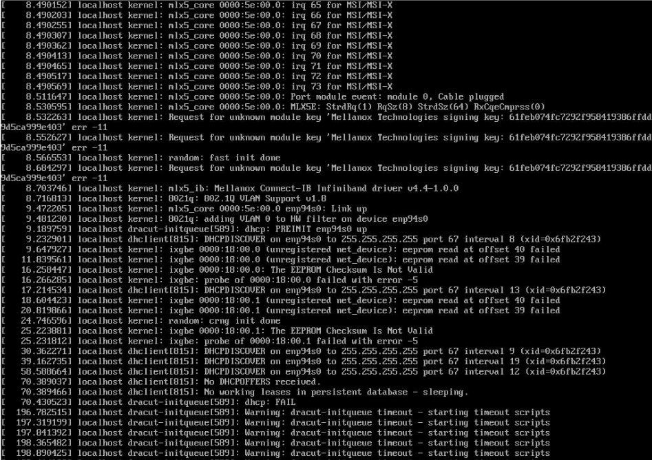

# Compute Node Boot Issue Symptom: Message About Invalid EEPROM Checksum in Node Console or Log

On rare occasions, the processor hardware may lose the Serial Over Lan \(SOL\) connections and may need to be reseated to allow the node to successfully boot.

### Symptoms

This issue can be identified if the following is displayed in the node's console or log:

```bash
console.38:2018-09-08 04:54:51 [   16.721165] ixgbe 0000:18:00.0: The EEPROM Checksum Is Not Valid
console.38:2018-09-08 04:55:00 [   25.768872] ixgbe 0000:18:00.1: The EEPROM Checksum Is Not Valid
```

The following figure shows that the EEPROM checksum errors lead to a `dracut-initqueue` timeout, and eventually cause the node to drop into the `dracut` emergency shell.



### Problem Detection

Run `dmidecode` from the compute node to identify its model. H87926-500 is the silver model that may exhibit this issue, whereas the production model, H87926-550, does not exhibit SOL connection issues.

```bash
cmp4:~ # dmidecode|grep H87926
```

Example output:

```
        Version: H87926-550
```

### Resolution

One way to resolve this issue is to ensure that the latest `ixgbe` network driver is installed on the nodes.

