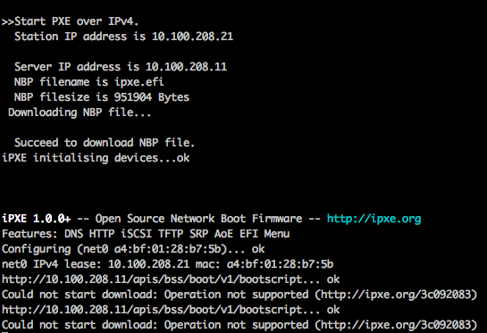

# Compute Node Boot Issue Symptom: Node is Not Able to Download the Required Artifacts

If either or both of the `kernel` or the `initrd` boot artifacts are missing from the artifact repository, Boot Script Service \(BSS\), or both, the node will not be able to download the required boot artifacts and will fail to boot.

### Symptoms

The node's console or log will display lines beginning with, ''`Could not start download`''. Refer to the image below for an example of this error message.



### Problem Detection

Use the following command from a non-compute node \(NCN\) to see which boot artifacts BSS assumes as those used for booting the node.

```bash
ncn-m001# cray bss bootparameters list
```

Each boot artifact has a download URL, as shown in the following example output:

```
[[results]]
kernel = "s3://boot-images/dc87a741-f7cc-4167-afae-592c5a8ca7ec/vmlinuz-4.12.14-197.29_9.1.14-cray_shasta_c"

[[results]]
kernel = "s3://boot-images/89e5a1dc-0caa-418a-9742-a832829db0ab/kernel"

[[results]]
kernel = "s3://boot-images/97b548b9-2ea9-45c9-95ba-dfc77e5522eb/kernel"

[[results]]
kernel = "s3://boot-images/29c2cc23-a9d6-4e9a-ab1a-b5fa9270c975/kernel"

[[results]]
initrd = "s3://boot-images/dc87a741-f7cc-4167-afae-592c5a8ca7ec/initrd-4.12.14-197.29_9.1.14-cray_shasta_c"

[[results]]
initrd = "s3://boot-images/97b548b9-2ea9-45c9-95ba-dfc77e5522eb/initrd"

[[results]]
initrd = "s3://boot-images/89e5a1dc-0caa-418a-9742-a832829db0ab/initrd"

[[results]]
initrd = "s3://boot-images/29c2cc23-a9d6-4e9a-ab1a-b5fa9270c975/initrd"

[[results]]
params = "console=ttyS0,115200n8 console=tty0 initrd=37103ceb-3813-45ba-85b0-a8fc53edd5da   rw selinux=0 nofb rd.shell    rd.net.timeout.carrier=20 ip=dhcp rd.neednet=1 rd.retry=60 crashkernel=360M reds=use_server api_gw_ip=api-gw-service-nmn.local"

initrd = "s3://boot-images/97b548b9-2ea9-45c9-95ba-dfc77e5522eb/initrd"
hosts = [ "Unknown-x86_64",]
kernel = "s3://boot-images/97b548b9-2ea9-45c9-95ba-dfc77e5522eb/kernel"
```

Use the artifact's S3 key to download it:

```bash
ncn-m001# cray artifacts get S3_BUCKET S3_OBJECT_KEY DOWNLOAD_FILE_PATH
```

For example, if s3://boot-images/97b548b9-2ea9-45c9-95ba-dfc77e5522eb/initrd is the S3 URI for the file initrd, run the following command:

```bash
ncn-m001# cray artifacts get boot-images \
97b548b9-2ea9-45c9-95ba-dfc77e5522eb/initrd initrd
```

This command will return 404 errors if the specified object does not exist in the S3 bucket.

### Resolution

Ensure that the required boot artifacts are stored in the artifact repository and/or BSS. If the artifact's name is different than what is already in BSS, then BSS needs to be updated to match.

