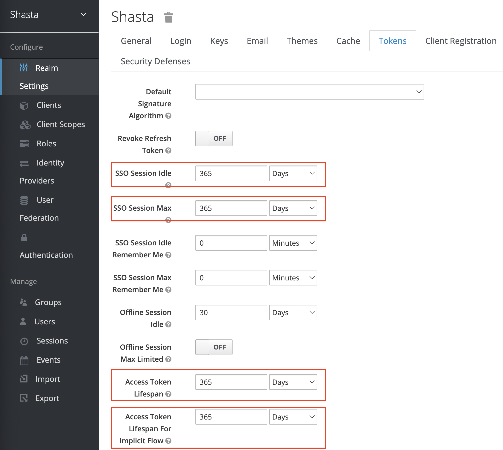
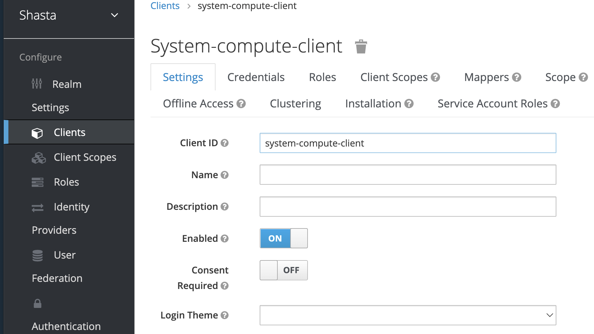
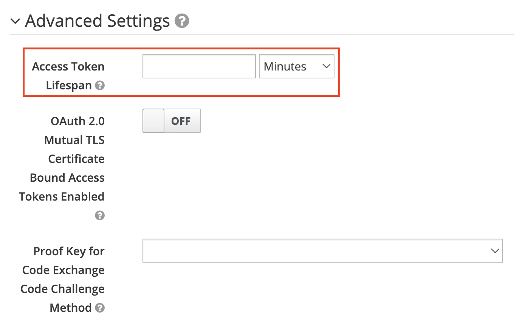

# Change the Keycloak Token Lifetime

This document outlines how to change the Keycloak default token lifetime or the token
lifetime for a specific client.

Note: The default value for these settings is 365 days.

## Procedure

Log in to Keycloak with the default admin credentials.

Point a browser at `https://auth.SYSTEM_DOMAIN_NAME/keycloak/admin`, replacing `SYSTEM_DOMAIN_NAME` with the actual NCN's DNS name.

The following is an example URL for a system: `https://auth.cmn.system1.us.cray.com/keycloak/admin`

Use the following admin login credentials:

- Username: `admin`
- The password can be obtained with the following command:

```bash
ncn# kubectl get secret -n services keycloak-master-admin-auth \
        --template={{.data.password}} | base64 --decode
```

### Change Global Token Lifetime Values

1. Select `Realm Settings` under `Configure` on the left of the `admin` page.
1. Select the `Tokens` tab.
1. Change the following options to the appropriate lifetime values:
   - `SSO Session Idle`
   - `SSO Session Max`
   - `Access Token Lifespan`
   - `Access Token Lifespan for Implicit Flow`
1. Click `Save` at the bottom of the page.



### Change A Specific Client's Token Lifetime

1. Select `Clients` under `Configure` on the left of the `admin` page.
1. Select the client that you wish to change the token lifetime for.
1. Expand `Advanced Settings`.
1. Change the `Access Token Lifespan` to the appropriate lifetime value.
1. Click `Save` at the bottom of the page.




