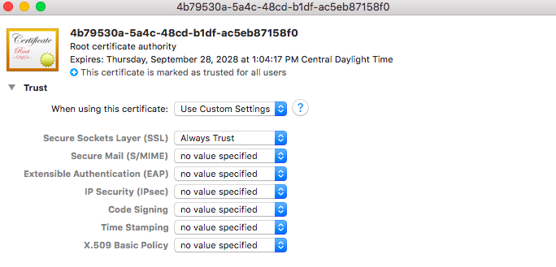

# Make HTTPS Requests from Sources Outside the Management Kubernetes Cluster

Clients lying outside the system's management cluster need to trust the Certificate Authority \(CA\) certificate or host certificate in order to make requests to a non-compute node \(NCN\).
Getting the client system to trust the CA certificate depends on the operating system.

This procedure shows an example of how to have a client trust the system's CA certificate on a Mac OS X system.

Updating the default certificates and password of the Keycloak master administrator is not supported.

## Prerequisites

This procedure assumes that it is being carried out on a Mac OS X system.

## Procedure

1. (`mac$`) Retrieve the CA public certificate file.

    The `scp` command is used in the following example to copy the CA public certificate file to the current directory.

    ```bash
    scp jones-ncn-m001.us.cray.com:/etc/pki/trust/anchors/platform-ca-certs.crt .
    ```

    Example output:

    ```text
    certificate_authority.crt                 100%  989     1.4MB/s   00:00
    ```

    **Troubleshooting:** Request a copy of the certificate file from a system administrator if it is not possible to log on to the NCN.

1. Use `Finder` to locate the `.crt` file.

    

1. Double-click the `.crt` file to add it to the system keychain.

    The `.crt` file might still not be trusted; start up the `Keychain Access` utility to mark it as trusted for SSL.

    

1. Double-click the untrusted certificate.

1. Expand the `Trust` menu item to set `Change Secure Sockets Layer (SSL)` to `Always Trust`.

1. Quit `Keychain Access`.

1. (`mac$`) Make secure requests to any NCN as needed.

    Making a secure request to an NCN requires users to pass an authentication token.
    See [Retrieve an Authentication Token](Retrieve_an_Authentication_Token.md) in order to set the `$TOKEN` variable used in the example below.

    For example:

    ```bash
    curl -H "Authorization: Bearer ${TOKEN}" https://api.cmn.SYSTEM-NAME_DOMAIN-NAME/apis/capmc/capmc/get_node_rules
    ```

    Example output:

    ```json
    {
    "e":0,
    "err_msg":"",
    "latency_node_off":60,
    "latency_node_on":120,
    "latency_node_reinit":180,
    "max_off_req_count":-1,
    "max_off_time":-1,
    "max_on_req_count":-1,
    "max_reinit_req_count":-1,
    "min_off_time":-1
    }
    ```
