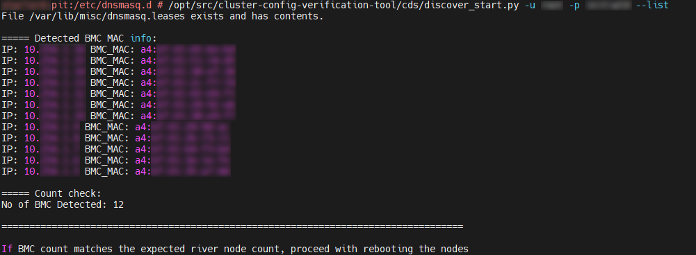
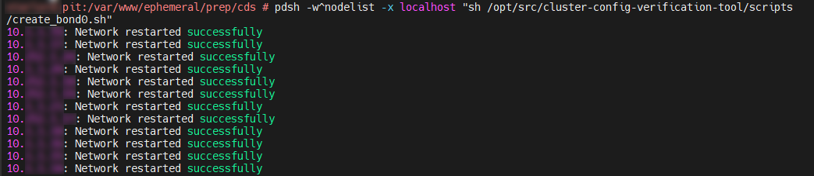
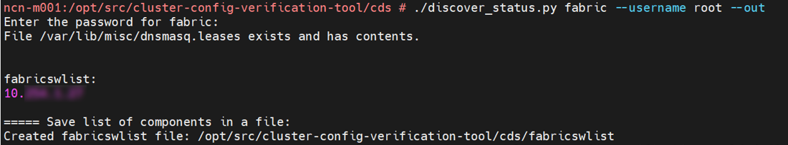

# Create System Configuration Using Cluster Discovery Service

This stage walks the user through creating the configuration payload for the system using Cluster Discovery Service (CDS) to generate seed files and paddle file.

Run the following steps before starting any of the system configuration procedures.

1. (`pit#`) Create the `prep` and `cds` directory.

   ```bash
   mkdir -pv "${PITDATA}/prep/cds"
   ```

1. (`pit#`) Change into the `cds` directory.

   ```bash
   cd "${PITDATA}/prep/cds"
   ```

1. (`pit#`) Set `CVT_PATH` variable.

   ```bash
   CVT_PATH=/opt/src/cluster-config-verification-tool/
   ```

## Topics

1. [Customize `system_config.yaml`](#1-customize-system_configyaml)
1. [Configure the management network](#2-configure-the-management-network)
1. [Configure auto-discovery](#3-configure-auto-discovery)
    1. [Configure `dnsmasq`](#31-configure-dnsmasq)
    1. [Verify and reset the BMCs](#32-verify-and-reset-the-bmcs)
    1. [Verify the discover status](#33-verify-the-discover-status)
    1. [Collect and compare the inventory data](#34-collect-and-compare-the-inventory-data)
1. [Generate seed files and paddle file](#4-generate-seed-files-and-paddle-file)
1. [Stop discovery](#5-stop-discovery)
1. [Run CSI](#6-run-csi)
1. [Prepare Site Init](#7-prepare-site-init)
1. [Initialize the LiveCD](#8-initialize-the-livecd)
1. [Next topic](#next-topic)

## 1. Customize `system_config.yaml`

1. (`pit#`) Change into the `prep` directory.

   ```bash
   cd "${PITDATA}/prep"
   ```

1. (`pit#`) Create or copy `system_config.yaml`.

   - If one does not exist from a prior installation, then create an empty one:

     ```bash
     csi config init empty
     ```

   - Otherwise, copy the existing `system_config.yaml` file into the working directory.

1. (`pit#`) Edit the `system_config.yaml` file with the appropriate values.

   > **NOTE**:
   >
   > - For a short description of each key in the file, run `csi config init --help`.
   > - For more description of these settings and the default values, see
   >   [Default IP Address Ranges](../introduction/csm_overview.md#2-default-ip-address-ranges) and the other topics in
   >   [CSM Overview](../introduction/csm_overview.md).
   > - To enable or disable audit logging, refer to [Audit Logs](../operations/security_and_authentication/Audit_Logs.md)
   >   for more information.
   > - If the system is using a `cabinets.yaml` file, be sure to update the `cabinets-yaml` field with `'cabinets.yaml'` as its value.

   ```bash
   vim system_config.yaml
   ```

## 2. Configure the management network

1. (`pit#`) Change into the `cds` directory.

   ```bash
   cd "${PITDATA}/prep/cds"
   ```

1. (`pit#`) Set up the `bond0` network interface as follows:

   - Configure `bond0` interface for single VLAN:

     ```bash
     "${CVT_PATH}"/cds/network_setup.py -mtl <ipaddr>,<netmask>,<slave0>,<slave1>
     ```

   - Configure `bond0` interface for HMN configured network (VLAN 1, 2, and 4):

     ```bash
     "${CVT_PATH}"/cds/network_setup.py -mtl <ipaddr>,<netmask>,<slave0>,<slave1> -hmn <ipaddr>,<netmask>,<vlanid> -nmn <ipaddr>,<netmask>,<vlanid>
     ```

     The variables and their descriptions are as follows:

     | Variable           | Description        |
     |--------------------|--------------------|
     | `ipaddr`           | IP address         |
     | `netmask`          | netmask value      |
     | `slave0`, `slave1` | network interfaces |
     | `vlanid`           | VLAN ID number     |

     > **NOTE**: The IP address value, netmask value, network interface, and VLAN ID are available in the `system_config.yaml` file in the `prep` directory.

## 3. Configure auto-discovery

### 3.1 Configure Dnsmasq

1. (`pit#`) Configure Dnsmasq and PXE Boot.

   - Configure Dnsmasq for single VLAN:

     > The `<leasetime>` parameter is optional.

     ```bash
     "${CVT_PATH}"/cds/discover_enable.py -ip <dhcp_ip_start>,<dhcp_ip_end>,<subnet>,<leasetime> -i bond0
     ```

     Example command:

     ```bash
     "${CVT_PATH}"/cds/discover_enable.py -ip 10.x.x.x,10.x.x.x,255.x.x.x,24h -i bond0
     ```

   - Configure Dnsmasq for HMN configured network (VLAN 1, 2, and 4):

     ```bash
     "${CVT_PATH}"/cds/discover_enable.py -mtl <admin_node_mtl_ip>,<start_ip>,<end_ip> \
                                          -nmn <admin_node_nmn_ip>,<start_ip>,<end_ip> \
                                          -hmn <admin_node_hmn_ip>,<start_ip>,<end_ip>
     ```

     Example command:

     ```bash
     "${CVT_PATH}"/cds/discover_enable.py -mtl 10.x.x.x,10.x.x.x,10.x.x.x \
                                          -nmn 10.x.x.x,10.x.x.x,10.x.x.x \
                                          -hmn 10.x.x.x,10.x.x.x,10.x.x.x
     ```

     > **NOTE**: The `iprange` for single VLAN or `mtliprange`, `nmniprange`, and `hmniprange` for HMN configured network are available in the `system_config.yaml` file in the `prep` directory.

### 3.2 Verify and reset the BMCs

The following steps will verify if IP addresses are assigned to the BMC nodes and then reset the nodes:

1. (`pit#`) If the fabric switches, PDUs, and CMCs are to be dynamically discovered, then ensure that they are set to DHCP mode.

1. (`pit#`) List the BMC nodes.

   ```bash
   "${CVT_PATH}"/cds/discover_start.py -u <bmc_username> -l
   ```

   > A prompt to enter the password will appear, enter the correct BMC password.

1. Verify that all the required nodes are listed.

   Example output:

   

1. (`pit#`) Reset the listed BMC nodes.

   ```bash
   "${CVT_PATH}"/cds/discover_start.py -u <bmc_username> -r
   ```

   > A prompt to enter the password will appear, enter the correct BMC password.

### 3.3 Verify the discover status

> **NOTE**: If the fabric switches, PDUs, and CMCs were not configured to DHCP mode in the step [Verify and reset the BMCs](#32-verify-and-reset-the-bmcs), manually create the `fabricswlist`, `pdulist`, and `cmclist` files in the working directory.

The following steps verify the status and lists the IP addresses of nodes, fabric switches, PDUs, and CMCs:

1. (`pit#`) Verify the status and list the IP addresses of the nodes.

   ```bash
   "${CVT_PATH}"/cds/discover_status.py nodes -o
   ```

   1. Create a `bond0` network interface on all the listed nodes.

      ```bash
      pdsh -w^nodelist -x localhost "sh "${CVT_PATH}"/scripts/create_bond0.sh"
      ```

   1. Ensure that `bond0` network interface is created on all the nodes listed in the `nodelist`.

      Example output:

      

1. (`pit#`) Verify the status and list the IP addresses of the fabric switches.

   ```bash
   "${CVT_PATH}"/cds/discover_status.py fabric -u <fabric_username> -o
   ```

   > A prompt to enter the password will appear, enter the correct fabric switch password.

   Example output:

   

1. (`pit#`) Verify the status and list the IP addresses of the PDUs.

   ```bash
   "${CVT_PATH}"/cds/discover_status.py pdu -o
   ```

1. (`pit#`) Verify the status and list the IP addresses of the CMCs.

   ```bash
   "${CVT_PATH}"/cds/discover_status.py cmc -u <cmc_username> -o
   ```

   > A prompt to enter the password will appear, enter the correct CMC password.

### 3.4 Collect and compare the inventory data

#### 3.4.1 Dynamic Data Collection

1. (`pit#`) Copy the SSH key to setup passwordless-SSH for the local host.

   ```bash
   ssh-copy-id localhost
   ```

1. (`pit#`) Collect the hardware inventory data.

   ```bash
   "${CVT_PATH}"/system_inventory.py -nf nodelist
   ```

1. (`pit#`) Collect the fabric inventory data.

   ```bash
   "${CVT_PATH}"/fabric_inventory.py -sf fabricswlist -u <switch_username>
   ```

   > A prompt to enter the password will appear, enter the correct fabric password.

1. (`pit#`) Collect the management network inventory.

   1. Manually, create a `mgmtswlist` file in the working directory listing the IP addresses of management switches.

   1. Collect the management network inventory data.

      ```bash
      "${CVT_PATH}"/management_inventory.py  -u <username> -sf mgmtswlist
      ```

      > A prompt to enter the password will appear, enter the correct fabric password.

1. (`pit#`) Collect the PDU inventory data.

   ```bash
   "${CVT_PATH}"/cds/pdu_cmc_inventory.py -pf pdulist
   ```

1. (`pit#`) Collect the CMC inventory data.

   ```bash
   "${CVT_PATH}"/cds/pdu_cmc_inventory.py -cf cmclist
   ```

#### 3.4.2 SHCD data population

1. Copy the SHCD files to the present working directory.

1. (`pit#`) Create a JSON file using the CANU tool.

   See [Validate the SHCD](../operations/network/management_network/validate_shcd.md#validate-the-shcd).

   Example command:

   ```bash
   canu validate shcd --shcd SHCD.xlsx --architecture V1 --tabs 40G_10G,NMN,HMN --corners I12,Q38,I13,Q21,J20,U38 --json --out cabling.json
   ```

1. (`pit#`) Store the SHCD data in the CVT database.

   ```bash
   "${CVT_PATH}"/parse_shcd.py -c cabling.json
   ```

#### 3.4.3 Server classification

(`pit#`) Classify the servers.

> In the following command, replace `<N>` with the number of worker NCNs in the system.

```bash
"${CVT_PATH}"/scripts/server_classification.py -n <N>
```

#### 3.4.4 Compare the SHCD data with CVT inventory data

1. (`pit#`) List the snapshot IDs of the SHCD and the CVT inventory data.

   ```bash
   "${CVT_PATH}"/shcd_compare.py -l
   ```

1. (`pit#`) Compare the SHCD data with the CVT inventory data.

   ```bash
   "${CVT_PATH}"/shcd_compare.py -s <SnapshotID_SHCD> -c <SnapshotID_CVT>
   ```

   Example command:

   ```bash
   "${CVT_PATH}"/shcd_compare.py -s 4ea86f99-47ca-4cd9-b142-ea572d0566bf -c 326a6edd-adce-4d1f-9f30-ae9539284733
   ```

## 4. Generate seed files and paddle file

1. (`pit#`) Generate the following seed files: `switch_metadata.csv`, `application_node_config.yaml`, `hmn_connections.json`, and `ncn_metadata.csv`.

   ```bash
   "${CVT_PATH}"/create_seedfile.py
   ```

   > **NOTE**: The generated seed files will be stored in the `seedfiles` folder in the working directory.

1. (`pit#`) Generate paddle file: `cvt-ccj.json`.

   > In the following command, replace `<arch_type>` with the type of architecture (`Full`, `V1`, or `Tds`).
   > See [Generate configuration files](../operations/network/management_network/generate_switch_configs.md#generate-configuration-files) for the characteristics of the architecture.

   ```bash
   "${CVT_PATH}"/create_paddle_file.py --architecture <arch_type>
   ```

1. Copy the generated paddle file and seed files to the `prep` directory.

   ```bash
   cp -rv ${PITDATA}/prep/cds/cvt-ccj.json ${PITDATA}/prep/cds/seedfiles/* ${PITDATA}/prep/
   ```

1. Create `cabinets.yaml` file in the `prep` directory, see [Create `cabinets.yaml`](create_cabinets_yaml.md).

## 5. Stop discovery

(`pit#`) Clean and reset the modified files to their original default state.

```bash
"${CVT_PATH}"/cds/discover_stop.py -u <bmc_username>
```

> A prompt to enter the password will appear, enter the correct BMC password.

## 6. Run CSI

1. (`pit#`) Change into the `prep` directory.

   ```bash
   cd "${PITDATA}/prep"
   ```

1. (`pit#`) Generate the initial configuration for CSI.

   This will validate whether the inputs for CSI are correct.

   ```bash
   csi config init
   ```

## 7. Prepare Site Init

Follow the [Prepare Site Init](prepare_site_init.md) procedure.

## 8. Initialize the LiveCD

> **NOTE:** If starting an installation at this point, then be sure to copy the previous `prep` directory back onto the system.

1. (`pit#`) Initialize the PIT.

   The `pit-init.sh` script will prepare the PIT server for deploying NCNs.

   ```bash
   /root/bin/pit-init.sh
   ```

1. (`pit#`) Set the `IPMI_PASSWORD` variable.

   ```bash
   read -r -s -p "NCN BMC root password: " IPMI_PASSWORD
   ```

1. (`pit#`) Export the `IPMI_PASSWORD` variable.

   ```bash
   export IPMI_PASSWORD
   ```

1. (`pit#`) Setup links to the boot artifacts extracted from the CSM tarball.

   > **NOTE**
   >
   > - This will also set all the BMCs to DHCP.
   > - Changing into the `$HOME` directory ensures the proper operation of the script.

   ```bash
   cd $HOME && /root/bin/set-sqfs-links.sh
   ```

## Next topic

After completing this procedure, proceed to import the CSM tarball.

See [Import the CSM Tarball](pre-installation.md#4-import-the-csm-tarball).
