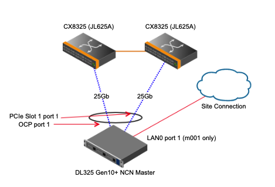
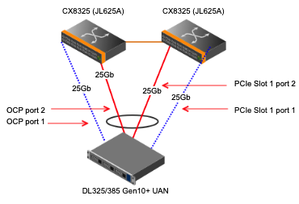
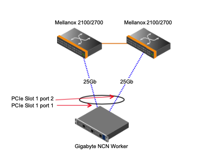
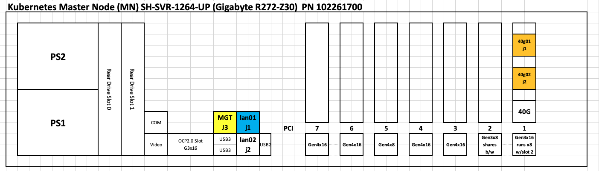
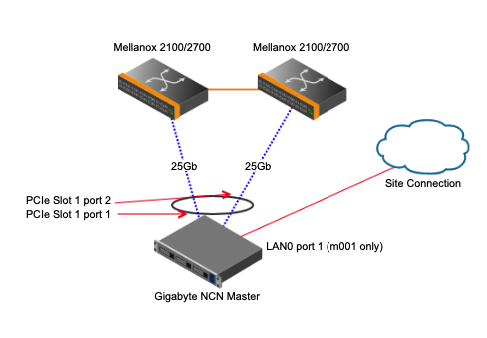
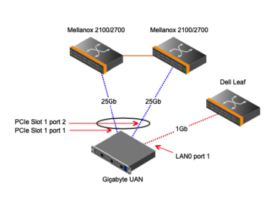

# Cable Management Network Servers

This topic describes nodes in the air-cooled cabinet with diagrams and pictures showing where to find the
ports on the nodes and how to cable the nodes to the management network switches.

* [HPE Hardware](#hpe-hardware)
  * [HPE DL385](#hpe_dl385)
  * [HPE DL325](#hpe_dl325)
  * [HPE Worker Node Cabling](#hpe_worker_node_cabling)
  * [HPE Master Node Cabling](#hpe_master_node_cabling)
  * [HPE Storage Node Cabling](#hpe_storage_node_cabling)
  * [HPE UAN Cabling](#hpe_uan_cabling)
  * [HPE Apollo 6500 XL645D](#hpe_apollo_6500_xl645d)
  * [HPE Apollo 6500 XL675D](#hpe_apollo_6500_xl675d)
* [Gigabyte/Intel Hardware](#gigabyte-hardware)
  * [Worker Node Cabling](#worker_node_cabling)
  * [Master Node Cabling](#master_node_cabling)
  * [Storage Node Cabling](#storage_node_cabling)
  * [UAN Cabling](#uan_cabling)

## HPE Hardware

### HPE DL385

* The OCP Slot is noted (number 7) in the image above.
  * This is the bottom middle slot to the left of the VGA port.
  * Ports are numbered left-to-right: the far left port is port 1.
* The PCIe Slot 1 is on the top left side of the image above (under number 1).
  * Ports are numbered left-to-right: the far left port is port 1.

### HPE DL325

* The OCP Slot is noted (number 9) in the image above.
  * This is the slot on the bottom left of the node.
  * Ports are numbered left-to-right: the far left port is port 1.
* The PCIE Slot 1 is on the top left side of the image above (under number 1).
  * Ports are numbered left-to-right: the far left port is port 1.

### HPE Worker Node Cabling

| Device | Port | Linux Device | Destination | Name | VLAN | LAG |
|:-------|------|:------|:-------------------------|:--------------|:--------------------|:-----|
| OCP | 1 |  mgmt0 | primary |  N/A |  HMN, NMN, CAN  |  MLAG-LACP |
| OCP | 2 |  mgmt1 | secondary |  N/A |  HMN, NMN, CAN  |  MLAG-LACP |
| ILO | 1 |  None | HMN leaf-bmc |  N/A |  HMN  |  N/A |

 
NOTES:

* A single OCP card is the default worker configuration.
 
 

#### SHCD Example

|hostname|Source         |Destination   |Destination |
|--------|---------------|--------------|------------|
| wn01	 | x3000u04ocp-j1 | x3000u12-j7 | sw-25g01   |
| wn01	 | x3000u04ocp-j2 | x3000u13-j7	| sw-25g02   |

### HPE Master Node Cabling

#### Dual Card Installations
The table below describes the cabling of dual card configurations. Also read notes in this section to see other possible customer-based configurations.

| Device | Port | Linux Device | Destination | Name | VLAN | LAG |
|:-------|------|:------|:-------------------------|:--------------|:--------------------|:-----|
| OCP | 1 |  mgmt0 | primary |  N/A |  HMN, NMN, CAN  |  MLAG-LACP |
| OCP | 2 |  mgmt1 | site |  N/A |  N/A  |  N/A |
| PCIE-SLOT1 | 1 |  mgmt2 | secondary |  N/A |  HMN, NMN, CAN  |  MLAG-LACP |
| PCIE-SLOT1 | 2 |  mgmt3 | None |  N/A |  N/A  |  N/A |
| ILO | 1 |  None | HMN leaf-bmc |  N/A |  HMN  |  N/A |

 
NOTES:

* REQUIRED:  Master 001 (ncn-m001) is required to have a site connection on OCP Port 2 for installation and maintenance.
* RECOMMENDED: Masters 002 and 003 may optionally have a site connection on OCP Port 2 for emergency system access.
* REQUIRED:  Master 001 (ncn-m001) is required to have its BMC/iLO connected to the site.
 
 

#### SHCD Example

|hostname|Source         |Destination   |Destination |
|--------|---------------|--------------|------------|
| mn01	 | x3000u01ocp-j1 | x3000u12-j1 | sw-25g01   |
| mn01	 | x3000u01s1-j1  | x3000u13-j1	| sw-25g02   |

**NOTE**: Master 1 (ncn-m001) is required to have a site connection for installation and non-CAN system access. This can have several configurations depending on customer requirements/equipment:

* Dual 10/25Gb card configurations as described in the table above should use PCIe Slot 1, Port 2 as a site connection if the customer supports 10/25Gb.
* If the customer does not support 10/25Gb speeds (or connection type) and requires RJ45 copper or 1Gb, then a new and separate card will be installed on ncn-m001 and that card will provide site connectivity.
* Another possibility (non-HPE hardware mainly) is that a built-in 1Gb port will be used if available (similar to Shasta v1.3 PoR on Gigabyte hardware).

### HPE Storage Node Cabling

| Device | Port | Linux Device | Destination | Name | VLAN | LAG |
|:-------|------|:------|:-------------------------|:--------------|:--------------------|:-----|
| OCP | 1 |  mgmt0 | primary |  N/A |  HMN, NMN, CAN  |  MLAG-LACP |
| OCP | 2 |  mgmt1 | primary |  N/A |  SUN  |  MLAG-LACP |
| PCIE-SLOT1 | 1 |  mgmt2 | secondary |  N/A |  HMN, NMN, CAN  |  MLAG-LACP |
| PCIE-SLOT1 | 2 |  mgmt3 | secondary |  N/A |  SUN  |  MLAG-LACP |
| ILO | 1 |  None | HMN leaf-bmc |  N/A |  HMN  |  N/A |

 
NOTES:

* All ports are cabled.
* OCP Port 1 and PCIE Slot 1 Port 1 (first ports) are bonded for the NMN, HMN and CAN.
* OCP Port 2 and PCIE Slot 1 Port 2 (second ports) cabled but not configured in this release.
 
 

#### SHCD Example

|hostname|Source         |Destination   |Destination |
|--------|---------------|--------------|------------|
| sn01	 | x3000u17s1-j2 | x3000u34-j14	| sw-25g02   |
| sn01	 | x3000u17s1-j1 | x3000u34-j8	| sw-25g02   |
| sn01	 | x3000u17ocp-j2| x3000u33-j14	| sw-25g01   |
| sn01	 | x3000u17ocp-j1| x3000u33-j8	| sw-25g01   |
The OCP ports go to the First switch and the PCIe ports go to the Second switch. OCP port 1 and PCIe port 1 form a Bond. OCP port 2 and PCIe port 2 form a Bond.

For systems that include 4 leaf-bmc switches the cabling will look like the following.

#### SHCD Example with four leaf-bmc switches.
|hostname|Source          |Destination   |Destination |
|--------|----------------|--------------|------------|
| sn01	 | x3000u10ocp-j2 | x3000u36-j5	 | sw-25g04   |
| sn01	 | x3000u10s1-j2  | x3000u35-j5	 | sw-25g03   |
| sn01	 | x3000u10ocp-j1 | x3000u34-j6	 | sw-25g02   |
| sn01	 | x3000u10s1-j1  | x3000u33-j6	 | sw-25g01   |

### HPE UAN Cabling

| Device | Port | Linux Device | Destination | Name | VLAN | LAG |
|:-------|------|:------|:-------------------------|:--------------|:--------------------|:-----|
| OCP | 1 |  mgmt0 | primary |  N/A |  NMN  |  N/A |
| OCP | 2 |  mgmt1 | primary |  N/A |  CAN  |  MLAG-LACP |
| PCIE-SLOT1 | 1 |  mgmt2 | secondary |  N/A |  N/A  |  N/A |
| PCIE-SLOT1 | 2 |  mgmt3 | secondary |  N/A |  CAN  |  MLAG-LACP |
| ILO | 1 |  None | HMN leaf-bmc |  N/A |  HMN  |  N/A |

 
NOTES:

* All ports are cabled.
* The OCP Port 1 connects to the NMN in a non-bonded configuration.
* The PCIE Slot 1 Port 1 is cabled but not configured/used in this release.
* OCP Port 2 and PCIE Slot 1 Port 2 (second ports) are bonded for the CAN.
 
 

#### SHCD Example

|hostname|Source         |Destination   |Destination |
|--------|---------------|--------------|------------|
| uan01	 | x3000u17s1-j2 | x3000u34-j14	| sw-25g02   |
| uan01	 | x3000u17s1-j1 | x3000u34-j8	| sw-25g02   |
| uan01	 | x3000u17ocp-j2| x3000u33-j14	| sw-25g01   |
| uan01	 | x3000u17ocp-j1| x3000u33-j8	| sw-25g01   |

### HPE Apollo 6500 XL645D

* The XL645D has two servers in the same chassis.
* The iLO BMC RJ45 port is a shared network port. Both iLO/BMC traffic and compute node traffic could transit this link.
  * Isolating this port to iLO/BMC only traffic is not possible within firmware configuration alone.
  * iLO configuration settings **must** be paired with management switch port settings to ensure only BMC traffic exits the port.
  * The iLO firmware must be set to tag traffic to VLAN 4. The switch port must be set to trunk VLAN 4.
* Ports on the OCP card are numbered left-to-right: the far left port is port 1.

#### Apollo XL645D Cabling (per server)

| Server Port        | Management Network Port        | Speed | Use / Configuration         |
|--------------------|--------------------------------|-------|-----------------------------|
| OCP port 1         | 1G leaf-bmc switch                 |  1Gb  | Management Network NMN      |
| OCP port 2         | None                           | None  | None                        |
| OCP port 3         | None                           | None  | None                        |
| OCP port 4         | None                           | None  | None                        |
| iLO                | 1G leaf-bmc switch                 |  1Gb  | Management Network HMN      |

### HPE Apollo 6500 XL675D

* Two PCIe slots (chassis slots 21 and 22) are highlighted. One will contain the 1Gb management network card and one will be for the HSN.
* The iLO BMC RJ45 port is a shared network port. Both iLO/BMC traffic and compute node traffic could transit this link.
  * Isolating this port to iLO/BMC only traffic is not possible within firmware configuration alone.
  * iLO configuration settings **must** be paired with management switch port settings to ensure only BMC traffic exits the port.
  * The iLO firmware must be set to tag traffic to VLAN 4. The switch port must be set to trunk VLAN 4.
* Ports on the PCIe card are numbered left-to-right: the far left port is port 1.

#### Apollo XL675D Cabling

| Server Port        | Management Network Port        | Speed | Use / Configuration         |
|--------------------|--------------------------------|-------|-----------------------------|
| PCIe port 1        | 1G leaf-bmc switch                 |  1Gb  | Management Network NMN      |
| PCIe port 2        | None                           | None  | None                        |
| PCIe port 3        | None                           | None  | None                        |
| PCIe port 4        | None                           | None  | None                        |
| iLO                | 1G leaf-bmc switch                 |  1Gb  | Management Network HMN      |

## Gigabyte/Intel Hardware

### Worker Node Cabling

| Server Port        | Management Network Port        | Speed | Use / Configuration            |
|--------------------|--------------------------------|-------|--------------------------------|
| PCIe Slot 1 port 1 | spine or leaf pair, switch 1/2 | 40Gb  | Management Network NMN/HMN/CAN |
| PCIe Slot 1 port 2 | spine or leaf pair, switch 2/2 | 40Gb  | Management Network NMN/HMN/CAN |

#### SHCD Example

|hostname|Source         |Destination   |Destination |
|--------|---------------|--------------|------------|
| wn01	 | x3000u07s1-j1 | x3000u24L-j4 | sw-smn02   |
| wn01	 | x3000u07s1-j2 | x3000u24R-j4	| sw-smn03   |

**NOTE**: Cabling of ncn-w001 has changed in Shasta v1.4. Please see ncn-m001 note below.

### Master Node Cabling

| Server Port        | Management Network Port        | Speed | Use / Configuration            |
|--------------------|--------------------------------|-------|--------------------------------|
| PCIe Slot 1 port 1 | spine or leaf pair, switch 1/2 | 40Gb  | Management Network NMN/HMN/CAN |
| PCIe Slot 1 port 2 | spine or leaf pair, switch 2/2 | 40Gb  | Management Network NMN/HMN/CAN |
| LAN0 port 1        | NONE (See note below for ncn-m001) | NONE  | Site (See note below for ncn-m001) |

#### SHCD Example

|hostname|Source         |Destination   |Destination |
|--------|---------------|--------------|------------|
| mn01	 | x3000u01s1-j1 | x3000u24L-j1 | sw-smn02   |
| mn01	 | x3000u01s1-j2 | x3000u24R-j1	| sw-smn03   |

**NOTE**: Master 1 (ncn-m001) is required to have a site connection for installation and non-CAN system access. In Shasta versions <=1.3 this connection was on ncn-w001. This can have several configurations depending on customer requirements/equipment:

* The default configuration for Gigabyte systems uses the built-in 1Gb lan0 port for site connection on ncn-m001.
* If the customer requires connectivity greater than 1Gb (or a different connection type), then a new and separate card will be installed on ncn-m001 and that card will provide site connectivity.

### Storage Node Cabling

| Server Port        | Management Network Port        | Speed | Use / Configuration            |
|--------------------|--------------------------------|-------|--------------------------------|
| PCIe Slot 1 port 1 | spine or leaf pair, switch 1/2 | 40Gb  | Management Network NMN/HMN/CAN |
| PCIe Slot 1 port 2 | spine or leaf pair, switch 2/2 | 40Gb  | Management Network NMN/HMN/CAN |

#### SHCD Example

|hostname|Source         |Destination   |Destination |
|--------|---------------|--------------|------------|
| sn01	 | x3000u13s1-j1 | x3000u24L-j7 | sw-smn02   |
| sn01	 | x3000u13s1-j2 | x3000u24R-j7	| sw-smn03   |

### UAN Cabling

| Server Port        | Management Network Port        | Speed | Use / Configuration         |
|--------------------|--------------------------------|-------|-----------------------------|
| LAN0 port 1        | leaf-bmc (see note)                |  1Gb  | Management Network NMN      |
| PCIe Slot 1 port 1 | spine or leaf pair, switch 1/2 | 40Gb  | Management Network CAN bond |
| PCIe Slot 1 port 2 | spine or leaf pair, switch 2/2 | 40Gb  | Management Network CAN bond |

#### SHCD Example

|hostname|Source         |Destination   |Destination |
|--------|---------------|--------------|------------|
| uan01	 | x3000u27s1-j1 | x3000u24L-j10| sw-smn02   |
| uan01	 | x3000u27s1-j2 | x3000u24R-j10| sw-smn03   |

NOTE that there are a couple configurations possible for LAN0:
* Existing Gigabyte systems on Dell and Mellanox network hardware will use the (existing) Dell leaf-bmc port.
* Any Gigabyte system on Aruba network hardware will use an Aruba 6300 (for the 1Gb port).
* Optionally a 10/25Gb card could be added in an Aruba hardware system to match the HPE UANs.
