# Boot Pre-Install Live ISO and Generate Seed Files

The following steps provide instructions to boot the Pre-Install Live ISO and create seed files for CSM installation.

## Topics

1. [Create the bootable media](#create-the-bootable-media)
1. [Boot the LiveCD](#boot-the-livecd)
1. [Booting the master node using bootable USB](#boot-the-livecd)
1. [Post-boot configuration](#post-boot-configuration)
1. [Import CSM tarball](#import-csm-tarball)
1. [Seed file generation](#seed-file-generation)
1. [Compare the SHCD data with CVT inventory data](#compare-the-shcd-data-with-cvt-inventory-data-optional)
1. [Stop HPCM services](#stop-hpcm-services)
1. [Cleanup](#cleanup-optional)
1. [Next topic](#next-topic)

## Create the bootable media

To create the bootable LiveCD image use `dd` command. Before creating the media, identify which device will be used for it. If the bootable media with LiveCD image is already prepared, then skip to [Boot the LiveCD](#boot-the-livecd).

1. (`external#`) Obtain the cluster manager software (HPCM version 1.9) from HPE for all the required ISO files.

    Obtain the cluster manager installation software, including patches and updates,from [My HPE Software Center
](https://www.hpe.com/downloads/software).

    > **NOTE:** User needs to have a HPE Passport account and its login credentials to access the customer portal website.

1. (`external#`) Identify the USB device.

   > **NOTE:** This example shows the USB device is `/dev/sdd` on the host.

   ```bash
   lsscsi
   ```

   Expected output looks similar to the following example:

   ```text
   [6:0:0:0]    disk    ATA      SAMSUNG MZ7LH480 404Q  /dev/sda
   [7:0:0:0]    disk    ATA      SAMSUNG MZ7LH480 404Q  /dev/sdb
   [8:0:0:0]    disk    ATA      SAMSUNG MZ7LH480 404Q  /dev/sdc
   [14:0:0:0]   disk    SanDisk  Extreme SSD      1012  /dev/sdd
   [14:0:0:1]   enclosu SanDisk  SES Device       1012  -
   ```

   In the previous example, the `ATA` devices are the internal disks and the other two devices are the USB drives.

1. (`external#`) Set a variable pointing to the USB device:

   ```bash
   USB=/dev/sd<disk_letter>
   ```

1. (`external#`) Format the USB device.

   Burn the LiveCD ISO on USB device using `dd` command in the following format:

   ```bash
   dd "if=${PWD}/cm-admin-install-1.9-sles15sp4-x86_64.iso" "of=${USB}" bs=4M oflag=sync status=progress
   ```

At this point, image is ready and system can be booted from the USB drive.

## Boot the LiveCD

Some systems will boot the USB device automatically, if no other OS exists (bare-metal). Otherwise the administrator may need to use the `BIOS Boot Selection menu` to choose the USB device (Option 1).

If an administrator has the node booted with an operating system which will next be rebooting into the LiveCD, then admin can use  `efibootmgr` to set the boot order to be the USB device (Option 2).
See the [set boot order](../../background/ncn_boot_workflow.md#setting-boot-order) page for more information about how to set the boot order to have the USB device first.

- _Option 1_ : Boot LiveCD ISO image using `BIOS Boot Selection menu`

   1. Reboot the server.

   1. Press F6 until the following screen appears.

      

   1. Select the bootable device.

      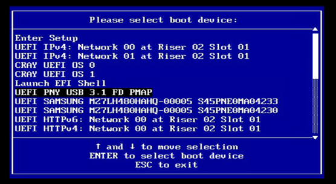

- _Option 2_ : Boot the LiveCD ISO image using `efibootmgr`.

   >**NOTE:** For the system to find the USB device's EFI bootloader, UEFI booting must be enabled.

   1. (`external#`) Confirm that the IPMI credentials work for the BMC by checking the power status.

         Set the `BMC` variable to the hostname or IP address of the BMC of the PIT node.

         ```bash
         USERNAME=root
         BMC=eniac-ncn-m001-mgmt
         read -r -s -p "${BMC} ${USERNAME} password: " IPMI_PASSWORD
         export IPMI_PASSWORD
         ipmitool -I lanplus -U "${USERNAME}" -E -H "${BMC}" chassis power status
         ```

         >**NOTE:** The `read -s` command is used to prevent the credentials from being displayed on the screen or recorded in the shell history.

   1. (`external#`) Power the NCN on and connect to the IPMI console.

      >**NOTE:** The boot device can be set via IPMI; the example below uses the `floppy` option. At a glance this seems incorrect, however it selects
      > the primary removable media. This step instructs the user to power off the node to ensure the BIOS has the best chance at finding the USB via a cold boot.

      ```bash
      ipmitool chassis bootdev
      ```

      ```text
         Received a response with unexpected ID 0 vs. 1
         bootdev <device> [clear-cmos=yes|no]
         bootdev <device> [options=help,...]
         none  : Do not change boot device order
         pxe   : Force PXE boot
         disk  : Force boot from default Hard-drive
         safe  : Force boot from default Hard-drive, request Safe Mode
         diag  : Force boot from Diagnostic Partition
         cdrom : Force boot from CD/DVD
         bios  : Force boot into BIOS Setup
         floppy: Force boot from Floppy/primary removable media
      ```

      ```bash
      ipmitool -I lanplus -U "${USERNAME}" -E -H "${BMC}" chassis bootdev floppy options=efiboot
      ipmitool -I lanplus -U "${USERNAME}" -E -H "${BMC}" chassis power off
      ```

   1. Insert the USB stick into a recommended USB3 port.

      **Information:** `USB2` port is also compatible, but `USB3` port is recommended as it offers the best performance.

   1. (`external#`) Power the server on.

      ```bash
      ipmitool -I lanplus -U "${USERNAME}" -E -H "${BMC}" chassis power on
      ipmitool -I lanplus -U "${USERNAME}" -E -H "${BMC}" sol activate
      ```

## Booting the master node using bootable USB

   1. After selecting the boot device, GRUB menu will show up.

   1. Select the `CM Live` option from GRUB prompt.

      1. From the GRUB menu, select `CM Live` option.

         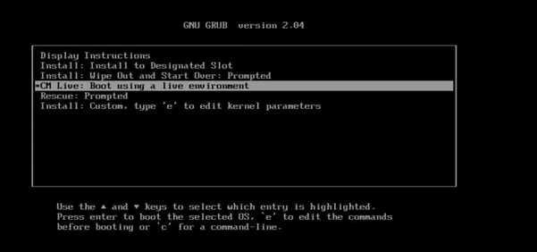

      1. A series of input prompts will appear. Provide the responses per the following example:

         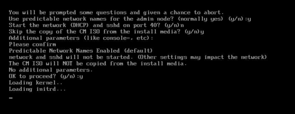

         >**NOTE:** It may be necessary to set `console=ttyS0,115200n8` or `console=ttyS1,115200n8` on some systems if the boot logs do not show after `Loading initrd...`.

         Once the system boots up the OS successfully, provide username and password as `root`/`cmdefault` to log in to the system.

## Post-boot configuration

   1. (`pit#`) Set the site LAN.

      To configure `sitelan` open a command line terminal and run the following command:

      `172.30.54.111` and `eno1` are examples of IP address and network device names.

      ```bash
      ifconfig eno1 172.30.54.111 netmask 255.255.240.0
      ip route add default via <gateway ip> dev eno1
      ```

      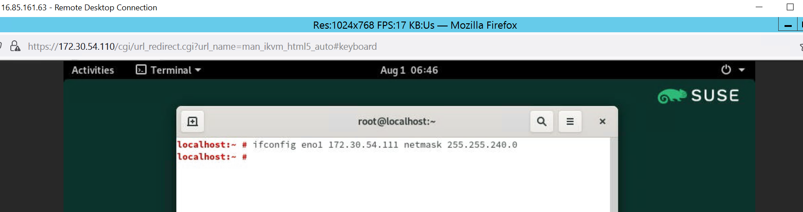

      Now this server can be accessed from the external servers.

   1. (`external#`) Log in to the machine using `ssh`.

      ```bash
      ssh root@172.30.54.111
      ```

   1. (`pit#`) Set the hostname.

      > Modify the following command to specify the desired hostname.

      ```bash
      hostnamectl set-hostname system_name
      ```

   1. (`pit#`) Set the timezone.

      > Modify the following command to specify the desired timezone.

      ```bash
      timedatectl set-timezone Asia/Kolkata
      ```

   1. Configure the management switches.

      - For Mellanox spine switches.

          1. (`pit#`) Access the Mellanox switch using `ssh` or `minicom`.

             >**NOTE:** The following are example commands; the actual device name and IP address may vary.

             - Example 1 (using `ssh` to its IP address):

                ```bash
                ssh admin@10.1.0.2
                ```

             - Example 2 (using `minicom`):

                ```bash
                minicom -b 115200 -D /dev/ttyUSB1
                ```

          1. Log in to the switch using the switch credentials.

             The login prompt for Mellanox switch looks similar to the following:

             ```text
             Welcome to minicom 2.7.1

             OPTIONS: I18n
             Port /dev/ttyUSB2, 21:51:12

             Press CTRL-A Z for help on special keys

             NVIDIA Onyx Switch Management
             sw-spine01 login: admin
             Password:
             Last login: Fri Nov  4 16:31:03 UTC 2022 from 172.23.0.1 on pts/1
             Last failed login: Fri Nov  4 17:02:03 UTC 2022 from 172.23.0.1 on ssh:notty
             Number of total successful connections since last 1 days: 10
             NVIDIA Switch
             sw-spine01 [standalone: master] >
             ```

          1. (`sw-spine01#`) Create blank/empty configuration file.

             ```text
             enable
             configure terminal
             configuration new hpcm_blank1
             configuration switch-to hpcm_blank1
             ```

             If the switch prompts for reboot, then give an affirmative response. After the reboot, log back
             into the switch and perform the next steps. If no reboot is required, just proceed to the next step.

          1. (`sw-spine01#`) Configure the switch settings.

             1. Enter configuration mode.

                ```text
                enable
                configure terminal
                ```

             1. Copy and paste the network settings from [Configuration of Spine Switch 01](hpcm_switch_conf_spine_001.md).

             1. Save those settings as `hpcm_blank1`.

                ```text
                configuration write
                ```

          1. Exit from the first spine switch and repeat the procedure for the second spine switch.

             The settings for the second spine switch can be copied from [Configuration of Spine Switch 02](hpcm_switch_conf_spine_002.md).

      - For leaf switches (Dell).

          1. (`pit#`) Access the leaf switch using minicom.

             This example assumes that `/dev/ttyUSB3` is leaf switch.

             ```bash
             minicom -b 115200 -D /dev/ttyUSB1
             ```

             >**NOTE:** Device name may vary.

             The login message will look similar to the following:

             ```text
             Welcome to minicom 2.7.1

             OPTIONS: I18n
             Port /dev/ttyUSB3, 16:48:45

             Press CTRL-A Z for help on special keys


             Debian GNU/Linux 9 sw-leaf01 ttyS0

             Dell EMC Networking Operating System (OS10)

             sw-leaf01 login: admin
             Password:
             Last login: Fri Nov  4 17:02:37 UTC 2022 from 172.23.0.1 on pts/0
             Linux sw-leaf01 4.9.189 #1 SMP Debian 4.9.189-3+deb9u2 x86_64

             The programs included with the Debian GNU/Linux system are free software;
             the exact distribution terms for each program are described in the
             individual files in /usr/share/doc/*/copyright.

             Debian GNU/Linux comes with ABSOLUTELY NO WARRANTY, to the extent
             permitted by applicable law.


             -*-*-*-*-*-*-*-*-*-*-*-*-*-*-*-*-*-*-*-*-*-*-*-*-*-*-*-*-*-*-*-*-
             -*         Dell EMC  Network Operating System (OS10)           *-
             -*                                                             *-
             -* Copyright (c) 1999-2020 by Dell Inc. All Rights Reserved.   *-
             -*                                                             *-
             -*-*-*-*-*-*-*-*-*-*-*-*-*-*-*-*-*-*-*-*-*-*-*-*-*-*-*-*-*-*-*-*-

             This product is protected by U.S. and international copyright and
             intellectual property laws. Dell EMC and the Dell EMC logo are
             trademarks of Dell Inc. in the United States and/or other
             jurisdictions. All other marks and names mentioned herein may be
             trademarks of their respective companies.

             %Warning : Default password for admin account should be changed to secure the system
             sw-leaf01#
             ```

          1. (`sw-leaf01#`) Clean up the existing configuration and reboot the switch.

             1. Delete the configuration.

                ```text
                delete startup-configuration
                ```

                When prompted, enter `yes` to delete the configuration.

             1. Reboot the switch.

                ```text
                reload
                ```

                When prompted to save the modified configuration, enter `no`.
                When prompted to proceed with the reboot, enter `yes`.

          1. Log back in to the switch.

          1. (`sw-leaf01#`) Configure the switch settings.

             1. Enter configuration mode.

             ```text
              configure terminal
              ```

             1. Copy and paste the network settings from [Configuration of Leaf Switch 001](hpcm_switch_conf_leaf.md).

             1. Save those settings.

                ```text
                write memory
                ```

      - For Aruba switches.

         See the "Using Aruba Switches" section in [HPE Performance Cluster Manager Installation Guide for Clusters Without Leader Nodes](https://www.hpe.com/support/hpcm-inst-no-leaders-006)
         for the procedure to configure the Aruba switches.

   1. (`pit#`) Run `YaST-Firstboot`.

      1. Run `YaST-Firstboot`.

         ```bash
         /usr/lib/YaST2/startup/YaST2.Firstboot
         ```

      1. Select language and keyboard layout.

         YaST menu can be navigated using the tab key. Select appropriate language and keyboard layout and select `Next`.

         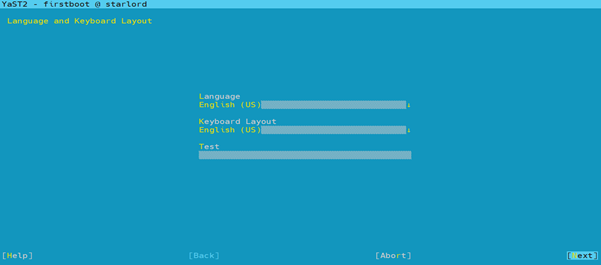

      1. Accept the licence agreement.

         Use the spacebar key to accept the licence agreement and select `Next`.

         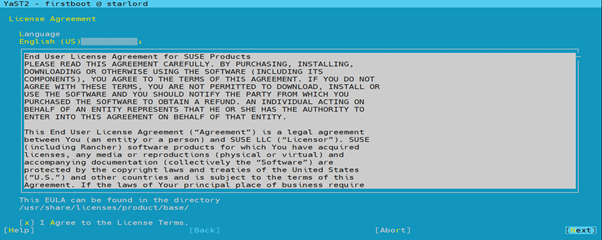

      1. Configure the `sitelan` network using the YaST menu.

         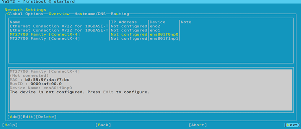

         Fill out the `IP Address`, `Subnet Mask`, `Hostname (FQDN)` fields and select `Next`.

         

      1. Set the hostname.

         Select the `Hostname/DNS` menu, fill the `Static Hostname` field, and select `Next`.

         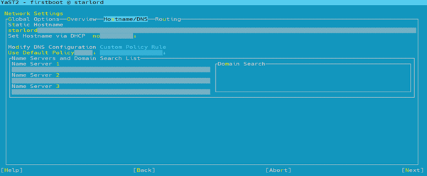

      1. Set the gateway.

         Navigate to the `Routing` tab from the UI and enter the gateway information.

      1. Set the timezone.

         Select the applicable timezone from the options and select `Next`.

         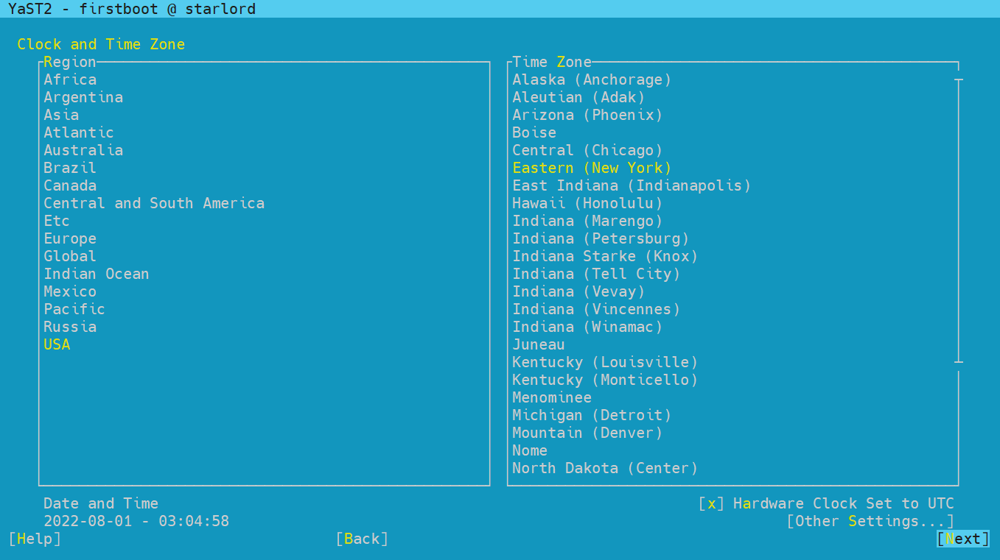

      1. Skip the user creation.

         Select `Skip User Creation` and select `Next`.

         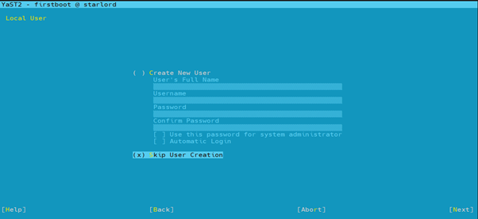

      1. Set the root password.

         Fill out the root password.

         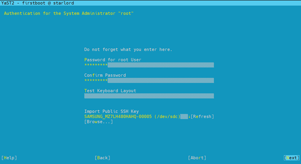

         After setting root user's password, the YaST First boot configuration will be complete. Select `Finish`.

         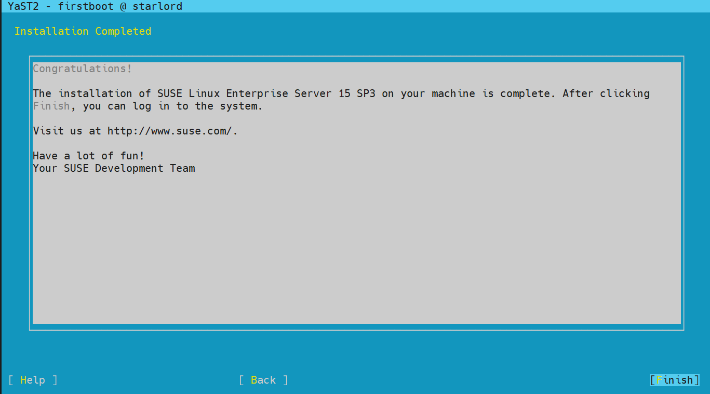

   1. (`pit#`) Create the SLES15 SP4 repository.

      1. Obtain the SLES15 SP4 ISO from your software vendor. Ensure the `SLE-15-SP4-Full-x86_64-GM-Media1.iso` is downloaded as a part of the package.

      1. Add the `sles15 sp4` repository.

         ```bash
         cm repo add SLE-15-SP4-Full-x86_64-GM-Media1.iso
         ```

   1. (`pit#`) Create the cluster manager repository.

      > **NOTE:** The cluster manager ISO `cm-1.9-cd1-media-sles15sp4-x86_64.iso` is a part of cluster manager software (HPCM version 1.9) package downloaded in [Create the bootable media](#create-the-bootable-media) section.

      1. Add the cluster manager repository.

         ```bash
         cm repo add cm-1.9-cd1-media-sles15sp4-x86_64.iso
         ```

   1. (`pit#`) List the repositories.

      ```bash
      cm repo show
      ```

      Expected output should resemble the following:

      ```text
      Cluster-Manager-1.9-sles15sp4-x86_64 : /opt/clmgr/repos/cm/Cluster-Manager-1.9-sles15sp4-x86_64
      SLE-15-SP4-Full-x86_64 : /opt/clmgr/repos/distro/sles15sp4-x86_64
      ```

   1. Select and activate the repositories.

      ```bash
      cm repo select SLE-15-SP4-Full-x86_64
      cm repo select Cluster-Manager-1.9-sles15sp4-x86_64
      ```

   1. Configure the cluster.

      1. (`pit#`) Run `configure-cluster`.

         ```bash
         configure-cluster
         ```

      1. Configure the House network interface.

         Select the House network interface from the list of network interfaces.

         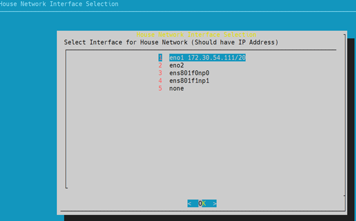

      1. Configure the Management/BMC network interface.

         1. Select the Management/BMC network interface from the list of network interfaces.

            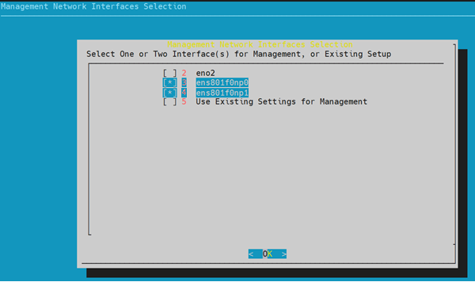

         1. Select `No` because separate network interfaces for BMC and Management network are not needed.

            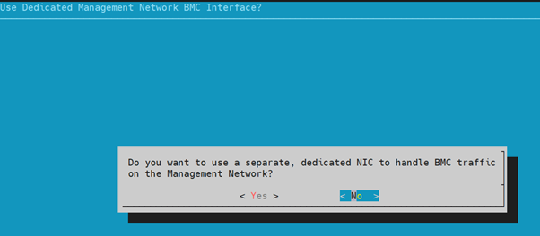

         1. Select LACP as network bonding type.

            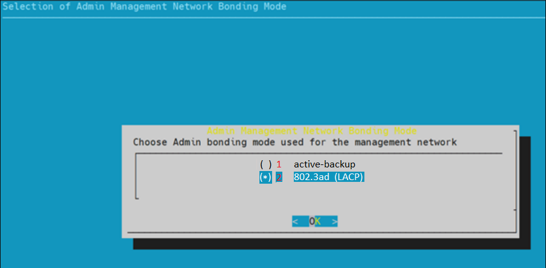

      1. Select the `Initial Setup Menu` from the main menu.

         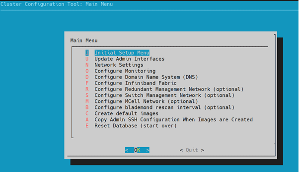

      1. Navigate and select the `Install and Configure Admin Cluster Software` option.

         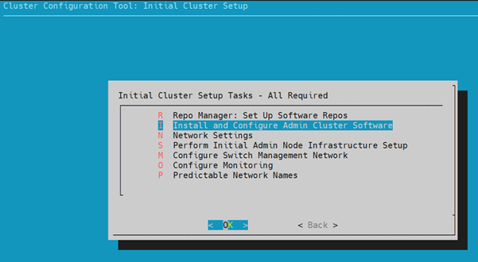

      1. Select and configure the network settings.

         1. Select the `Network Settings` menu option.

            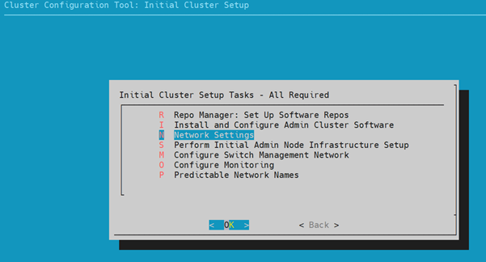

         1. Select `Yes` because the NTP and timezone settings have already been configured.

            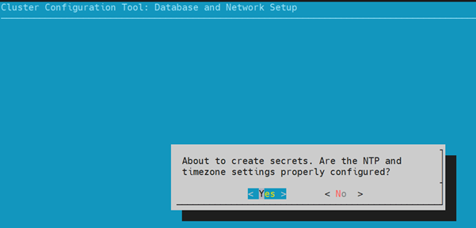

         1. Start the network and database initialization by selecting `OK`.

            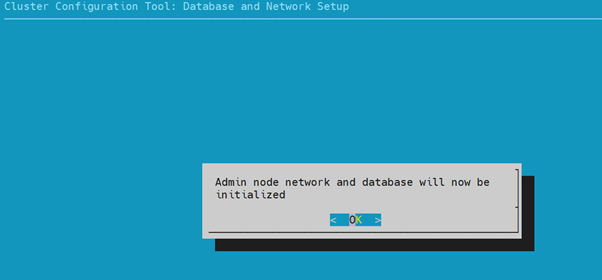

         1. Select `List and Adjust Subnet Addresses`.

            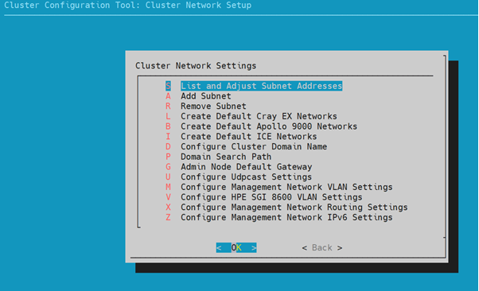

         1. Select `OK` at the following prompt.

            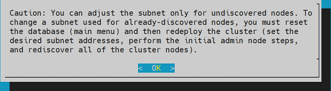

         1. Select `head Network` and select `OK`.

            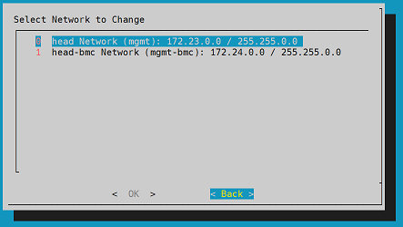

         1. Change the subnet, netmask, gateway and VLAN for the `head` network.

            

         1. Select `OK` at the following prompt.

            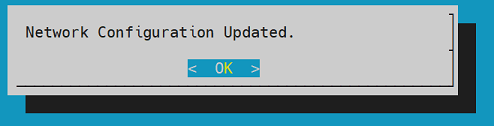

         1. Select `head-bmc Network` and select `OK`.

            

         1. Change the subnet, netmask, gateway and VLAN for the `head-bmc` network.

            

         1. Select `OK` at the following prompt.

            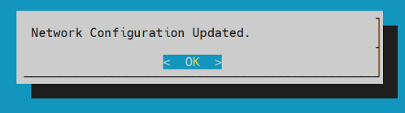

         1. Select `Back` at the following prompt.

            

         1. Select `Back` at the following prompt.

            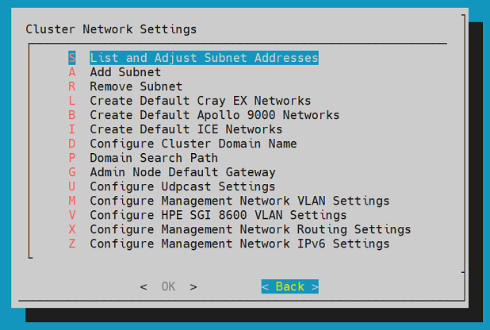

      1. Select the `Perform Initial Admin Node Infrastructure Setup`.

         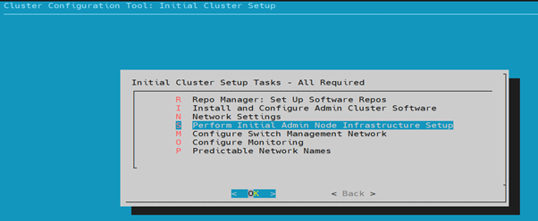

      1. Perform initial cluster setup by selecting `OK`.

         

      1. The `Domain Search Path` input field will be populated by default. Select `OK`.

         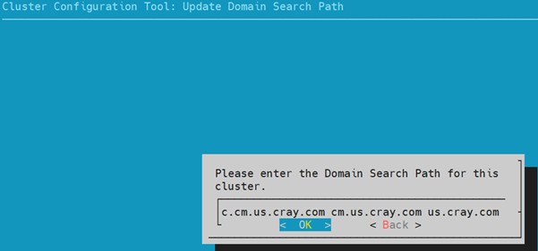

      1. Leave the `Resolver IP` fields empty and select `OK`.

         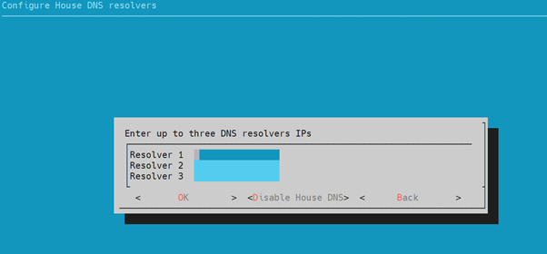

      1. Select `OK` at the following prompt.

         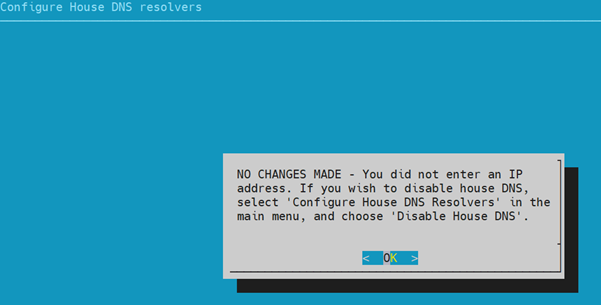

      1. Select `Yes` and select `OK` option.

         This step will copy the SSH configuration from current node to the image. The image will be created in next step.

         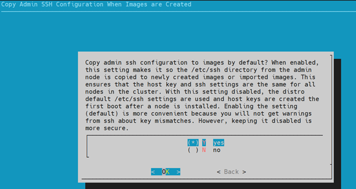

      1. Select the `default` image creation option and select `OK`.

         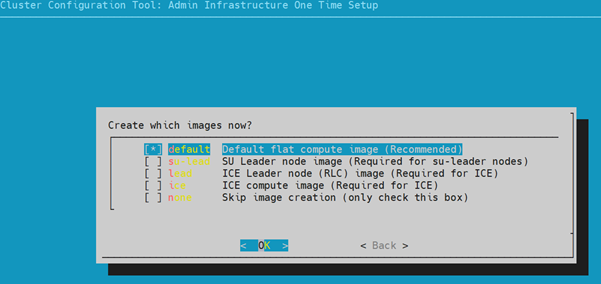

      1. Once the following prompt appears , select `OK`, and quit the `configure-cluster` process.

         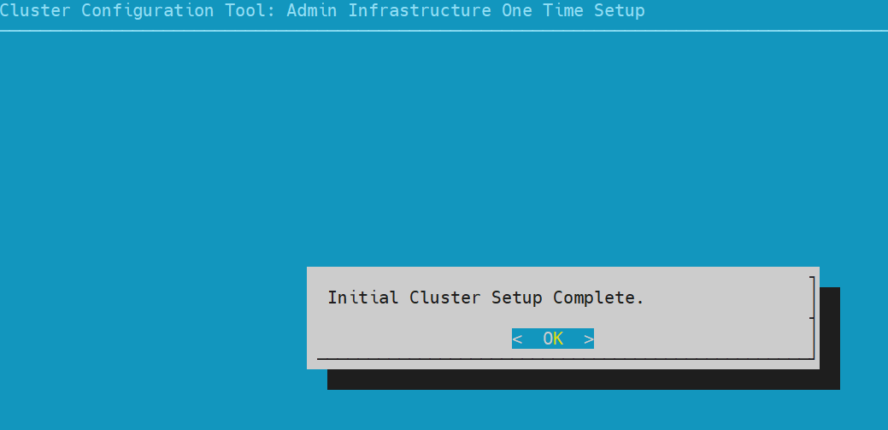

   1. (`pit#`) Perform the cluster component discovery using `cm` commands.

      The cluster component discovery has to be performed using both a manual process and an automatic process.

      1. Perform manual discovery.

         Management switches, fabric switches, PDUs, and sub-rack CMCs are the components for which the manual discovery has to be performed.
         The administrator must collect component data and perform manual discovery by following these steps:

         1. Discover management switches.

            1. Create a configuration file for the management switches.

               The management switch file must be in a specific format. Example of switch configuration file:

               ```text
               [discover]
               temponame=mgmtsw0, mgmt_net_name=head, mgmt_net_macs="b8:59:9f:68:8a:00", mgmt_net_interfaces="eth0", transport=udpcast, redundant_mgmt_network=yes, net=head/head-bmc, type=spine, ice=yes, console_device=ttyS1, architecture=x86_64, discover_skip_switchconfig=yes, mgmt_net_ip=10.1.0.2
               temponame=mgmtsw1, mgmt_net_name=head, mgmt_net_macs="b8:59:9f:68:94:00", mgmt_net_interfaces="eth0", transport=udpcast, redundant_mgmt_network=yes, net=head/head-bmc, type=spine, ice=yes, console_device=ttyS1, architecture=x86_64, discover_skip_switchconfig=yes, mgmt_net_ip=10.1.0.3
               temponame=mgmtsw2, mgmt_net_name=head, mgmt_net_macs="e4:f0:04:4e:1a:ec", mgmt_net_interfaces="eth0", transport=udpcast, redundant_mgmt_network=yes, net=head/head-bmc, type=leaf, ice=yes, console_device=ttyS1, architecture=x86_64, discover_skip_switchconfig=yes, mgmt_net_ip=10.1.0.4
               ```

            1. Perform switch discovery.

               ```bash
               cm node add -c mswitch.conf
               ```

         1. Discover PDUs.

            1. Create the PDU configuration file.

               Example of a PSU in configuration file format.

               ```text
               [discover]
               internal_name=pdu-x3000-001, mgmt_bmc_net_name=head-bmc, geolocation="cold isle 4 rack 1 B power",mgmt_bmc_net_macs=00:0a:9c:62:04:ee,hostname1=pdu-x3000-001, pdu_protocol="snmp/admn"
               ```

            1. Perform PDU discovery.

               ```bash
               cm node add -c pdus.conf
               ```

         1. Discover fabric switches.

            Use the `cm controller add` command. Add only River cabinet fabric switches.

            ```bash
            cm controller add -c sw-hsn-x3000-001 -t external_switch -m 00:40:a6:82:f7:5f -u [USERNAME] -p [PASSWORD]
            ```

         1. Discover CMCs.

            Use the `cm controller add` command. An example for a Gigabyte server:

            ```bash
            cm controller add -c SubRack001-cmc -t gigabyte -m  b4:2e:99:b8:da:03 -u [USERNAME] -p [PASSWORD]
            ```

         1. Discover CECs.

            **This information is not yet available.**

      1.Perform automatic discovery.

         Management nodes, UANs, and CNs will be automatically discovered by the following procedure:

         >**NOTE:**
         >
         > - Ensure that all the River components are powered on, DHCP is enabled on the BMCs, and the BMCs are each on only one switch out of the available spine switches.
         >
         > - If there are multiple Mellanox spine switches, then there should be only one spine switch with an active port connection to NCNs. On other switches, connections to NCNs should be disabled until all nodes have been booted with HPCM images.
         >
         >   (`spine-sw#`) The connection can be disabled by connecting to the switch using `ssh` and running commands similar to the following:
         >
         >   ```text
         >   enable
         >   configure terminal
         >   interface ethernet 1/2-1/9
         >   shutdown
         >   ```
         >
         >   Once all the NCNs are booted, enable all the ports by running a corresponding `no shutdown` command on the switch.

         1. If there are any Intel nodes, then run the following command.

            ```bash
            sed -i '226s/ipmitool lan print/ipmitool lan print 3/g' /opt/clmgr/tools/cm_pxe_status
            ```

         1. Enable the auto-discovery process.

            ```bash
            cm node discover enable
            ```

         1. Check the power status and PXE status.

            >**NOTE:**  
            >Verify if all the River node BMCs are leased with an IP address.  
            >To set the username and IPMI password, see [Set IPMI credentials](../re-installation.md#set-ipmi-credentials).

            1. Check the power status of nodes.

               ```bash
               cm node discover status | grep client-hostname  > temp.txt
               for i in `cat temp.txt| awk '{print $1}'` ; do echo $i; ipmitool -I lanplus -U "${USERNAME}" -E -H $i  power status; done
               ```

            1. Check if all the node's bootorder is set to `pxe`.

               ```bash
               for i in `cat temp.txt| awk '{print $1}'` ; do echo $i; ipmitool -I lanplus -U "${USERNAME}" -E -H $i chassis bootdev; done
               ```

            1. Set the boot order to `pxe` and reboot the nodes.

               ```bash
               for i in `cat temp.txt| awk '{print $1}'` ; do echo $i; ipmitool -I lanplus -U "${USERNAME}" -E -H $i chassis bootdev pxe; done
               for i in `cat temp.txt| awk '{print $1}'` ; do echo $i; ipmitool -I lanplus -U "${USERNAME}" -E -H $i power on; done
               for i in `cat temp.txt| awk '{print $1}'` ; do echo $i; ipmitool -I lanplus -U "${USERNAME}" -E -H $i power reset; done
               ```

         1. Wait for the discovery process to detect desired hardware components, then check the status of discovered hardware using the following command.

            ```bash
            cm node discover status
            ```

            Repeat this until there is data of the discovered nodes in the `Detected server MAC info` section. For example:

            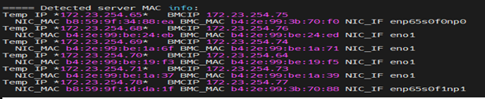

         1. Create the node configuration definition file.

            ```bash
            cm node discover mkconfig -o "mgmt_bmc_net_name=head-bmc, mgmt_net_name=head, redundant_mgmt_network=yes, switch_mgmt_network=yes, dhcp_bootfile=grub2, conserver_logging=yes, conserver_ondemand=no, root_type=disk, console_device=ttyS0, tpm_boot=no, mgmt_net_bonding_master=bond0, disk_bootloader=no, mgmtsw=mgmtsw0, predictable_net_names=yes, transport=udpcast, baud_rate=115200, bmc_username=[USERNAME], bmc_password=[PASSWORD]" nodes.conf
            ```

            Example content of `nodes.conf`:

            ```text
            [discover]
            internal_name=service1, hostname1=node1, mgmt_bmc_net_macs=b4:2e:99:3b:70:88, mgmt_net_macs=b8:59:9f:1d:da:1e, mgmt_net_interfaces="enp65s0f0np0", mgmt_bmc_net_name=head-bmc, mgmt_net_name=head, redundant_mgmt_network=yes, switch_mgmt_network=yes, dhcp_bootfile=grub2, conserver_logging=yes, conserver_ondemand=no, root_type=disk, console_device=ttyS0, tpm_boot=no, mgmt_net_bonding_master=bond0, disk_bootloader=no, mgmtsw=mgmtsw0, predictable_net_names=yes, transport=udpcast, baud_rate=115200, bmc_username=[USERNAME], bmc_password=[PASSWORD]
            internal_name=service2, hostname1=node2, mgmt_bmc_net_macs=b4:2e:99:3b:70:04, mgmt_net_macs=b8:59:9f:34:89:26, mgmt_net_interfaces="enp65s0f0np0", mgmt_bmc_net_name=head-bmc, mgmt_net_name=head, redundant_mgmt_network=yes, switch_mgmt_network=yes, dhcp_bootfile=grub2, conserver_logging=yes, conserver_ondemand=no, root_type=disk, console_device=ttyS0, tpm_boot=no, mgmt_net_bonding_master=bond0, disk_bootloader=no, mgmtsw=mgmtsw0, predictable_net_names=yes, transport=udpcast, baud_rate=115200, bmc_username=[USERNAME], bmc_password=[PASSWORD]
            internal_name=service3, hostname1=node3, mgmt_bmc_net_macs=b4:2e:99:3b:70:94, mgmt_net_macs=b8:59:9f:34:89:2e, mgmt_net_interfaces="enp65s0f0np0", mgmt_bmc_net_name=head-bmc, mgmt_net_name=head, redundant_mgmt_network=yes, switch_mgmt_network=yes, dhcp_bootfile=grub2, conserver_logging=yes, conserver_ondemand=no, root_type=disk, console_device=ttyS0, tpm_boot=no, mgmt_net_bonding_master=bond0, disk_bootloader=no, mgmtsw=mgmtsw0, predictable_net_names=yes, transport=udpcast, baud_rate=115200, bmc_username=[USERNAME], bmc_password=[PASSWORD]
            internal_name=service4, hostname1=node4, mgmt_bmc_net_macs=b4:2e:99:3b:70:f8, mgmt_net_macs=b8:59:9f:1d:d7:f2, mgmt_net_interfaces="enp65s0f0np0", mgmt_bmc_net_name=head-bmc, mgmt_net_name=head, redundant_mgmt_network=yes, switch_mgmt_network=yes, dhcp_bootfile=grub2, conserver_logging=yes, conserver_ondemand=no, root_type=disk, console_device=ttyS0, tpm_boot=no, mgmt_net_bonding_master=bond0, disk_bootloader=no, mgmtsw=mgmtsw0, predictable_net_names=yes, transport=udpcast, baud_rate=115200, bmc_username=[USERNAME], bmc_password=[PASSWORD]
            internal_name=service5, hostname1=node5, mgmt_bmc_net_macs=b4:2e:99:3b:70:9c, mgmt_net_macs=98:03:9b:b4:27:62, mgmt_net_interfaces="enp66s0f0np0", mgmt_bmc_net_name=head-bmc, mgmt_net_name=head, redundant_mgmt_network=yes, switch_mgmt_network=yes, dhcp_bootfile=grub2, conserver_logging=yes, conserver_ondemand=no, root_type=disk, console_device=ttyS0, tpm_boot=no, mgmt_net_bonding_master=bond0, disk_bootloader=no, mgmtsw=mgmtsw0, predictable_net_names=yes, transport=udpcast, baud_rate=115200, bmc_username=[USERNAME], bmc_password=[PASSWORD]
            internal_name=service6, hostname1=node6, mgmt_bmc_net_macs=b4:2e:99:3b:70:20, mgmt_net_macs=98:03:9b:bb:a8:94, mgmt_net_interfaces="enp66s0f0np0", mgmt_bmc_net_name=head-bmc, mgmt_net_name=head, redundant_mgmt_network=yes, switch_mgmt_network=yes, dhcp_bootfile=grub2, conserver_logging=yes, conserver_ondemand=no, root_type=disk, console_device=ttyS0, tpm_boot=no, mgmt_net_bonding_master=bond0, disk_bootloader=no, mgmtsw=mgmtsw0, predictable_net_names=yes, transport=udpcast, baud_rate=115200, bmc_username=[USERNAME], bmc_password=[PASSWORD]
            internal_name=service7, hostname1=node7, mgmt_bmc_net_macs=b4:2e:99:be:19:f5, mgmt_net_macs=b4:2e:99:be:19:f3, mgmt_net_interfaces="eno1", mgmt_bmc_net_name=head-bmc, mgmt_net_name=head, redundant_mgmt_network=yes, switch_mgmt_network=yes, dhcp_bootfile=grub2, conserver_logging=yes, conserver_ondemand=no, root_type=disk, console_device=ttyS0, tpm_boot=no, mgmt_net_bonding_master=bond0, disk_bootloader=no, mgmtsw=mgmtsw0, predictable_net_names=yes, transport=udpcast, baud_rate=115200, bmc_username=[USERNAME], bmc_password=[PASSWORD]
            internal_name=service8, hostname1=node8, mgmt_bmc_net_macs=b4:2e:99:be:1a:71, mgmt_net_macs=b4:2e:99:be:1a:6f, mgmt_net_interfaces="eno1", mgmt_bmc_net_name=head-bmc, mgmt_net_name=head, redundant_mgmt_network=yes, switch_mgmt_network=yes, dhcp_bootfile=grub2, conserver_logging=yes, conserver_ondemand=no, root_type=disk, console_device=ttyS0, tpm_boot=no, mgmt_net_bonding_master=bond0, disk_bootloader=no, mgmtsw=mgmtsw0, predictable_net_names=yes, transport=udpcast, baud_rate=115200, bmc_username=[USERNAME], bmc_password=[PASSWORD]
            internal_name=service9, hostname1=node9, mgmt_bmc_net_macs=b4:2e:99:be:1a:39, mgmt_net_macs=b4:2e:99:be:1a:37, mgmt_net_interfaces="eno1", mgmt_bmc_net_name=head-bmc, mgmt_net_name=head, redundant_mgmt_network=yes, switch_mgmt_network=yes, dhcp_bootfile=grub2, conserver_logging=yes, conserver_ondemand=no, root_type=disk, console_device=ttyS0, tpm_boot=no, mgmt_net_bonding_master=bond0, disk_bootloader=no, mgmtsw=mgmtsw0, predictable_net_names=yes, transport=udpcast, baud_rate=115200, bmc_username=[USERNAME], bmc_password=[PASSWORD]
            internal_name=service10, hostname1=node10, mgmt_bmc_net_macs=b4:2e:99:be:24:ed, mgmt_net_macs=b4:2e:99:be:24:eb, mgmt_net_interfaces="eno1", mgmt_bmc_net_name=head-bmc, mgmt_net_name=head, redundant_mgmt_network=yes, switch_mgmt_network=yes, dhcp_bootfile=grub2, conserver_logging=yes, conserver_ondemand=no, root_type=disk, console_device=ttyS0, tpm_boot=no, mgmt_net_bonding_master=bond0, disk_bootloader=no, mgmtsw=mgmtsw0, predictable_net_names=yes, transport=udpcast, baud_rate=115200, bmc_username=[USERNAME], bmc_password=[PASSWORD]
            internal_name=service11, hostname1=node11, mgmt_bmc_net_macs=b4:2e:99:3b:70:f0, mgmt_net_macs=b8:59:9f:34:88:ea, mgmt_net_interfaces="enp65s0f0np0", mgmt_bmc_net_name=head-bmc, mgmt_net_name=head, redundant_mgmt_network=yes, switch_mgmt_network=yes, dhcp_bootfile=grub2, conserver_logging=yes, conserver_ondemand=no, root_type=disk, console_device=ttyS0, tpm_boot=no, mgmt_net_bonding_master=bond0, disk_bootloader=no, mgmtsw=mgmtsw0, predictable_net_names=yes, transport=udpcast, baud_rate=115200, bmc_username=[USERNAME], bmc_password=[PASSWORD]
            internal_name=service12, hostname1=node12, mgmt_bmc_net_macs=b4:2e:99:3b:70:10, mgmt_net_macs=b8:59:9f:1d:d8:c2, mgmt_net_interfaces="enp66s0f0np0", mgmt_bmc_net_name=head-bmc, mgmt_net_name=head, redundant_mgmt_network=yes, switch_mgmt_network=yes, dhcp_bootfile=grub2, conserver_logging=yes, conserver_ondemand=no, root_type=disk, console_device=ttyS0, tpm_boot=no, mgmt_net_bonding_master=bond0, disk_bootloader=no, mgmtsw=mgmtsw0, predictable_net_names=yes, transport=udpcast, baud_rate=115200, bmc_username=[USERNAME], bmc_password=[PASSWORD]
            ```

         1. Add discovered nodes and set images for the discovered nodes.

            ```bash
            cm node discover add nodes.conf
            cinstallman --assign-image --image sles15sp4 --kernel <kernel version> --node '*'
            cinstallman --set-rootfs tmpfs --node '*'
            cm node refresh netboot -n '*'
            ```

            >**NOTE:** Kernel version can be obtained from `cinstallman --show-default-image` command.

         1. Stop the automatic discovery process.

            ```bash
            cm node discover disable
            ```

         1. Wait for all of the nodes to be ready.

            ```bash
            cm power status -n '*'
            ```

            Do not proceed until this command lists all of the nodes. If there are any errors, then rerun the command.

         1. Power on all nodes.

            ```bash
            cm power on -n '*'
            ```

         1. Check the status of nodes.

            ```bash
            cm power status -n '*'
            ```

            Expected output will resemble the following:

            ```text
            node1        : BOOTED
            node2        : BOOTED
            node3        : BOOTED
            node4        : BOOTED
            node5        : BOOTED
            node6        : BOOTED
            node7        : BOOTED
            node8        : BOOTED
            node9        : BOOTED
            node10       : BOOTED
            node11       : BOOTED
            node12       : BOOTED
            ```

            Repeat this step until all nodes report their status as `BOOTED`. At this point, all ports to the NCNs should be enabled on the switches.

## Import CSM tarball

### Download CSM tarball

1. (`pit#`) Download the CSM tarball

   - From Cray using `curl`:

      > - `-C -` is used to allow partial downloads. These tarballs are large; in the event of a connection disruption, the same `curl` command can be used to continue the disrupted download.
      > - CSM does NOT support the use of proxy servers for anything other than downloading artifacts from external endpoints.
      >   Using `http_proxy` or `https_proxy` in any way other than the following examples will cause many failures in subsequent steps.

      Without proxy:

      ```bash
      curl -C - -f -o "/var/www/ephemeral/csm-${CSM_RELEASE}.tar.gz" \
        "https://release.algol60.net/$(awk -F. '{print "csm-"$1"."$2}' <<< ${CSM_RELEASE})/csm/csm-${CSM_RELEASE}.tar.gz"
      ```

      With HTTPS proxy:

      ```bash
      https_proxy=https://example.proxy.net:443 curl -C - -f -o "/var/www/ephemeral/csm-${CSM_RELEASE}.tar.gz" \
        "https://release.algol60.net/$(awk -F. '{print "csm-"$1"."$2}' <<< ${CSM_RELEASE})/csm/csm-${CSM_RELEASE}.tar.gz"
      ```

   - `scp` from the external server:

      ```bash
      scp "<external-server>:/<path>/csm-${CSM_RELEASE}.tar.gz" /var/www/ephemeral/
      ```

### Import tarball assets

If resuming at this stage, the `CSM_RELEASE` and `PITDATA` variables are already set
in `/etc/environment` from the [Download CSM tarball](#download-csm-tarball) step.

1. (`pit#`) Extract the tarball.

   ```bash
   tar -zxvf  "${PITDATA}/csm-${CSM_RELEASE}.tar.gz" -C ${PITDATA}
   ```

1. To install all the dependency packages, run the `csm_dep_install.sh` using the following command:

   ```bash
   sh csm_dep_install.sh  ${PITDATA}
   ```

   >**NOTE:** `${PITDATA}` is the path of the folder where the CSM tarball is extracted in the preceding step.

## Seed file generation

The procedure to generate seed files is as follows:

1. (`pit#`) Generate paddle file.

   To generate the paddle file using the CANU Validate tool, see [Validate SHCD](../../operations/network/management_network/validate_shcd.md).

   Example command:

   ```bash
   canu validate shcd --shcd CrayInc-ShastaRiver-Groot-RevE12.xlsx --architecture V1 --tabs 40G_10G,NMN,HMN --corners I12,Q38,I13,Q21,J20,   U38 --json --out cabling.json
   ```

1. (`pit#`) Store SHCD Data in CVT Database.

   ```bash
   cm cvt parse shcd --canu_json_file cabling.json
   ```

   Example output:

   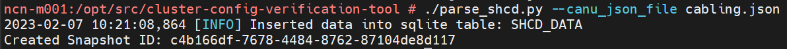

1. Create [`cabinets.yaml`](../create_cabinets_yaml.md) (manually).

1. (`pit#`) Capture hardware inventory and generate seed files and paddle file.

   The following command stores the inventory of nodes and switches (fabric and management) in the database and generates the seed files and paddle file:

   ```bash
   cnodes | grep node >>nodelist
   pdsh -w^nodelist /opt/clmgr/cluster-config-verification-tool/scripts/create_bond0.sh
   cm cvt config create -t all --mgmt_username 'uname' --mgmt_password 'passwd' --architecture '<architecture>'
   ```

   >**NOTE:** The seed files and paddle file will be generated in the current working directory.

1. Save the generated seed files (`switch_metadata.csv`, `application_node_config.yaml`, `hmn_connections.json`, `ncn_metadata.csv`), paddle file (`cvt-ccj.json`), and `cvt.json`.

   The seed files (or configuration payload files) and paddle file will be used later during the CSM installation process, so they should be saved/backed up in a persistent storage.

## Compare the SHCD data with CVT inventory data (optional)

1. (`pit#`) Display the list of generated snapshot IDs.

   ```bash
   cm cvt shcd compare --list
   ```

   Example output:

   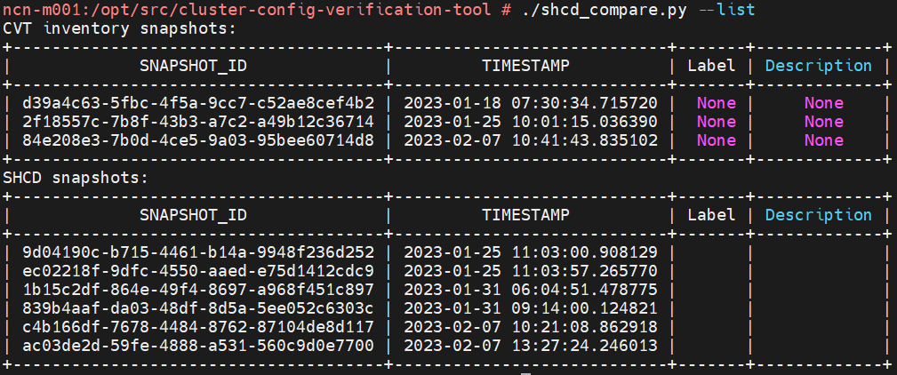

1. (`pit#`) Compare the CVT and SHCD snapshots.

   ```bash
   cm cvt shcd compare --shcd_id c4b166df-7678-4484-8762-87104de8d117 --cvt_id 84e208e3-7b0d-4ce5-9a03-95bee60714d8
   ```

   In the previous command, `--shcd_id` accepts the snapshot ID created while inserting into `SHCD_DATA` table and `--cvt_id` accepts the snapshot ID created while inserting into Management Inventory tables.

   Example output:

   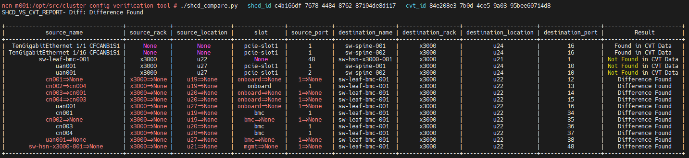

   In the previous output, wherever there is a difference in the data found, the left hand side is the data from SHCD and the right hand side is the data from CVT (SHCD => CVT).
   Under the Result column `Found in CVT Data` implies the data is present only in the CVT inventory and not found in the SHCD data, `Not Found in CVT Data` implies the data is present only in the SHCD data and not found in the CVT inventory.
   And the Difference Found is resulted along with the display of the mismatch found between both the data.

## Stop HPCM services

(`pit#`) Run the following commands to stop HPCM services:

```bash
systemctl stop clmgr-power
systemctl stop grafana-server.service
systemctl stop aiops-mlflow.service
```

## Cleanup (optional)

(`pit#`) If the amount of memory on the booted system is low, then this cleanup step can be performed to remove the downloaded ISO files and delete the images.

```bash
rm -v *.iso
cm image delete -i sles15sp4
cm repo del Cluster-Manager-1.9-sles15sp4-x86_64
cm repo del SLE-15-SP4-Full-x86_64
```

These steps can help reclaim ~40 GB of space in the `tmpfs/overlay` partition.

## Next topic

After completing this procedure, proceed to pre-installation.

See [Pre-installation](pre-installation-cpi.md).
