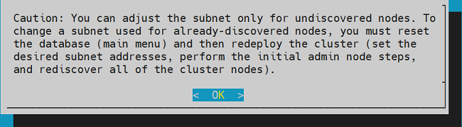
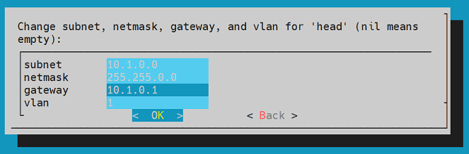
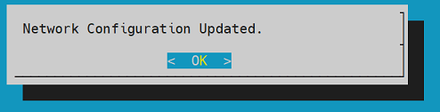
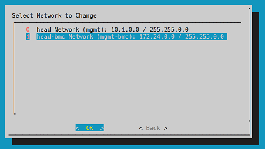
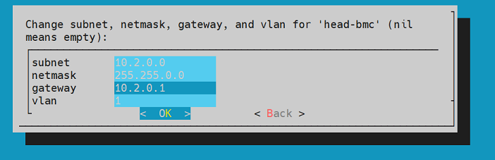
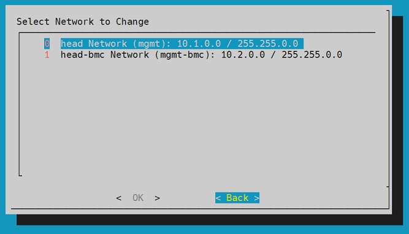
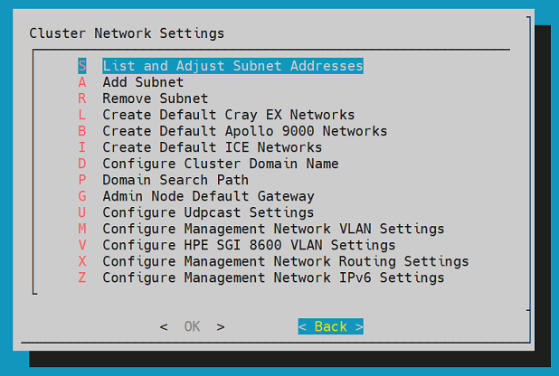
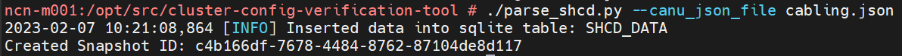

# Boot Pre-Install Live ISO and Generate Seed Files

The following steps provide instructions to boot the Pre-Install Live ISO and create seed files for CSM installation.

## Topics

1. [Create the Bootable Media](#create-the-bootable-media)
1. [Boot the LiveCD](#boot-the-livecd)
1. [Booting the Master node using Bootable USB](#boot-the-livecd)
1. [Post Boot Configuration](#post-boot-configuration)
1. [Import CSM tarball](#import-csm-tarball)
1. [Seed File generation](#seed-file-generation)
1. [Compare the SHCD Data with CVT Inventory Data](#compare-the-shcd-data-with-cvt-inventory-dataoptional)
1. [Stop HPCM services](#stop-hpcm-services)
1. [CleanUp (Optional)](#cleanup-optional)
1. [Next Topic](#next-topic)

## Create the Bootable Media

To create the bootable LiveCD image use `dd` command. Before creating the media, identify which device will be used for it. If you already have the bootable media with LiveCD image ready, skip to [Boot the LiveCD](#boot-the-livecd).

1. (`external#`) Download the LiveCD ISO.

   ```bash
   wget http://preserve.eag.rdlabs.hpecorp.net/mirrors/sgi/dist.engr/test/stout727/iso-latest-sles15sp4-x86_64/cm-admin-install-1.9-sles15sp4-x86_64.iso
   ```

1. (`external#`) Identify the USB device.

   >__Note:__ This example shows the USB device is `/dev/sdd` on the host.

   ```bash
   lsscsi
   ```

   Expected output looks similar to the following example:

   ```text
   [6:0:0:0]    disk    ATA      SAMSUNG MZ7LH480 404Q  /dev/sda
   [7:0:0:0]    disk    ATA      SAMSUNG MZ7LH480 404Q  /dev/sdb
   [8:0:0:0]    disk    ATA      SAMSUNG MZ7LH480 404Q  /dev/sdc
   [14:0:0:0]   disk    SanDisk  Extreme SSD      1012  /dev/sdd
   [14:0:0:1]   enclosu SanDisk  SES Device       1012  -
   ```

   In the previous example, the `ATA` devices are the internal disks and the other two devices are the USB drives.

   Set a variable pointing to the USB device:

   ```bash
   USB=/dev/sd<disk_letter>
   ```

1. Format the USB device.

   Burn the LiveCD ISO on USB device using `dd` command in the following format:

   ```bash
   #dd if=$PWD/cm-admin-install-1.9-sles15sp4-x86_64.iso of=$USB bs=4M oflag=sync status=progress
   ```

At this point, image is ready and system can be booted from the USB drive.

## Boot the LiveCD

Some systems will boot the USB device automatically, if no other OS exists (bare-metal). Otherwise the administrator may need to use the `BIOS Boot Selection menu` to choose the USB device (Option 1).

If an administrator has the node booted with an operating system which will next be rebooting into the LiveCD, then admin can use  `efibootmgr` to set the boot order to be the USB device (Option 2).
See the [set boot order](../../background/ncn_boot_workflow.md#setting-boot-order) page for more information about how to set the boot order to have the USB device first.

1. _Option 1_ : Boot LiveCD ISO image using `BIOS Boot Selection menu`

   1. Reboot the server.

   1. Press F6 until the following screen appears.

      

   1. Select the bootable device.

      

1. _Option 2_ : Boot the LiveCD ISO image using `efibootmgr` (This option has not been tested).

   >__Note:__ UEFI booting must be enabled in order for the system to find the USB device's EFI bootloader.

   1. (`external#`) Confirm that the IPMI credentials work for the BMC by checking the power status.

         Set the `BMC` variable to the hostname or IP address of the BMC of the PIT node.

         ```bash
           USERNAME=root
           BMC=eniac-ncn-m001-mgmt
           read -r -s -p "${BMC} ${USERNAME} password: " IPMI_PASSWORD
           export IPMI_PASSWORD
           ipmitool -I lanplus -U "${USERNAME}" -E -H "${BMC}" chassis power status
         ```

         >__Note:__ The `read -s` command is used to prevent the credentials from being displayed on the screen or recorded in the shell history.

   1. (`external#`) Power the NCN on and connect to the IPMI console.

      >__Note:__ The boot device can be set via IPMI; the example below uses the `floppy` option. At a glance this seems incorrect, however it selects the primary removable media.
This step instructs the user to power off the node to ensure the BIOS has the best chance at finding the USB via a cold boot.

      ```bash
      ipmitool chassis bootdev
      ```

      ```text
         Received a response with unexpected ID 0 vs. 1
         bootdev <device> [clear-cmos=yes|no]
         bootdev <device> [options=help,...]
         none  : Do not change boot device order
         pxe   : Force PXE boot
         disk  : Force boot from default Hard-drive
         safe  : Force boot from default Hard-drive, request Safe Mode
         diag  : Force boot from Diagnostic Partition
         cdrom : Force boot from CD/DVD
         bios  : Force boot into BIOS Setup
         floppy: Force boot from Floppy/primary removable media
      ```

      ```bash
      ipmitool -I lanplus -U "${username}" -E -H "${BMC}" chassis bootdev floppy options=efiboot
      ipmitool -I lanplus -U "${username}" -E -H "${BMC}" chassis power off
      ```

   1. Insert the USB stick into a recommended USB3 port.

      __Information:__ USB2 port is also compatible, but USB3 port is recommended as it offers the best performance.

   1. (`external#`) Power the server on.

      ```bash
      ipmitool -I lanplus -U "${username}" -E -H "${BMC}" chassis power on
      ipmitool -I lanplus -U "${username}" -E -H "${BMC}" sol activate
      ```

## Booting the Master node using Bootable USB

   1. After selecting the boot device, GRUB menu will show up.

   1. Select the CM Live option from GRUB prompt.

      1. From the GRUB menu, select "CM Live" option.

         

      2. Now a series of input prompts will appear. Provide the responses per the following example:

         

         >__Note:__ You might have to set `console=ttyS0,115200n8` or `console=ttyS1,115200n8` on some systems if the boot logs do not show after `Loading initrd...`.

         Once the system boots up the OS successfully, provide username and password as `root/cmdefault` to log in to the system.

## Post Boot configuration

   1. Set the SITE LAN.

      To configure `sitelan` open a command line terminal and run the following command:

      `172.30.54.111` and `eno1` are examples of IP address and network device names.

      ```bash
      ifconfig eno1 172.30.54.111 netmask 255.255.240.0 
      ip route add default via <gateway ip> dev eno1
      ```

      

      Now this server can be accessed from the external servers using `ssh`. Login to the machine using following command:

      ```bash
      (external)#  ssh root@172.30.54.111
      ```

   1. Set the hostname.

      ```bash
           hostnamectl set-hostname starlord
      ```

   1. Set the timezone.

      ```bash
          timedatectl set-timezone Asia/Kolkata
      ```

   1. Configure Management Switches.

      1. For Mellanox spine switches.

          1. Access the Mellanox switch using `IP address` or `Minicom`.

             Example 1 (using IP address):

             ```bash
              ssh admin@10.1.0.2
             ```

             Example 2 (using Minicom):

             ```bash
              minicom -b 115200 -D /dev/ttyUSB1
             ```

             >__Note:__ Device name and IP may vary.

          1. Login to the switch using the switch credentials. Login prompt for Mellanox switch is as follows:

             ```text
             Welcome to minicom 2.7.1

             OPTIONS: I18n
             Port /dev/ttyUSB2, 21:51:12

             Press CTRL-A Z for help on special keys

             NVIDIA Onyx Switch Management
             sw-spine01 login: admin
             Password:
             Last login: Fri Nov  4 16:31:03 UTC 2022 from 172.23.0.1 on pts/1
             Last failed login: Fri Nov  4 17:02:03 UTC 2022 from 172.23.0.1 on ssh:notty
             Number of total successful connections since last 1 days: 10
             NVIDIA Switch
             sw-spine01 [standalone: master] >
             ```

          1. Create blank/empty configuration file.

             ```bash
             sw-spine01 [standalone: master] > enable
             sw-spine01 [standalone: master] # configure terminal
             sw-spine01 [standalone: master] (config) # configuration new hpcm_blank1
             sw-spine01 [standalone: master] (config) # configuration switch-to hpcm_blank1
             ```

             Click Yes, if the switch asks for reboot.

             Login to the switch and perform the next steps.

          1. Configure the switch settings.

             ```bash
             sw-spine01 [standalone: master] > enable
             sw-spine01 [standalone: master] # configure terminal
             ```

             Copy and paste network settings [from here](hpcm_switch_conf_spine_001_starlord.md) and save those configurations as "hpcm_blank1" using the following command:

             ```bash
             sw-spine01 [standalone: master] # configuration write
             ```

             Exit from the switch1 and repeat the procedure for spine `switch2`. The `switch2` settings can be copied [from here](hpcm_switch_conf_spine_002_starlord.md).

      1. For leaf switches (Dell).

          1. Access the leaf switch using minicom. Here we assume `/dev/ttyUSB3` is leaf switch.

             ```bash
             minicom -b 115200 -D /dev/ttyUSB1
             ```

             >__Note:__ Device name may vary.
  
          1. Access the leaf switch using minicom. Here we assume `/dev/ttyUSB3` is leaf switch.

          ```text
              Welcome to minicom 2.7.1

              OPTIONS: I18n
              Port /dev/ttyUSB3, 16:48:45

              Press CTRL-A Z for help on special keys


              Debian GNU/Linux 9 sw-leaf01 ttyS0

              Dell EMC Networking Operating System (OS10)

              sw-leaf01 login: admin
              Password:
              Last login: Fri Nov  4 17:02:37 UTC 2022 from 172.23.0.1 on pts/0
              Linux sw-leaf01 4.9.189 #1 SMP Debian 4.9.189-3+deb9u2 x86_64

              The programs included with the Debian GNU/Linux system are free software;
              the exact distribution terms for each program are described in the
              individual files in /usr/share/doc/*/copyright.

              Debian GNU/Linux comes with ABSOLUTELY NO WARRANTY, to the extent
              permitted by applicable law.


              -*-*-*-*-*-*-*-*-*-*-*-*-*-*-*-*-*-*-*-*-*-*-*-*-*-*-*-*-*-*-*-*-
              -*         Dell EMC  Network Operating System (OS10)           *-
              -*                                                             *-
              -* Copyright (c) 1999-2020 by Dell Inc. All Rights Reserved.   *-
              -*                                                             *-
              -*-*-*-*-*-*-*-*-*-*-*-*-*-*-*-*-*-*-*-*-*-*-*-*-*-*-*-*-*-*-*-*-

              This product is protected by U.S. and international copyright and
              intellectual property laws. Dell EMC and the Dell EMC logo are
              trademarks of Dell Inc. in the United States and/or other
              jurisdictions. All other marks and names mentioned herein may be
              trademarks of their respective companies.

              %Warning : Default password for admin account should be changed to secure the system
              sw-leaf01#
          ```

          1. Clean up the existing configuration and reboot the switch.

             ```bash
               sw-leaf01# delete startup-configuration
               Proceed to delete startup-configuration [confirm yes/no(default)]:yes
               sw-leaf01# reload
               System configuration has been modified. Save? [yes/no]:no
               Continuing without saving system configuration
               Proceed to reboot the system? [confirm yes/no]:yes
             ```

          1. Re-login to the switch.

             ```bash
              sw-leaf01# configure terminal
              sw-leaf01(config)#
             ```

             Copy and paste the configuration [from here](hpcm_switch_conf_leaf_starlord.md) and save the configuration using the following command:

             ```bash
              sw-leaf01(config)# write memory
             ```

      >__Note:__ Incase the spine and/or leaf switches are from Aruba then following document an be referred for the configuration in the following link: https://hpedia.osp.hpe.com/wiki/Setting_up_Aruba_Switches_with_HPCM.

   1. Running `YaST-Firstboot`.

      Run the following command:

      ```bash
      /usr/lib/YaST2/startup/YaST2.Firstboot
      ```

         1. Select language and keyboard layout.

            YaST menu can be navigated using tab key. Select appropriate language and keyboard layout and click Next.

            

         1. Accepting the Licence Agreement.

            Use spacebar key to accept the licence agreement and click Next.

            

         1. Configuring `sitelan` network using YaST menu.

            

            Fill out the `IP Address`, `Subnet Mask`, `Hostname (FQDN)` fields and click Next.

            

         1. Setting the hostname.

            Select the "Hostname/DNS" menu, fill the Static Hostname field and click Next.

            

         1. Setting the gateway.

            Navigate to the Routing tab from the UI and enter the gateway information.

         1. Setting the timezone.

            Select the applicable timezone from the options and click Next.

            

         1. Skip the user creation.

            Select Skip User Creation and click Next.

            

         1. Set the root password.

            Fill out the root password.

            

            After setting root user's password, YaST First boot configuration will be complete. Click on Finish.

            

         1. Creating the `sles15 sp4` distro repo.

            Download the SLES15-SP4 ISO.

            ```bash
            wget http://preserve.eag.rdlabs.hpecorp.net/mirrors/novell/sles/15sp4/x86_64/latest/SLE-15-SP4-Full-x86_64-GM-Media1.iso
            ```

            Add the `sles15 sp4` repo  using `cm repo` command.

            ```bash
            cm repo add SLE-15-SP4-Full-x86_64-GM-Media1.iso
            ```

         1. Creating the cluster manager repo.

            Download `cm media iso`.

            ```bash
            wget http://preserve.eag.rdlabs.hpecorp.net/mirrors/sgi/dist.engr/test/stout727/iso-latest-sles15sp4-x86_64/cm-1.9-cd1-media-sles15sp4-x86_64.iso
            ```

            Add the cluster manager repo using `cm repo` command.

            ```bash
            cm repo add cm-1.9-cd1-media-sles15sp4-x86_64.iso
            ```

         1. List the repos.

            ```bash
            cm repo show
            ```

            Expected Output:

            ```text
            Cluster-Manager-1.9-sles15sp4-x86_64 : /opt/clmgr/repos/cm/Cluster-Manager-1.9-sles15sp4-x86_64
            SLE-15-SP4-Full-x86_64 : /opt/clmgr/repos/distro/sles15sp4-x86_64
            ```

         1. Select and activate the repo.

            Run the following commands and activate repos.

            ```bash
            cm repo select SLE-15-SP4-Full-x86_64
            cm repo select Cluster-Manager-1.9-sles15sp4-x86_64
            ```

   1. Run configure-cluster command.
      1. Run the following command:

         ```bash
         configure-cluster
         ```

      1. Configuring the House network Interface.

         Select House Network Interface from the list of network interfaces.

         

      1. Configuring the management and BMC net interface.

         Select the Management/BMC interface from the list of network interfaces.

         

         Select No as we don't need separate network interfaces for BMC and Management network.

         

         Select LACP as network bonding type.

         

      1. Select the Initial Setup Menu from the Main Menu.

         

      1. Skip the repo selection menu (Repo manager).

         We skip this option as required repos were installed using "cm repo add" commands.

         

         Select the Install and Configure Admin Cluster Software option.

         

         Select and configure the network settings:  

            Select the Network Settings menu option.

            

            Select Yes as we have already configured NTP and timezone settings.

            

            Start the network and database initialization by clicking OK.

            

            Select the List and Adjust Subnet Addresses.

            

            Click OK on the following prompt.

            

            Select Head Network and click OK.

            

            Change Subnet, Netmask, Gateway and vlan for head network

            

            Click OK on the following prompt.

            

            Select Head-bmc Network and click Ok.

            

            Change Subnet, Netmask, Gateway and vlan for head-bmc network.

            

            Click OK on the following prompt.

            

            Select Back on the following prompt.

            

            Select Back on the following prompt.

            

         Select the Perform Initial Admin Node Infrastructure Setup.

            

            Perform initial cluster setup by clicking OK.

            

            Domain Search Path input field will be populated by default. Click OK.  

            

            Leave the Resolver IP fields empty and click OK.

            

            Click OK on the following prompt.

            

            Select Yes and click OK option. This step will copy ssh configuration from current node to the image . Image will be created in next step.

            

            Select the "default" image creation option and click OK.

            

            Once the following prompt appears , click OK, and quit the configure-cluster process.

            

   1. Perform the cluster component discovery using `cm` commands.

      The cluster component discovery has to be performed using auto discovery and manual process.

      1. Manual discovery method.

         In this method,  the administrator has to collect  data of components and perform manual discovery.
         Management Switches, Fabric Switches, PDU and sub rack CMCs are the components for which manual discovery method has to be performed. The procedure and the sequence is described as follows:

         1. Management Switch : Discovery of management switches has to be performed by manually creating configuration files. The management switch file should be in a specific format. Here is the example of switch configuration file:

               ```text
               [discover]
               temponame=mgmtsw0, mgmt_net_name=head, mgmt_net_macs="b8:59:9f:68:8a:00", mgmt_net_interfaces="eth0", transport=udpcast, redundant_mgmt_network=yes, net=head/head-bmc, type=spine, ice=yes, console_device=ttyS1, architecture=x86_64, discover_skip_switchconfig=yes, mgmt_net_ip=10.1.0.2
               temponame=mgmtsw1, mgmt_net_name=head, mgmt_net_macs="b8:59:9f:68:94:00", mgmt_net_interfaces="eth0", transport=udpcast, redundant_mgmt_network=yes, net=head/head-bmc, type=spine, ice=yes, console_device=ttyS1, architecture=x86_64, discover_skip_switchconfig=yes, mgmt_net_ip=10.1.0.3
               temponame=mgmtsw2, mgmt_net_name=head, mgmt_net_macs="e4:f0:04:4e:1a:ec", mgmt_net_interfaces="eth0", transport=udpcast, redundant_mgmt_network=yes, net=head/head-bmc, type=leaf, ice=yes, console_device=ttyS1, architecture=x86_64, discover_skip_switchconfig=yes, mgmt_net_ip=10.1.0.4
               ```

               Perform switch discovery.

               ```bash
               cm node add -c mswitch.conf
               ```

         1. For PDU : Create the PDU configuration file. Here is the example of a PSU in configuration file format.

               ```text
               [discover]
               internal_name=pdu-x3000-001, mgmt_bmc_net_name=head-bmc, geolocation="cold isle 4 rack 1 B power",mgmt_bmc_net_macs=00:0a:9c:62:04:ee,hostname1=pdu-x3000-001, pdu_protocol="snmp/admn"
               ```

               Perform PDU discovery.

               ```bash
               cm node add -c pdus.conf
               ```

         1. For Fabric Switch: Use cm controller add to perform discovery. Add only River cabinent fabric switches

            ```bash
            cm controller add -c sw-hsn-x3000-001 -t external_switch -m 00:40:a6:82:f7:5f -u root -p initial0
            ```

         1. For CMC : Use cm controller add to perform discovery.

            For gigabyte server.

            ```bash
            cm controller add -c SubRack001-cmc -t gigabyte -m  b4:2e:99:b8:da:03 -u root -p initial0
            ```

         1. For CEC : TBD.

      1. Auto-discovery method.

         Management, worker, storage nodes, UANs will be auto discovered and the procedure is described as follows -

         >__Note:__
         >
         > - Ensure all the river components are powered on, dhcp is enabled on bmc and only one switch out of the available spine switch.
         >
         > - If there are multiple mellanox spine switches then there should be only 1 spine switch with active port connection to NCNs. On other switches, connections to NCNs should be disabled till all nodes have been booted with HPCM Images.
         >
         >  ```bash
         >  ssh admin@<ip-addr>
         >  enable
         >  configure terminal
         >  interface ethernet 1/2-1/9
         >  shutdown
         >  ```
         >
         > Once all the NCN's are booted enable all the ports by running `no shutdown` command.

         1. Enable auto-discovery process.

            The management nodes, worker nodes, storage nodes, UANs and CNs can be auto discovered using the following command:

            ```bash
            cm node discover enable 
            ```

            >__Note:__ If there are any intel nodes run the following command:
            >
            >```bash
            >sed -i '226s/ipmitool lan print/ipmitool lan print 3/g' /opt/clmgr/tools/cm_pxe_status
            >```

         1. Check the power status and pxe status.

            > Note: Verify if all the river node BMCs are leased with an IP.

            Check the power status of nodes.

            ```bash
            cm node discover status | grep BMC  > temp.txt
            for i in `cat temp.txt| awk '{print $1}'` ; do echo $i; ipmitool -I lanplus -H $i -U root -P initial0 power status; done
            ```

            Check if all the node's bootorder is set to `pxe`.

            ```bash
            for i in `cat temp.txt| awk '{print $1}'` ; do echo $i; ipmitool -I lanplus -H $i -U root -P initial0 chassis bootdev; done
            ```

            Set the Boot order to `pxe` and reboot the nodes.

            ```bash
            for i in `cat temp.txt| awk '{print $1}'` ; do echo $i; ipmitool -I lanplus -H $i -U root -P initial0 chassis bootdev pxe; done
            for i in `cat temp.txt| awk '{print $1}'` ; do echo $i; ipmitool -I lanplus -H $i -U root -P initial0 power on; done
            for i in `cat temp.txt| awk '{print $1}'` ; do echo $i; ipmitool -I lanplus -H $i -U root -P initial0 power reset; done
            ```

         1. Wait for the discovery process to detect desired hardware components, check the status of discovered hardware using the following command.

            ```bash
            cm node discover status
            ```

            And wait till we get data of the discovered nodes in "Detected server MAC info" section. For example,

            

         1. Create node configuration definition file.

            ```bash
            cm node discover mkconfig -o "mgmt_bmc_net_name=head-bmc, mgmt_net_name=head, redundant_mgmt_network=yes, switch_mgmt_network=yes, dhcp_bootfile=grub2, conserver_logging=yes, conserver_ondemand=no, root_type=disk, console_device=ttyS0, tpm_boot=no, mgmt_net_bonding_master=bond0, disk_bootloader=no, mgmtsw=mgmtsw0, predictable_net_names=yes, transport=udpcast, baud_rate=115200, bmc_username=root, bmc_password=initial0" nodes.conf
            ```

            Example content of `nodes.conf`:

            ```text
            [discover]
            internal_name=service1, hostname1=node1, mgmt_bmc_net_macs=b4:2e:99:3b:70:88, mgmt_net_macs=b8:59:9f:1d:da:1e, mgmt_net_interfaces="enp65s0f0np0", mgmt_bmc_net_name=head-bmc, mgmt_net_name=head, redundant_mgmt_network=yes, switch_mgmt_network=yes, dhcp_bootfile=grub2, conserver_logging=yes, conserver_ondemand=no, root_type=disk, console_device=ttyS0, tpm_boot=no, mgmt_net_bonding_master=bond0, disk_bootloader=no, mgmtsw=mgmtsw0, predictable_net_names=yes, transport=udpcast, baud_rate=115200, bmc_username=root, bmc_password=initial0
            internal_name=service2, hostname1=node2, mgmt_bmc_net_macs=b4:2e:99:3b:70:04, mgmt_net_macs=b8:59:9f:34:89:26, mgmt_net_interfaces="enp65s0f0np0", mgmt_bmc_net_name=head-bmc, mgmt_net_name=head, redundant_mgmt_network=yes, switch_mgmt_network=yes, dhcp_bootfile=grub2, conserver_logging=yes, conserver_ondemand=no, root_type=disk, console_device=ttyS0, tpm_boot=no, mgmt_net_bonding_master=bond0, disk_bootloader=no, mgmtsw=mgmtsw0, predictable_net_names=yes, transport=udpcast, baud_rate=115200, bmc_username=root, bmc_password=initial0
            internal_name=service3, hostname1=node3, mgmt_bmc_net_macs=b4:2e:99:3b:70:94, mgmt_net_macs=b8:59:9f:34:89:2e, mgmt_net_interfaces="enp65s0f0np0", mgmt_bmc_net_name=head-bmc, mgmt_net_name=head, redundant_mgmt_network=yes, switch_mgmt_network=yes, dhcp_bootfile=grub2, conserver_logging=yes, conserver_ondemand=no, root_type=disk, console_device=ttyS0, tpm_boot=no, mgmt_net_bonding_master=bond0, disk_bootloader=no, mgmtsw=mgmtsw0, predictable_net_names=yes, transport=udpcast, baud_rate=115200, bmc_username=root, bmc_password=initial0
            internal_name=service4, hostname1=node4, mgmt_bmc_net_macs=b4:2e:99:3b:70:f8, mgmt_net_macs=b8:59:9f:1d:d7:f2, mgmt_net_interfaces="enp65s0f0np0", mgmt_bmc_net_name=head-bmc, mgmt_net_name=head, redundant_mgmt_network=yes, switch_mgmt_network=yes, dhcp_bootfile=grub2, conserver_logging=yes, conserver_ondemand=no, root_type=disk, console_device=ttyS0, tpm_boot=no, mgmt_net_bonding_master=bond0, disk_bootloader=no, mgmtsw=mgmtsw0, predictable_net_names=yes, transport=udpcast, baud_rate=115200, bmc_username=root, bmc_password=initial0
            internal_name=service5, hostname1=node5, mgmt_bmc_net_macs=b4:2e:99:3b:70:9c, mgmt_net_macs=98:03:9b:b4:27:62, mgmt_net_interfaces="enp66s0f0np0", mgmt_bmc_net_name=head-bmc, mgmt_net_name=head, redundant_mgmt_network=yes, switch_mgmt_network=yes, dhcp_bootfile=grub2, conserver_logging=yes, conserver_ondemand=no, root_type=disk, console_device=ttyS0, tpm_boot=no, mgmt_net_bonding_master=bond0, disk_bootloader=no, mgmtsw=mgmtsw0, predictable_net_names=yes, transport=udpcast, baud_rate=115200, bmc_username=root, bmc_password=initial0
            internal_name=service6, hostname1=node6, mgmt_bmc_net_macs=b4:2e:99:3b:70:20, mgmt_net_macs=98:03:9b:bb:a8:94, mgmt_net_interfaces="enp66s0f0np0", mgmt_bmc_net_name=head-bmc, mgmt_net_name=head, redundant_mgmt_network=yes, switch_mgmt_network=yes, dhcp_bootfile=grub2, conserver_logging=yes, conserver_ondemand=no, root_type=disk, console_device=ttyS0, tpm_boot=no, mgmt_net_bonding_master=bond0, disk_bootloader=no, mgmtsw=mgmtsw0, predictable_net_names=yes, transport=udpcast, baud_rate=115200, bmc_username=root, bmc_password=initial0
            internal_name=service7, hostname1=node7, mgmt_bmc_net_macs=b4:2e:99:be:19:f5, mgmt_net_macs=b4:2e:99:be:19:f3, mgmt_net_interfaces="eno1", mgmt_bmc_net_name=head-bmc, mgmt_net_name=head, redundant_mgmt_network=yes, switch_mgmt_network=yes, dhcp_bootfile=grub2, conserver_logging=yes, conserver_ondemand=no, root_type=disk, console_device=ttyS0, tpm_boot=no, mgmt_net_bonding_master=bond0, disk_bootloader=no, mgmtsw=mgmtsw0, predictable_net_names=yes, transport=udpcast, baud_rate=115200, bmc_username=root, bmc_password=initial0
            internal_name=service8, hostname1=node8, mgmt_bmc_net_macs=b4:2e:99:be:1a:71, mgmt_net_macs=b4:2e:99:be:1a:6f, mgmt_net_interfaces="eno1", mgmt_bmc_net_name=head-bmc, mgmt_net_name=head, redundant_mgmt_network=yes, switch_mgmt_network=yes, dhcp_bootfile=grub2, conserver_logging=yes, conserver_ondemand=no, root_type=disk, console_device=ttyS0, tpm_boot=no, mgmt_net_bonding_master=bond0, disk_bootloader=no, mgmtsw=mgmtsw0, predictable_net_names=yes, transport=udpcast, baud_rate=115200, bmc_username=root, bmc_password=initial0
            internal_name=service9, hostname1=node9, mgmt_bmc_net_macs=b4:2e:99:be:1a:39, mgmt_net_macs=b4:2e:99:be:1a:37, mgmt_net_interfaces="eno1", mgmt_bmc_net_name=head-bmc, mgmt_net_name=head, redundant_mgmt_network=yes, switch_mgmt_network=yes, dhcp_bootfile=grub2, conserver_logging=yes, conserver_ondemand=no, root_type=disk, console_device=ttyS0, tpm_boot=no, mgmt_net_bonding_master=bond0, disk_bootloader=no, mgmtsw=mgmtsw0, predictable_net_names=yes, transport=udpcast, baud_rate=115200, bmc_username=root, bmc_password=initial0
            internal_name=service10, hostname1=node10, mgmt_bmc_net_macs=b4:2e:99:be:24:ed, mgmt_net_macs=b4:2e:99:be:24:eb, mgmt_net_interfaces="eno1", mgmt_bmc_net_name=head-bmc, mgmt_net_name=head, redundant_mgmt_network=yes, switch_mgmt_network=yes, dhcp_bootfile=grub2, conserver_logging=yes, conserver_ondemand=no, root_type=disk, console_device=ttyS0, tpm_boot=no, mgmt_net_bonding_master=bond0, disk_bootloader=no, mgmtsw=mgmtsw0, predictable_net_names=yes, transport=udpcast, baud_rate=115200, bmc_username=root, bmc_password=initial0
            internal_name=service11, hostname1=node11, mgmt_bmc_net_macs=b4:2e:99:3b:70:f0, mgmt_net_macs=b8:59:9f:34:88:ea, mgmt_net_interfaces="enp65s0f0np0", mgmt_bmc_net_name=head-bmc, mgmt_net_name=head, redundant_mgmt_network=yes, switch_mgmt_network=yes, dhcp_bootfile=grub2, conserver_logging=yes, conserver_ondemand=no, root_type=disk, console_device=ttyS0, tpm_boot=no, mgmt_net_bonding_master=bond0, disk_bootloader=no, mgmtsw=mgmtsw0, predictable_net_names=yes, transport=udpcast, baud_rate=115200, bmc_username=root, bmc_password=initial0
            internal_name=service12, hostname1=node12, mgmt_bmc_net_macs=b4:2e:99:3b:70:10, mgmt_net_macs=b8:59:9f:1d:d8:c2, mgmt_net_interfaces="enp66s0f0np0", mgmt_bmc_net_name=head-bmc, mgmt_net_name=head, redundant_mgmt_network=yes, switch_mgmt_network=yes, dhcp_bootfile=grub2, conserver_logging=yes, conserver_ondemand=no, root_type=disk, console_device=ttyS0, tpm_boot=no, mgmt_net_bonding_master=bond0, disk_bootloader=no, mgmtsw=mgmtsw0, predictable_net_names=yes, transport=udpcast, baud_rate=115200, bmc_username=root, bmc_password=initial0
            ```

         1. Add discovered nodes, set image for the discovered nodes.

            ```bash
            cm node discover add nodes.conf
            cinstallman --assign-image --image sles15sp4 --kernel <kernel version> --node '*'
            cinstallman --set-rootfs tmpfs --node '*'
            cm node refresh netboot -n '*'
            ```

            __NOTE:__ Kernel version can be obtained from `cinstallman --show-default-image` command.

         1. Stop the auto-discovery process and power on all nodes.

            ```bash
            cm node discover disable
            cm power status -n '*'
            cm power on -n '*'
            ```

            __NOTE:__ Power on the nodes when 'cm power status -n '*'' lists all the nodes. if there are any errors rerun the command.

            1. Check the status of nodes.

            ```bash
            cm power status -n '*'
            ```

            Example output (expected):

            ```text
            node1        : BOOTED
            node2        : BOOTED
            node3        : BOOTED
            node4        : BOOTED
            node5        : BOOTED
            node6        : BOOTED
            node7        : BOOTED
            node8        : BOOTED
            node9        : BOOTED
            node10       : BOOTED
            node11       : BOOTED
            node12       : BOOTED
            ```

            __NOTE:__ We need to wait at this step till all nodes report status as "BOOTED". Now the ports to all the NCNs can be enabled on switches.

         1. Create a Bond Network

## Import CSM tarball

### Download CSM tarball

1. (`pit#`) Download the CSM tarball

   - From Cray using `curl`:

      > - `-C -` is used to allow partial downloads. These tarballs are large; in the event of a connection disruption, the same `curl` command can be used to continue the disrupted download.
      > - CSM does NOT support the use of proxy servers for anything other than downloading artifacts from external endpoints. Using `http_proxy` or `https_proxy` in any way other than the following examples will cause many failures in subsequent steps.

      Without proxy:

      ```bash
      curl -C - -f -o "/var/www/ephemeral/csm-${CSM_RELEASE}.tar.gz" \
        "https://release.algol60.net/$(awk -F. '{print "csm-"$1"."$2}' <<< ${CSM_RELEASE})/csm/csm-${CSM_RELEASE}.tar.gz"
      ```

      With HTTPS proxy:

      ```bash
      https_proxy=https://example.proxy.net:443 curl -C - -f -o "/var/www/ephemeral/csm-${CSM_RELEASE}.tar.gz" \
        "https://release.algol60.net/$(awk -F. '{print "csm-"$1"."$2}' <<< ${CSM_RELEASE})/csm/csm-${CSM_RELEASE}.tar.gz"
      ```

   - `scp` from the external server:

      ```bash
      scp "<external-server>:/<path>/csm-${CSM_RELEASE}.tar.gz" /var/www/ephemeral/
      ```

### Import tarball assets

If resuming at this stage, the `CSM_RELEASE` and `PITDATA` variables are already set
in `/etc/environment` from the [Download CSM tarball](#21-download-csm-tarball) step.

1. (`pit#`) Extract the tarball.

   ```bash
   tar -zxvf  "${PITDATA}/csm-${CSM_RELEASE}.tar.gz" -C ${PITDATA}
   ```

1. (`pit#`) Install/update the RPMs necessary for the CSM installation.

   > **NOTE** `--no-gpg-checks` is used because the repository contained within the tarball does not provide a GPG key.

   1. Install `docs-csm`.

      > **NOTE** This installs necessary scripts for deployment checks, as well as the offline manual.

       ```bash
       zypper --plus-repo "${CSM_PATH}/rpm/cray/csm/sle-$(awk -F= '/VERSION=/{gsub(/["-]/, "") ; print tolower($NF)}' /etc/os-release)/" \ --no-gpg-checks install -y docs-csm
       ```

   1. Update `cray-site-init`.

       > **NOTE** This provides `csi`, a tool for creating and managing configurations, as well as orchestrating the [handoff and deploy of the final non-compute node](../deploy_final_non-compute_node.md).

       ```bash
       zypper --plus-repo "${CSM_PATH}/rpm/cray/csm/sle-$(awk -F= '/VERSION=/{gsub(/["-]/, "") ; print tolower($NF)}' /etc/os-release)/" \ --no-gpg-checks update -y cray-site-init
       ```

   1. Install `iuf-cli`.

       > **NOTE** This provides `iuf`, a command line interface to the [Install and Upgrade Framework](../../operations/iuf/IUF.md).

       ```bash
       zypper --plus-repo "${CSM_PATH}/rpm/cray/csm/sle-$(awk -F= '/VERSION=/{gsub(/["-]/, "") ; print tolower($NF)}' /etc/os-release)/" \ --no-gpg-checks install -y iuf-cli
       ```

   1. Install `csm-testing` RPM.

       > **NOTE** This package provides the necessary tests and their dependencies for validating the pre-installation, installation, and more.

       ```bash
        zypper --plus-repo "${CSM_PATH}/rpm/cray/csm/sle-$(awk -F= '/VERSION=/{gsub(/["-]/, "") ; print tolower($NF)}' /etc/os-release)/" \ --no-gpg-checks install -y csm-testing
       ```

1. (`pit#`) Install/update the RPMs and configuration files necessary for CSM installation

   1. Install the required RPMs using the following command:

      ```bash
          rpm -ivh /var/www/ephemeral/csm-1.3.0/rpm/embedded/suse/SLE-Module-Basesystem/15-SP3/x86_64/product/python3-simplejson-3.17.2-1.10.x86_64.rpm
          rpm -ivh /var/www/ephemeral/csm-1.3.0/rpm/embedded/suse/SLE-Module-Basesystem/15-SP2/x86_64/product/python3-jmespath-0.9.3-1.21.noarch.rpm
          rpm -ivh /var/www/ephemeral/csm-1.3.0/rpm/embedded/suse/SLE-Module-Basesystem/15-SP3/x86_64/product/python3-python-dateutil-2.8.1-1.24.noarch.rpm
          rpm -ivh /var/www/ephemeral/csm-1.3.0/rpm/embedded/suse/SLE-Module-Basesystem/15-SP2/x86_64/update/python3-botocore-1.21.7-37.4.1.noarch.rpm
          rpm -ivh /var/www/ephemeral/csm-1.3.0/rpm/embedded/suse/SLE-Module-Basesystem/15-SP2/x86_64/update/python3-s3transfer-0.5.0-9.4.1.noarch.rpm
          rpm -ivh /var/www/ephemeral/csm-1.3.0/rpm/embedded/suse/SLE-Module-Basesystem/15-SP2/x86_64/update/python3-botocore-1.21.7-37.4.1.noarch.rpm
          rpm -ivh /var/www/ephemeral/csm-1.3.0/rpm/embedded/suse/SLE-Module-Basesystem/15-SP2/x86_64/update/python3-boto3-1.18.7-23.4.1.noarch.rpm
          rpm -ivh  /var/www/ephemeral/csm-1.3.0/rpm/embedded/suse/SLE-Module-HPC/15-SP2/x86_64/product/conman-0.3.0-1.42.x86_64.rpm
          rpm -ivh /var/www/ephemeral/csm-1.3.0/rpm/embedded/suse/SLE-Module-Public-Cloud/15-SP2/x86_64/update/python3-colorama-0.4.4-5.4.1.noarch.rpm
      ```

   1. Update `dnsmasq`, `apache2` configuration files.

      Download the tarball from [here](files/dhcp_http.tar.gz) and extract in present working directory.

      ```bash
       tar -xf dhcp_http.tar.gz
      ```

   1. Update the `apache2` and `dnsmasq` configuration as follows:

     ```bash
       cp -r dnsmasq/dnsmasq.conf  /etc/dnsmasq.conf
       cp -r apache2/* /etc/apache2/ 
       cp -r  conman/conman.conf /etc/conman.conf
       cp -r logrotate/conman /etc/logrotate.d/conman
       cp -r kubectl/kubectl /usr/bin/
     ```

     (Optional) uncomment `tftp_secure` entry in `dnsmasq.conf` file.

   1. Stop the following services: `clmgr-power`, `dhcpd`, and `named`.

     ```bash
       systemctl  stop clmgr-power 
       systemctl  stop dhcpd  
       systemctl  stop named
       systemctl restart apache2
     ```

   1. If `ping dcldap3.us.cray.com` does not work then add following entry in `/etc/hosts`

      ```bash
         172.30.12.37    dcldap3.us.cray.com
      ```

1. (`pit#`) Get the artifact versions.

   ```bash
   KUBERNETES_VERSION="$(find ${CSM_PATH}/images/kubernetes -name '*.squashfs' -exec basename {} .squashfs \; | awk -F '-' '{print $(NF-1)}')"
   echo "${KUBERNETES_VERSION}"
   CEPH_VERSION="$(find ${CSM_PATH}/images/storage-ceph -name '*.squashfs' -exec basename {} .squashfs \; | awk -F '-' '{print $(NF-1)}')"
   echo "${CEPH_VERSION}"
   ```

1. (`pit#`) Copy the NCN images from the expanded tarball.

   > **NOTE** This hard-links the files to do this copy as fast as possible, as well as to mitigate space waste on the USB stick.

   ```bash
   mkdir -pv "${PITDATA}/data/k8s/" "${PITDATA}/data/ceph/"
   rsync -rltDP --delete "${CSM_PATH}/images/kubernetes/" --link-dest="${CSM_PATH}/images/kubernetes/" "${PITDATA}/data/k8s/${KUBERNETES_VERSION}"
   rsync -rltDP --delete "${CSM_PATH}/images/storage-ceph/" --link-dest="${CSM_PATH}/images/storage-ceph/" "${PITDATA}/data/ceph/${CEPH_VERSION}"
   ```

1. (`pit#`) Modify the NCN images with SSH keys and `root` passwords.

   The following substeps provide the most commonly used defaults for this process. For more advanced options, see
   [Set NCN Image Root Password, SSH Keys, and Timezone on PIT Node](../../operations/security_and_authentication/Change_NCN_Image_Root_Password_and_SSH_Keys_on_PIT_Node.md).

   1. Generate SSH keys.

       > **NOTE** The code block below assumes there is an RSA key without a passphrase. This step can be customized to use a passphrase if desired.

       ```bash
       ssh-keygen -N "" -t rsa
       ```

   1. Export the password hash for `root` that is needed for the `ncn-image-modification.sh` script.

       This will set the NCN `root` user password to be the same as the `root` user password on the PIT.

       ```bash
       export SQUASHFS_ROOT_PW_HASH="$(awk -F':' /^root:/'{print $2}' < /etc/shadow)"
       ```

   1. Inject these into the NCN images by running `ncn-image-modification.sh` from the CSM documentation RPM.

       ```bash
       NCN_MOD_SCRIPT=$(rpm -ql docs-csm | grep ncn-image-modification.sh)
       echo "${NCN_MOD_SCRIPT}"
       "${NCN_MOD_SCRIPT}" -p \
          -d /root/.ssh \
          -k "/var/www/ephemeral/data/k8s/${KUBERNETES_VERSION}/kubernetes-${KUBERNETES_VERSION}.squashfs" \
          -s "/var/www/ephemeral/data/ceph/${CEPH_VERSION}/storage-ceph-${CEPH_VERSION}.squashfs"
       ```

1. (`pit#`) Log the currently installed PIT packages.

   Having this information in the typescript can be helpful if problems are encountered during the install.
   This command was run once in a previous step -- running it again now is intentional.

   ```bash
   /root/bin/metalid.sh
   ```

   Expected output looks similar to the following (the versions in the example below may differ). There should be **no** errors.

   ```text
   = PIT Identification = COPY/CUT START =======================================
   VERSION=1.6.0
   TIMESTAMP=20220504161044
   HASH=g10e2532
   2022/05/04 17:08:19 Using config file: /var/www/ephemeral/prep/system_config.yaml
   CRAY-Site-Init build signature...
   Build Commit   : 0915d59f8292cfebe6b95dcba81b412a08e52ddf-main
   Build Time     : 2022-05-02T20:21:46Z
   Go Version     : go1.16.10
   Git Version    : v1.9.13-29-g0915d59f
   Platform       : linux/amd64
   App. Version   : 1.17.1
   metal-ipxe-2.2.6-1.noarch
   metal-net-scripts-0.0.2-20210722171131_880ba18.noarch
   metal-basecamp-1.1.12-1.x86_64
   pit-init-1.2.20-1.noarch
   pit-nexus-1.1.4-1.x86_64
   = PIT Identification = COPY/CUT END =========================================
   ```

## Seed File generation

The stepwise procedure to generate seed files is as follows:

   1. Generate Paddle File
      To generate the paddle file using the CANU Validate tool, follow link [Validate SHCD](../../operations/network/management_network/validate_shcd.md).

      Example Command:

      ```bash
      canu validate shcd --shcd CrayInc-ShastaRiver-Groot-RevE12.xlsx --architecture V1 --tabs 40G_10G,NMN,HMN --corners I12,Q38,I13,Q21,J20,   U38 --json --out cabling.json
      ```

   1. Store SHCD Data in CVT Database.

      ```bash
      cm cvt parse shcd --canu_json_file cabling.json
      ```

      Example output:

      

   1. Create [`cabinets.yaml`](../create_cabinets_yaml.md) (Manually).

   1. Capture hardware inventory and generate seed files and paddle file.

      The following command stores the inventory of nodes and switches (fabric and management) in the database and generates the seed files and paddle file:

      ```bash
      cnodes | grep node >>nodelist
      pdsh -w^nodelist /opt/clmgr/scripts/cluster-config-verification-tool/create_bond0.sh
      cm cvt config create -t all --mgmt_username 'uname' --mgmt_password 'passwd' --architecture '<architecture>'
      ```

      __NOTE:__ The seed files and paddle file will be generated in the present working directory.

   1. Save the generated seed files (`switch_metadata.csv`, `application_node_config.yaml`, `hmn_connections.json`, `ncn_metadata.csv`), paddle file (`cvt-ccj.json`) and `cvt.json`.
   The seed files (or configuration payload files) and paddle file will be used later during the CSM installation process so they can be saved/backed up in a persistent storage.

## Compare the SHCD Data with CVT Inventory Data(Optional)

   1. Display the list of generated snapshot IDs.

      ```bash
      cm cvt shcd compare --list
      ```

      Sample Output:
      

   1. Compare the CVT and SHCD snapshots.

      ```bash
      cm cvt shcd compare --shcd_id c4b166df-7678-4484-8762-87104de8d117 --cvt_id 84e208e3-7b0d-4ce5-9a03-95bee60714d8
      ```

      In the previous command, `--shcd_id` accepts the snapshot ID created while inserting into SHCD_DATA table and `--cvt_id` accepts the snapshot ID created while inserting into Management Inventory tables.

      Sample Output:
      

      In the previous output, wherever there is a difference in the data found, the left hand side is the data from SHCD and the right hand side is the data from CVT (SHCD => CVT).
      Under the Result column `Found in CVT Data` implies the data is present only in the CVT inventory and not found in the SHCD data, `Not Found in CVT Data` implies the data is present only in the SHCD data and not found in the CVT inventory.
      And the Difference Found is resulted along with the display of the mismatch found between both the data.

## Stop HPCM services

Run the following commands to stop HPCM services:

   ```bash
   systemctl stop clmgr-power
   systemctl stop grafana-server.service
   systemctl stop aiops-mlflow.service
   ```

## CleanUp (Optional)

1. If the amount of memory on the booted system is low, then cleanup step can be performed by removing the downloaded ISO files and deleting the images.

   ```bash
   rm *.iso 
   cm image delete -i sles15sp4
   cm repo del Cluster-Manager-1.9-sles15sp4-x86_64
   cm repo del SLE-15-SP4-Full-x86_64    
   ```

   These steps can help reclaim ~40 GB of space in the `tmpfs/overlay` partition.

## Next topic

After completing this procedure, proceed to pre-installation.

See [Pre-installation](pre-installation-cpi.md).
