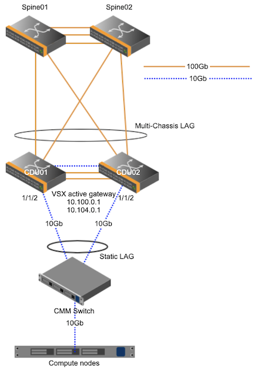

# Configure Aruba CDU Switch

This page describes how CDU switches are configured and will show users how to validate configuration.

CDU switches are located in Mountain cabinets and provide connectivity to MTN components.
CDU switches act as leafs in the architecture.
Aruba JL720A 8360-48XT4 is the model used.
They run in a high availability pair and use VSX to provide redundancy.
Requirements:
    - Two uplinks from each CDU switch to the upstream switch, this is normally a Spine switch.
    - Three connections between the switches, two of these are used for the ISL (Inter switch link) and one used for the keepalive.
    - The ISL uses 100GB ports and the keepalive uses a 10GB port.



Here are example snippets from a CDU switch in the SHCD.

The uplinks are port 51 and 52 on both CDU switches.  These go to sw-100g01 and sw-100g2 which are spine 1 and 2. 

The ISL are ports 49 and 50 on both CDU switches.

The Keepalive is port 48.

Note: These are examples only, your installation and cabling may vary. 


It is assumed that you have connectivity to the switch and the [Base Config](402-MGMT-NET-BASE-CONFIG.md) has been applied.
## VSX Config

Create the keepalive vrf on both switches.
```
sw-cdu-001 & sw-cdu-002 (config)#
    vrf keepalive
```

Setup the keepalive link.
This will require a unique IP on both switches.  The IP is in it's own VRF so this address will not be reachable from anywhere besides the CDU pair.

```
sw-cdu-001(config)# 
    int 1/1/48
    no shutdown 
    mtu 9198
    vrf attach keepalive   
    description VSX keepalive
    ip address 192.168.255.0/31

sw-cdu-002(config)# 
    int 1/1/48
    no shutdown
    mtu 9198
    vrf attach keepalive
    description VSX keepalive
    ip address 192.168.255.1/31
```
Create the ISL lag on both switches.

```
sw-cdu-001 & sw-cdu-002 (config)#
    interface lag 99
    no shutdown 
    description ISL link
    no routing
    vlan trunk native 1 tag
    vlan trunk allowed all
    lacp mode active
```
Add the ISL ports to the LAG, these are two of the ports connected between the switches.

```
sw-cdu-001 & sw-cdu-002 (config)#
    int 1/1/49-1/1/50
    no shutdown
    mtu 9198
    lag 99
```

Create the VSX instance and setup the keepalive link.

```
SW-CDU-001(config)# 
    no ip icmp redirect
    vsx
    system-mac 02:01:00:00:01:00
    inter-switch-link lag 99
    role primary
    keepalive peer 192.168.255.1 source 192.168.255.0 vrf keepalive
    linkup-delay-timer 600
    vsx-sync vsx-global

SW-CDU-002(config)#
    no ip icmp redirect
    vsx
    system-mac 02:01:00:00:01:00
    inter-switch-link lag 99
    role secondary
    keepalive peer 192.168.255.0 source 192.168.255.1 vrf keepalive
    linkup-delay-timer 600
    vsx-sync vsx-global

```
At this point you should have an Established VSX session
```
SW-CDU-001 # show vsx brief 
ISL State                              : In-Sync
Device State                           : Sync-Primary
Keepalive State                        : Keepalive-Established
Device Role                            : secondary
Number of Multi-chassis LAG interfaces : 0
```

## Uplink Config
The uplink ports are the ports connecting the CDU switches to the upstream switch, most likely a spine switch.

Create the LAG.
```
sw-cdu-001 & sw-cdu-002 (config)#
interface lag 99 multi-chassis
    no shutdown
    no routing
    vlan trunk native 1
    vlan trunk allowed all
    lacp mode active
    exit
```

Add ports to the LAG
```
sw-cdu-001 & sw-cdu-002 (config)#
interface 1/1/51 - 1/1/52
    no shutdown
    mtu 9198
    lag 99
    exit
```

## VLAN Config

**Cray Site Init (CSI) generates the IPs used by the system, below are samples only.**
The VLAN information is located in the network yaml files.  Below are examples.
The CDU switches will have VLAN interfaces in NMN, HMN, NMN_MTN, HMN_MTN networks.
```
sif-ncn-m001-pit:/var/www/ephemeral/prep/sif/networks # cat NMN.yaml
SNIPPET
  - ip_address: 10.252.0.5
    name: sw-cdu-001
    comment: d0w1
    aliases: []
  - ip_address: 10.252.0.6
    name: sw-cdu-002
    comment: d0w2
    aliases: []
  name: network_hardware
  net-name: NMN
  vlan_id: 2
  comment: ""
  gateway: 10.252.0.1
```
```
sif-ncn-m001-pit:/var/www/ephemeral/prep/sif/networks # cat HMN.yaml
SNIPPET
  - ip_address: 10.254.0.5
    name: sw-cdu-001
    comment: d0w1
    aliases: []
  - ip_address: 10.254.0.6
    name: sw-cdu-002
    comment: d0w2
    aliases: []
  name: network_hardware
  net-name: HMN
  vlan_id: 4
  comment: ""
  gateway: 10.254.0.1
```
```
sif-ncn-m001-pit:/var/www/ephemeral/prep/sif/networks # cat NMN_MTN.yaml
full_name: Mountain Node Management Network
cidr: 10.100.0.0/17
subnets:
- full_name: ""
  cidr:
    ip: 10.100.0.0
    mask:
    - 255
    - 255
    - 252
    - 0
  ip_reservations: []
  name: cabinet_9000
  net-name: ""
  vlan_id: 2000
  comment: ""
  gateway: 10.100.0.1
  _: ""
  dns_server: ""
  iprange-start: 10.100.0.10
  iprange-end: 10.100.3.254
name: NMN_MTN
```
```
sif-ncn-m001-pit:/var/www/ephemeral/prep/sif/networks # cat HMN_MTN.yaml
full_name: Mountain Hardware Management Network
cidr: 10.104.0.0/17
subnets:
- full_name: ""
  cidr:
    ip: 10.104.0.0
    mask:
    - 255
    - 255
    - 252
    - 0
  ip_reservations: []
  name: cabinet_9000
  net-name: ""
  vlan_id: 3000
  comment: ""
  gateway: 10.104.0.1
  _: ""
  dns_server: ""
  iprange-start: 10.104.0.10
  iprange-end: 10.104.3.254
name: HMN_MTN
```
Note: CSI does not yet generate IPs for the CDU switches on VLANs HMN_MTN and NMN_MTN.
- The first CDU switch in the pair will always have an IP address ending in .2 on the HMN_MTN and NMN_MTN networks.
- The second CDU switch in the pair will always have an IP address ending in .3 on the HMN_MTN and NMN_MTN networks.  
- Both CDU MTN VLAN IP addresses will be at the beginning of the subnet. 
- The gateway will always end in .1 and will be at the beginning of the subnet.
- Every Mountain Cabinet will get it's own HMN and NMN VLAN.

Below is an example of CDU switch IP addressing based on the network .yaml files from above.

| VLAN | CDU1 | CDU2	| Purpose |
| --- | --- | ---| --- |
| 2 | 10.252.0.5/17| 10.252.0.6/17 | River Node Management
| 4 | 10.254.0.5/17| 10.254.0.6/17 | River Hardware Management
| 2000 | 10.100.0.2/22| 10.100.0.3/22 | Mountain Node Management
| 3000 | 10.104.0.2/22| 10.104.0.3/22 | Mountain Hardware Management

If the system has additional Mountain Cabinets the VLANs will look like this. 
This is an example of a system with 3 cabinets. 

| VLAN | CDU1 | CDU2	| Purpose |
| --- | --- | ---| --- |
| 2000 | 10.100.0.2/22| 10.100.0.3/22 | Mountain Node Management
| 3000 | 10.104.0.2/22| 10.104.0.3/22 | Mountain Hardware Management
| 2001 | 10.100.4.2/22| 10.100.4.3/22 | Mountain Node Management
| 3001 | 10.104.4.2/22| 10.104.4.3/22 | Mountain Hardware Management
| 2002 | 10.100.8.2/22| 10.100.8.3/22 | Mountain Node Management
| 3002 | 10.104.8.2/22| 10.104.8.3/22 | Mountain Hardware Management

Below is the output of an SHCD, the components in the x1000 cabinet would get their own NMN and HMN VLAN and components in the x1001 would also get their own NMN and HMN VLAN.
The CECs will be on the HMN VLAN of that cabinet.


Once you have all this information you can now configure the VLANs on the switches. 

NMN VLAN config
```
sw-cdu-001(config)# 
    vlan 2
    interface vlan2
    ip address 10.252.0.5/17
    ip mtu 9198
    exit

sw-cdu-002(config)# 
    vlan 2
    interface vlan2
    ip address 10.252.0.6/17
    ip mtu 9198
    exit
```
HMN VLAN config
```
sw-cdu-001(config)# 
    vlan 4
    interface vlan4
    ip address 10.254.0.5/17
    ip mtu 9198
    exit

sw-cdu-002(config)# 
    vlan 4
    interface vlan4
    ip address 10.254.0.6/17
    ip mtu 9198
    exit
```
NMN MTN VLAN config

```
sw-cdu-001(config)#
    vlan 2000
    interface vlan2000
    description CAB_9000_MTN_NMN
    ip address 10.100.0.2/22
    active-gateway ip mac 02:01:00:00:01:02
    active-gateway ip 10.100.0.1
    ipv6 address autoconfig
    ip helper-address 10.92.100.222
    exit

sw-cdu-002(config)#
    vlan 2000
    interface vlan2000
    description CAB_9000_MTN_NMN
    ip address 10.100.0.3/22
    active-gateway ip mac 02:01:00:00:01:02
    active-gateway ip 10.100.0.1
    ipv6 address autoconfig
    ip helper-address 10.92.100.222
    exit
```

HMN MTN VLAN config

```
sw-cdu-001(config)#
    vlan 3000
    interface vlan3000
    description CAB_9000_MTN_HMN
    ip address 10.104.0.2/22
    active-gateway ip mac 02:01:00:00:01:02
    active-gateway ip 10.104.0.1
    ipv6 address autoconfig
    ip helper-address 10.94.100.222
    exit

sw-cdu-002(config)#
    vlan 3000
    interface vlan3000
    description CAB_9000_MTN_HMN
    ip address 10.104.0.3/22
    active-gateway ip mac 02:01:00:00:01:02
    active-gateway ip 10.104.0.1
    ipv6 address autoconfig
    ip helper-address 10.94.100.222
    exit
```

## ACL configuration

These ACLs are designed to block traffic from the node management network to and from the hardware management network.

The first step is to create the access list, once it's created we have to apply it to a VLAN.

NOTE: these are examples only, the IP addresses below need to match what was generated by CSI.
```
sw-cdu-001 & sw-cdu-002 (config)#
    access-list ip nmn-hmn
    10 deny any 10.252.0.0/255.255.128.0 10.254.0.0/255.255.128.0 
    20 deny any 10.252.0.0/255.255.128.0 10.104.0.0/255.252.0.0
    30 deny any 10.254.0.0/255.255.128.0 10.252.0.0/255.255.128.0 
    40 deny any 10.254.0.0/255.255.128.0 10.100.0.0/255.252.0.0
    50 deny any 10.100.0.0/255.252.0.0 10.254.0.0/255.255.128.0 
    60 deny any 10.100.0.0/255.252.0.0 10.104.0.0/255.252.0.0
    70 deny any 10.104.0.0/255.252.0.0 10.252.0.0/255.255.128.0 
    80 deny any 10.104.0.0/255.252.0.0 10.100.0.0/255.252.0.0
    90 permit any any any
```

Apply ACL to a VLANs
```
sw-cdu-001 & sw-cdu-002 (config)#
    vlan 2
    apply access-list ip nmn-hmn in
    apply access-list ip nmn-hmn out
    vlan 4
    apply access-list ip nmn-hmn in
    apply access-list ip nmn-hmn out
    vlan 2000
    apply access-list ip nmn-hmn in
    apply access-list ip nmn-hmn out
    vlan 3000
    apply access-list ip nmn-hmn in
    apply access-list ip nmn-hmn out
```
## Spanning-tree configuration

The following config is applied to Aruba CDU switches.
If there are more 2xxx or 3xxx VLANs you will add them to the ```spanning-tree vlan``` list
```
sw-cdu-001 & sw-cdu-002 (config)#
    spanning-tree mode rpvst
    spanning-tree
    spanning-tree vlan 1,2,4,2000,3000
```

Verify that each CDU switch is the root bridge for VLANs 2xxx and 3xxx


## OSPF configuration

OSPF is a dynamic routing protocol used to exchange routes.
It provides reachability from the MTN networks to NMN/K8s networks.
The router-id used here is the NMN ip address. (VLAN 2 IP) 

```
sw-cdu-001 & sw-cdu-002 (config)#
    router ospf 1
    router-id 10.252.0.x
    interface vlan2
    ip ospf 1 area 0.0.0.2
    interface vlan4
    ip ospf 1 area 0.0.0.4
    interface vlan2000
    ip ospf 1 area 0.0.0.2
    ip ospf passive
    interface vlan3000
    ip ospf 1 area 0.0.0.4
    ip ospf passive
```

## NTP configuration

The IPs used here will be the first 3 Worker nodes on the NMN network.  These can be found in NMN.yaml.
```
sw-cdu-001 & sw-cdu-002 (config)#
    ntp server 10.252.1.7
    ntp server 10.252.1.8
    ntp server 10.252.1.9
    ntp enable
```

## DNS configuration

This will point to the unbound DNS server. 
```
sw-cdu-001 & sw-cdu-002 (config)#
    ip dns server-address 10.92.100.225
```

## Downlink port configuration

## Configure LAG for CMMs

- This **requires** updated CMM firmware. (version 1.4.20) `See v1.4 Admin Guide for details on updating CMM firmware`
- A static LAG will be configured on the CDU switches.
- The CDU switches have two cables (10Gb RJ45) connecting to each CMM.
- This configuration offers increased throughput and redundancy.
- The CEC will not need to be programmed in order to support the LAG configuration as it was required in previous versions.  The updated firmware takes care of this.

Ports going to CMM switches.
The VLANs used are the cabinet VLANS that are generated from CSI
The Description should be changed to match the cabinet number.
```
sw-cdu-001 & sw-cdu-002 (config)#
    interface lag 1 multi-chassis static
    no shutdown
    description CMM_CAB_9000
    no routing
    vlan trunk native 2000
    vlan trunk allowed 2000,3000,4091

    interface 1/1/1
    no shutdown
    mtu 9198
    lag 1
    exit
```

Ports going to CECs
```
sw-cdu-001 & sw-cdu-002 (config)#
    interface 1/1/1
    no shutdown
    mtu 9198
    description cec1
    no routing
    vlan access 3000
    spanning-tree bpdu-guard
    spanning-tree port-type admin-edge
```
