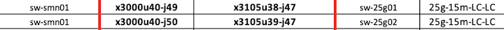

# Configure Aruba Leaf Switch

This page describes how aruba leaf switches are configured and will show users how to validate configuration.

Leaf switches are located in river cabinets and provide connectivity to MTN components.
Aruba JL762A 6300M 48G 4SFP56 is the model used.

Requirements:
    - Two uplinks from the switch to the upstream switch, this is can be an aggregation switch or a spine switch.


Here are example snippets from a CDU switch on the SHCD.



The uplinks are port 49 and 50 on the leaf.  They connect to Aggregation switch 1 and 2 on port 47.

It is assumed that you have connectivity to the switch and the [Base Config](402-MGMT-NET-BASE-CONFIG.md) has been applied.

## Uplink Config
The uplink ports are the ports connecting the Leaf switches to the upstream switch.

Create the LAG.
```
sw-leaf-001(config)#
interface lag 99
    no shutdown
    no routing
    vlan trunk native 1
    vlan trunk allowed all
    lacp mode active
    exit
```

Add ports to the LAG
```
sw-leaf-001(config)#
interface 1/1/49 - 1/1/50
    no shutdown
    mtu 9198
    lag 99
    exit
```

## VLAN Config

**Cray Site Init (CSI) generates the IPs used by the system, below are samples only.**
The VLAN information is located in the network yaml files.  Below are examples.
The Leaf switches will have VLAN interfaces in NMN, and the HMN networks

```
sif-ncn-m001-pit:/var/www/ephemeral/prep/sif/networks # cat NMN.yaml
SNIPPET
  - ip_address: 10.252.0.4
    name: sw-leaf-001
    comment: x3000c0w14
    aliases: []
  name: network_hardware
  net-name: NMN
  vlan_id: 2
  comment: ""
  gateway: 10.252.0.1
```
```
sif-ncn-m001-pit:/var/www/ephemeral/prep/sif/networks # cat HMN.yaml
SNIPPET
  - ip_address: 10.254.0.4
    name: sw-leaf-001
    comment: x3000c0w14
    aliases: []
  name: network_hardware
  net-name: HMN
  vlan_id: 4
  comment: ""
  gateway: 10.254.0.1
```

NMN VLAN config
```
sw-leaf-001(config)#
    vlan 2
    interface vlan2
    description RIVER_NMN
    ip address 10.252.0.4/17
    exit
```
HMN VLAN config
```
sw-leaf-001(config)#
    vlan 4
    interface vlan4
    description RIVER_HMN
    ip address 10.254.0.4/17
    exit
```

## SNMP configuration

This configuration is required for hardware discovery of the Shasta system.
```
snmp-server vrf default
snmpv3 user testuser auth md5 auth-pass plaintext testpass1 priv des priv-pass plaintext testpass2
```

## ACL configuration

These ACLs are designed to block traffic from the node management network to and from the hardware management network.

The first step is to create the access list, once it's created we have to apply it to a VLAN.

NOTE: these are examples only, the IP addresses below need to match what was generated by CSI.
```
sw-leaf-001(config)#
    access-list ip nmn-hmn
    10 deny any 10.252.0.0/255.255.128.0 10.254.0.0/255.255.128.0 
    20 deny any 10.252.0.0/255.255.128.0 10.104.0.0/255.252.0.0
    30 deny any 10.254.0.0/255.255.128.0 10.252.0.0/255.255.128.0 
    40 deny any 10.254.0.0/255.255.128.0 10.100.0.0/255.252.0.0
    50 deny any 10.100.0.0/255.252.0.0 10.254.0.0/255.255.128.0 
    60 deny any 10.100.0.0/255.252.0.0 10.104.0.0/255.252.0.0
    70 deny any 10.104.0.0/255.252.0.0 10.252.0.0/255.255.128.0 
    80 deny any 10.104.0.0/255.252.0.0 10.100.0.0/255.252.0.0
    90 permit any any any
```

Apply ACL to a VLANs
```
sw-leaf-001(config)#
    vlan 2
    name RVR_NMN
    apply access-list ip nmn-hmn in
    apply access-list ip nmn-hmn out
    vlan 4
    name RVR_HMN
    apply access-list ip nmn-hmn in
    apply access-list ip nmn-hmn out
```

## Spanning-tree configuration

The following configuration is applied to Aruba leaf/Aggregation switches.
```
sw-leaf-001(config)#
    spanning-tree mode rpvst
    spanning-tree
    spanning-tree vlan 1,2,4
```

## OSPF configuration

OSPF is a dynamic routing protocol used to exchange routes.
It provides reachability from the leaf switch to k8s
The router-id used here is the NMN ip address. (VLAN 2 IP) 

```
sw-leaf-001(config)#
    router ospf 1
    router-id 10.252.0.x
    interface vlan2
    ip ospf 1 area 0.0.0.2
    interface vlan4
    ip ospf 1 area 0.0.0.4
```

## NTP configuration

The IPs used here will be the first 3 Worker nodes on the NMN network.  These can be found in NMN.yaml.
```
sw-leaf-001(config)#
    ntp server 10.252.1.7
    ntp server 10.252.1.8
    ntp server 10.252.1.9
    ntp enable
```

## DNS configuration

This will point to the unbound DNS server. 
```
sw-leaf-001(config)#
    ip dns server-address 10.92.100.225
```

## Edge port config

Ports that need to be on the HMN (hardware management network) This would include BMCs/PDUs
```
sw-leaf-001(config)#
    interface 1/1/35
    no shutdown
    no routing
    vlan access 4
    spanning-tree bpdu-guard
    spanning-tree port-type admin-edge
```

Ports that need to be on the NMN (node management network) This would include river computes.
```
sw-leaf-001(config)#
    interface 1/1/35
    no shutdown
    no routing
    vlan access 2
    spanning-tree bpdu-guard
    spanning-tree port-type admin-edge
```

## Apollo Server port config

iLO BMC port
```
sw-leaf-001(config)#
    interface 1/1/46 
    no shutdown 
    no routing
    vlan trunk native 1
    vlan trunk allowed 4
    spanning-tree bpdu-guard
    spanning-tree port-type admin-edge
    exit 
```
NMN port from OCP card
```
interface 1/1/14 
    no shutdown 
    no routing
    vlan access 2
    spanning-tree bpdu-guard
    spanning-tree port-type admin-edge
    exit 
```
