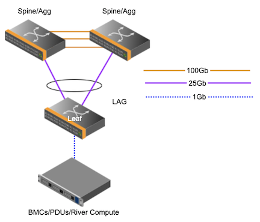

# Configure Aruba Leaf Switch

This page describes how Aruba leaf switches are configured.

Leaf switches are located in air-cooled cabinets and provide connectivity to components in those cabinets.
Aruba JL762A 6300M 48G 4SFP56 is the model used.

## Prerequisites

- Connectivity to the switch is established.
- The [Configure Aruba Management Network Base](configure_aruba_management_network_base.md) procedure has been run.
- There are two uplinks from the switch to the upstream switch; this is can be an aggregation switch or a spine switch.



Here are example snippets from a leaf switch in the SHCD.

| Source | Source Label Info | Destination Label Info | Destination | Description |
| --- | --- | ---| --- | --- |
| sw-smn01 | x3000u40-j49 | x3105u38-j47 | sw-25g01 | 25g-15m-LC-LC |
| sw-smn01 | x3000u40-j50 | x3105u39-j47 | sw-25g02 | 25g-15m-LC-LC |

The uplinks are port 49 and 50 on the leaf. They connect to Aggregation switch 1 and 2 on port 47.

## Configure Uplink

The uplink ports are the ports connecting the leaf switches to the upstream switch.

1. Create the LAG.

   ```bash
   sw-leaf-001(config)#
   interface lag 99
       no shutdown
       no routing
       vlan trunk native 1
       vlan trunk allowed all
       lacp mode active
       exit
   ```

1. Add ports to the LAG.

   ```bash
   sw-leaf-001(config)#
   interface 1/1/49 - 1/1/50
       no shutdown
       mtu 9198
       lag 99
       exit
   ```

## Configure VLAN

**Cray Site Init (CSI) generates the IP addresses used by the system, below are samples only.**
The VLAN information is located in the network YAML files. Below are examples.

1. View the VLAN interfaces for the leaf switches in the Node Management Network (NMN) and the Hardware Management Network (HMN).

   Example of NMN.yaml:

   ```bash
   pit# cat /var/www/ephemeral/prep/${SYSTEM_NAME}/networks/NMN.yaml
   SNIPPET
     - ip_address: 10.252.0.4
       name: sw-leaf-001
       comment: x3000c0w14
       aliases: []
     name: network_hardware
     net-name: NMN
     vlan_id: 2
     comment: ""
     gateway: 10.252.0.1
   ```

   Example of HMN.yaml:

   ```bash
   pit# cat /var/www/ephemeral/prep/${SYSTEM_NAME}/networks/HMN.yaml
   SNIPPET
     - ip_address: 10.254.0.4
       name: sw-leaf-001
       comment: x3000c0w14
       aliases: []
     name: network_hardware
     net-name: HMN
     vlan_id: 4
     comment: ""
     gateway: 10.254.0.1
   ```

1. Configure NMN VLAN.

   ```bash
   sw-leaf-001(config)#
       vlan 2
       interface vlan2
       description RIVER_NMN
       ip address 10.252.0.4/17
       exit
   ```
1. Configure HMN VLAN.

   ```bash
   sw-leaf-001(config)#
       vlan 4
       interface vlan4
       description RIVER_HMN
       ip address 10.254.0.4/17
       exit
   ```

## Configure SNMP

SNMP configuration is required for hardware discovery of the HPE Cray EX system.

1. Configure SNMP.

   ```bash
   snmp-server vrf default
   snmpv3 user testuser auth md5 auth-pass plaintext testpass1 priv des priv-pass plaintext testpass2
   ```

## Configure ACL

These ACLs are designed to block traffic from the NMN to and from the HMN.

1. Create the access list.

   **NOTE:** The following are only examples. The IP addresses below need to match what was generated by CSI.

   ```bash
   sw-leaf-001(config)#
       access-list ip nmn-hmn
       10 deny any 10.252.0.0/255.255.128.0 10.254.0.0/255.255.128.0
       20 deny any 10.252.0.0/255.255.128.0 10.104.0.0/255.252.0.0
       30 deny any 10.254.0.0/255.255.128.0 10.252.0.0/255.255.128.0
       40 deny any 10.254.0.0/255.255.128.0 10.100.0.0/255.252.0.0
       50 deny any 10.100.0.0/255.252.0.0 10.254.0.0/255.255.128.0
       60 deny any 10.100.0.0/255.252.0.0 10.104.0.0/255.252.0.0
       70 deny any 10.104.0.0/255.252.0.0 10.252.0.0/255.255.128.0
       80 deny any 10.104.0.0/255.252.0.0 10.100.0.0/255.252.0.0
       90 permit any any any
   ```

2. Apply ACL to VLANs.

   ```bash
   sw-leaf-001(config)#
       vlan 2
       name RVR_NMN
       apply access-list ip nmn-hmn in
       apply access-list ip nmn-hmn out
       vlan 4
       name RVR_HMN
       apply access-list ip nmn-hmn in
       apply access-list ip nmn-hmn out
   ```

## Configure Spanning-Tree

The following configuration is applied to Aruba leaf/Aggregation switches.

1. Configure spanning-tree.

   ```bash
   sw-leaf-001(config)#
       spanning-tree mode rpvst
       spanning-tree
       spanning-tree vlan 1,2,4
   ```

## Configure OSPF

OSPF is a dynamic routing protocol used to exchange routes.
It provides reachability from the leaf switch to k8s
The router-id used here is the NMN IP address. (VLAN 2 IP)

1. Configure OSPF.

   ```bash
   sw-leaf-001(config)#
       router ospf 1
       router-id 10.252.0.x
       interface vlan2
       ip ospf 1 area 0.0.0.2
       interface vlan4
       ip ospf 1 area 0.0.0.4
   ```

## Configure NTP

The IP addresses used to configure NTP are the first three worker nodes on the NMN.
These can be found in the NMN.yaml file.

1. Configure NTP.

   ```bash
   sw-leaf-001(config)#
       ntp server 10.252.1.7
       ntp server 10.252.1.8
       ntp server 10.252.1.9
       ntp enable
   ```

## Configure DNS

1. Configure DNS.

   This will point to the unbound DNS server.

   ```bash
   sw-leaf-001(config)#
       ip dns server-address 10.92.100.225
   ```

## Configure Edge port

1. Configure the ports that need to be on the HMN, including BMCs/PDUs.

   ```bash
   sw-leaf-001(config)#
       interface 1/1/35
       no shutdown
       no routing
       vlan access 4
       spanning-tree bpdu-guard
       spanning-tree port-type admin-edge
   ```

1. Configure ports that need to be on the NMN, including air-cooled compute nodes.

   ```bash
   sw-leaf-001(config)#
       interface 1/1/35
       no shutdown
       no routing
       vlan access 2
       spanning-tree bpdu-guard
       spanning-tree port-type admin-edge
   ```

## Configure Apollo Server Port

1. Configure iLO BMC port.

   ```bash
   sw-leaf-001(config)#
       interface 1/1/46
       no shutdown
       no routing
       vlan trunk native 1
       vlan trunk allowed 4
       spanning-tree bpdu-guard
       spanning-tree port-type admin-edge
       exit
   ```
1. Configure NMN port from OCP card.

   ```bash
   interface 1/1/14
       no shutdown
       no routing
       vlan access 2
       spanning-tree bpdu-guard
       spanning-tree port-type admin-edge
       exit
   ```

## Save Configuration

To save the configuration:

   ```bash
   sw-leaf-001(config)# exit
   sw-leaf-001# write memory
   ```


## Show Running Configuration

To display the running configuration:

   ```bash
   sw-leaf-001# show running-config
   ```

