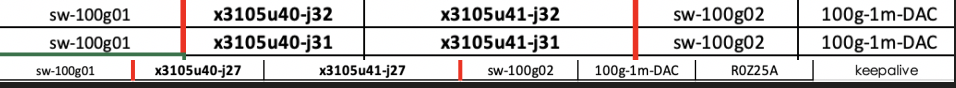

# Configure Aruba Spine Switch

This page describes how aruba spine switches are configured and will show users how to validate configuration.

Depending on the size of the shasta system the Spine switches will serve different purposes.  On TDS systems, the NCNs will plug directly into the spine switches, on larger systems with aggregation switches, the spines will provide connection between the aggregation switches.

Switch Models used
JL635A Aruba 8325-48Y8C and JL636A Aruba 8325-32C

They run in a high availability pair and use VSX to provide redundancy.
Requirements:
    - Three connections between the switches, two of these are used for the ISL (Inter switch link) and one used for the keepalive.
    - The ISL uses 100GB ports and the keepalive will be a 100GB port on the JL636A and a 25GB port on the JL635A.

Here is an example snippet from a Spine switch on the SHCD.

The ISL ports are 31 and 32 on both Spine switches.
The keepalive is port 27.



It is assumed that you have connectivity to the switch and the [Base Config](402-MGMT-NET-BASE-CONFIG.md) has been applied.

## VSX Config

Create the keepalive vrf on both switches.
```
sw-spine-001 & sw-spine-002 (config)#
    vrf keepalive
```

Setup the keepalive link.
This will require a unique IP on both switches.  The IP is in it's own VRF so this address will not be reachable from anywhere besides the Spine pair.

```
sw-spine-001(config)# 
    int 1/1/27
    no shutdown 
    vrf attach keepalive   
    description VSX keepalive
    ip address 192.168.255.0/31

sw-spine-002(config)#
    int 1/1/27
    no shutdown
    vrf attach keepalive
    description VSX keepalive
    ip address 192.168.255.1/31
```

Create the ISL lag on both switches.

```
sw-spine-001 & sw-spine-002 (config)#
    interface lag 256
    no shutdown 
    description ISL link
    no routing
    vlan trunk native 1 tag
    vlan trunk allowed all
    lacp mode active
```
Add the ISL ports to the LAG, these are two of the ports connected between the switches.

```
sw-spine-001 & sw-spine-002 (config)#
    int 1/1/31-1/1/32
    no shutdown
    mtu 9198
    lag 99
```

Create the VSX instance and setup the keepalive link.

```
sw-spine-001(config)# 
    no ip icmp redirect
    vsx
    system-mac 02:01:00:00:01:00
    inter-switch-link lag 99
    role primary
    keepalive peer 192.168.255.1 source 192.168.255.0 vrf keepalive
    linkup-delay-timer 600
    vsx-sync vsx-global

sw-spine-002(config)#
    no ip icmp redirect
    vsx
    system-mac 02:01:00:00:01:00
    inter-switch-link lag 99
    role secondary
    keepalive peer 192.168.255.0 source 192.168.255.1 vrf keepalive
    linkup-delay-timer 600
    vsx-sync vsx-global

```
At this point you should have an Established VSX session
```
sw-spine-001 # show vsx brief 
ISL State                              : In-Sync
Device State                           : Sync-Primary
Keepalive State                        : Keepalive-Established
Device Role                            : secondary
Number of Multi-chassis LAG interfaces : 0
```
## VLAN Config

**Cray Site Init (CSI) generates the IPs used by the system, below are samples only.**
The VLAN information is located in the network yaml files.  Below are examples.
The Spine switches will have VLAN interfaces in NMN, HMN, and CAN networks.
```
sif-ncn-m001-pit:/var/www/ephemeral/prep/sif/networks # cat NMN.yaml
SNIPPET
  - ip_address: 10.252.0.2
    name: sw-spine-001
    comment: x3000c0h12s1
    aliases: []
  - ip_address: 10.252.0.3
    name: sw-spine-002
    comment: x3000c0h13s1
    aliases: []
  name: network_hardware
  net-name: NMN
  vlan_id: 2
  comment: ""
  gateway: 10.252.0.1
```
```
sif-ncn-m001-pit:/var/www/ephemeral/prep/sif/networks # cat HMN.yaml
SNIPPET
  - ip_address: 10.254.0.2
    name: sw-spine-001
    comment: x3000c0h12s1
    aliases: []
  - ip_address: 10.254.0.3
    name: sw-spine-002
    comment: x3000c0h13s1
    aliases: []
  name: network_hardware
  net-name: HMN
  vlan_id: 4
  comment: ""
  gateway: 10.254.0.1
```
```
sif-ncn-m001-pit:/var/www/ephemeral/prep/sif/networks # cat CAN.yaml
SNIPPET
  - ip_address: 10.102.11.2
    name: can-switch-1
    comment: ""
    aliases: []
  - ip_address: 10.102.11.3
    name: can-switch-2
    comment: ""
    aliases: []
  net-name: CAN
  vlan_id: 7
  comment: ""
  gateway: 10.102.11.1
```

Below is an example of Spine switch IP addressing based on the network .yaml files from above.

| VLAN | Spine01 | Spine02	| Purpose |
| --- | --- | ---| --- | --- | --- | --- |
| 2 | 10.252.0.2/17| 10.252.0.3/17 | River Node Management
| 4 | 10.254.0.2/17| 10.254.0.3/17 | River Hardware Management
| 7 | 10.102.11.2/24| 10.102.11.3/24 | Customer Access 

NMN VLAN config
```
sw-spine-001(config)# 
    vlan 2
    interface vlan2
    vsx-sync active-gateways
    ip address 10.252.0.2/17
    active-gateway ip mac 12:01:00:00:01:00
    active-gateway ip 10.252.0.1
    ip mtu 9198
    ip helper-address 10.92.100.222
    exit

sw-spine-002(config)# 
    vlan 2
    interface vlan2
    vsx-sync active-gateways
    ip address 10.252.0.3/17
    active-gateway ip mac 12:01:00:00:01:00
    active-gateway ip 10.252.0.1
    ip mtu 9198
    ip helper-address 10.92.100.222
    exit
```
HMN VLAN config
```
sw-spine-001(config)#
    vlan 4
    interface vlan4
    vsx-sync active-gateways
    ip address 10.254.0.2/17
    active-gateway ip mac 12:01:00:00:01:00
    active-gateway ip 10.254.0.1
    ip mtu 9198
    ip helper-address 10.94.100.222
    exit

sw-spine-002(config)# 
    vlan 4
    interface vlan4
    vsx-sync active-gateways
    ip address 10.254.0.3/17
    active-gateway ip mac 12:01:00:00:01:00
    active-gateway ip 10.254.0.1
    ip mtu 9198
    ip helper-address 10.94.100.222
    exit
```
CAN VLAN config
```
sw-spine-001(config)#
    interface vlan 7
    vsx-sync active-gateways
    ip mtu 9198
    ip address 10.102.11.2/24
    active-gateway ip mac 12:01:00:00:01:00
    active-gateway ip 10.102.11.1
    ip helper-address 10.92.100.222

sw-spine-002(config)#
    interface vlan 7
    vsx-sync active-gateways
    ip mtu 9198
    ip address 10.102.11.3/24
    active-gateway ip mac 12:01:00:00:01:00
    active-gateway ip 10.102.11.1
    ip helper-address 10.92.100.222
```

## Uplink Config
The uplink ports are the ports connecting the spine switches to the downstream switches, these switches can be Aggregations, leaf, or Spine switches.

Create the LAG.
```
sw-spine-001 & sw-spine-002 (config)#
interface lag 1 multi-chassis
    no shutdown
    no routing
    vlan trunk native 1
    vlan trunk allowed all
    lacp mode active
    exit
```

Add ports to the LAG
```
sw-spine-001 & sw-spine-002 (config)#
interface 1/1/1 - 1/1/2
    no shutdown
    mtu 9198
    lag 1
    exit
```
## ACL configuration

These ACLs are designed to block traffic from the node management network to and from the hardware management network.

The first step is to create the access list, once it's created we have to apply it to a VLAN.

NOTE: these are examples only, the IP addresses below need to match what was generated by CSI.
```
sw-spine-001 & sw-spine-002 (config)#
    access-list ip nmn-hmn
    10 deny any 10.252.0.0/255.255.128.0 10.254.0.0/255.255.128.0 
    20 deny any 10.252.0.0/255.255.128.0 10.104.0.0/255.252.0.0
    30 deny any 10.254.0.0/255.255.128.0 10.252.0.0/255.255.128.0 
    40 deny any 10.254.0.0/255.255.128.0 10.100.0.0/255.252.0.0
    50 deny any 10.100.0.0/255.252.0.0 10.254.0.0/255.255.128.0 
    60 deny any 10.100.0.0/255.252.0.0 10.104.0.0/255.252.0.0
    70 deny any 10.104.0.0/255.252.0.0 10.252.0.0/255.255.128.0 
    80 deny any 10.104.0.0/255.252.0.0 10.100.0.0/255.252.0.0
    90 permit any any any
```

Apply ACL to a VLANs
```
sw-spine-001 & sw-spine-002 (config)#
    vlan 2
    name RVR_NMN
    apply access-list ip nmn-hmn in
    apply access-list ip nmn-hmn out
    vlan 4
    name RVR_HMN
    apply access-list ip nmn-hmn in
    apply access-list ip nmn-hmn out
```
## Spanning-tree configuration

The following config is applied to Aruba Spine switches.

```
sw-spine-001 & sw-spine-002 (config)#
    spanning-tree mode rpvst
    spanning-tree
    spanning-tree priority 7
    spanning-tree vlan 1,2,4,7
```

## OSPF configuration

OSPF is a dynamic routing protocol used to exchange routes.
It provides reachability from the MTN networks to NMN/K8s networks.
The router-id used here is the NMN ip address. (VLAN 2 IP) 
```
sw-spine-001 & sw-spine-002 (config)#
    router ospf 1
    router-id 10.252.0.x
    interface vlan2
    ip ospf 1 area 0.0.0.2
    interface vlan4
    ip ospf 1 area 0.0.0.4
    redistribute bgp
```

## NTP configuration

The IPs used here will be the first 3 Worker nodes on the NMN network.  These can be found in NMN.yaml.
```
sw-spine-001 & sw-spine-002 (config)#
    ntp server 10.252.1.7
    ntp server 10.252.1.8
    ntp server 10.252.1.9
    ntp enable
```

## DNS configuration

This will point to the unbound DNS server. 
```
sw-spine-001 & sw-spine-002 (config)#
    ip dns server-address 10.92.100.225
```

## Edge port configuration

- These are ports that are connected to NCNs.

Worker and Master node configuration
Refer to [MGMT-NET-CABLING](416-MGMT-NET-CABLING.md) for cabling specs.
```
sw-spine-001 & sw-spine-002 (config)#
    interface lag 4 multi-chassis
    no shutdown
    description w001
    no routing
    vlan trunk native 1
    vlan trunk allowed 1-2,4,7
    lacp mode active
    lacp fallback
    spanning-tree bpdu-guard
    spanning-tree port-type admin-edge
    exit

sw-spine-001 & sw-spine-002 (config)#
    interface 1/1/7
    no shutdown
    mtu 9198
    lag 4
    exit
```

Aruba Storage port configuration (future use)
These will be configured, but the ports will be shut down until needed.
These are OCP and PCIe port 2 on storage nodes.
```
sw-spine-001 & sw-spine-002 (config)#
    interface 1/1/7
    shutdown
    mtu 9198
    lag 4
    exit
```
Aruba LAG Configuration
```
sw-spine-001 & sw-spine-002 (config)#
    interface lag 4 multi-chassis
    shutdown
    no routing
    vlan access 10
    lacp mode active
    lacp fallback
    spanning-tree bpdu-guard
    spanning-tree port-type admin-edge
    exit
```

## User Access/Login/Application node port configuration
- One connection will go to a NMN(VLAN2) access port, this is where the UAN will pxe boot and communicate with internal systems. (see SHCD for UAN cabling).
- ONE OF THESE PORTS IS SHUTDOWN.
- One Bond (two connections) will be going to the MLAG/VSX pair of switches. This will be a TRUNK port for the CAN connection.

Aruba UAN NMN Configuration
```
sw-spine-001 (config)#
    interface 1/1/16
    no shutdown
    mtu 9198
    no routing
    vlan access 2
    spanning-tree bpdu-guard
    spanning-tree port-type admin-edge
    exit

sw-spine-002 (config)#
    interface 1/1/16
    shutdown
    mtu 9198
    no routing
    vlan access 2
    spanning-tree bpdu-guard
    spanning-tree port-type admin-edge
    exit
```

Aruba UAN CAN Configuration

Port Configuration is the same on both switches.
```
sw-spine-001 & sw-spine-002 (config)#
    interface lag 17 multi-chassis
    no shutdown
    no routing
    vlan trunk native 1
    vlan trunk allowed 7
    lacp mode active
    lacp fallback
    spanning-tree bpdu-guard
    spanning-tree port-type admin-edge
    exit
```
