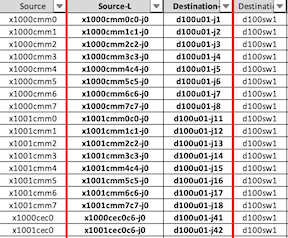

# Dell CDU switch configuration

This page describes how CDU switches are configured and will show users how to validate configuration.

CDU switches are located in Mountain cabinets and provide connectivity to MTN components.
CDU switches act as leafs in the architecture.
They run in a high availability pair and use VLT to provide redundancy.

Requirements:

   - Two uplinks from each CDU switch to the upstream switch, this is normally a Spine switch.
   - Three connections between the switches, two of these are used for the VLTi (VLT interconnect) and one used for the keepalive.
   - The VLTi uses two 100gb links between the switches.

## VLAN Config

**Cray Site Init (CSI) generates the IPs used by the system, below are samples only.**
The VLAN information is located in the network yaml files.  Below are examples.
The CDU switches will have VLAN interfaces in NMN, HMN, NMN_MTN, HMN_MTN networks.
```
sif-ncn-m001-pit:/var/www/ephemeral/prep/sif/networks # cat NMN.yaml
SNIPPET
  - ip_address: 10.252.0.5
    name: sw-cdu-001
    comment: d0w1
    aliases: []
  - ip_address: 10.252.0.6
    name: sw-cdu-002
    comment: d0w2
    aliases: []
  name: network_hardware
  net-name: NMN
  vlan_id: 2
  comment: ""
  gateway: 10.252.0.1
```
```
sif-ncn-m001-pit:/var/www/ephemeral/prep/sif/networks # cat HMN.yaml
SNIPPET
  - ip_address: 10.254.0.5
    name: sw-cdu-001
    comment: d0w1
    aliases: []
  - ip_address: 10.254.0.6
    name: sw-cdu-002
    comment: d0w2
    aliases: []
  name: network_hardware
  net-name: HMN
  vlan_id: 4
  comment: ""
  gateway: 10.254.0.1
```
```
sif-ncn-m001-pit:/var/www/ephemeral/prep/sif/networks # cat NMN_MTN.yaml
full_name: Mountain Node Management Network
cidr: 10.100.0.0/17
subnets:
- full_name: ""
  cidr:
    ip: 10.100.0.0
    mask:
    - 255
    - 255
    - 252
    - 0
  ip_reservations: []
  name: cabinet_9000
  net-name: ""
  vlan_id: 2000
  comment: ""
  gateway: 10.100.0.1
  _: ""
  dns_server: ""
  iprange-start: 10.100.0.10
  iprange-end: 10.100.3.254
name: NMN_MTN
```
```
sif-ncn-m001-pit:/var/www/ephemeral/prep/sif/networks # cat HMN_MTN.yaml
full_name: Mountain Hardware Management Network
cidr: 10.104.0.0/17
subnets:
- full_name: ""
  cidr:
    ip: 10.104.0.0
    mask:
    - 255
    - 255
    - 252
    - 0
  ip_reservations: []
  name: cabinet_9000
  net-name: ""
  vlan_id: 3000
  comment: ""
  gateway: 10.104.0.1
  _: ""
  dns_server: ""
  iprange-start: 10.104.0.10
  iprange-end: 10.104.3.254
name: HMN_MTN
```
Note: CSI does not yet generate IPs for the CDU switches on VLANs HMN_MTN and NMN_MTN.
- The first CDU switch in the pair will always have an IP address ending in .2 on the HMN_MTN and NMN_MTN networks.
- The second CDU switch in the pair will always have an IP address ending in .3 on the HMN_MTN and NMN_MTN networks.  
- Both CDU MTN VLAN IP addresses will be at the beginning of the subnet. 
- The gateway will always end in .1 and will be at the beginning of the subnet.
- Every Mountain Cabinet will get it's own HMN and NMN VLAN.

Below is an example of CDU switch IP addressing based on the network .yaml files from above.

| VLAN | CDU1 | CDU2	| Purpose |
| --- | --- | ---| --- | 
| 2 | 10.252.0.5/17| 10.252.0.6/17 | River Node Management
| 4 | 10.254.0.5/17| 10.254.0.6/17 | River Hardware Management
| 2000 | 10.100.0.2/22| 10.100.0.3/22 | Mountain Node Management
| 3000 | 10.104.0.2/22| 10.104.0.3/22 | Mountain Hardware Managemen

If the system has additional Mountain Cabinets the VLANs will look like this. 
This is an example of a system with 3 cabinets. 

| VLAN | CDU1 | CDU2	| Purpose |
| --- | --- | ---| --- |
| 2000 | 10.100.0.2/22| 10.100.0.3/22 | Mountain Node Management
| 3000 | 10.104.0.2/22| 10.104.0.3/22 | Mountain Hardware Management
| 2001 | 10.100.4.2/22| 10.100.4.3/22 | Mountain Node Management
| 3001 | 10.104.4.2/22| 10.104.4.3/22 | Mountain Hardware Management
| 2002 | 10.100.8.2/22| 10.100.8.3/22 | Mountain Node Management
| 3002 | 10.104.8.2/22| 10.104.8.3/22 | Mountain Hardware Management

Below is the output of an SHCD, the components in the x1000 cabinet would get their own NMN and HMN VLAN and components in the x1001 would also get their own NMN and HMN VLAN.
The CECs will be on the HMN VLAN of that cabinet.



Once you have all this information you can now configure the VLANs on the switches. 

NMN MTN VLAN config

```
sw-cdu-001(config)#
    interface vlan2000
    mode L3
    description CAB_1000_MTN_NMN
    no shutdown
    ip address 10.100.0.2/22
    ip access-group nmn-hmn in
    ip access-group nmn-hmn out
    ip ospf passive
    ip helper-address 10.92.100.222
    !
    vrrp-group 20
    virtual-address 10.100.0.1

sw-cdu-002(config)#
    interface vlan2000
    mode L3
    description CAB_1000_MTN_NMN
    no shutdown
    ip address 10.100.0.3/22
    ip access-group nmn-hmn in
    ip access-group nmn-hmn out
    ip ospf passive
    ip helper-address 10.92.100.222
    !
    vrrp-group 20
    virtual-address 10.100.0.1
```

HMN MTN VLAN config

```
sw-cdu-001(config)#
    interface vlan3000
    mode L3
    description CAB_1000_MTN_HMN
    no shutdown
    ip address 10.104.0.2/22
    ip access-group nmn-hmn in
    ip access-group nmn-hmn out
    ip ospf 1 area 0.0.0.0
    ip ospf passive
    ip helper-address 10.94.100.222
    !
    vrrp-group 30
    virtual-address 10.104.0.1

sw-cdu-002(config)#
    interface vlan3000
    mode L3
    description CAB_1000_MTN_HMN
    no shutdown
    ip address 10.104.0.3/22
    ip access-group nmn-hmn in
    ip access-group nmn-hmn out
    ip ospf 1 area 0.0.0.0
    ip ospf passive
    ip helper-address 10.94.100.222
    !
    vrrp-group 30
    virtual-address 10.104.0.1
```

## Downlink port configuration

## Configure LAG for CMMs

- This **requires** updated CMM firmware. (version 1.4.20) `See v1.4 Admin Guide for details on updating CMM firmware`
- A static LAG will be configured on the CDU switches.
- The CDU switches have two cables (10Gb RJ45) connecting to each CMM.
- This configuration offers increased throughput and redundancy.
- The CEC will not need to be programmed in order to support the LAG configuration as it was required in previous versions.  The updated firmware takes care of this.

Ports going to CMM switches.
The VLANs used are the cabinet VLANS that are generated from CSI
The Description should be changed to match the cabinet number.

```
sw-cdu-001 & sw-cdu-002 (config)#
    interface port-channel1
    description CMM_CAB_1000
    no shutdown
    switchport mode trunk
    switchport access vlan 2000
    switchport trunk allowed vlan 3000,4091
    mtu 9216
    vlt-port-channel 1

sw-cdu-001 & sw-cdu-002 (config)#
    interface ethernet1/1/1
    description CMM_CAB_1000
    no shutdown
    channel-group 1 mode on
    no switchport
    mtu 9216
    flowcontrol receive on
    flowcontrol transmit on
```

## CEC port configuration.

The VLAN used here is generated from CSI.  It is the HMN_MTN VLAN that is assigned to that cabinet.

```
interface ethernet1/1/50
    description CEC_CAB_1003_alt
    no shutdown
    switchport access vlan 3003
    flowcontrol receive off
    flowcontrol transmit off
    spanning-tree bpduguard enable
    spanning-tree port type edge
 ```
