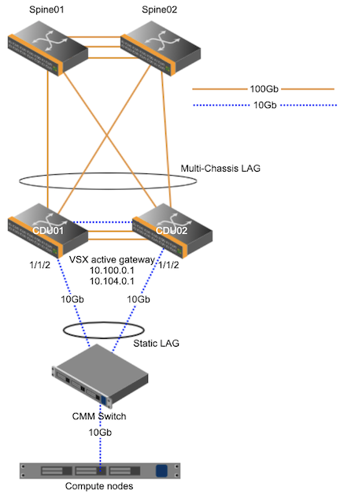
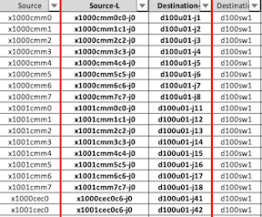

# Configure Dell CDU switch

This page describes how Dell CDU switches are configured.

CDU switches are located in liquid-cooled cabinets and provide connectivity to MTN (Mountain) components.
CDU switches act as leaf switches in the architecture.
They run in a high availability pair and use VLT to provide redundancy.

## Prerequisites

- Two uplinks from each CDU switch to the upstream switch, this is normally a spine switch.
- Connectivity to the switch is established.
- Three connections between the switches, two of these are used for the VLT interconnect (VLTi), and one used for the keepalive.
- The VLTi uses two 100gb links between the switches.



Here are example snippets from a CDU switch in the SHCD.

The uplinks are port 51 and 52 on both CDU switches. These go to sw-100g01 and sw-100g2 which are spine 1 and 2.

The ISL are ports 49 and 50 on both CDU switches.

The Keepalive is port 48.

   **NOTE:** The following are only examples; installation and cabling may vary.
   This information is on the 25G_10G tab of the SHCD spreadsheet.

| Source | Source Label Info | Destination Label Info | Destination | Description | Notes
| --- | --- | ---| --- | --- | --- |
| sw-100g01 | x3105u40-j01 | d100u01-j51 | d100sw1 | 100g-30m-AOC | |
| sw-100g02 | x3105u41-j01 | d100u01-j52 | d100sw1 | 100g-30m-AOC | |
| sw-100g01 | x3105u40-j02 | d100u02-j51 | d100sw2 | 100g-30m-AOC | |
| sw-100g02 | x3105u41-j02 | d100u02-j52 | d100sw2 | 100g-30m-AOC | |
| d100sw1 | d100u01-j48 | d100u02-j48 | d100sw2 | 6ft | keepalive |
| d100sw1 | d100u01-j49 | d100u02-j49 | d100sw2 | 100g-1m-DAC | |
| d100sw1 | d100u01-j50 | d100u02-j50 | d100sw2 | 100g-1m-DAC | |


## Configure VLT


## Configure VLAN

**Cray Site Init (CSI) generates the IP addresses used by the system, below are samples only.**
The VLAN information is located in the network YAML files. The following are examples.

1. Verify the CDU switches have VLAN interfaces in the NMN, HMN, NMN_MTN, and HMN_MTN.

   Example NMN.yaml:

   ```bash
   pit# cat /var/www/ephemeral/prep/${SYSTEM_NAME}/networks/NMN.yaml
   SNIPPET
     - ip_address: 10.252.0.5
       name: sw-cdu-001
       comment: d0w1
       aliases: []
     - ip_address: 10.252.0.6
       name: sw-cdu-002
       comment: d0w2
       aliases: []
     name: network_hardware
     net-name: NMN
     vlan_id: 2
     comment: ""
     gateway: 10.252.0.1
   ```

   Example HMN.yaml:

   ```bash
   pit# cat /var/www/ephemeral/prep/${SYSTEM_NAME}/networks/HMN.yaml

   SNIPPET
     - ip_address: 10.254.0.5
       name: sw-cdu-001
       comment: d0w1
       aliases: []
     - ip_address: 10.254.0.6
       name: sw-cdu-002
       comment: d0w2
       aliases: []
     name: network_hardware
     net-name: HMN
     vlan_id: 4
     comment: ""
     gateway: 10.254.0.1
   ```

   Example NMN_MTN.yaml:

   ```bash
   pit# cat /var/www/ephemeral/prep/${SYSTEM_NAME}/networks/NMN_MTN.yaml

   full_name: Mountain Node Management Network
   cidr: 10.100.0.0/17
   subnets:
   - full_name: ""
     cidr:
       ip: 10.100.0.0
       mask:
       - 255
       - 255
       - 252
       - 0
     ip_reservations: []
     name: cabinet_9000
     net-name: ""
     vlan_id: 2000
     comment: ""
     gateway: 10.100.0.1
     _: ""
     dns_server: ""
     iprange-start: 10.100.0.10
     iprange-end: 10.100.3.254
   name: NMN_MTN
   ```

   Example HMN_MTN.yaml:

   ```bash
   pit# cat /var/www/ephemeral/prep/${SYSTEM_NAME}/networks/HMN_MTN.yaml

   full_name: Mountain Hardware Management Network
   cidr: 10.104.0.0/17
   subnets:
   - full_name: ""
     cidr:
       ip: 10.104.0.0
       mask:
       - 255
       - 255
       - 252
       - 0
     ip_reservations: []
     name: cabinet_9000
     net-name: ""
     vlan_id: 3000
     comment: ""
     gateway: 10.104.0.1
     _: ""
     dns_server: ""
     iprange-start: 10.104.0.10
     iprange-end: 10.104.3.254
   name: HMN_MTN
   ```

   **NOTE:** CSI does not yet generate IP addresses for the CDU switches on VLANs HMN_MTN and NMN_MTN.
   - The first CDU switch in the pair will always have an IP address ending in .2 on the HMN_MTN and NMN_MTN networks.
   - The second CDU switch in the pair will always have an IP address ending in .3 on the HMN_MTN and NMN_MTN networks.
   - Both CDU MTN VLAN IP addresses will be at the beginning of the subnet.
   - The gateway will always end in .1 and will be at the beginning of the subnet.
   - Every Mountain Cabinet will get its own HMN and NMN VLAN.

   The following is an example of CDU switch IP addressing based on the network .yaml files from above.

   | VLAN | CDU1 | CDU2	| Purpose |
   | --- | --- | ---| --- |
   | 2 | 10.252.0.5/17| 10.252.0.6/17 | River Node Management
   | 4 | 10.254.0.5/17| 10.254.0.6/17 | River Hardware Management
   | 2000 | 10.100.0.2/22| 10.100.0.3/22 | Mountain Node Management
   | 3000 | 10.104.0.2/22| 10.104.0.3/22 | Mountain Hardware Management

   If the system has additional Mountain Cabinets the VLANs will look like the following.
   This is an example of a system with 3 cabinets.

   | VLAN | CDU1 | CDU2	| Purpose |
   | --- | --- | ---| --- |
   | 2000 | 10.100.0.2/22| 10.100.0.3/22 | Mountain Node Management
   | 3000 | 10.104.0.2/22| 10.104.0.3/22 | Mountain Hardware Management
   | 2001 | 10.100.4.2/22| 10.100.4.3/22 | Mountain Node Management
   | 3001 | 10.104.4.2/22| 10.104.4.3/22 | Mountain Hardware Management
   | 2002 | 10.100.8.2/22| 10.100.8.3/22 | Mountain Node Management
   | 3002 | 10.104.8.2/22| 10.104.8.3/22 | Mountain Hardware Management

1. View the output of the SHCD.

   The components in the x1000 cabinet would get their own NMN and HMN VLAN and components in the x1001 would also get their own NMN and HMN VLAN.
   The CECs will be on the HMN VLAN of that cabinet.

   

1. Configure the VLANs on the switches.

   NMN MTN VLAN configuration:

   ```bash
   sw-cdu-001(config)#
       interface vlan2000
       mode L3
       description CAB_1000_MTN_NMN
       no shutdown
       ip address 10.100.0.2/22
       ip helper-address 10.92.100.222
       !
       vrrp-group 20
       virtual-address 10.100.0.1

   sw-cdu-002(config)#
       interface vlan2000
       mode L3
       description CAB_1000_MTN_NMN
       no shutdown
       ip address 10.100.0.3/22
       ip helper-address 10.92.100.222
       !
       vrrp-group 20
       virtual-address 10.100.0.1
   ```

   HMN MTN VLAN configuration:

   ```bash
   sw-cdu-001(config)#
       interface vlan3000
       mode L3
       description CAB_1000_MTN_HMN
       no shutdown
       ip address 10.104.0.2/22
       ip helper-address 10.94.100.222
       !
       vrrp-group 30
       virtual-address 10.104.0.1

   sw-cdu-002(config)#
       interface vlan3000
       mode L3
       description CAB_1000_MTN_HMN
       no shutdown
       ip address 10.104.0.3/22
       ip helper-address 10.94.100.222
       !
       vrrp-group 30
       virtual-address 10.104.0.1
   ```

## Configure Uplink

The uplink ports are the ports connecting the CDU switches to the upstream switch, most likely a spine switch.


## Configure ACL

These ACLs are designed to block traffic from the NMN to and from the HMN.

1. Create the access list.

   **NOTE:** The following are examples only. The IP addresses below need to match what was generated by CSI.

   ```bash
   sw-cdu-001 & sw-cdu-002 (config)#
   ip access-list nmn-hmn
   seq 10 deny ip 10.252.0.0/17 10.254.0.0/17
   seq 20 deny ip 10.252.0.0/17 10.104.0.0/14
   seq 30 deny ip 10.254.0.0/17 10.252.0.0/17
   seq 40 deny ip 10.254.0.0/17 10.100.0.0/14
   seq 50 deny ip 10.100.0.0/14 10.254.0.0/17
   seq 60 deny ip 10.100.0.0/14 10.104.0.0/14
   seq 70 deny ip 10.104.0.0/14 10.252.0.0/17
   seq 80 deny ip 10.104.0.0/14 10.100.0.0/14
   seq 90 permit ip any any
   ```

1. Apply ACL to VLANs.

   ```bash
   sw-cdu-001 & sw-cdu-002 (config)#
   interface vlan2
   ip access-group nmn-hmn in
   ip access-group nmn-hmn out
   interface vlan4
   ip access-group nmn-hmn in
   ip access-group nmn-hmn out
   interface vlan2000
   ip access-group nmn-hmn in
   ip access-group nmn-hmn out
   interface vlan3000
   ip access-group nmn-hmn in
   ip access-group nmn-hmn out
   ```

## Configure Spanning-Tree

Spanning-tree is used to protect the network against layer2 loops.
Dell switches should have these settings for spanning-tree using bpduguard and not bpdufilter.

1. Enable spanning-tree for these VLANs.

   ```bash
   sw-cdu-001 & sw-cdu-002 (config)#
   spanning-tree vlan 1-2,4,4091 priority 61440
   ```

1. Ensure that no ports have bpduguard enabled.

   ```bash
   sw-cdu-001 & sw-cdu-002 (config)#
   interface ethernet 1/1/x
   no spanning-tree bpdufilter
   spanning-tree bpduguard enable
   ```

1. Add BPDUguard to ports going to CMMs.

   ```bash
   interface port-channel1
   description CMM_CAB_1000
   no shutdown
   switchport mode trunk
   switchport access vlan 2000
   switchport trunk allowed vlan 3000,4091
   mtu 9216
   vlt-port-channel 1
   spanning-tree bpduguard enable
   ```

## Configure OSPF

OSPF is a dynamic routing protocol used to exchange routes. It provides reachability from the MTN networks to NMN/Kubernetes networks. The router-id used here is the NMN IP address (VLAN 2 IP).

   ```bash
   sw-cdu-001 & sw-cdu-002 (config)#
   router ospf 1
   router-id 10.252.0.x
   interface vlan2
   ip ospf 1 area 0.0.0.2
   interface vlan4
   ip ospf 1 area 0.0.0.4
   interface vlan2000
   ip ospf 1 area 0.0.0.2
   ip ospf passive
   interface vlan3000
   ip ospf 1 area 0.0.0.4
   ip ospf passive
   ```

## Configure NTP

The IP addresses used are the first three worker nodes on the NMN network. These can be found in NMN.yaml.

1. Get current NTP configuration.

   ```bash
   sw-cdu-001# show running-configuration | grep ntp
   ntp server 10.252.1.12
   ntp server 10.252.1.13
   ntp server 10.252.1.14 prefer
   ```

1. Delete any current NTP configuration.

   ```bash
   sw-cdu-001# configure terminal
   sw-cdu-001(config)# no ntp server 10.252.1.12
   sw-cdu-001(config)# no ntp server 10.252.1.13
   sw-cdu-001(config)# no ntp server 10.252.1.14
   ```

1. Add new NTP server configuration.

   ```bash
   ntp server 10.252.1.10 prefer
   ntp server 10.252.1.11
   ntp server 10.252.1.12
   ntp source vlan 2
   ```

1. Verify NTP status.

   ```bash
   sw-cdu-001# show ntp associations
        remote           refid      st t when poll reach   delay   offset  jitter
   ==============================================================================
   *10.252.1.10     10.252.1.4       4 u   52   64    3    0.420   -0.262   0.023
    10.252.1.11     10.252.1.4       4 u   51   64    3    0.387   -0.225   0.043
    10.252.1.12     10.252.1.4       4 u   48   64    3    0.399   -0.222   0.050
   * master (synced), # master (unsynced), + selected, - candidate, ~ configured
   ```

## Configure DNS

1. Configure DNS.

   This will point to the unbound DNS server.

   ```bash
   sw-cdu-001 & sw-cdu-002 (config)#
   ip name-server 10.92.100.225
   ```

## Configure SNMP

1. Configure SNMP.

   ```bash
   sw-cdu-001 & sw-cdu-002 (config)#
   snmp-server group cray-reds-group 3 noauth read cray-reds-view
   snmp-server user testuser cray-reds-group 3 auth md5 testpass1 priv des testpass2
   snmp-server view cray-reds-view 1.3.6.1.2 included
   ```

## Downlink Port Configuration


## Configure Flow Control


## Configure LAG for CMMs

- This **requires** updated CMM firmware. (version 1.4.20) `See v1.4 Admin Guide for details on updating CMM firmware`
- A static LAG will be configured on the CDU switches.
- The CDU switches have two cables (10Gb RJ45) connecting to each CMM.
- This configuration offers increased throughput and redundancy.
- The CEC will not need to be programmed in order to support the LAG configuration as it was required in previous versions. The updated firmware takes care of this.

1. Configure ports going to CMM switches.

   The VLANs used are the cabinet VLANs that are generated from CSI.
   The description should be changed to match the cabinet number.

   ```bash
   sw-cdu-001 & sw-cdu-002 (config)#
   interface port-channel1
   description CMM_CAB_1000
   no shutdown
   switchport mode trunk
   switchport access vlan 2000
   switchport trunk allowed vlan 3000,4091
   mtu 9216
   vlt-port-channel 1

   sw-cdu-001 & sw-cdu-002 (config)#
   interface ethernet1/1/1
   description CMM_CAB_1000
   no shutdown
   channel-group 1 mode on
   no switchport
   mtu 9216
   flowcontrol receive on
   flowcontrol transmit on
   ```

## CEC Port Configuration

The VLAN used here is generated from CSI. It is the HMN_MTN VLAN that is assigned to that cabinet.

   ```bash
   sw-cdu-001 & sw-cdu-002 (config)#
   interface ethernet1/1/50
   description CEC_CAB_1003_alt
   no shutdown
   switchport access vlan 3003
   flowcontrol receive off
   flowcontrol transmit off
   spanning-tree bpduguard enable
   spanning-tree port type edge
   ```

## Disable iSCSI

Disable iSCSI in the configuration.

   ```bash
   sw-cdu-001 & sw-cdu-002 (config)#
   no iscsi enable
   ```

## Save Configuration

To save the configuration:

   ```bash
   sw-cdu-001(config)# exit
   sw-cdu-001# write memory
   ```

## Show Running Configuration

To display the running configuration:

   ```bash
   sw-cdu-001# show running-config
   ```

