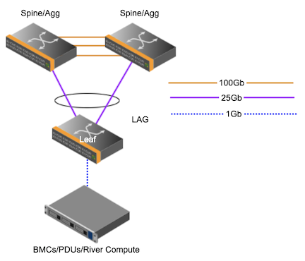

# Configure Dell Leaf Switch

This page describes how Dell leaf switches are configured.

Leaf switches are located in air-cooled cabinets and provide connectivity to components in those cabinets.

Requirements:
    - Two uplinks from the switch to the upstream switch, this is can be an aggregation switch or a spine switch.



Here are example snippets from a leaf switch in the SHCD.

| Source | Source Label Info | Destination Label Info | Destination | Description |
| --- | --- | --- | --- | --- | 
| sw-smn01 | x3000u40-j49 | x3105u38-j47 | sw-25g01 | 25g-15m-LC-LC |
| sw-smn01 | x3000u40-j50 | x3105u39-j47 | sw-25g02 | 25g-15m-LC-LC |
   

The uplinks are port 49 and 50 on the leaf. They connect to Aggregation switch 1 and 2 on port 47.

It is assumed that you have connectivity to the switch.

## Configure Uplink
The uplink ports are the ports connecting the leaf switches to the upstream switch.
Set the description to indicate the appropriate switch names and ports from the SHCD.

   ```bash
   interface port-channel100
   description vertex_to_sw-40g0x
   no shutdown
   switchport mode trunk
   switchport access vlan 1
   switchport trunk allowed vlan 2,4,7,10
   mtu 9216

   interface ethernet1/1/51
   description to:sw-40g02_x3000u34-j15:from:sw-smn01_x3000u38-j51
   no shutdown
   channel-group 100 mode active
   no switchport
   mtu 9216
   speed 10000
   flowcontrol receive off
   flowcontrol transmit off
   !
   interface ethernet1/1/52
   description to:sw-40g01_x3000u33-j15:from:sw-smn01_x3000u38-j52
   no shutdown
   channel-group 100 mode active
   no switchport
   mtu 9216
   speed 10000
   flowcontrol receive off
   flowcontrol transmit off
   ```

## Configure VLAN

**Cray Site Init (CSI) generates the IP addresses used by the system, below are samples only.**
The VLAN information is located in the network YAML files. Below are examples.
1. The leaf switches will have VLAN interfaces in NMN and the HMN networks.

   ```
   pit# cat /var/www/ephemeral/prep/${SYSTEM_NAME}/networks/NMN.yaml
   SNIPPET
     - ip_address: 10.252.0.4
       name: sw-leaf-001
       comment: x3000c0w14
       aliases: []
     name: network_hardware
     net-name: NMN
     vlan_id: 2
     comment: ""
     gateway: 10.252.0.1
   ```
   ```
   pit# cat /var/www/ephemeral/prep/${SYSTEM_NAME}/networks/HMN.yaml
   SNIPPET
     - ip_address: 10.254.0.4
       name: sw-leaf-001
       comment: x3000c0w14
       aliases: []
     name: network_hardware
     net-name: HMN
     vlan_id: 4
     comment: ""
     gateway: 10.254.0.1
   ```

1. NMN VLAN config

   ```
   sw-leaf-001(config)#
       vlan 2
       interface vlan2
       description RIVER_NMN
       ip address 10.252.0.4/17
       exit
   ```
1. HMN VLAN config

   ```
   sw-leaf-001(config)#
       vlan 4
       interface vlan4
       description RIVER_HMN
       ip address 10.254.0.4/17
       exit
   ```

## Configure SNMP

1. This configuration is required for hardware discovery of the Shasta system.

   ```
   snmp-server group cray-reds-group 3 noauth read cray-reds-view
   snmp-server user testuser cray-reds-group 3 auth md5 testpass1 priv des testpass2
   snmp-server view cray-reds-view 1.3.6.1.2 included

   ```

## Configure ACL

These ACLs are designed to block traffic from the node management network to and from the hardware management network.

1. The first step is to create the access list, once it is created we have to apply it to a VLAN.

   NOTE: these are examples only, the IP addresses below need to match what was generated by CSI.
   
   ```
   sw-leaf-001(config)#
   seq 10 deny ip 10.252.0.0/17 10.254.0.0/17
   seq 20 deny ip 10.252.0.0/17 10.104.0.0/14
   seq 30 deny ip 10.254.0.0/17 10.252.0.0/17
   seq 40 deny ip 10.254.0.0/17 10.100.0.0/14
   seq 50 deny ip 10.100.0.0/14 10.254.0.0/17
   seq 60 deny ip 10.100.0.0/14 10.104.0.0/14
   seq 70 deny ip 10.104.0.0/14 10.252.0.0/17
   seq 80 deny ip 10.104.0.0/14 10.100.0.0/14
   ```

1. Apply ACL to VLANs

   ```
   sw-leaf-001(config)#
   interface vlan2
   ip access-group nmn-hmn in
   ip access-group nmn-hmn out
   interface vlan4
   ip access-group nmn-hmn in
   ip access-group nmn-hmn out
   interface vlan2000
   ip access-group nmn-hmn in
   ip access-group nmn-hmn out
   interface vlan3000
   ip access-group nmn-hmn in
   ip access-group nmn-hmn out
   ```

## Configure Spanning-tree

Spanning tree is used to protect the network against layer2 loops.
Dell switches should have these settings for spanning-tree using bpduguard and not bpdufilter.

1. Enable spanning tree for these VLANs.

   ```
   sw-leaf-001(config)#
   spanning-tree vlan 1-2,4,7,10 priority 61440
   spanning-tree vlan 4 enable
   ```

1. The following configuration is applied to Dell leaf switches.

   ```
   sw-leaf-001(config)#
   interface ethernet1/1/2
   no shutdown
   switchport mode trunk
   switchport access vlan 1
   switchport trunk allowed vlan 2,4,7,10
   mtu 9216
   flowcontrol receive on
   flowcontrol transmit off
   no spanning-tree bpdufilter
   spanning-tree bpduguard enable
   spanning-tree port type edge
   ```

## Configure OSPF

1. OSPF is a dynamic routing protocol used to exchange routes.
   It provides reachability from the leaf switch to k8s
   The router-id used here is the NMN IP address. (VLAN 2 IP) 

   ```
   sw-leaf-001(config)#
       router ospf 1
       router-id 10.252.0.x
       interface vlan2
       ip ospf 1 area 0.0.0.2
       interface vlan4
       ip ospf 1 area 0.0.0.4
   ```

## Configure NTP

The IP addresses used here will be the first three worker nodes on the NMN network. These can be found in NMN.yaml.

1. Get current NTP configuration.

   ```
   sw-cdu-001# show running-configuration | grep ntp
   ntp server 10.252.1.12
   ntp server 10.252.1.13
   ntp server 10.252.1.14 prefer
   ```

1. Delete any current NTP configuration.

   ```
   sw-cdu-001# configure terminal
   sw-cdu-001(config)# no ntp server 10.252.1.12
   sw-cdu-001(config)# no ntp server 10.252.1.13
   sw-cdu-001(config)# no ntp server 10.252.1.14
   ```

1. Add new NTP server configuration.

   ```
   ntp server 10.252.1.10 prefer
   ntp server 10.252.1.11
   ntp server 10.252.1.12
   ntp source vlan 2
   ```

1. Verify NTP status.

   ```
   sw-cdu-001# show ntp associations
        remote           refid      st t when poll reach   delay   offset  jitter
   ==============================================================================
   *10.252.1.10     10.252.1.4       4 u   52   64    3    0.420   -0.262   0.023
    10.252.1.11     10.252.1.4       4 u   51   64    3    0.387   -0.225   0.043
    10.252.1.12     10.252.1.4       4 u   48   64    3    0.399   -0.222   0.050
   * master (synced), # master (unsynced), + selected, - candidate, ~ configured
   ```

## Configure DNS

1. This will point to the unbound DNS server. 

   ```
   sw-leaf-001(config)#
   ip name-server 10.92.100.225
   ```
   
## Configure Flow Control

```
sw-leaf01(config)# interface range ethernet 1/1/1-1/1/48
sw-leaf01(conf-range-eth1/1/1-1/1/48)# flowcontrol receive on
sw-leaf01(conf-range-eth1/1/1-1/1/48)# flowcontrol transmit off
sw-leaf01(conf-range-eth1/1/1-1/1/48)# end

sw-leaf01(config)# interface range ethernet 1/1/51-1/1/52
sw-leaf01(conf-if-eth1/1/51-1/1/52)# flowcontrol receive off
sw-leaf01(conf-if-eth1/1/51-1/1/52)# flowcontrol transmit off
sw-leaf01(conf-if-eth1/1/51-1/1/52)# end
```

## Configure Edge port


1. Ports that need to be on the HMN (hardware management network) This would include BMCs/PDUs

   ```
   sw-leaf-001(config)#
       interface 1/1/35
       no shutdown
       no routing
       vlan access 4
       spanning-tree bpdu-guard
       spanning-tree port-type admin-edge
   ```

1. Ports that need to be on the NMN (node management network). This would include air-cooled compute nodes.

   ```
   sw-leaf-001(config)#
       interface 1/1/35
       no shutdown
       no routing
       vlan access 2
       spanning-tree bpdu-guard
       spanning-tree port-type admin-edge
   ```

## Disable iSCSI

Disable iSCSI in the configuration.

   ```
   sw-cdu-001 & sw-cdu-002 (config)#
   no iscsi enable
   ```

## Save configuration
   ```
   sw-leaf-001(config)# exit
   sw-leaf-001# write memory
   ```


## Show Running Configuration

   ```
   sw-leaf-001# show running-config
   ```

