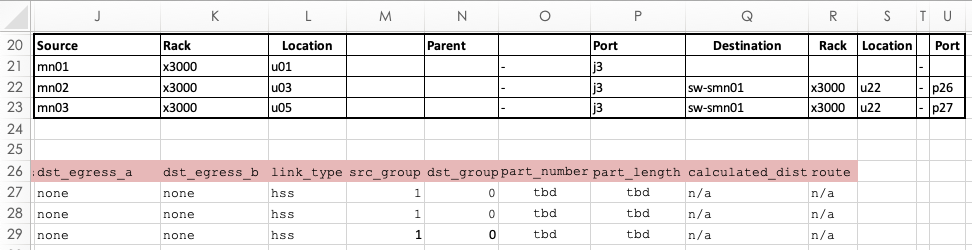

# Create HMN Connections JSON

### About this task

Use this procedure shows to generate the `hmn_connections.json` from the system's SHCD Excel document. This process is typically needed when generating the `hmn_connections.json` file for a new system, or regenerating it when system's SHCD is changed (specifically the HMN tab). The `hms-shcd-parser` tool can be used to generate the `hmn_connections.json` file.

The [SHCD/HMN Connections Rules document](shcd_hmn_connections_rules.md) explains the expected naming conventions and rules for the HMN tab of the SHCD, and the `hmn_connections.json` file.

### Prerequisites

* SHCD Excel file for the system
* Podman is available
    
    > Podman is available on the CSM LiveCD, and is installed onto a NCN when being used as an environment to create the CSM PIT in the [Bootstrap PIT Node from LiveCD USB](bootstrap_livecd_usb.md) or [Bootstrap Pit Node from LiveCD Remote ISO](bootstrap_livecd_remote_iso.md) procedures.

### Procedure

1. Inspect the HMN tab of the SHCD to verify that it does not have unexpected data in columns J through U in row 20 or below. If any unexpected data is present in this region of the HMN tab it will end up in the generated `hmn_connections.json`, and needs to be removed before generating the `hmn_connections.json` file. Unexpected data is anything other than HMN cabling information, such as another table placed below the HMN cabling information. Any data above row 20 will not interfere when generating `hmn_connections.json`.

    For example, the following image shows an unexpected table present underneath HMN cabling information in rows 26 to 29. The HMN cabling information in this example is truncated for brevity.
    
    

2. Load the `hms-shcd-parser` container image from the CSM release distribution into Podman.
    
    > The `CSM_RELEASE` environment variable is expected to to be set from the [Bootstrap PIT Node from LiveCD USB](bootstrap_livecd_usb.md) or [Bootstrap Pit Node from LiveCD Remote ISO](bootstrap_livecd_remote_iso.md) procedures.
    >
    > It is expected that current directory contains the directory of the extracted CSM release tarball.

    Determine the version of the `hms-shcd-parser` container image:
    
    ```bash
    linux# SHCD_PARSER_VERSION=$(realpath ./${CSM_RELEASE}/docker/dtr.dev.cray.com/cray/hms-shcd-parser* | egrep  -o '[0-9]+\.[0-9]+\.[0-9]+$')
    linux# echo $SHCD_PARSER_VERSION
    ```

    Load the `hms-shcd-parser` container image into Podman:
    
    ```bash
    linux# ./${CSM_RELEASE}/hack/load-container-image.sh dtr.dev.cray.com/cray/hms-shcd-parser:$SHCD_PARSER_VERSION
    ```

3. Copy the system's SHCD over the machine being used to prepare the `hmn_connections.json` file.

4. Set environment to point to the system's SHCD Excel file:
    
    > **NOTE:** Make sure to quote the SHCD file path if there are spaces in the document's filename.

    ```bash
    linux# export SHCD_FILE="/path/to/systems/SHCD.xlsx"
    ```

5. Generate the hmn_connections.json file from the SHCD. This will either create or overwrite the `hmn_connections.json` file in the current directory:

    ```bash
    linux# podman run --rm -it --name hms-shcd-parser -v "$(realpath "$SHCD_FILE")":/input/shcd_file.xlsx -v "$(pwd)":/output dtr.dev.cray.com/cray/hms-shcd-parser:$SHCD_PARSER_VERSION
    ```


