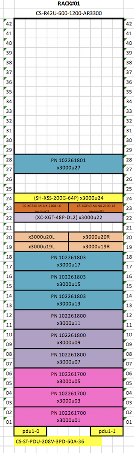

# Create Switch Metadata CSV

This page provides directions on constructing the `switch_metadata.csv` file.

This file is manually created to include information about all spine, leaf, CDU, and aggregation switches in the system.
None of the Slingshot switches for the HSN should be included in this file.

The file follows this format in ascending order for the switches of each type:

```
Switch Xname,Type,Brand
d0w1,CDU,Dell
d0w2,CDU,Dell
x3000c0w38,Leaf,Dell
x3000c0w36,Leaf,Dell
x3000c0h33s1,Spine,Mellanox
x3000c0h34s1,Spine,Mellanox
```

The above file would lead to this pairing between component name and hostname:

| hostname | component name |
| --------- | -------------- |
| sw-spine-001 | x3000c0h33s1 |
| sw-spine-002 | x3000c0h34s1 |
| sw-leaf-001 | x3000c0w38 |
| sw-leaf-002 | x3000c0w36 |
| sw-cdu-001 | d0w1 |
| sw-cdu-002 | d0w2 |

#### Requirements

For this you will need:

- The SHCD for your system
Check the description for component names while mapping names between the SHCD and your `switch_metadata.csv` file.
Refer to "Component Names (xnames)" in the _HPE Cray EX Hardware Management Administration Guide 1.5 S-8015_.

#### Format

Spine and aggregation switches use the format `xXcChHsS`. Leaf switches use `xXcCwW`.  CDU switches use `dDwW`.

#### Directions

1. In your SHCD, identify your switches. Look for:
    - The slot number(s) for the leaf switches (usually 48-port switches)
        - In the below example this is x3000u22
    - The slot number(s) for the spine switches
        - In the below example this is x3000u23R and x3000u23L (two side-by-side switches)
        - Newer side-by-side switches use slot numbers of s1 and s2 instead of R and L
    >   
2. Each spine or aggregation switch will follow this format: `xXcChHsS`
    > This format also applies to CDU switches that are in a river cabinet that make connections to an adjacent hill cabinet.
    - xX : where "X" is the river cabinet identification number (the figure above is "3000")
    - cC : where "C" is the cabinet identification number (the figure above is "0")
    - hH : where "H" is the slot number in the cabinet (height)
    - sS : where "S" is the horizontal space number'
3. Each leaf switch will follow this format: `xXcCwW`:
    - xX : where "X" is the river cabinet identification number (the figure above is "3000")
    - cC : where "C" is the cabinet identification number (the figure above is "0")
    - wW : where "W" is the slot number in the cabinet (height)
4. Each CDU switch will follow this format: `dDwW`:
    > If a CDU switch is in a river cabinet, then follow the naming convention in step 2 instead.
    - dD : where "D" is the Coolant Distribution Unit (CDU)
    - wW : where "W" is the management switch in a CDU
5. Each item in the file is either of type `Aggregation`, `CDU`, `Leaf`, or `Spine`.
6. Each line in the file must denote the Brand, either `Dell`, `Mellanox`, or `Aruba`.
7. Create the switch_metadata.csv file with this information.

```
linux# vi switch_metadata.csv
```

See the example files below for reference.

#### Examples

> Use case: 2 Aruba CDU Switches, 2 Aruba leaf switches, 4 Aruba aggregation switches, and 2 Aruba spine switches
```
pit# cat example_switch_metadata.csv
Switch Xname,Type,Brand
d0w1,CDU,Aruba
d0w2,CDU,Aruba
x3000c0w31,Leaf,Aruba
x3000c0w32,Leaf,Aruba
x3000c0h33s1,Aggregation,Aruba
x3000c0h34s1,Aggregation,Aruba
x3000c0h35s1,Aggregation,Aruba
x3000c0h36s1,Aggregation,Aruba
x3000c0h37s1,Spine,Aruba
x3000c0h38s1,Spine,Aruba
```

> Use case: 2 Dell CDU switches, 2 Dell leaf switches, and 2 Mellanox spine switches:

```
Switch Xname,Type,Brand
d0w1,CDU,Dell
d0w2,CDU,Dell
x3000c0w36,Leaf,Dell
x3000c0w38,Leaf,Dell
x3000c0h33s1,Spine,Mellanox
x3000c0h34s1,Spine,Mellanox
```

> Use case: 2 Dell leaf switches and 2 Mellanox switches in the same slot number:
```
pit# cat example_switch_metadata.csv
Switch Xname,Type,Brand
x3000c0w38,Leaf,Dell
x3000c0w36,Leaf,Dell
x3000c0h33s1,Spine,Mellanox
x3000c0h33s2,Spine,Mellanox
```

