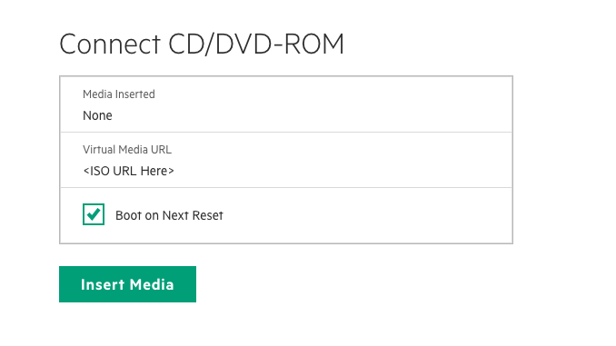
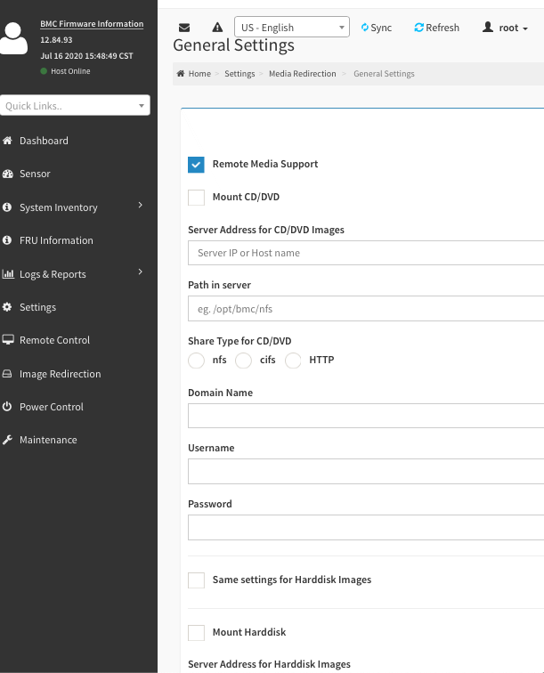
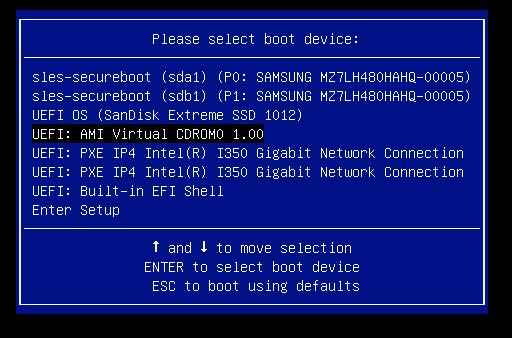

# Boot LiveCD RemoteISO

This page will guide a user on booting the LiveCD `.iso` file directly onto a BMC.

## Topics

- [Prerequisites](#prerequisites)
- [BMCs' virtual mounts](#bmcs-virtual-mounts)
  - [HPE iLO BMCs](#hpe-ilo-bmcs)
  - [Gigabyte BMCs](#gigabyte-bmcs)
- [Configuring](#configuring)
  - [Backing up the overlay COW FS](#backing-up-the-overlay-cow-fs)
  - [Restoring from an overlay COW FS backup](#restoring-from-an-overlay-cow-fs-backup)

## Prerequisites

A Cray Pre-Install Toolkit ISO is required for this process. This ISO can be obtained from:

- The Cray Pre-Install Toolkit ISO included in a CSM release tar file. It will have a filename similar to
  `pre-install-toolkit-0.4.10-x86_64.iso`

## BMCs' virtual mounts

Most BMCs offer a web interface for controlling the node and providing access to its BIOS and firmware.

Refer to the following pages based on the node vendor for help mounting an ISO image:

- [HPE iLO BMCs](#hpe-ilo-bmcs)
- [Gigabyte](#gigabyte-bmcs)

### HPE iLO BMCs

HPE iLO BMCs allow for booting directly from an HTTP-accessible ISO location.

1. Enter the `Virtual Media URL`, select `Boot on Next Reset`, and click `Insert Media`.

   

1. Reboot by selecting `Reset` in the top right power menu.

   

1. Open the virtual terminal by choosing the `HTML5 Console` option when clicking the terminal image in the bottom left corner.

   > **`NOTE`** It may appear that the boot is stalled at a line of `EXT4-fs (loop1): mounted ...` or `Starting dracut pre-mount hook...`. This is the step when it begins downloading the ISO's SquashFS root file system, which can take a few minutes.

### Gigabyte BMCs

Gigabyte BMCs allow for booting over HTTP.

> **WARNING:** Do not try to boot over NFS or CIFS because of problems in the Gigabyte firmware.

1. Go to the BMC settings and setup the remote ISO for the protocol and node.

   

1. Access the BMC's web interface and navigate to `Settings` -> `Media Redirection Settings` -> `General Settings`.

1. Enable `Remote Media Support` and `Mount CD/DVD` and then fill in the server IP address or DNS name and the path to the server.

   

   > **`NOTE`** The Gigabyte URL appears to not allow certain characters and has a limit on path length. You may need to move or rename the ISO to a location with a smaller file name.

1. Navigate to `Image Redirection` -> `Remote Images`.

1. Click on the `Start` button to start the Virtual ISO mount.

   

1. Reboot the node and select the `Virtual CDROM` option from the manual boot options.

   

## Configuring

- [Backing up the overlay COW FS](#backing-up-the-overlay-cow-fs)
- [Restoring from an overlay COW FS backup](#restoring-from-an-overlay-cow-fs-backup)

The ISO boots with no password, requiring one be set on first login.
Continue the bootstrap process by setting the root password
following the procedure [First log in](../pre-installation.md#13-first-log-in).

> **`NOTE`** The root OS `/` directory is writable without persistence. This means that restarting
> the machine will result in all changes being lost. Before restarting, consider following
> [Backing up the overlay COW FS](#backing-up-the-overlay-cow-fs) and the accompanying
> [Restoring from an overlay COW FS backup](#restoring-from-an-overlay-cow-fs-backup) section.

### Backing up the overlay COW FS

Backup the writable overlay's `upperdir` so that changes are not lost after a reboot or when updating the ISO.

(`pit#`) This requires a location to `scp` a tar file as a backup.

```bash
tar czf /run/overlay.tar.gz -C /run/overlayfs/rw .
scp /run/overlay.tar.gz <somelocation>
```

> **`NOTE`** To reduce the size of the backup, delete any SquashFS files first, or exclude them
> in the `tar` command using `--exclude='*.squashfs'`. Those will need to be repopulated after
> restoring the backup.

### Restoring from an overlay COW FS backup

Restore a backed up tar file from the previous command with the following:

```bash
scp <somelocation> /run/overlay.tar.gz
tar xf /run/overlay.tar.gz -C /run/overlayfs/rw
mount -o remount /
```

If the `SquashFS` files were excluded from the backup, repopulate them following the configuration section.
