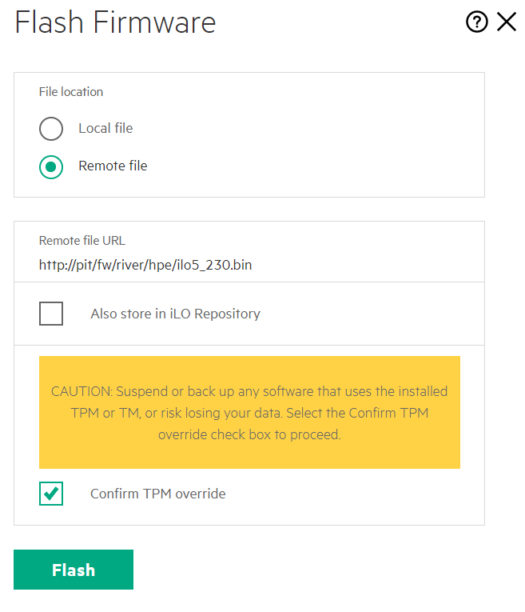
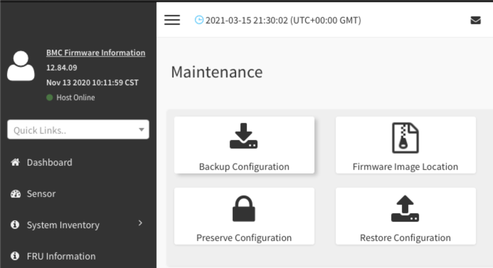
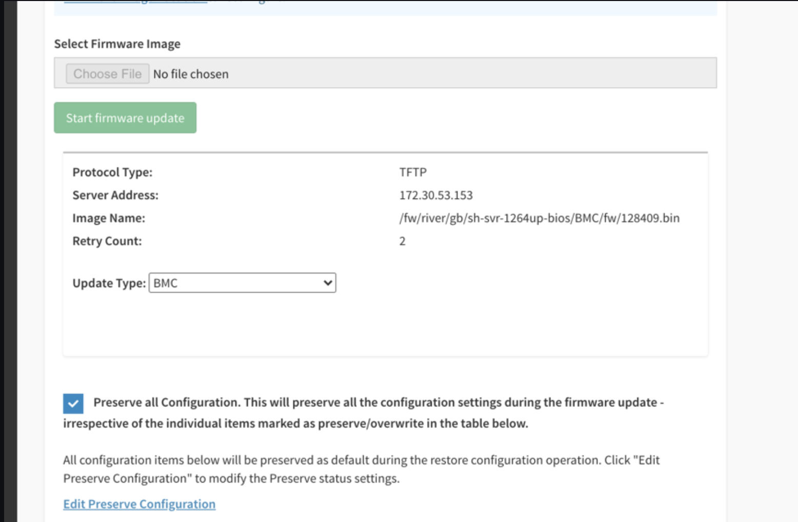

# Update NCN Firmware

Firmware and BIOS updates for the management nodes may be necessary before an install can progress.

Only non-compute nodes (NCNs) can upgrade firmware during a CSM install.
Other devices, such as compute nodes or application nodes, have their upgrades managed by FAS
once all CSM software and services have been installed.

FAS tracks and performs actions (upgrade, downgrade, restore, and create snapshots) on system firmware.
FAS is a runtime service deployed in Kubernetes. Fresh installs use FAS for upgrading
compute node and application node firmware. See [Update Firmware with Firmware Action Service (FAS)](../operations/firmware/Update_Firmware_with_FAS.md)
for more information.

Reset Gigabyte nodes to factory defaults to resolve problems with `ipmitool`, Redfish, or when BMC flash procedures fail. See [Set Gigabyte Node BMC to Factory Defaults](set_gigabyte_node_bmc_to_factory_defaults.md).

### Topics
   1. [Prepare BIOS and Firmware Content for Installation](#prepare-bios-and-firmware-for-installation)
   2. [Check BIOS and Hardware](#check-bios-and-hardware)
      1. [Upgrade HPE (iLO) Firmware](#upgrade-hpe-ilo-firmware)
         * [HPE Pre-Reqs](#hpe-pre-reqs)
         * [HPE GUI](#hpe-gui)
         * [HPE Redfish](#hpe-redfish)
      1. [Upgrade Gigabyte Firmware](#upgrade-gigabyte-firmware)
         * [Gigabyte GUI](#gigabyte-gui)
   3. [Component Firmware Checkout](#component-firmware-checkout)
      1. [Upgrade Marvell PCIe Card](#upgrade-marvell-pcie-card)
      1. [Upgrade Mellanox PCIe Card](#upgrade-mellanox-pcie-card)

## Details

<a name="prepare-bios-and-firmware-for-installation"></a>
### 1. Prepare BIOS and Firmware Content for Installation

> **`CUSTOMER NOTE`** If there is doubt that the tar contains the latest, the customer should check [CrayPort][1] for newer firmware.

1. Prepare the inventory. The RPMs providing firmware need to be installed:

    > When setting the CSM_PATH variable, set it to where your expanded CSM release tarball is located.

   ```bash
   pit# export CSM_RELEASE=x.y.z
   pit# export CSM_PATH=/var/www/ephemeral/${CSM_RELEASE}
   pit# zypper ar -fG "${CSM_PATH}/rpm/embedded" "${CSM_RELEASE}-embedded"
   pit# pushd "${CSM_PATH}"
   pit# find firmware -name *.rpm -exec zypper -n in --auto-agree-with-licenses --allow-unsigned-rpm {} \+
   pit# popd
   ```

2. Hide the old firmware; cleanup the directory
   > **`NOTE`** This step will be removed in later versions of CSM; this is correcting the layout of the directory.

   ```bash
   pit# mv /var/www/fw/river /var/www/fw/.river-old
   ```

3. Set web-links for the new firmware:

   ```bash
   pit# mkdir -pv /var/www/fw/river/hpe
   pit# find /opt/cray/fw -name *.flash -exec ln -svnf {} /var/www/fw/river/hpe/ \;
   pit# find /opt/cray/fw -name *.bin -exec ln -svnf {} /var/www/fw/river/hpe/ \;
   pit# mkdir -pv /var/www/fw/river/gb
   pit# find /opt/cray/FW/bios -name sh-svr* -exec ln -svnf {} /var/www/fw/river/gb/ \;
   pit# mkdir -pv /var/www/fw/mountain/cray
   pit# find /opt/cray/FW/bios -mindepth 0 -maxdepth 1 -type f -exec ln -svnf {} /var/www/fw/mountain/cray/ \;
   ```

4. Make a tftp symlink for Gigabyte nodes:

    ```bash
    pit# mkdir -pv /var/www/boot
    pit# ln -svnf /var/www/fw /var/www/boot/fw
    ```

<a name="check-bios-and-hardware"></a>
### 2. Check BIOS and Hardware

1. Checkout BIOS and BMC firmware with `ipmitool`:
   * From the NCN:

      ```bash
      ncn-m# pdsh -b -w $(grep -oP 'ncn-\w\d+' /etc/hosts | sort -u |  tr -t '\n' ',') '
      ipmitool fru | grep -i "board product" && \
      ipmitool mc info | grep -i "firmware revision" && \
      ipmitool fru | grep -i "product version"
      ' | sort -u
      ```

   * From the LiveCD

     ```bash
     pit# \
     export mtoken='ncn-m(?!001)\w+-mgmt'
     export stoken='ncn-s\w+-mgmt'
     export wtoken='ncn-w\w+-mgmt'
     export USERNAME=root
     export IPMI_PASSWORD=changeme
     grep -oP "($mtoken|$stoken|$wtoken)" /etc/dnsmasq.d/statics.conf | sort -u | xargs -t -i ipmitool -I lanplus -U $USERNAME -E -H {} fru | grep -i 'board product'
     grep -oP "($mtoken|$stoken|$wtoken)" /etc/dnsmasq.d/statics.conf | sort -u | xargs -t -i ipmitool -I lanplus -U $USERNAME -E -H {} mc info | grep -i 'firmware revision'
     grep -oP "($mtoken|$stoken|$wtoken)" /etc/dnsmasq.d/statics.conf | sort -u | xargs -t -i ipmitool -I lanplus -U $USERNAME -E -H {} mc info | grep -i 'product version'
     ```

   > #### Manufacturer Examples
   > - Gigabyte:
   >      > **NOTE** On Gigabyte, the Product Version can be disregarded. It may become valuable at a later date.
   >
   >      ```bash
   >      ncn-m001:  Board Product         : MZ32-AR0-00
   >      ncn-m001: Firmware Revision         : 12.84
   >      ncn-m001:  Product Version       : 0100
   >      ncn-m002:  Board Product         : MZ32-AR0-00
   >      ncn-m002: Firmware Revision         : 12.84
   >      ncn-m002:  Product Version       : 0100
   >      ncn-m003:  Board Product         : MZ32-AR0-00
   >      ncn-m003: Firmware Revision         : 12.84
   >      ncn-m003:  Product Version       : 0100
   >      ncn-s001:  Board Product         : MZ32-AR0-00
   >      ncn-s001: Firmware Revision         : 12.84
   >      ncn-s001:  Product Version       : 0100
   >      ncn-s002:  Board Product         : MZ32-AR0-00
   >      ncn-s002: Firmware Revision         : 12.84
   >      ncn-s002:  Product Version       : 0100
   >      ncn-s003:  Board Product         : MZ32-AR0-00
   >      ncn-s003: Firmware Revision         : 12.84
   >      ncn-s003:  Product Version       : 0100
   >      ncn-w001:  Board Product         : MZ32-AR0-00
   >      ncn-w001: Firmware Revision         : 12.84
   >      ncn-w001:  Product Version       : 0100
   >      ncn-w002:  Board Product         : MZ32-AR0-00
   >      ncn-w002: Firmware Revision         : 12.84
   >      ncn-w002:  Product Version       : 0100
   >      ncn-w003:  Board Product         : MZ32-AR0-00
   >      ncn-w003: Firmware Revision         : 12.84
   >      ncn-w003:  Product Version       : 0100
   >      ```
   >
   > - HPE:
   >
   >      ```bash
   >      ncn-m001:  Board Product         : Marvell 2P 25GbE SFP28 QL41232HQCU-HC OCP3 Adapter
   >      ncn-m001:  Board Product         : ProLiant DL325 Gen10 Plus
   >      ncn-m001: Firmware Revision         : 2.33
   >      ncn-m001:  Product Version       :
   >      ncn-m001:  Product Version       : 10/30/2020
   >      ncn-m002:  Board Product         : Marvell 2P 25GbE SFP28 QL41232HQCU-HC OCP3 Adapter
   >      ncn-m002:  Board Product         : ProLiant DL325 Gen10 Plus
   >      ncn-m002: Firmware Revision         : 2.33
   >      ncn-m002:  Product Version       :
   >      ncn-m002:  Product Version       : 10/30/2020
   >      ncn-m003:  Board Product         : Marvell 2P 25GbE SFP28 QL41232HQCU-HC OCP3 Adapter
   >      ncn-m003:  Board Product         : ProLiant DL325 Gen10 Plus
   >      ncn-m003: Firmware Revision         : 2.33
   >      ncn-m003:  Product Version       :
   >      ncn-m003:  Product Version       : 10/30/2020
   >      ncn-s001:  Board Product         : Marvell 2P 25GbE SFP28 QL41232HQCU-HC OCP3 Adapter
   >      ncn-s001:  Board Product         : ProLiant DL325 Gen10 Plus
   >      ncn-s001: Firmware Revision         : 2.33
   >      ncn-s001:  Product Version       :
   >      ncn-s001:  Product Version       : 10/30/2020
   >      ncn-s002:  Board Product         : Marvell 2P 25GbE SFP28 QL41232HQCU-HC OCP3 Adapter
   >      ncn-s002:  Board Product         : ProLiant DL325 Gen10 Plus
   >      ncn-s002: Firmware Revision         : 2.33
   >      ncn-s002:  Product Version       :
   >      ncn-s002:  Product Version       : 10/30/2020
   >      ncn-s003:  Board Product         : Marvell 2P 25GbE SFP28 QL41232HQCU-HC OCP3 Adapter
   >      ncn-s003:  Board Product         : ProLiant DL325 Gen10 Plus
   >      ncn-s003: Firmware Revision         : 2.33
   >      ncn-s003:  Product Version       :
   >      ncn-s003:  Product Version       : 10/30/2020
   >      ncn-w001:  Board Product         : Marvell 2P 25GbE SFP28 QL41232HQCU-HC OCP3 Adapter
   >      ncn-w001:  Board Product         : ProLiant DL325 Gen10 Plus
   >      ncn-w001: Firmware Revision         : 2.33
   >      ncn-w001:  Product Version       :
   >      ncn-w001:  Product Version       : 10/30/2020
   >      ncn-w002:  Board Product         : Marvell 2P 25GbE SFP28 QL41232HQCU-HC OCP3 Adapter
   >      ncn-w002:  Board Product         : ProLiant DL325 Gen10 Plus
   >      ncn-w002: Firmware Revision         : 2.33
   >      ncn-w002:  Product Version       :
   >      ncn-w002:  Product Version       : 10/30/2020
   >      ncn-w003:  Board Product         : Marvell 2P 25GbE SFP28 QL41232HQCU-HC OCP3 Adapter
   >      ncn-w003:  Board Product         : ProLiant DL325 Gen10 Plus
   >      ncn-w003: Firmware Revision         : 2.33
   >      ncn-w003:  Product Version       :
   >      ncn-w003:  Product Version       : 10/30/2020
   >      ```

2. Refer to the table below, and use the output from the previous step to map the following information:
   - NCN Type: `Board Product` maps to the "Board Product" column
   - NCN BIOS:`Product Version : 10/30/2020` maps to the "Version" column (note: ignore this field for Gigabyte)
   - NCN BMC Firmware: `Firmware Revision` maps to the rows for the BMC

   > **`IMPORTANT NOTE`** **Do not downgrade firmware** unless directed to by the table(s) below. In the event that newer firmware is found, the administrator should return to their Shasta installation and consider this step completed. Only on rare circumstance will certain downgrades be required.

   <a name="bios-and-bmc-firmware-version-reference"></a>
   #### BIOS and BMC Firmware Version Reference

   | Node Type | Manufacturer | Board Product | Device Type | Version | Downgrade (Y/n)? | LiveCD Location |
   | :---: | :---: | :--- | :---: | ---: | :---: | :--- |
   | NCN | Gigabyte | MZ32-AR0 | BIOS | 21.00.00 | `YES` |`http://pit/fw/river/gb/sh-svr-1264up-bios/bios/RBU/image.RBU`
   | NCN | Gigabyte | MZ32-AR0 | BMC | 12.84.09 | `YES` |`http://pit/fw/river/gb/sh-svr-1264up-bios/bmc/fw/128409.bin`
   | | | | | | |
   | CN | Gigabyte | MZ62-HD0 | BIOS | 20.03.00 | `NO` |`http://pit/fw/river/gb/sh-svr-3264-bios/bios/RBU/image.RBU`
   | CN | Gigabyte | MZ62-HD0 | BMC | 12.84.09 | `NO` |`http://pit/fw/river/gb/sh-svr-3264-bios/bmc/fw/128409.bin`
   | CN | Gigabyte | MZ62-HD0 | CMC | 62.84.02 | `NO` |`http://pit/fw/river/gb/sh-svr-3264-bios/bmc/fw/628402.bin`
   | | | | | | |
   | UAN | Gigabyte | MZ92-FS0 | BIOS | 20.03.00 | `NO` |`http://pit/fw/river/gb/sh-svr-5264-gpu-bios/bios/RBU/image.RBU`
   | UAN | Gigabyte | MZ92-FS0 | BMC | 12.84.09 | `NO` |`http://pit/fw/river/gb/sh-svr-5264-gpu-bios/bmc/fw/128409.bin`
   | | | | | | |
   | NCN | HPE | `A42` ProLiant DL385 Gen10 Plus | BIOS | 10/30/2020 1.38 | `NO` | `http://pit/fw/river/hpe/A42_1.38_10_30_2020.signed.flash` |
   | NCN | HPE | `A43` ProLiant DL325 Gen10 Plus | BIOS | 10/30/2020 1.38 | `NO` | `http://pit/fw/river/hpe/A43_1.38_10_30_2020.signed.flash` |
   | NCN | HPE | iLO5 | BMC | 2.44 | `NO` |`http://pit/fw/river/hpe/ilo5_244.bin` |
   | | | | | | |
   | CN | CRAY | EX235n | BIOS | ex235n.bios-1.0.3 | `NO` | `http://pit/fw/mountain/cray/ex235n.bios-1.0.3.tar.gz` |
   | CN | CRAY | EX425 | BIOS | ex425.bios-1.4.3 | `NO` | `http://pit/fw/mountain/cray/ex425.bios-1.4.3.tar.gz` |

3. For each server that is **lower** than the items above (except for any downgrade exceptions), run through
   these procedures to update them:
   * [Upgrade HPE (iLO) Firmware](#upgrade-hpe-ilo-firmware)
   * [Upgrade Gigabyte Firmware](#upgrade-gigabyte-firmware)

<a name="upgrade-hpe-ilo-firmware"></a>
#### 2.1 Upgrade HPE (iLO)

Firmware is located on the LiveCD (versions 1.4.6 or higher).

<a name="hpe-pre-reqs"></a>
##### HPE Pre-Reqs

- BMCs are reachable; dnsmasq is setup and BMCs show in `/var/lib/misc/dnsmasq.leases`
- Servers can be `off`
- Static entries in dnsmasq are a bonus; helpful but unnecessary.

<a name="hpe-gui"></a>
##### HPE GUI

1. From the administrators own machine, SSH tunnel (`-L` creates the tunnel, and `-N` prevents a shell and stubs the connection). One at a time, or all together.
    ```bash
    ssh -L 6443:ncn-m002-mgmt:443 -N root@${system_name}-ncn-m001
    ssh -L 7443:ncn-m003-mgmt:443 -N root@${system_name}-ncn-m001
    ssh -L 8443:ncn-w001-mgmt:443 -N root@${system_name}-ncn-m001
    ssh -L 9443:ncn-w002-mgmt:443 -N root@${system_name}-ncn-m001
    ssh -L 10443:ncn-w003-mgmt:443 -N root@${system_name}-ncn-m001
    ssh -L 11443:ncn-s001-mgmt:443 -N root@${system_name}-ncn-m001
    ssh -L 12443:ncn-s002-mgmt:443 -N root@${system_name}-ncn-m001
    ssh -L 13443:ncn-s003-mgmt:443 -N root@${system_name}-ncn-m001
    ```
2. One at a time in (to prevent log-outs from duplicate SSL/CA) open each and run through the nested steps:

         https://127.0.0.1:6443
         https://127.0.0.1:7443
         https://127.0.0.1:8443
         https://127.0.0.1:9443
         https://127.0.0.1:10443
         https://127.0.0.1:11443
         https://127.0.0.1:12443
         https://127.0.0.1:13443

   1. Log in with the default credentials.
   2. On the _Left_, select "Firmware & OS Software"
   3. On the _Right_, select "Upload Firmware"
   4. Select "Remote File" and "Confirm TPM override", and then choose your firmware file:
      - `Remote File URL`: Use the "LiveCD Location" value from the table above.
      - `Confirm TPM Override`: Check this box to confirm the flash.
        
   5. Press **`Flash`** and wait for the upload and flash to complete. iLO may reboot after flash.
   6. Now grab the iLO5 Firmware the same way:
      1. On the _Right_, select "Upload Firmware"
      2. Select "Remote File" and "Confirm TPM override", and then choose your firmware file:
         
      3. Press **`Flash`** and wait for the upload and flash to complete. iLO may reboot after flash.
   7. Cold boot the node, or momentarily press the button (GUI button) to power it on.

3. After the other nodes are completed, the PIT node can be upgraded. (Alternatively this could be done first):
   - Repeat the same process, using the external BMC URL for the PIT node's BMC (e.g. https://system-ncn-m001-mgmt)
   - For the `Remote File URL` use `127.0.0.1` instead of `pit` (e.g. http://127.0.0.1/fw/river/hpe/A42_1.38_10_30_2020.signed.flash)
   - Before rebooting the node, save any work and set the `BootNext` to the current boot sessions device:

      ```bash
      pit# bootcurrent=$(efibootmgr | grep -i bootcurrent | awk '{print $NF}')
      pit# efibootmgr -n $bootcurrent
      pit# reboot
      ```

All NCNs are now updated via GUI.

<a name="hpe-redfish"></a>
##### HPE Redfish


> **Not Ready** This LiveCD bash script is broken, and will be fixed. It will allow remote BIOS and firmware updates and checkout from the PIT node.

1. Set login vars for redfish™

    ```bash
   export USERNAME=root
   export PASSWORD=changeme
   ```

2. Invoke `mfw` with the matching firmware (check `ls 1 /var/www/fw/river/hpe` for a list)

    ```bash
    pit# /root/bin/mfw A43_1.30_07_18_2020.signed.flash
    ```

3. Watch status:

    ```bash
    pit# curl -sk -u $USERNAME:$PASSWORD https://$1/redfish/v1/UpdateService | jq |grep -E 'State|Progress|Status'"
    ```

<a name="upgrade-gigabyte-firmware"></a>
#### 2.2 Upgrade Gigabyte Firmware

For Gigabyte upgrades a tftp server needs to be referred to.

<a name="gigabyte-gui"></a>
##### Gigabyte GUI

1. From the administrators own machine, SSH tunnel (`-L` creates the tunnel, and `-N` prevents a shell and stubs the connection). One at a time, or all together.

    ```bash
    ssh -L 6443:ncn-m002-mgmt:443 -N $system_name-ncn-m001
    ssh -L 7443:ncn-m003-mgmt:443 -N $system_name-ncn-m001
    ssh -L 8443:ncn-w001-mgmt:443 -N $system_name-ncn-m001
    ssh -L 9443:ncn-w002-mgmt:443 -N $system_name-ncn-m001
    ssh -L 10443:ncn-w003-mgmt:443 -N $system_name-ncn-m001
    ssh -L 11443:ncn-s001-mgmt:443 -N $system_name-ncn-m001
    ssh -L 12443:ncn-s002-mgmt:443 -N $system_name-ncn-m001
    ssh -L 13443:ncn-s003-mgmt:443 -N $system_name-ncn-m001
    ```

2. One at a time in (to prevent log-outs from duplicate SSL/CA) open each and run through the nested steps:

         https://127.0.0.1:6443
         https://127.0.0.1:7443
         https://127.0.0.1:8443
         https://127.0.0.1:9443
         https://127.0.0.1:10443
         https://127.0.0.1:11443
         https://127.0.0.1:12443
         https://127.0.0.1:13443

   1. Log in with the default credentials.
   2. On the _Left_, select "Maintenance"
   3. In the new pane, select "Firmware Image Location"
      
   4. Configure the TFTP Server:
      - Server Address: The HMN IP address of the PIT node (`ip a show vlan004`)
      - Image Name: The LiveCD Location from the above table, minus the base URL (e.g. `/fw/river/gb/sh-svr-1264up-bios/bios/RBU/image.RBU`)
      - Press **`SAVE`** when done
         
   5. Go back to "Maintenance", then select "Firmware Update"
   6. Change the selection to BIOS and then press "Flash"
      
   7. Next. Go back to the "Firmware Image Location" and modify it to fetch the BMC ROM:
      
   8. Press Proceed to Flash; ensure the Update Type is set to BMC
       > **`IMPORTANT`** Make sure to check off "Preserve all configuration" otherwise network connectivity may be lost after reset.

      

3. Now repeat this for ncn-m001, however for every location `http://pit` is used we need to use `127.0.0.1` instead.

4. Reboot the PIT node back into itself:

   ```bash
   pit# bootcurrent=$(efibootmgr | grep -i bootcurrent | awk '{print $NF}')
   pit# efibootmgr -n $bootcurrent
   pit# reboot
   ```

You are now finished with firmware updates.

<a name="component-firmware-checkout"></a>
### 3. Component Firmware Checkout

This covers PCIe devices.

> Note: The Mellanox firmware can be updated to minimum spec. using `mlxfwmanager`. The `mlxfwmanager` will fetch updates from online, or it can use a local file (or local web server such as http://pit/).

Find more information for each vendor below:

- [Upgrade Marvell PCIe card](#upgrade-marvell-pcie-card)
- [Upgrade Mellanox PCIe card](#upgrade-mellanox-pcie-card)

| Vendor | Model | PSID | Version | Downgrade (Y/n)? | LiveCD Location |
| :--- | :--- | --- | ---: | :---: | :--- |
| Marvell | QL41232HQCU-HC |   | 08.50.78 | `NO` | `unavailable`
| Mellanox | MCX416A-BCA* | `CRAY000000001` | 12.28.2006 | `NO` | `http://pit/fw/pcie/images/CRAY000000001.bin`
| Mellanox | MCX515A-CCA* | `MT_0000000011` and `MT_0000000591` | 16.28.2006 | `NO` | `http://pit/fw/pcie/images/MT_0000000011.bin`


<a name="upgrade-marvell-pcie-card"></a>
#### 3.1 Upgrade Marvell PCIe Card

> There are no upgrades at this time for Marvell.

<a name="upgrade-mellanox-pcie-card"></a>
#### 3.2 Upgrade Mellanox PCIe Card

The firmware for a Mellanox PCIe card used for booting the NCNs can be updated from a booted Linux node.

1. Enable Mellanox tools

   MST needs to be started for the tools to work.

   ```bash
   linux# mst status
   Starting MST (Mellanox Software Tools) driver set
   Loading MST PCI module - Success
   Loading MST PCI configuration module - Success
   Create devices
   Unloading MST PCI module (unused) - Success
   ```

1. Check Current Firmware

   **Some nodes will not have any Mellanox cards.** If `mlxfwmanager` returns with no devices found after `mst start` was run then this
   section should be skipped for that NCN.

   1. Start and Run Mellanox Firmware services to check for firmware revision:

      ```bash
      linux# mlxfwmanager
      Querying Mellanox devices firmware ...

      Device #1:
      ----------

        Device Type:      ConnectX5
        Part Number:      MCX515A-CCA_Ax_Bx
        Description:      ConnectX-5 EN network interface card; 100GbE single-port QSFP28; PCIe3.0 x16; tall bracket; ROHS R6
        PSID:             MT_0000000011
        PCI Device Name:  /dev/mst/mt4119_pciconf1
        Base GUID:        506b4b030028505c
        Base MAC:         506b4b28505c
        Versions:         Current        Available
           FW             16.28.4000     N/A
           PXE            3.6.0103       N/A
           UEFI           14.21.0021     N/A

        Status:           No matching image found

      Device #2:
      ----------

        Device Type:      ConnectX5
        Part Number:      MCX515A-CCA_Ax_Bx
        Description:      ConnectX-5 EN network interface card; 100GbE single-port QSFP28; PCIe3.0 x16; tall bracket; ROHS R6
        PSID:             MT_0000000011
        PCI Device Name:  /dev/mst/mt4119_pciconf0
        Base GUID:        98039b03001eda3c
        Base MAC:         98039b1eda3c
        Versions:         Current        Available
           FW             16.28.4000     N/A
           PXE            3.6.0103       N/A
           UEFI           14.21.0021     N/A

        Status:           No matching image found
      ```

1. Download and run the update on the NCN

   ```bash
   ncn# curl -O http://pit/fw/pcie/images/MT_0000000011.bin
   ncn# curl -O http://pit/fw/pcie/images/CRAY000000001.bin
   ncn# mlxfwmanager -u -i ./MT_0000000011.bin -y
   ncn# mlxfwmanager -u -i ./CRAY000000001.bin -y
   ```

1. Update the PIT node:

   ```bash
   ncn# mlxfwmanager -u -i /var/www/fw/pcie/images/MT_0000000011.bin -y
   ncn# mlxfwmanager -u -i /var/www/fw/pcie/images/CRAY000000001.bin -y
   ```

<a name="optional-online-update"></a>
##### Optional Online Update

The non-HSN PCIe cards, like the NCN's management PCIe cards, can obtain updates from the Internet:

- When firmware is not available on the LiveCD _and_
- Internet access is available to the NCN

Run this command to update the card, after finding the PCI Device Name in the `mlxfwmanager` output:

```bash
ncn# mlxfwmanager -u --online -d /dev/mst/<mst_device_id>
```

[1]: https://cray.my.salesforce.com/apex/Home
