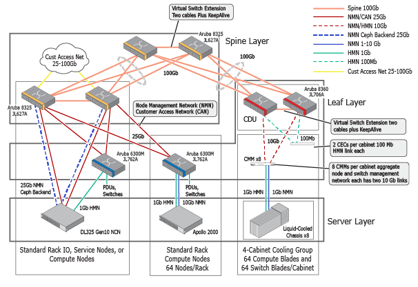

# CSM Overview

This CSM Overview describes the Cray System Management ecosystem with its hardware, software, and network. It describes how to access these services and components.

The CSM installation prepares and deploys a distributed system across a group of management nodes organized into a Kubernetes cluster which uses Ceph for utility storage. These nodes perform their function as Kubernetes master nodes, Kubernetes worker nodes, or utility storage nodes with the Ceph storage.

System services on these nodes are provided as containerized micro-services packaged for deployment via Helm charts. Kubernetes orchestrates these services and schedules them on Kubernetes worker nodes with horizontal scaling. Horizontal scaling increases or decreases the number of services' instances as demand for them varies, such as when booting many compute nodes or application nodes.

### Topics:
   1. [System Nodes and Networks](#system_nodes_and_networks)
   1. [Default IP Address Ranges](#default_ip_address_ranges)
   1. [Resilience of System Management Services](#resilience_of_system_management_services)
   1. [Access to System Management Services](#access_to_system_management_services)

## Details

## 1. System Nodes and Networks

The HPE Cray EX system has two types of nodes:

* **Compute Nodes**, where high performance computing applications are run, have hostnames in the form of
nidXXXXXX, that is, "nid" followed by six digits. These six digits will be padded with zeroes at the beginning.
All other nodes provide supporting functions to these compute nodes.
* **Non-Compute Nodes (NCNs)**, which carry out system functions and come in many types:
   * Management nodes in a Kubernetes cluster which host system services.
      * Kubernetes master nodes, with names in the form of ncn-mXXX. Every system has three or more master nodes.
      * Kubernetes worker nodes, with names in the form of ncn-wXXX. Every system has three or more worker nodes.
      * Utility Storage nodes providing Ceph storage to Kubernetes nodes, with names in the form of ncn-sXXX. Every system has three or more storage nodes.
   * Application nodes (ANs) which are not part of the Kubernetes management cluster
      * User Access Nodes (UANs), known by some as login or front-end nodes
      * Other site-defined types:
         * Gateway nodes
         * Data Mover nodes
         * Visualization nodes

The following system networks connect the devices listed:

* Networks external to the system:
   * Customer Network (Data Center)
      * ncn-m001 BMC is connected by the customer network switch to the customer management network
      * ClusterStor System Management Unit (SMU) interfaces
      * User Access Nodes (UANs)
* System networks:
   * Hardware Management Network (HMN)
      * BMCs for Admin tasks
      * Power distribution units (PDU)
      * Keyboard/video/mouse (KVM)
   * Node Management Network (NMN)
      * All NCNs and compute nodes
   * ClusterStor Management Network
      * ClusterStor controller management interfaces of all ClusterStor components (SMU, Metadata
Management Unit (MMU), and Scalable Storage Unit (SSU))
   * High-Speed Network (HSN), which connects the following devices:
      * Kubernetes worker nodes
      * UANs
      * ClusterStor controller data interfaces of all ClusterStor components (SMU, MMU, and SSU)

During initial installation, several of those networks are created with default IP address ranges. See
[Default IP Address Ranges](#default_ip_address_ranges)

The network management system (NMS) data model and REST API enable customer sites to construct their own
"networks" of nodes within the high-speed fabric, where a "network" is a collection of nodes that share a VLAN
and an IP subnet.

The low-level network management components (switch, DHCP service, ARP service) of the management nodes and
ClusterStor interfaces are configured to serve one particular network (the "supported network") on the high-speed
fabric. As part of the initial installation, the supported network is created to include all of the compute nodes,
thereby enabling those compute nodes to access the gateway, user access services, and ClusterStor devices.

A site may create other networks as well, but it is only the supported network that is served by those devices.

## 2. Default IP Address Ranges

The initial installation of the system creates default networks with default settings and with no external exposure.
These IP address default ranges ensure that no nodes in the system attempt to use the same IP address as a
Kubernetes service or pod, which would result in undefined behavior that is extremely difficult to reproduce or
debug.

The following table shows the default IP address ranges

| Network | IP Address Range |
| --- | --- |
| Kubernetes service network | 10.16.0.0/12 |
| Kubernetes pod network | 10.32.0.0/12 |
| Install Network (MTL) | 10.1.0.0/16 |
| Node Management Network (NMN) | 10.252.0.0/17 |
| High Speed Network (HSN) | 10.253.0.0/16 |
| Hardware Management Network (HMN) | 10.254.0.0/17 |
| Mountain NMN Allocate a /22 from this range per liquid cooled cabinet: * cabinet 1 * cabinet 2 * cabinet 3 * ...  | 10.100.0.0/17 Example IP address in the allocated ranges: * 10.100.0.0/22 * 10.100.4.0/22 * 10.100.8.0/22 * ... |
| Mountain HMN Allocate a /22 from this range per liquid cooled cabinet: * cabinet 1 * cabinet 2 * cabinet 3 * ... | 10.104.0.0/17 Example IP address in the allocated ranges: * 10.104.0.0/22 * 10.104.4.0/22 * 10.104.8.0/22 * ... |
| River NMN | 10.106.0.0/17 |
| River HMN | 10.107.0.0/17 |
| Load Balanced NMN | |

The above values could be modified prior to install if there is a need to ensure that there are no conflicts with
customer resources, such as LDAP or license servers. If a customer has more than one HPE Cray EX system,
these values can be safely reused across them all.
Contact customer support for this site if it is required to change the IP address range for Kubernetes services or
pods; for example, if the IP addresses within those ranges must be used for something else. **The cluster must be
fully reinstalled if either of those ranges are changed.**

There are several network values and other pieces of system information that are unique to the customer system.
   * IP addresses and the network(s) for ncn-m001 and the BMC on ncn-m001.
   * The main Customer Access Network (CAN) subnet and the two address pools mentioned below need to be
part of the main subnet.

      For more information on the CAN, see [Customer Access Network (CAN)](../operations/network/customer_access_network/Customer_Access_Network_CAN.md).

      * Subnet for the MetalLB static address pool (can-static-pool), which is used for services that need to be pinned to the same IP address, such as the system DNS service.
      * Subnet for the MetalLB dynamic address pool (can-dynamic-pool), which is used for services such as User Access Instances (UAIs) that can be reached by DNS.
   * HPE Cray EX Domain: The value of the subdomain that is used to access externally exposed services.
   For example, if the system is named TestSystem, and the site is example.com, the HPE Cray EX domain
   would be testsystem.example.com. Central DNS would need to be configured to delegate requests for
   addresses in this domain to the HPE Cray EX DNS IP address for resolution.
   * HPE Cray EX DNS IP: The IP address used for the HPE Cray EX DNS service. Central DNS delegates the
   resolution for addresses in the HPE Cray EX Domain to this server. The IP address will be in the
   can-static-pool subnet.
   * CAN gateway IP address: The IP address assigned to a specific port on the spine switch, which will act as the
   gateway between the CAN and the rest of the customer's internal networks. This address would be the lasthop
   route to the CAN network.

## 3. Resilience of System Management Services

HPE Cray EX systems are designed so that system management services (SMS) are fully resilient and that there
is no single point of failure. The design of the system allows for resiliency in the following ways:

   * Three management nodes are configured as Kubernetes master nodes. When one master goes
   down, operations (such as jobs running across compute nodes) are expected to continue.
   * At least three utility storage nodes provide persistent storage for the services running on the Kubernetes
   management nodes. When one of the utility storage nodes goes down, operations (such as jobs running
   across compute nodes) are expected to continue.
   * At least three management nodes are configured as Kubernetes worker nodes. If one of only three Kubernetes worker
   nodes were to go down, it would be much more difficult for the remaining two worker nodes to handle
   the total balance of pods. It is less significant to lose one of the worker nodes if the system has more
   than three worker nodes because there are more worker nodes able to handle the pod load.
   * The state and configuration of the Kubernetes cluster are stored in an etcd cluster distributed across the
   Kubernetes master nodes. This cluster is also backed up on an interval, and backups are pushed to the
   local cluster's Ceph Rados Gateway (S3).
   * A micro-service can run on any node that meets the requirements for that micro-service, such as appropriate
   hardware attributes, which are indicated by Kubernetes labels and taints.
   * All micro-services have shared persistent storage so that they can be restarted on any worker node in the Kubernetes
   management cluster without losing state.

Kubernetes is designed to ensure that the desired number of deployments of a micro-service are always running
on one or more worker nodes. In addition, it ensures that if one worker node becomes unresponsive, the
micro-services that were running on it are migrated to another worker node that is up and meets the requirements of those
micro-services.

For more information about resiliency topics see
[Resilience of System Management Services](../operations/resiliency/Resilience_of_System_Management_Services.md).

## 4. Access to System Management Services

The standard configuration for System Management Services (SMS) is the containerized REST micro-service
with a public API. All of the micro-services provide an HTTP interface and are collectively exposed through a
single gateway URL. The API gateway for the system is available at a well known URL based on the domain
name of the system. It acts as a single HTTPS endpoint for terminating Transport Layer Security (TLS) using the
configured certificate authority. All services and the API gateway are not dependent on any single node. This
resilient arrangement ensures that services remain available during possible underlying hardware and network
failures.

Access to individual APIs through the gateway is controlled by a policy-driven access control system. Administrators and
users must retrieve a token for authentication before attempting to access APIs through the gateway and present
a valid token with each API call. The authentication and authorization decisions are made at the gateway level
which prevent unauthorized API calls from reaching the underlying micro-services. For more detail on the process
of obtaining tokens and user management, see
[System Security and Authentication](../operations/security_and_authentication/System_Security_and_Authentication.md).

Review the API documentation in the supplied container before attempting to use the API services. This container
is generated with the release using the most current API descriptions in OpenAPI 2.0 format. Because this file serves
as both an internal definition of the API contract and the external documentation of the API function, it is the most
up-to-date reference available.

The API Gateway URL for accessing the APIs on a site-specific system is
https://api.cmn.SYSTEM-NAME.DOMAIN-NAME/apis/.

The internal URL from a local console on any of the management nodes is https://api-gw-service-nmn.local/apis.
