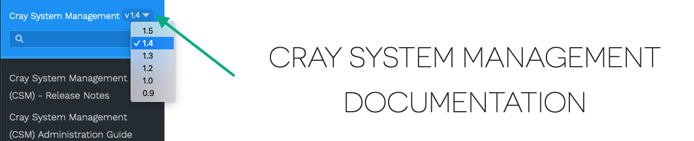
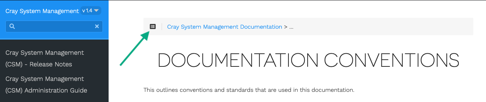
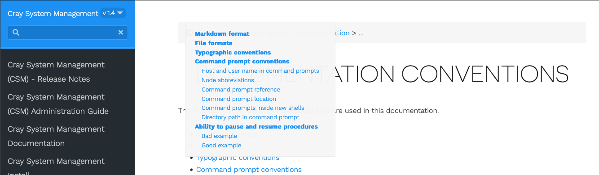
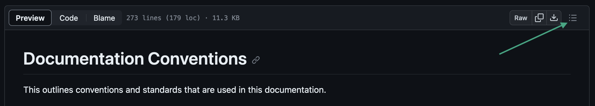
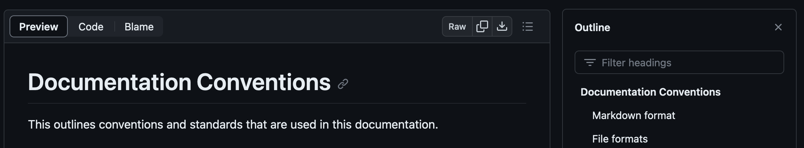

# Viewing CSM documentation

The CSM documentation can be viewed in different formats both online and offline.

## Online CSM documentation in HTML format

The CSM documentation can be viewed online in HTML format at the following URL in a browser:
[Cray System Management Documentation](https://cray-hpe.github.io/docs-csm).

Multiple versions of the documentation are available at this location, and they can be selected
using a drop-down menu in the top left corner of the browser window, as shown below:

The navigation pane on the left of the HTML page orders topics alphabetically. Navigate an
individual topic's headings by using the **Headings** icon at the top left side of the header bar at
the top the page, as shown in the following image.

Once the icon is clicked, a navigation pane opens as shown.

## Online CSM documentation in GitHub

The documentation can also be viewed online in GitHub directly by navigating to the `README.md` file
in the [`docs-csm` repository](https://github.com/Cray-HPE/docs-csm). Navigate an individual topic's
headings with a **Headings** icon at the top right side of the file header bar, as shown in the
following image.

Once the icon is clicked, a navigation pane opens as shown.

## Offline Documentation

The CSM documentation is available offline as markdown, which can be viewed with a markdown viewer
or with a text editor. The offline documentation is available in the `docs/` directory of the CSM
release distribution as well as in RPM package format. The RPM package is installed as a part of the
Ansible plays launched by the Configuration Framework Service (CFS). Its files are installed to
`/usr/share/doc/csm`.
