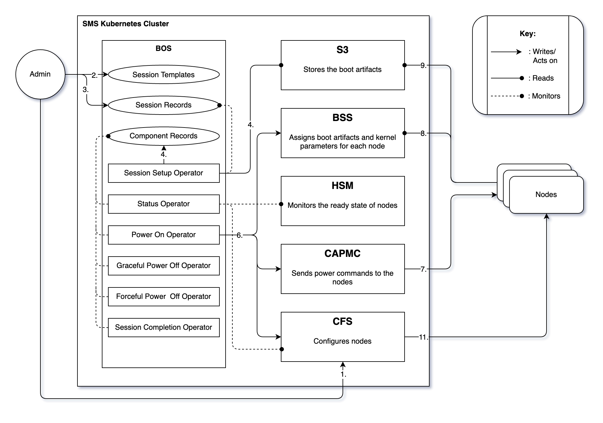
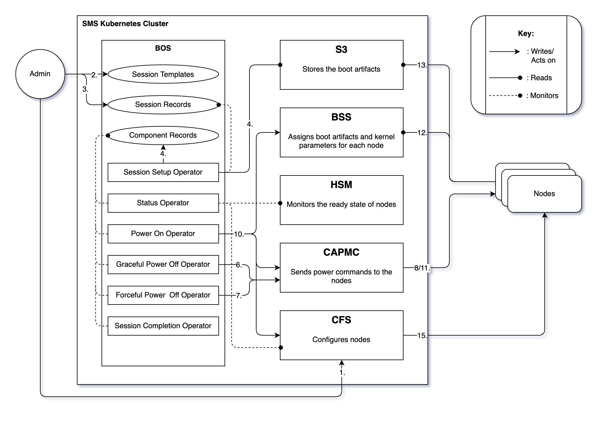
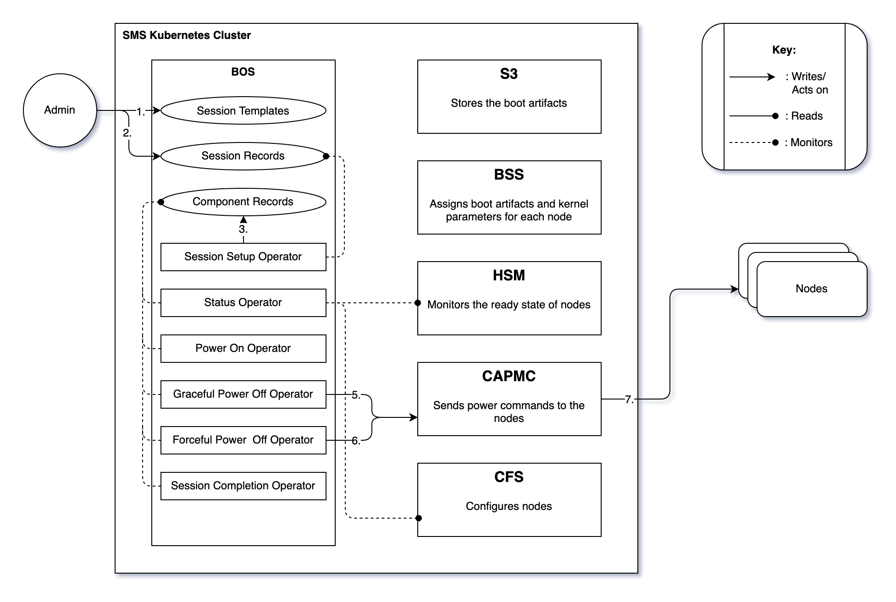
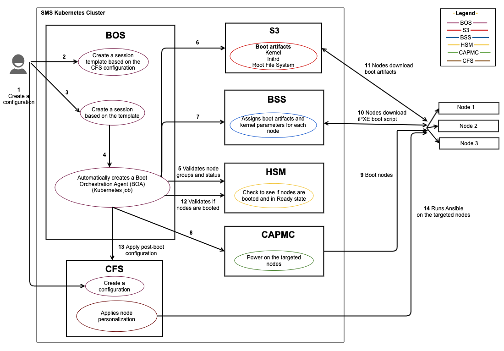
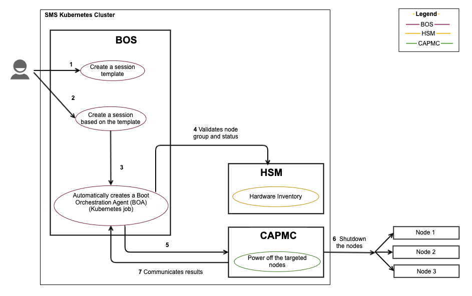

# BOS Workflows

The following workflows present a high-level overview of common Boot Orchestration Service \(BOS\) operations.
These workflows depict how services interact with each other when booting, configuring, or shutting down nodes. They also help provide a quicker and deeper understanding of how the system functions.

* [Terminology](#terminology)
* [BOS v2 workflows](#bos-v2-workflows)
  * [Boot nodes](#v2-boot-nodes)
  * [Reboot nodes](#v2-reboot-nodes)
  * [Power off nodes](#v2-power-off-nodes)
* [BOS v1 workflows](#bos-v1-workflows)
  * [Boot and configure nodes](#v1-boot-and-configure-nodes)
  * [Reconfigure nodes](#v1-reconfigure-nodes)
  * [Power off nodes](#v1-power-off-nodes)

## Terminology

The following are mentioned in the workflows:

* Boot Orchestration Service \(BOS\) is responsible for booting, configuring, and shutting down collections of nodes. The Boot Orchestration Service has the following components:
  * A BOS session template is a collection of one or more boot sets. A boot set defines a collection of nodes and the information about the boot artifacts and parameters. Session templates also include information on what CFS configuration should be applied.
  * BOS sessions provide a way to apply a template across a group of nodes and monitor the progress of those nodes as they move toward their desired state.
  * BOS Operators interact with other services to perform actions on nodes, moving them toward their desired state. BOS operators are used only for BOS v2 operations.
  * Boot Orchestration Agent \(BOA\) is automatically launched to execute the session.
  A BOA executes the given operation, and if the operation is a boot or a reboot, it also configures the nodes post-boot \(if configure is enabled\). BOA is used only for BOS v1 operations.
* Cray Advanced Platform and Monitoring Control \(CAPMC\) service provides system-level power control for nodes in the system.
CAPMC interfaces directly with the Redfish APIs to the controller infrastructure to effect power and environmental changes on the system.
* Hardware State Manager \(HSM\) tracks the state of each node and its group and role associations.
* Boot Script Service \(BSS\) stores per-node information about the iPXE boot script. Nodes consult BSS for boot artifacts \(kernel, `initrd`, image root\) and boot parameters when nodes boot or reboot.
* The Simple Storage Service \(Ceph S3\) is an artifact repository that stores boot artifacts.
* Configuration Framework Service \(CFS\) configures nodes using the configuration framework. Launches and aggregates the status from one or more Ansible instances against nodes \(node personalization\) or images \(image customization\).

## BOS v2 workflows

The following workflows are included in this section:

* [Boot nodes](#v2-boot-nodes)
* [Reboot nodes](#v2-reboot-nodes)
* [Power off nodes](#v2-power-off-nodes)

### V2 boot nodes

**Use case:** Administrator powers on and configures select compute nodes.

**BOS v2 boot flow diagram:** This labels on the diagram correspond to the workflow steps listed below. Some steps are omitted from the diagram for readability.



**Workflow overview:** The following sequence of steps occurs during this workflow.

1. **Administrator creates a configuration**

    (`ncn-mw#`) Add a configuration to CFS. See [Create a CFS Configuration](../configuration_management/Create_a_CFS_Configuration.md) for more information.

    ```bash
    cray cfs configurations update sample-config --file configuration.json --format json
    ```

    Example output:

    ```json
    {
        "lastUpdated": "2020-09-22T19:56:32Z",
        "layers": [
            {
                "cloneUrl": "https://api-gw-service-nmn.local/vcs/cray/configmanagement.git",
                "commit": "01b8083dd89c394675f3a6955914f344b90581e2",
                "playbook": "site.yaml"
            }
        ],
        "name": "sample-config"
    }
    ```

1. **Administrator creates a BOS session template**

    A session template is a collection of data specifying a group of nodes, as well as the boot artifacts and  configuration that should be applied to them. A session template can be created from a JSON structure. It returns a Session Template ID if successful.

    See [Manage a Session Template](Manage_a_Session_Template.md) for more information.

1. **Administrator creates a session**

    Create a session to perform the operation specified in the operation request parameter on the boot set defined in the session template. For this use case, Administrator creates a session with operation as Boot and specifies the session template ID.

    (`ncn-mw#`)

    ```bash
    cray bos v2 sessions create --template-name SESSIONTEMPLATE_NAME --operation Boot
    ```

1. **Session setup operator**

    The creation of a session causes the session-setup operator to set a desired state on all components listed in the session template.
    This includes pulling files from S3 to determine boot artifacts like kernel, `initrd`, and root file system. The session setup operator also enables the relevant components at this time.

1. **Status operator (powering-on)**

    The status operator will detect the enabled components and assign them a phase. This involves checking the current state of the node, including communicating with HSM to determine the current power status of the node.

    In this example of booting nodes, the first phase is `powering-on`. If queried at this point, the nodes will have a status of `power-on-pending`.
    For more on component phase and status, see [Component Status](Component_Status.md)

1. **Power-on operator**

    The power-on operator will detect nodes with a `power-on-pending` status. The power-on operator first sets the desired boot artifacts in BSS.
    If configuration is enabled for the node, the power-on operator will also call CFS to set the desired configuration and disable the node with CFS.
    The node must be disabled within CFS so that CFS does not try to configure node until it has booted.
    The power-on operator then calls CAPMC to power-on the node.
    Lastly, the power-on operator will update the state of the node in BOS, including setting the last action. If queried at this point, the nodes will have a status of `power-on-called`.

1. **CAPMC boots nodes**

    CAPMC interfaces directly with the Redfish APIs and powers on the selected nodes.

1. **BSS interacts with the nodes**

    BSS generates iPXE boot scripts based on the image content and boot parameters that have been assigned to a node. Nodes download the iPXE boot script from BSS.

1. **Nodes request boot artifacts from S3**

    Nodes download the boot artifacts. The nodes boot using the boot artifacts pulled from S3.

1. **Status operator (configuring)**

    The status operator monitors a node's power state until HSM reports that the power state is on.  
    When the power state for a node is on, the status operator will either set the phase to `configuring` if CFS configuration is required or it will clear the current phase if the node is in its final state.

1. **CFS applies configuration**

    If needed, CFS runs Ansible on the nodes and applies post-boot configuration \(also called node personalization\).

1. **Status operator (complete)**

    The status operator will continue monitoring the states for each node until CFS reports that configuration is complete.
    The status operator will clear the current phase now that the node is in its final state. The status operator will also disable components at this point.

1. **Session completion operator**

    When all nodes belonging to a session have been disabled, the session is marked complete, and its final status is saved to the database.

### V2 reboot nodes

**Use case:** Administrator reboots and configures select compute nodes.

**BOS v2 reboot flow diagram:** This labels on the diagram correspond to the workflow steps listed below. Some steps are omitted from the diagram for readability.



**Workflow overview:** The following sequence of steps occurs during this workflow.

1. **Administrator creates a configuration**

    Add a configuration to CFS. See [Create a CFS Configuration](../configuration_management/Create_a_CFS_Configuration.md) for more information.

    (`ncn-mw#`)

    ```bash
    cray cfs configurations update sample-config --file configuration.json --format json
    ```

    Example output:

    ```json
    {
        "lastUpdated": "2020-09-22T19:56:32Z",
        "layers": [
            {
                "cloneUrl": "https://api-gw-service-nmn.local/vcs/cray/configmanagement.git",
                "commit": "01b8083dd89c394675f3a6955914f344b90581e2",
                "playbook": "site.yaml"
            }
        ],
        "name": "sample-config"
    }
    ```

1. **Administrator creates a BOS session template**

    A session template is a collection of data specifying a group of nodes, as well as the boot artifacts and  configuration that should be applied to them. A session template can be created from a JSON structure. It returns a Session Template ID if successful.

    See [Manage a Session Template](Manage_a_Session_Template.md) for more information.

1. **Administrator creates a session**

    Create a session to perform the operation specified in the operation request parameter on the boot set defined in the session template. For this use case, the administrator creates a session with operation as Boot and specifies the session template ID.

    (`ncn-mw#`)

    ```bash
    cray bos v2 sessions create --template-name SESSIONTEMPLATE_NAME --operation Reboot
    ```

1. **Session setup operator**

    The creation of a session causes the session-setup operator to set a desired state on all components listed in the session template.
    This includes pulling files from S3 to determine boot artifacts like kernel, `initrd`, and root file system. The session setup operator also enables the relevant components at this time.

1. **Status operator (powering-off)**

    The status operator will detect the enabled components and assign them a phase. This involves checking the current state of the node, including communicating with HSM to determine the current power status of the node.

    In this example of rebooting nodes, the first phase is `powering-off`. If queried at this point, the nodes will have a status of `power-off-pending`.
    For more on component phase and status, see [Component Status](Component_Status.md)

1. **Graceful-power-off operator**

    The power-off operator will detect nodes with a `power-off-pending` status, calls CAPMC to power-off the node.
    Then, the power-off operator will update the state of the node in BOS, including setting the last action. If queried at this point, the nodes will have a status of `power-off-gracefully-called`.

1. **Forceful-power-off operator**

    If powering-off is taking too long, the forceful-power-off will take over. It also calls CAPMC to power-off the node, but with the addition of the forceful flag.
    Then, the power-off operator will update the state of the node in BOS, including setting the last action. If queried at this point, the nodes will have a status of `power-off-forcefully-called`.

1. **CAPMC powers off nodes**

    CAPMC interfaces directly with the Redfish APIs and powers off the selected nodes.

1. **Status operator (powering-on)**

    The status operator monitors a node's power state until HSM reports that the power state is off.
    When the power state for a node is off, the status operator will set the phase to `powering-on`. If queried at this point, the nodes will have a status of `power-on-pending`.

1. **Power-on operator**

    The power-on operator will detect nodes with a `power-on-pending` status. The power-on operator first sets the desired boot artifacts in BSS.
    If configuration is enabled for the node, the power-on operator will also call CFS to set the desired configuration and disable the node with CFS.
    The node must be disabled within CFS so that CFS does not try to configure node until it has booted.
    The power-on operator then calls CAPMC to power-on the node.
    Lastly, the power-on operator will update the state of the node in BOS, including setting the last action. If queried at this point, the nodes will have a status of `power-on-called`.

1. **CAPMC boots nodes**

    CAPMC interfaces directly with the Redfish APIs and powers on the selected nodes.

1. **BSS interacts with the nodes**

    BSS generates iPXE boot scripts based on the image content and boot parameters that have been assigned to a node. Nodes download the iPXE boot script from BSS.

1. **Nodes request boot artifacts from S3**

    Nodes download the boot artifacts. The nodes boot using the boot artifacts pulled from S3.

1. **Status operator (configuring)**

    The status operator monitors a node's power state until HSM reports that the power state is on.
    When the power state for a node is on, the status operator will either set the phase to `configuring` if CFS configuration is required or it will clear the current phase if the node is in its final state.

1. **CFS applies configuration**

    If needed, CFS runs Ansible on the nodes and applies post-boot configuration \(also called node personalization\).

1. **Status operator (complete)**

    The status operator will continue monitoring the states for each node until CFS reports that configuration is complete.
    The status operator will clear the current phase now that the node is in its final state. The status operator will also disable components at this point.

1. **Session completion operator**

    When all nodes belonging to a session have been disabled, the session is marked complete, and its final status is saved to the database.

### V2 power off nodes

**Use case:** Administrator powers off selected compute nodes.

**BOS v2 Shutdown flow diagram:** This labels on the diagram correspond to the workflow steps listed below. Some steps are omitted from the diagram for readability.



**Workflow overview:** The following sequence of steps occurs during this workflow.

1. **Administrator creates a BOS session template**

    A session template is a collection of data specifying a group of nodes, as well as the boot artifacts and configuration that should be applied to them. A session template can be created from a JSON structure. It returns a Session Template ID if successful.

    See [Manage a Session Template](Manage_a_Session_Template.md) for more information.

1. **Administrator creates a session**

    Create a session to perform the operation specified in the operation request parameter on the boot set defined in the session template. For this use case, the administrator creates a session with operation as Boot and specifies the session template ID.

    (`ncn-mw#`)

    ```bash
    cray bos v2 sessions create --template-name SESSIONTEMPLATE_NAME --operation Reboot
    ```

1. **Session setup operator**

    The creation of a session causes the session-setup operator to set a desired state on all components listed in the session template.
    For a power-off, this means clearing the desired state for each component.
    The session setup operator also enables the relevant components at this time.

1. **Status operator (powering-off)**

    The status operator will detect the enabled components and assign them a phase. This involves checking the current state of the node, including communicating with HSM to determine the current power status of the node.

    In this example of booting nodes, the first phase is `powering-off`. If queried at this point, the nodes will have a status of `power-off-pending`.
    For more on component phase and status, see [Component Status](Component_Status.md)

1. **Graceful-power-off operator**

    The power-off operator will detect nodes with a `power-off-pending` status, calls CAPMC to power-off the node.
    Then, the power-off operator will update the state of the node in BOS, including setting the last action. If queried at this point, the nodes will have a status of `power-off-gracefully-called`.

1. **Forceful-power-off operator**

    If powering-off is taking too long, the forceful-power-off will take over. It also calls CAPMC to power-off the node, but with the addition of the forceful flag.
    Then, the power-off operator will update the state of the node in BOS, including setting the last action. If queried at this point, the nodes will have a status of `power-off-forcefully-called`.

1. **CAPMC powers off nodes**

    CAPMC interfaces directly with the Redfish APIs and powers off the selected nodes.

1. **Status operator (complete)**

    The status operator will continue monitoring the states for each node until CFS reports that configuration is complete.
    The status operator will clear the current phase now that the node is in its final state. The status operator will also disable components at this point.

1. **Session completion operator**

    When all nodes belonging to a session have been disabled, the session is marked complete, and its final status is saved to the database.
  
## BOS v1 workflows

The following workflows are included in this section:

* [Boot and configure nodes](#v1-boot-and-configure-nodes)
* [Reconfigure nodes](#v1-reconfigure-nodes)
* [Power off nodes](#v1-power-off-nodes)

### V1 boot and configure nodes

**Use case:** Administrator powers on and configures select compute nodes.

**Components:** This workflow is based on the interaction of the BOS with other services during the boot process:



**Workflow overview:** The following sequence of steps occurs during this workflow.

1. **Administrator creates a configuration**

    Add a configuration to CFS. See [Create a CFS Configuration](../configuration_management/Create_a_CFS_Configuration.md) for more information.

    (`ncn-mw#`)

    ```bash
    cray cfs configurations update sample-config --file configuration.json --format json
    ```

    Example output:

    ```json
    {
        "lastUpdated": "2020-09-22T19:56:32Z",
        "layers": [
            {
                "cloneUrl": "https://api-gw-service-nmn.local/vcs/cray/configmanagement.git",
                "commit": "01b8083dd89c394675f3a6955914f344b90581e2",
                "playbook": "site.yaml"
            }
        ],
        "name": "sample-config"
    }
    ```

1. **Administrator creates a BOS session template**

    A session template is a collection of data specifying a group of nodes, as well as the boot artifacts and configuration that should be applied to them. A session template can be created from a JSON structure. It returns a Session Template ID if successful.

    See [Manage a Session Template](Manage_a_Session_Template.md) for more information.

1. **Administrator creates a session**

    Create a session to perform the operation specified in the operation request parameter on the boot set defined in the session template.
    For this use case, the administrator creates a session with operation as Boot and specifies the session template ID. The set of allowed operations are:

    * Boot – Boot nodes that are powered off
    * Configure – Reconfigure the nodes using the Configuration Framework Service \(CFS\)
    * Reboot – Gracefully power down nodes that are on and then power them back up
    * Shutdown – Gracefully power down nodes that are on

    (`ncn-mw#`)

    ```bash
    cray bos v1 session create --template-uuid SESSIONTEMPLATE_NAME --operation Boot
    ```

1. **Launch BOA**

    The creation of a session results in the creation of a Kubernetes BOA job to complete the operation. BOA coordinates with other services to complete the requested operation.

1. **BOA to HSM**

    BOA coordinates with HSM to validate node group and node status.

1. **BOA to S3**

    BOA coordinates with S3 to verify boot artifacts like kernel, `initrd`, and root file system.

1. **BOA to BSS**

    BOA updates BSS with boot artifacts and kernel parameters for each node.

1. **BOA to CAPMC**

    BOA coordinates with CAPMC to power-on the nodes.

1. **CAPMC boots nodes**

    CAPMC interfaces directly with the Redfish APIs and powers on the selected nodes.

1. **BSS interacts with the nodes**

    BSS generates iPXE boot scripts based on the image content and boot parameters that have been assigned to a node. Nodes download the iPXE boot script from BSS.

1. **Nodes request boot artifacts from S3**

    Nodes download the boot artifacts from S3. The nodes boot using these artifacts.

1. **BOA to HSM**

    BOA waits for the nodes to boot up and be accessible via SSH. This can take up to 30 minutes. BOA coordinates with HSM to ensures that nodes are booted and Ansible can SSH to them.

1. **BOA to CFS**

    BOA directs CFS to apply post-boot configuration.

1. **CFS applies configuration**

    CFS runs Ansible on the nodes and applies post-boot configuration \(also called node personalization\). CFS then communicates the results back to BOA.

### V1 reconfigure nodes

**Use case:** Administrator reconfigures compute nodes that are already booted and configured.

**Components:** This workflow is based on the interaction of the BOS with other services during the reconfiguration process.


**Workflow overview:** The following sequence of steps occurs during this workflow.

1. **Administrator creates a BOS session template**

    A session template is a collection of data specifying a group of nodes, as well as the boot artifacts and configuration that should be applied to them. A session template can be created from a JSON structure. It returns a Session Template ID if successful.

    See [Manage a Session Template](Manage_a_Session_Template.md) for more information.

1. **Administrator creates a session**

    Create a session to perform the operation specified in the operation request parameter on the boot set defined in the session template.
    For this use case, the administrator creates a session with operation as Boot and specifies the session template ID. The set of allowed operations are:

    * Boot – Boot nodes that are powered off
    * Configure – Reconfigure the nodes using the Configuration Framework Service \(CFS\)
    * Reboot – Gracefully power down nodes that are on and then power them back up
    * Shutdown – Gracefully power down nodes that are on

    (`ncn-mw#`)

    ```bash
    cray bos v1 session create --template-uuid SESSIONTEMPLATE_NAME --operation Configure
    ```

1. **Launch BOA**

    The creation of a session results in the creation of a Kubernetes BOA job to complete the operation. BOA coordinates with the underlying subsystem to complete the requested operation.

1. **BOA to HSM**

    BOA coordinates with HSM to validate node group and node status.

1. **BOA to CFS**

    BOA directs CFS to apply post-boot configuration.

1. **CFS applies configuration**

    CFS runs Ansible on the nodes and applies post-boot configuration \(also called node personalization\).

1. **CFS to BOA**

    CFS then communicates the results back to BOA.

### V1 power off nodes

**Use cases:** Administrator powers off selected compute nodes.

**Components:** This workflow is based on the interaction of the Boot Orchestration Service \(BOS\) with other services during the node shutdown process:



**Workflow overview:** The following sequence of steps occurs during this workflow.

1. **Administrator creates a BOS session template**

    A session template is a collection of data specifying a group of nodes, as well as the boot artifacts and configuration that should be applied to them. A session template can be created from a JSON structure. It returns a Session Template ID if successful.

    See [Manage a Session Template](Manage_a_Session_Template.md) for more information.

1. **Administrator creates a session**

    Create a session to perform the operation specified in the operation request parameter on the boot set defined in the session template.
    For this use case, the administrator creates a session with operation as Boot and specifies the session template ID. The set of allowed operations are:

    * Boot – Boot nodes that are powered off
    * Configure – Reconfigure the nodes using the Configuration Framework Service \(CFS\)
    * Reboot – Gracefully power down nodes that are on and then power them back up
    * Shutdown – Gracefully power down nodes that are on

    (`ncn-mw#`)

    ```bash
    cray bos v1 session create --template-uuid SESSIONTEMPLATE_NAME --operation Shutdown
    ```

1. **Launch BOA**

    The creation of a session results in the creation of a Kubernetes BOA job to complete the operation. BOA coordinates with the underlying subsystem to complete the requested operation.

1. **BOA to HSM**

    BOA coordinates with HSM to validate node group and node status.

1. **BOA to CAPMC**

    BOA directs CAPMC to power off the nodes.

1. **CAPMC to the nodes**

    CAPMC interfaces directly with the Redfish APIs and powers off the selected nodes.

1. **CAPMC to BOA**

    CAPMC communicates the results back to BOA.
