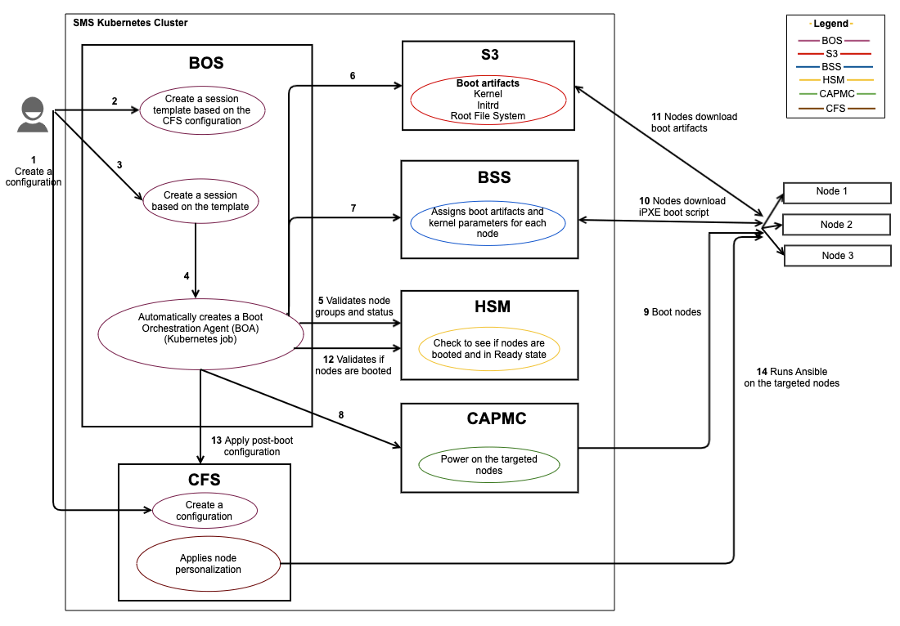
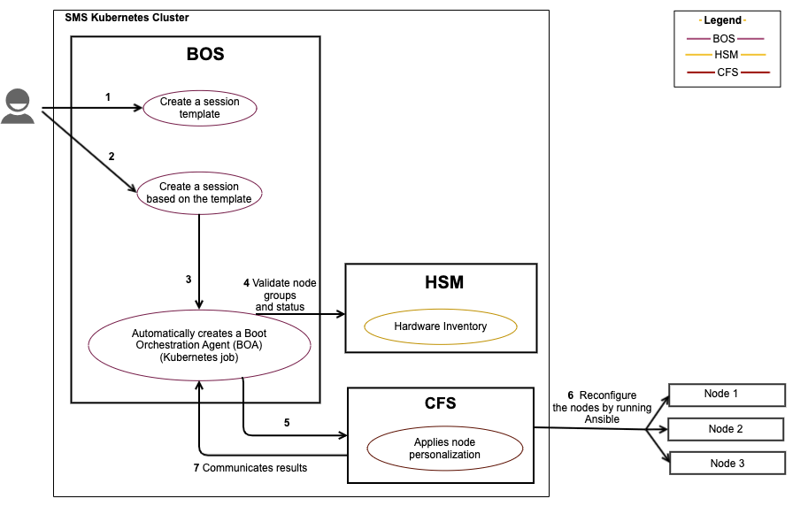
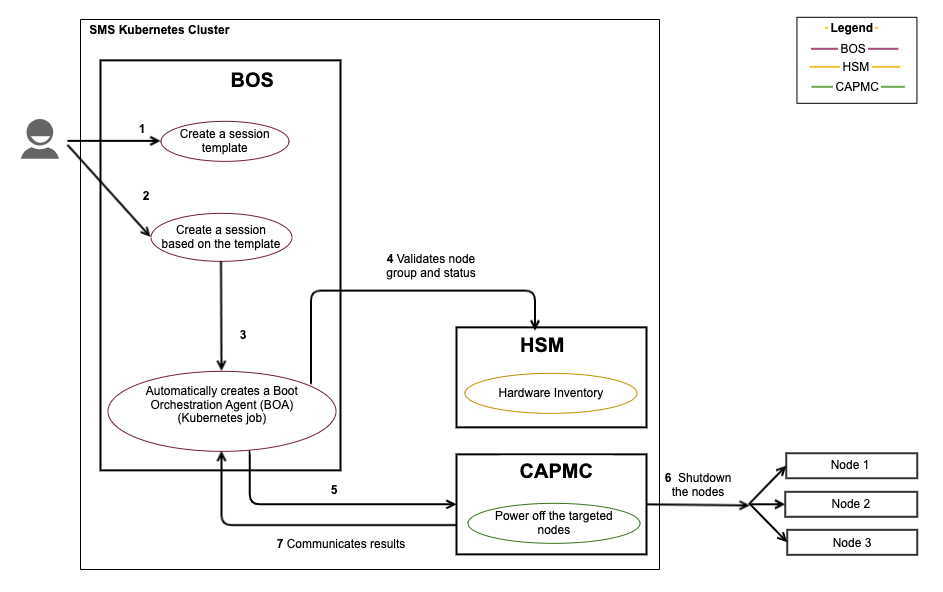

# BOS Workflows

The following workflows present a high-level overview of common Boot Orchestration Service \(BOS\) operations.
These workflows depict how services interact with each other when booting, configuring, or shutting down nodes. They also help provide a quicker and deeper understanding of how the system functions.

* [Terminology](#terminology)
* [Workflows](#workflows)
  * [Boot and configure nodes](#boot-and-configure-nodes)
  * [Reconfigure nodes](#reconfigure-nodes)
  * [Power off nodes](#power-off-nodes)

## Terminology

The following are mentioned in the workflows:

* Boot Orchestration Service \(BOS\) is responsible for booting, configuring, and shutting down collections of nodes. The Boot Orchestration Service has the following components:
  * A BOS session template is a collection of one or more boot sets. A boot set defines a collection of nodes and the information about the boot artifacts and parameters. Session templates also include information on what CFS configuration should be applied.
  * BOS sessions provide a way to apply a template across a group of nodes and monitor the progress of those nodes as they move toward their desired state.
  * Boot Orchestration Agent \(BOA\) is automatically launched to execute the session.
  A BOA executes the given operation, and if the operation is a boot or a reboot, it also configures the nodes post-boot \(if configure is enabled\). BOA is used only for BOS v1 operations.
* Cray Advanced Platform and Monitoring Control \(CAPMC\) service provides system-level power control for nodes in the system.
CAPMC interfaces directly with the Redfish APIs to the controller infrastructure to effect power and environmental changes on the system.
* Hardware State Manager \(HSM\) tracks the state of each node and its group and role associations.
* Boot Script Service \(BSS\) stores per-node information about the iPXE boot script. Nodes consult BSS for boot artifacts \(kernel, `initrd`, image root\) and boot parameters when nodes boot or reboot.
* The Simple Storage Service \(Ceph S3\) is an artifact repository that stores boot artifacts.
* Configuration Framework Service \(CFS\) configures nodes using the configuration framework. Launches and aggregates the status from one or more Ansible instances against nodes \(node personalization\) or images \(image customization\).

## Workflows

The set of allowed operations for a session are:

* Boot – Boot nodes that are powered off.
* Configure – Reconfigure the nodes using the Configuration Framework Service \(CFS\).
* Reboot – Gracefully power down nodes that are on and then power them back up.
* Shutdown – Gracefully power down nodes that are on.

The following workflows are included in this document:

* [Boot and configure nodes](#boot-and-configure-nodes)
* [Reconfigure nodes](#reconfigure-nodes)
* [Power off nodes](#power-off-nodes)

<a name="boot-and-configure"></a>

### Boot and configure nodes

**Use case:** Administrator powers on and configures select compute nodes.

**Components:** This workflow is based on the interaction of the BOS with other services during the boot process:



**Workflow overview:** The following sequence of steps occurs during this workflow.

1. Administrator creates a configuration.

    Add a configuration to CFS.

    ```bash
    ncn-mw# cray cfs configurations update sample-config --file configuration.json --format json
    ```

    Example output:

    ```json
    {
        "lastUpdated": "2020-09-22T19:56:32Z",
        "layers": [
            {
                "cloneUrl": "https://api-gw-service-nmn.local/vcs/cray/configmanagement.git",
                "commit": "01b8083dd89c394675f3a6955914f344b90581e2",
                "playbook": "site.yaml"
            }
        ],
        "name": "sample-config"
    }
    ```

1. Administrator creates a session template.

    A session template is a collection of metadata for a group of nodes and their desired configuration. A session template can be created from a JSON structure. It returns a session template ID if successful.

    See [Manage a Session Template](Manage_a_Session_Template.md) for more information.

1. Administrator creates a session.

    Create a session to perform the operation specified in the operation request parameter on the boot set defined in the session template. For this use case, the administrator creates a session with
    operation as Boot and specifies the session template ID.

    ```bash
    ncn-mw# cray bos session create --template-uuid SESSIONTEMPLATE_NAME --operation Boot
    ```

1. Launch BOA.

    The creation of a session results in the creation of a Kubernetes BOA job to complete the operation. BOA coordinates with other services to complete the requested operation.

1. BOA to HSM.

    BOA coordinates with HSM to validate node group and node status.

1. BOA to S3.

    BOA coordinates with S3 to verify boot artifacts like kernel, `initrd`, and root file system.

1. BOA to BSS.

    BOA updates BSS with boot artifacts and kernel parameters for each node.

1. BOA to CAPMC.

    BOA coordinates with CAPMC to power-on the nodes.

1. CAPMC boots nodes.

    CAPMC interfaces directly with the Redfish APIs and powers on the selected nodes.

1. BSS interacts with the nodes.

    BSS generates iPXE boot scripts based on the image content and boot parameters that have been assigned to a node. Nodes download the iPXE boot script from BSS.

1. S3 interacts with the nodes.

    Nodes download the boot artifacts. The nodes boot using the boot artifacts pulled from S3.

1. BOA to HSM.

    BOA waits for the nodes to boot up and be accessible via SSH. This can take up to 30 minutes. BOA coordinates with HSM to ensures that nodes are booted and Ansible can SSH to them.

1. BOA to CFS.

    BOA directs CFS to apply post-boot configuration.

1. CFS applies configuration.

    CFS runs Ansible on the nodes and applies post-boot configuration \(also called node personalization\). CFS then communicates the results back to BOA.

<a name="reconfigure"></a>

### Reconfigure nodes

**Use case:** Administrator reconfigures compute nodes that are already booted and configured.

**Components:** This workflow is based on the interaction of the BOS with other services during the reconfiguration process.



**Workflow overview:** The following sequence of steps occurs during this workflow.

1. Administrator creates a session template.

    A session template is a collection of metadata for a group of nodes and their desired configuration. A session template can be created from a JSON structure. It returns a session template ID if successful.

    See [Manage a Session Template](Manage_a_Session_Template.md) for more information.

1. Administrator creates a session.

    Create a session to perform the operation specified in the operation request parameter on the boot set defined in the session template. For this use case, the administrator creates a session with
    operation as Configure and specifies the session template ID.

    ```bash
    ncn-mw# cray bos session create --template-uuid SESSIONTEMPLATE_NAME --operation Configure
    ```

1. Launch BOA.

    The creation of a session results in the creation of a Kubernetes BOA job to complete the operation. BOA coordinates with the underlying subsystem to complete the requested operation.

1. BOA to HSM.

    BOA coordinates with HSM to validate node group and node status.

1. BOA to CFS.

    BOA directs CFS to apply post-boot configuration.

1. CFS applies configuration.

    CFS runs Ansible on the nodes and applies post-boot configuration \(also called node personalization\).

1. CFS to BOA.

    CFS then communicates the results back to BOA.

<a name="power-off"></a>

### Power off nodes

**Use cases:** Administrator powers off selected compute nodes.

**Components:** This workflow is based on the interaction of the Boot Orchestration Service \(BOS\) with other services during the node shutdown process:



**Workflow overview:** The following sequence of steps occurs during this workflow.

1. Administrator creates a session template.

    A session template is a collection of metadata for a group of nodes and their desired configuration. A session template can be created from a JSON structure. It returns a session template ID if successful.

    See [Manage a Session Template](Manage_a_Session_Template.md) for more information.

1. Administrator creates a session.

    Create a session to perform the operation specified in the operation request parameter on the boot set defined in the session template. For this use case, the administrator creates a
    session with operation as Shutdown and specifies the session template ID.

    ```bash
    ncn-mw# cray bos session create --template-uuid SESSIONTEMPLATE_NAME --operation Shutdown
    ```

1. Launch BOA.

    The creation of a session results in the creation of a Kubernetes BOA job to complete the operation. BOA coordinates with the underlying subsystem to complete the requested operation.

1. BOA to HSM.

    BOA coordinates with HSM to validate node group and node status.

1. BOA to CAPMC.

    BOA directs CAPMC to power off the nodes.

1. CAPMC to the nodes.

    CAPMC interfaces directly with the Redfish APIs and powers off the selected nodes.

1. CAPMC to BOA.

    CAPMC communicates the results back to BOA.
