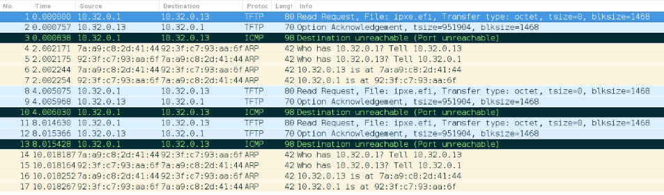

# Compute Node Boot Issue Symptom: Node Console or Logs Indicate that the Server Response has Timed Out

If the TFTP request is able to access the TFTP service pod but is unable to find its way back to the node, it may be
because the kernel is not tracking established TFTP connections.

- [Symptoms](#symptoms)
- [Problem detection](#problem-detection)
- [Resolution](#resolution)

## Symptoms

The following image is `tcpdump` data from within the TFTP pod. It shows what happens when the TFTP request cannot
find a route back to the node that sent the request. The node IP address is `10.32.0.1`, which is the IP address of the
Kubernetes `weave` network. It is forwarding the node's TFTP to this pod. The server IP address is `10.32.0.13`.



- Line 1: The read request from the node arrives.
- Line 2: The TFTP server attempts to acknowledge the read request.
- Line 3: ICMP complains about an unreachable destination/port.
- Lines 4-6: The TFTP server cannot locate the route to the node. It issues an ARP request for `10.32.0.1`, but that
  does not have any effect.
- Lines 8 and 11: After waiting, the client resends a read request and eventually times out. This repeated request
  causes a repeat of lines 2-6 as seen in lines 9, 12, and 14-17.

## Problem detection

Check if the `nf_nat_tftp` kernel module has been loaded. The kernel module is loaded on all ingress points in the
Kubernetes cluster, so there will likely be no missing kernel modules.

## Resolution

1. Load `nf_nat_tftp`, if it has not been loaded already.

    ```bash
    ncn-m001# modprobe nf_nat_tftp
    ```

1. Restart the `cray-tftp` service.

    ```bash
    ncn-m001# kubectl delete pod cray-tftp-885cc65c4-fk8bm
    ```

    Example output:

    ```text
    pod "cray-tftp-885cc65c4-fk8bm" deleted
    ```
