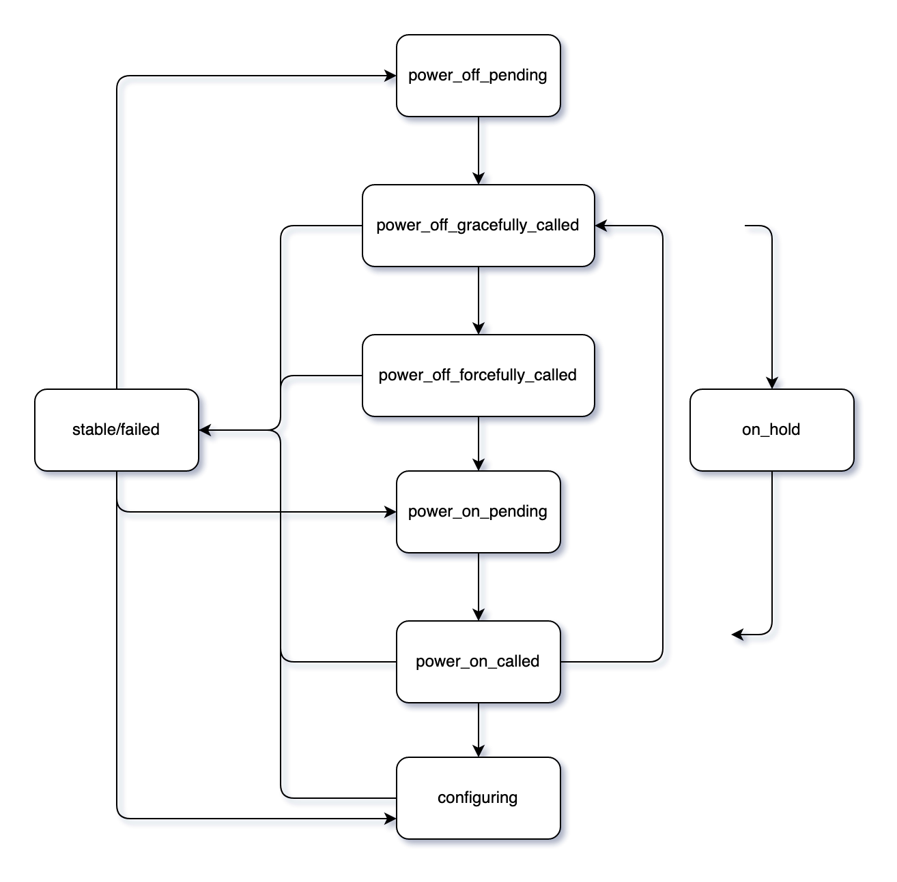

# Component Status

> **`NOTE`** This section is for Boot Orchestration Service \(BOS\) v2 only.

For each component, BOS tracks information on what actions are expected to be happening (the `phase`) and what actions have recently happened (the `last_action`).
This information is then aggregated into an overall `status`.

* [Phases](#phases)
* [Last actions](#last-actions)
* [Status](#status)
* [Status transitions](#status-transitions)

## Phases

A component's phase is the high level part of the boot process that the component is currently on.
This value is automatically monitored and set by the `status` operator based on the components desired and current state in BOS, the components power state as reported by HSM, and the component's configuration status as reported by CFS.
Session status is also aggregated by phase in order to show a high level view of where components are at in the boot process.
For more on session status see [BOS v2 session status](View_the_Status_of_a_BOS_Session.md#bos-v2-session-status).

The possible values for this field are:

* `powering_on`

    A component will be in the `powering_on` phase whenever its current power state is `off`, and it has a desired state.

* `powering_off`

    A component will be in the `powering_off` phase whenever its current power state is `on`, and it has a desired state that does not match the current state (a reboot operation) or when the desired state is empty (a shutdown operation).

* `configuring`

    A component will be in the `configuring` phase whenever its current power state is `on`, its desired and current state match,
    and when CFS does not yet report that configuration is complete for the component with the desired configuration set in BOS.

* None

    An empty phase indicates that the component is in a stable state and that BOS is not currently taking actions on the component.

## Last actions

The `last_action` field stores information on the last action that was taken by BOS for this component. This field is automatically updated by the operators as they take actions.
For more information on the BOS operators see [BOS operators](BOS_Services.md#bos-operators).

The possible values for this field are:

* `powering_on`

    This indicates that the `power-on` operator called CAPMC to power-on the component.

* `powering_off_gracefully`

    This indicates that the `power-off-graceful` operator called CAPMC to gracefully power-off the component.

* `powering_off_forcefully`

    This indicates that the `power-off-forceful` operator called CAPMC to gracefully power-off the component.

* `apply_staged`

    This indicates that the `applystaged` endpoint was called for this component and that the staged state was moved to the desired state.
    This is the only action that is reported by the API rather than an operator.

* `session_setup`

    This indicates that the `session-setup` operator set this component's desired state based on a new session.

* `newly_discovered`

    This indicates that the component was recently added to the BOS database by the `discovery` operator.

## Status

The `status` field is aggregated from information stored in the `phase`, `last_action` and an optional `status_override` field,
which is used to store additional information when BOS would not normally have internal access to the data it needs to determine the status.
`status` provides detailed information on where the component is in the boot process, and is used by the BOS operators to determine which components they should be acting on.

The possible values for this field are:

* `power_on_pending`

    This indicates that the component needs to be powered on, but CAPMC has not yet been called.
    This status will be set when the `phase` is `powering_on` and the `last_action` is not `powering_on`.
    The `power-on` operator monitors for components in this state to find components that need to be acted on.

* `power_on_called`

    This indicates that CAPMC has been called to power on the component, but HSM does not yet report that the component is on.
    This status will be set when the `phase` is `powering_on` and the `last_action` is `powering_on`
    The component will remain in this state until HSM reports the component is `on` and `ready`.
    If the `max_power_on_wait_time` expires while waiting for the component to power on, the status reverts to `power_on_pending`.
    If the `max_boot_wait_time` expires while waiting for the component to become ready, the status reverts to `power_off_pending`, and the component is rebooted.
    See [Options](Options.md) for more on `max_power_on_wait_time` and `max_boot_wait_time`.

* `power_off_pending`

    This indicates that the component needs to be powered off, but CAPMC has not yet been called.
    This status will be set when the `phase` is `powering_off` and the `last_action` is not `powering_off_gracefully` or `powering_off_forcefully`.
    The `power-off-graceful` operator monitors for components in this state to find components that need to be acted on.

* `power_off_gracefully_called`

    This indicates that CAPMC has been called to power off the component, but HSM does not yet report that the component is off.
    This status will be set when the `phase` is `powering_off` and the `last_action` is `powering_off_gracefully`
    The component will remain in this state until either HSM reports the power state for the component is `off` and the `status` operator updates the `phase`,
    or until the `max_power_off_wait_time` has expired and the `power-off-forceful` operator takes over.
    See [Options](Options.md) for more on `max_power_off_wait_time`.

* `power_off_forcefully_called`

        This indicates that CAPMC has been called to power off the component, but HSM does not yet report that the component is off.
    This status will be set when the `phase` is `powering_off` and the `last_action` is `powering_off_gracefully`
    The component will remain in this state until either HSM reports the power state for the component is `off` and the `status` operator updates the `phase`,
    or until the `max_power_off_wait_time` has expired and the `power-off-forceful` operator takes over.
    See [Options](Options.md) for more on `max_power_off_wait_time`.

* `configuring`

    This indicates that the component is booted with the correct boot artifacts, but that CFS is reporting the component still has pending configuration.
    This status will be set when the `phase` is `configuring` and either the desired configuration in CFS does not match what BOS believes the configuration should be, or configuration for the component is not yet complete.

* `stable`

    This indicates that the component is in the desired state.  This status will be set when the `phase` is not set.

* `failed`

    This indicates that the component is not yet in the desired state, but that BOS will not take further actions on the component.  
    This can be due to too many attempts of a power action, or due to CFS reporting failed configuration.

* `on_hold`

    This indicates that something has changed about the components state, such as re-enabling a component in BOS, and that BOS needs to gather information from other services and re-evaluate the state of the node.
    This is done so that none of the BOS operators take action against a node based on stale information in the BOS database.

## Status transitions

The possible transitions between statuses are show below.
As actions are being taken against a node, it flows through the power action and configuration statuses, from pending to called and then on to the next action's status.
Components will start and end with in the `stable` state or `failed` state, and when something changes to the component it will re-enter the flow at one of the `pending` statuses.

`on_hold` is a special case, and any status can flow into or out of the status, depending on what actions cause BOS to re-evaluate, and where it finds the component once the evaluation is complete.
However, typically `on_hold` will be the result of a `stable` of `failed` component being re-enabled, and will flow into on of the `pending` statuses.

For more information on the BOS operators that act on components to move them from state to state, see [BOS operators](BOS_Services.md#bos-operators)
