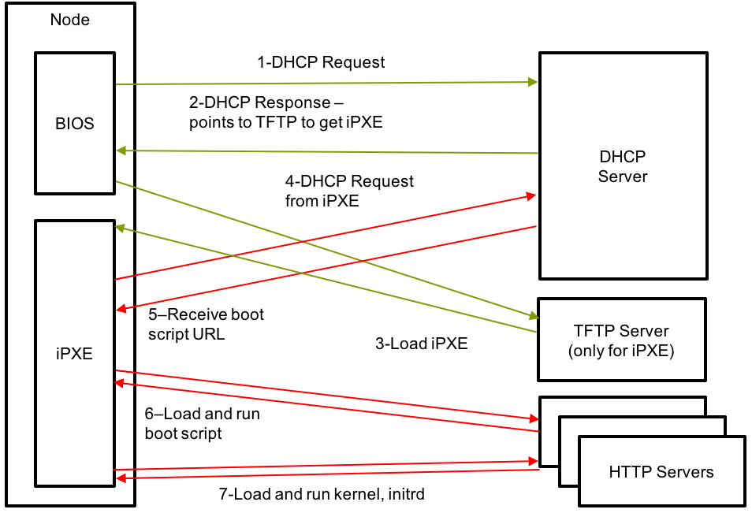

# Compute Node Boot Sequence

Provides an overview of the compute node boot process and touches upon the fact that issues can be encountered during this process.

The following is a high-level overview of the boot sequence for compute nodes:

1. The compute node is powered on.
1. The BIOS issues a DHCP discover request.
1. DHCP responds with the following:
    1. `next-server`, which is the IP address of the TFTP server.
    1. The name of the file to download from the TFTP server.
1. The node's PXE sends a TFTP request to the TFTP server.
1. If the TFTP server has the requested file, it sends it to the node's PXE. In this case, the file name is `ipxe.efi`,
   which is a Cray-crafted iPXE binary that points at the Boot Script Service \(BSS\). The BSS will then serve up
   another iPXE boot script.
1. The `ipxe.efi` file downloads another iPXE boot script from the BSS.

    This script provides information for downloading:

    - The location of the kernel.
    - The location of the `initrd`.
    - A string containing the kernel parameters.

1. The node attempts to download the kernel and `initrd` boot artifacts. If successful, it will boot using these and the kernel parameters.
   Otherwise, it will retry to download these boot artifacts indefinitely.

There may be times when certain issues may be encountered during the compute node boot up process. In order to resolve these issues,
it is important to understand the underlying cause, symptoms, and stage at which the issue has occurred. The exact process and tools
required to resolve the issue depend on this information.
