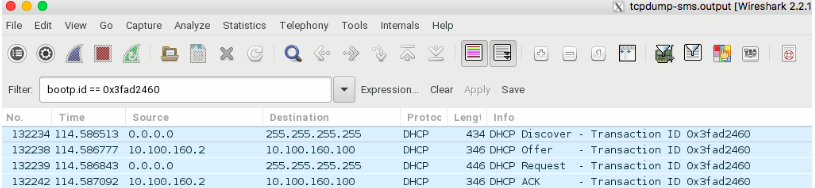

# Healthy Compute Node Boot Process

In order to investigate node boot-related issues, it is important to understand the flow of a healthy boot process and the associated components.
This section outlines the normal flow of components that play a role in booting compute nodes, including DHCP, BSS, and TPTP.

## DHCP

A healthy DHCP exchange between server and client looks like the following:

| Traffic       | Description                                                                                                  | Sender |
|---------------|--------------------------------------------------------------------------------------------------------------|--------|
| DHCP Discover | A broadcast request from the client requesting an IP address. The request contains the client's MAC address. | Client |
| DHCP Offer    | The server offers an IP address to the client.                                                               | Server |
| DHCP Request  | After testing the IP address to see that it is not in use, the client requests the proffered IP address.     | Client |
| DHCP ACK      | The server acknowledges that the client owns the lease on the IP address.                                    | Server |

The following figure shows what a healthy DHCP discover process looks like via Wireshark, which is a packet analyzer:



The DHCP client uses port 68, whereas the DHCP server uses port 67. Unlike most Kubernetes pods, the DHCP pod is located on the host network.

## TFTP

A healthy TFTP exchange between server and client looks like the following.

| Traffic                                                                           | Description                                                                               | Sender |
|-----------------------------------------------------------------------------------|-------------------------------------------------------------------------------------------|--------|
| `Read Request File: filename tsize=0`                                             | The client requests a file with a `tsize` equal to zero.                                  | Client |
| `Option Acknowledgement`                                                          | The server acknowledges the request and provides the file's size and block transfer size. | Server |
| `Error Code, Code: Option negotiation failed, Message: User aborted the transfer` | The client aborts the transfer once it determines the file size.                          | Client |
| `Read Request File: filename`                                                     | The client requests the file again.                                                       | Client |
| `Option Acknowledgement`                                                          | The server acknowledges the request and provides the block transfer size.                 | Server |
| `Acknowledgement, Block: 0`                                                       | The client acknowledges the server.                                                       | Client |
| `Data Packet, Block: 1`                                                           | The server sends the first data packet.                                                   | Server |
| `Acknowledgement, Block: 1`                                                       | The client acknowledges reception of block 1.                                             | Client |

The last two steps repeat until the file transfer is complete. The last block from the server will be labeled as \(`Last`\). The TFTP server listens on port 69. Kubernetes forwards port 69 on every node in the Kubernetes cluster to the TFTP pod.

## Boot Script Service \(BSS\)

(`ncn-mw#`) A healthy transaction with the Boot Script Service \(BSS\) looks similar to the following:

```bash
cray bss bootscript list --mac a4:bf:01:3e:c0:a2
```

Example output (lines truncated because of extreme length):

```text
#!ipxe
kernel --name kernel http://rgw.local:8080/boot-images/29c2cc23-a9d6-4e9a-ab1a-b5fa9270c975/kernel?X-Amz-A...
initrd --name initrd http://rgw.local:8080/boot-images/29c2cc23-a9d6-4e9a-ab1a-b5fa9270c975/initrd?X-Amz-A...
boot || goto boot_retry
:boot_retry
sleep 30
chain https://api-gw-service-nmn.local/apis/bss/boot/v1/bootscript?mac=a4:bf:01:3e:f9:28&retry=1
```
