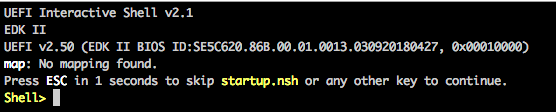

## Troubleshoot Compute Node Boot Issues Related to Unified Extensible Firmware Interface \(UEFI\)

If a node is stuck in the UEFI shell, ConMan will be able to connect to it, but nothing else will appear in its logs. The node's logs will look similar to the following, indicating that ConMan is updating its log hourly:

```
<ConMan> Console [86] log at 2018-09-07 20:00:00 CDT.
<ConMan> Console [86] log at 2018-09-07 21:00:00 CDT.
<ConMan> Console [86] log at 2018-09-07 22:00:00 CDT.
<ConMan> Console [86] log at 2018-09-07 23:00:00 CDT.
<ConMan> Console [86] log at 2018-09-08 00:00:00 CDT.
```

This procedure helps resolve this issue.

### Prerequisites

This procedure requires administrative privileges.

### Limitations

Encryption of compute node logs is not enabled, so the passwords may be passed in clear text.

### Procedure

1.  Log onto the node via ipmitool or ConMan.

2.  Select **Enter**.

    The system will present one of the following prompts, both of which indicate that the user has entered the UEFI shell.

    

    

3.  Use one of the following options to resolve the issue:

    -   Contact the system administrator or someone who is knowledgeable about UEFI if the node is stuck in the UEFI shell.
    -   Reseat the node if it is suspected that this may be a hardware related issue. To reseat a node, pull the power cable off the back end of the box. Wait a few seconds, then reconnect the power cable and push the power button on the front of the box. Reseating a node must be done on site. Contact customer support for more information.


