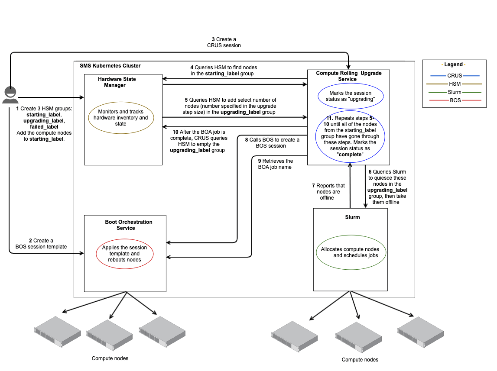

# CRUS Workflow

> **`NOTE`** CRUS was deprecated in CSM 1.2.0. It will be removed in a future CSM release and replaced with BOS V2, which will provide similar functionality.
> See the following links for more information:
>
> - [Rolling Upgrades with BOS V2](../boot_orchestration/Rolling_Upgrades.md)
> - [Deprecated features](../../introduction/differences.md#deprecated-features)

The following workflow is intended to be a high-level overview of how to upgrade compute nodes. This workflow depicts how services interact with each other during the compute node
upgrade process, and helps to provide a quicker and deeper understanding of how the system functions.

## Use cases

Administrator upgrades select compute nodes to a newer compute image by using Compute Rolling Upgrade Service \(CRUS\).

## Requirements

- The compute nodes are up and running.
- Compute node workloads are managed by Slurm.

## Components

This workflow is based on the interaction of CRUS with Boot Orchestration Service \(BOS\) and Slurm \(Workload Manager\).

The following terms are mentioned in this workflow:

- Compute Rolling Upgrade Service \(CRUS\) allows an administrator to modify the boot image and/or configuration on a set of compute nodes without the need to take the entire set
  of nodes out of service at once. It manages the workload management status of nodes, quiescing each node before taking the node out of service, upgrading the node, rebooting
  the node into the upgraded state and then returning the node to service within the workload manager.
- Boot Orchestration Service \(BOS\) is responsible for booting, configuring, and shutting down collections of nodes. The Boot Orchestration Service has the following components:
  - Boot Orchestration Session Template is a collection of one or more boot set objects. A boot set defines a collection of nodes and the information about the boot artifacts
    and parameters.
  - Boot Orchestration Session carries out an operation. The possible operations in a session are boot, shutdown, reboot, and configure.
  - Boot Orchestration Agent \(BOA\) is automatically launched to execute the session. A BOA executes the given operation, and if the operation is a boot or a reboot, it also
    configures the nodes post-boot \(if configure is enabled\).
- The Slurm control daemon (`slurmctld`) is the central management daemon of Slurm. It runs on non-compute nodes in a container. It monitors all other Slurm daemons and
  resources, accepts jobs, and allocates resources to those jobs.
- The Slurm daemon (`slurmd`) monitors all tasks running on compute nodes, accepts tasks, launches tasks, and kills running tasks upon request. It runs on compute nodes.

## Workflow

The following sequence of steps occur during this workflow.

### 1. Administrator creates HSM groups and populates the starting group

1. Create three HSM groups with starting, failed, and upgrading labels.

    Any names can be used for these groups.
    For this example: `crus_starting`, `crusfailed`, and `crusupgrading`, respectively.

1. Add all of the compute nodes to be updated to the `crus_starting` group.

    Leave the `crusfailed`, and `crusupgrading` groups empty.

### 2. Administrator creates a session template

A session template is a collection of metadata for a group of nodes and their desired configuration.

Create a BOS session template which points to the new image, the desired CFS configuration, and with a boot set which includes all the compute nodes to be updated.
The boot set can include additional nodes, but it must contain all the nodes that need to be updated. The BOS session template should specify `crusupgrading` in the
`node_groups` field of one of its boot sets.

This example will use the BOS session template named `newcomputetemplate`.

### 3. Administrator creates a CRUS session

A new upgrade session is launched as a result of this call.

Specify the following parameters:

| Parameter             | Example              | Meaning                                                                                                         |
|-----------------------|----------------------|-----------------------------------------------------------------------------------------------------------------|
| `failed_label`        | `crusfailed`         | An empty Hardware State Manager \(HSM\) group which CRUS will populate with any nodes that fail their upgrades. |
| `starting_label`      | `crus_starting`      | An HSM group which contains the total set of nodes to be upgraded.                                              |
| `upgrading_label`     | `crusupgrading`      | An empty HSM group which CRUS will use to boot and configure subsets of the compute nodes.                      |
| `upgradestepsize`     | `50`                 | The number of nodes to include in each discrete upgrade step.*                                                  |
| `upgradetemplateid`   | `newcomputetemplate` | The name of the BOS session template to use for the upgrades.                                                   |
| `workloadmanagertype` | `slurm`              | Only Slurm is supported.                                                                                        |

> \* Each group of concurrent upgrades will never exceed this number of compute nodes, although in some cases they may be smaller.

### 4. CRUS to HSM

CRUS calls HSM to find the nodes in the `crus_starting` group.

### 5. CRUS to HSM

CRUS selects a number of these nodes equal to `upgradestepsize` and calls HSM to put them into the `crusupgrading` group.

### 6. CRUS to Slurm

CRUS tells Slurm to quiesce these nodes. As each node is quiesced, Slurm puts the node offline.

### 7. Slurm to CRUS

Slurm reports back to CRUS that all of the nodes as offline.

### 8. CRUS to BOS

CRUS calls BOS to create a session with the following arguments:

| Parameter      | Value                |
|----------------|----------------------|
| `operation`    | `reboot`             |
| `templateUuid` | `newcomputetemplate` |
| `limit`        | `crusupgrading`      |

### 9. CRUS retrieves the BOA job details from BOS

1. CRUS retrieves the BOS session to get the BOA job name.

1. CRUS waits for the BOA job to finish.

1. CRUS looks at the exit code of the BOA job to determine whether or not there were errors.

    If there were errors, CRUS adds the nodes from the `crusupgrading` group into the `crusfailed` group.

1. CRUS calls HSM to empty the `crusupgrading` group.

### 10. CRUS repeats steps for remaining nodes, then updates status

1. CRUS repeats steps 5-9 until all of the nodes from the `crus_starting` group have gone through these steps.

1. CRUS marks the session status as `complete`.
