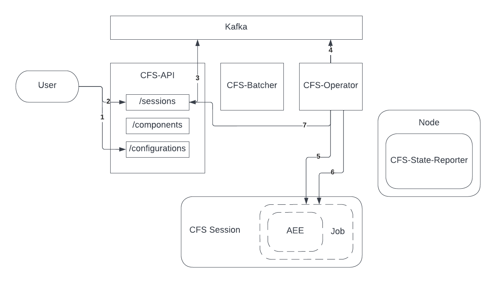
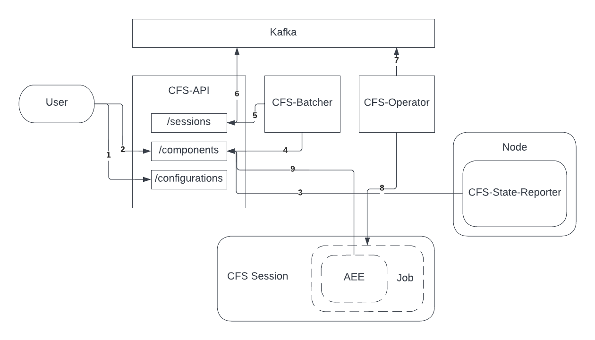

# CFS Flow

* [Single Session Flow](#single_session_flow)
* [Automated Session Flow](#automated_session_flow)

## Single Session Flow

This section covers the components and actions taken when a user or service creates a session using the CFS sessions endpoint.

1. A user creates a CFS configuration.
2. A user creates a CFS session, causing a session record to be created.
3. When a session record is created, the `CFS-API` also posts an event to a Kafka queue.
4. The `CFS-Operator` is always monitoring the Kafka queue, and handles events as they come in.
5. The `CFS-Operator` creates a Kubernetes job for the session in response to a session creation event.
6. The `CFS-Operator` monitors the Kubernetes job (not the pod) for completion.
7. When the Kubernetes job is complete, the `CFS-Operator` updates the session record in the `CFS-API`.

## Automated Session Flow

This section covers the components and actions taken when a user or service sets a desired configuration for a component, causing automatic configuration to occur.

1. A user creates a CFS configuration.
2. A user sets the desired configuration for some number of components. This may immediately trigger configuration if the component is enabled in CFS and the desired
   configuration has not yet been applied. If that is the case, then skip to step 4.
3. When a node reboots, the `CFS-State-Reporter` runs on the node, and contacts the `CFS-API` to enable and clear the state for the current node. This will always trigger
   the next steps for configuration as long as a desired configuration is set for the node.
4. The `CFS-Batcher` monitors the `CFS-API`, periodically querying for enabled components with a `pending` configuration status. (The status is determined by the API at
   query time based on the desired and current state of the component). Any components found are placed into batches.
5. The `CFS-Batcher` calls the `CFS-API` to create sessions for each batch, using the `ansible-limit` parameter to limit each session to the components in a batch.
6. The `CFS-API` creates a session record and session creation event. See [Single Session Flow](#single_session_flow) for details.
7. The `CFS-Operator` monitors for session creation events. See [Single Session Flow](#single_session_flow) for details.
8. The `CFS-Operator` creates a Kubernetes job. See [Single Session Flow](#single_session_flow) for details.
9. The Ansible Execution Environment contains a custom Ansible plugin that calls CFS to update the status of all components affected after each play.
10. If the component does not have a `configured` status due to failure or other reasons, return to step 4.
