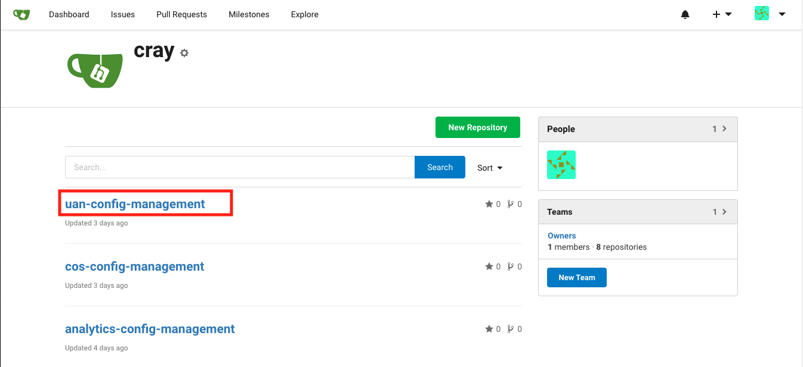
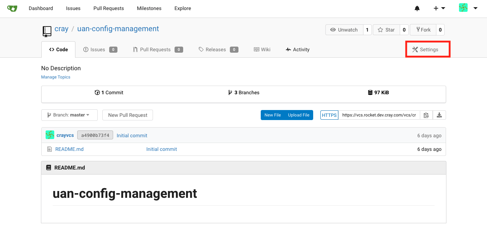
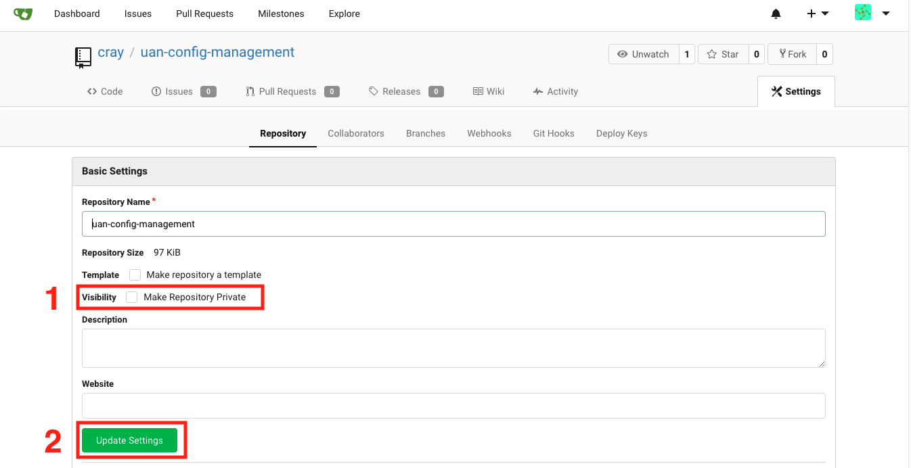

# Update the Privacy Settings for Gitea Configuration Content Repositories

Change the visibility of Gitea configuration content repositories from public to private. All Cray-provided repositories are created as private by default.

## Procedure

1. Log in to the Version Control Service \(VCS\) as the `crayvcs` user.

   Use the following URL to access the VCS web interface: `https://vcs.SYSTEM-NAME.DOMAIN-NAME`

1. Navigate to the `cray` organization.

    The following URL should access it directly: `https://vcs.SYSTEM-NAME.DOMAIN-NAME/vcs/cray`

1. Select the repository title for each repository listed on the page.

    

1. Click the `Settings` button in the repository header section.

    

1. Update the visibility settings for the repository.

    

   1. Click the `Visibility` check box to make the repository private.

   1. Click the `Update Settings` button to save the change for the repository.
