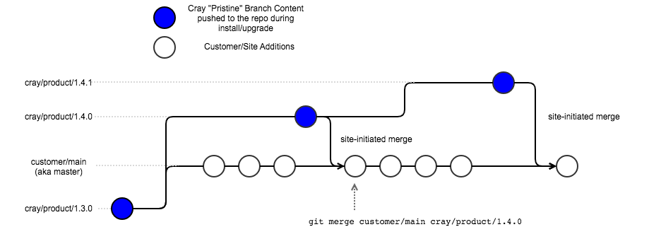

# VCS Branching Strategy

Individual products import configuration content \(Ansible plays, roles, and more\) into a repository in the Version Control Service \(VCS\) through
their installation process. Typically, this repository exists in the `cray` organization in VCS and its name has the format `[product name]-config-management`.

The import branch of the product is considered "pristine content" and is added to VCS in a read-only branch. This step is taken to ensure the future
updates of the product's configuration content can be based on a clean branch, and that upgrades can proceed without merging issues.

HPE Cray products import their content into a branch with a name that has the format `cray/[product]/[product version]`.

The version is in [SemVer](https://semver.org) format. Product installation and operational workflows will direct users to create branches from these
pristine product branches to begin customizing their configuration from the default provided by the HPE Cray product.

The workflow of branching from pristine imported content and handling upgrades to that content is shown in the diagram below \(see "Branch Workflow"\).
In this scenario, the configuration customizations are made in a customer/main branch, which can be any branch in the repository, such as `master`, `main`,
`integration`, or others. As configuration changes are made and the system is configured as required, users can point to the commits \(white circles\) in their
CFS configuration layers to test and run HPE Cray products on the system. Users may also point to the commits on pristine branches \(blue circle\) in CFS configuration
layers if the default configuration is sufficient.

When a product upgrade occurs \(`cray/product/1.4.0` in the above diagram\), the product installer will create a new branch and commit based off the previous
pristine branch. If the previous customizations on the customer/main branch also need to be included with the new 1.4.0 content, the user should initiate a Git merge
of the new pristine content into their branch \(or possibly into a test branch based on customer/main\). This process will be the same for subsequent updates of the
product as well.

> **IMPORTANT:** If the HPE Cray product has specific instructions for installing and upgrading configuration content, those should take precedence over this generic workflow.

The "Branch Workflow" diagram is an example workflow that can be used to manage new product content being introduced during upgrades. However, CFS and VCS do not
require any specific branching strategy. Users are free to manage the branches as they see fit with the exception of the pristine branches imported by individual HPE Cray
products. CFS configuration layers \(see [Configuration Layers](Configuration_Layers.md)\) only require a Git commit ID, a Git repository clone URL, and the path to an
Ansible playbook to run the configuration content in the repository.
