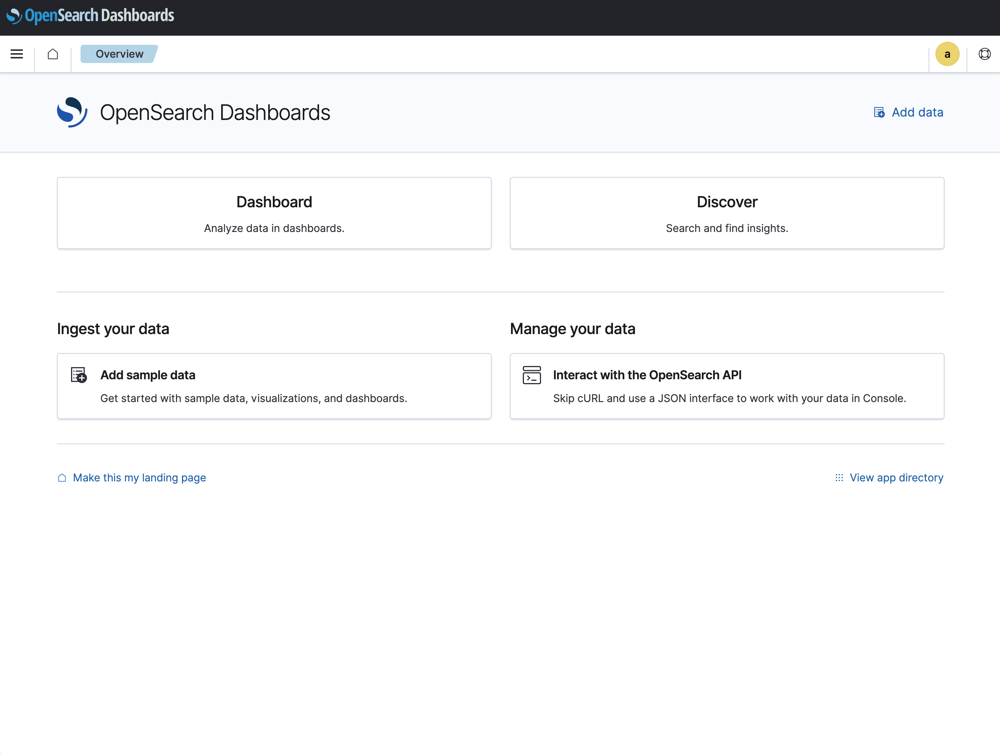
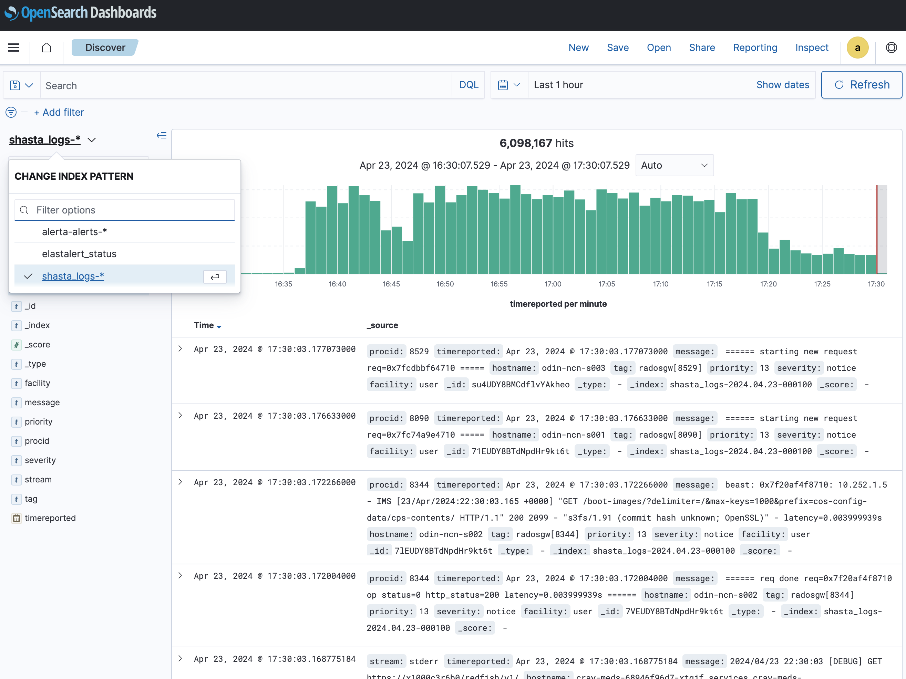

# Access Console Log Data Via the System Monitoring Framework \(SMF\)

Console log data is collected by SMF and can be queried through the SMA Dashboards UI or Opensearch. Each line of the console logs are an individual record in the SMF database.

- [Prerequisites](#prerequisites)
- [System domain name](#system-domain-name)
- [Procedure](#procedure)

## Prerequisites

This procedure requires the `sma-dashboards` service to be up and running on a non-compute node \(NCN\).

## System domain name

The `SYSTEM_DOMAIN_NAME` value found in some of the URLs on this page is expected to be the system's fully qualified domain name (FQDN).

(`ncn-mw#`) The FQDN can be found by running the following command on any Kubernetes NCN.

```bash
kubectl get secret site-init -n loftsman -o jsonpath='{.data.customizations\.yaml}' | base64 -d | yq r - spec.network.dns.external
```

Example output:

```text
system.hpc.amslabs.hpecorp.net
```

Be sure to modify the example URLs on this page by replacing `SYSTEM_DOMAIN_NAME` with the actual value found using the above command.

## Procedure

1. Navigate to the following URL in a web browser: `https://sma-dashboards.cmn.SYSTEM_DOMAIN_NAME`

    | If this appears                                                                                            | Do this                                                                                                       |
    |------------------------------------------------------------------------------------------------------------|---------------------------------------------------------------------------------------------------------------|
    | **the Keycloak login page**                                                                                | Supply valid credentials, then wait to be redirected to the SMA dashboard before continuing to the next step. |
    | **the error `Opensearch Dashboards did not load properly. Check the server output for more information.`** | Clear browser cookies for `https://sma-dashboards.cmn.SYSTEM_DOMAIN_NAME`                                     |
    | **The SMA dashboard \(see example below\)**                                                                | Proceed to next step                                                                                          |

    When the SMA dashboard loads, the web UI displays the SMA dashboard home page. 

    

1. Select the Shasta index for the type of logs desired from the drop-down list to search that data source.

    

1. Identify the component name (xname) for individual consoles to search for specific logs.

    Each line of the log data is prepended with `console.hostname: XNAME` where `XNAME` is the name of the node for the console log. This information can be used to identify each individual console.

    For example, the following is the console log for `x3000c0s19b4n0`:

    ```text
    console.hostname: x3000c0s19b4n0 <ConMan> Console [x3000c0s19b4n0] joined by <root@localhost> on pts/0 at 10-09 15:11.
    console.hostname: x3000c0s19b4n0 2020-10-09 15:11:39 Keepalived_vrrp[38]: bogus VRRP packet received on bond0.nmn0 !!!
    ```

1. Enter **Search** terms for the specific console component name (xname) using the `console.hostname: XNAME` string.

1. Click the time range drop-down menu to select the time period for which logs are displayed.

    Using a time range for these searches is important to limit the scope and number of records returned, as well as limiting the time required to perform the search.

    The default time range is 15 minutes.

    
