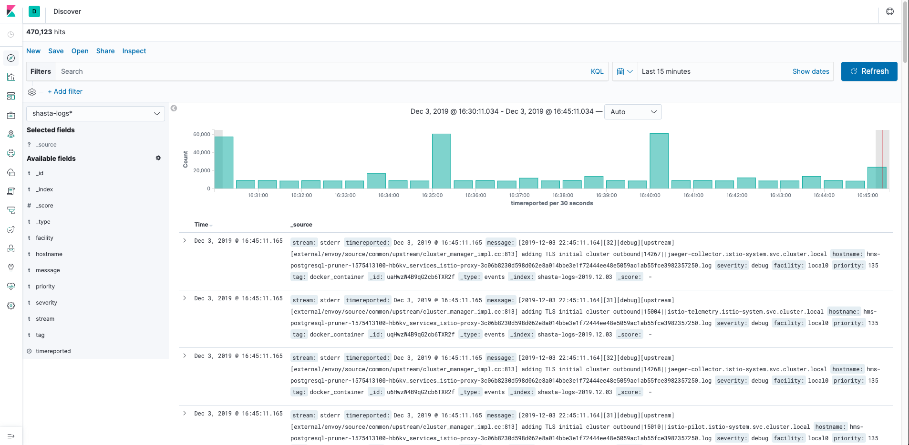
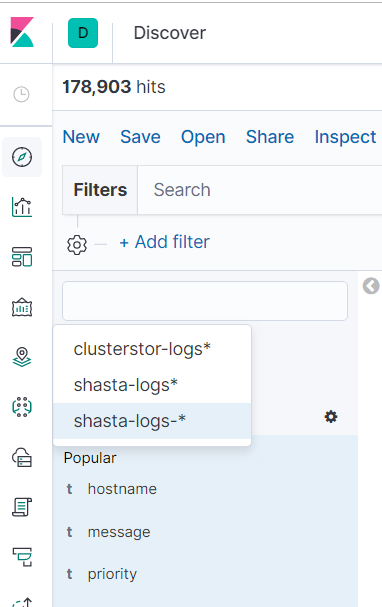
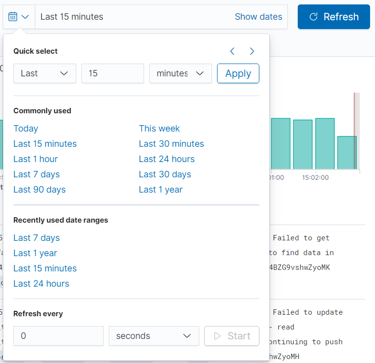

## Access Console Log Data Via the System Monitoring Framework \(SMF\)

Console log data is collected by SMF and can be queried through the Kibana UI or Elasticsearch. Each line of the console logs are an individual record in the SMF database.

### Prerequisites

This procedure requires the Kibana service to be up and running on a non-compute node \(NCN\).

### Procedure

1.  Determine the external domain name by running the following command on any NCN:

    ```
    ncn-m001# kubectl get secret site-init -n loftsman -o jsonpath='{.data.customizations.yaml}' \
    | base64 -d | grep "external:"
    ```

    Example output:
    
    ```
        external: SHASTA_EXTERNAL_DOMAIN.com
    ```

2.  Navigate to the following URL in a web browser:

    ```
    https://sma-kibana.SHASTA_EXTERNAL_DOMAIN.com/app/kibana
    ```

    |If this appears:|Do this:|
    |----------------|--------|
    |**the Keycloak login page**|Supply valid credentials, then wait to be redirected to the Kibana dashboard before continuing to the next step.|
    |**the error `Kibana did not load properly. Check the server output for more information.`**|Clear browser cookies for https://sma-kibana.SHASTA\_EXTERNAL\_DOMAIN.com|
    |**The Kibana dashboard \(see example below\)**|Proceed to next step|

    When the Kibana dashboard loads, the web UI displays the Discover page by default. Note that even without entering a search pattern, an index pattern shows entries ordered in time.

    

3.  Select the Shasta index for the type of logs desired from the drop-down list to search that data source.

    

4.  Identify the xname for individual consoles to search for specific logs.

    Each line of the log data is prepended with "console.hostname: XNAME" where XNAME is the name of the node for the console log. This information can be used to identify each individual console.

    For example, the following is the console log for x3000c0s19b4n0:

    ```
    console.hostname: x3000c0s19b4n0 <ConMan> Console [x3000c0s19b4n0] joined by <root@localhost> on pts/0 at 10-09 15:11.
    console.hostname: x3000c0s19b4n0 2020-10-09 15:11:39 Keepalived_vrrp[38]: bogus VRRP packet received on bond0.nmn0 !!!
    ```

5.  Enter **Search** terms for the specific console xname using the "console.hostname: XNAME" string.

6.  Click the time range drop-down menu to select the time period for which logs are displayed.

    Using a time range for these searches is important to limit the scope and number of records returned, as well as limiting the time required to perform the search.

    The default time range is 15 minutes.

    


