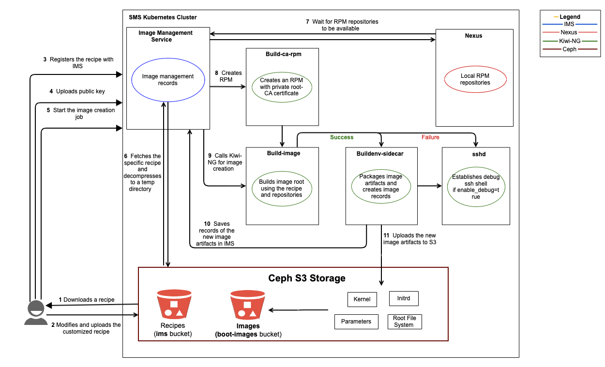
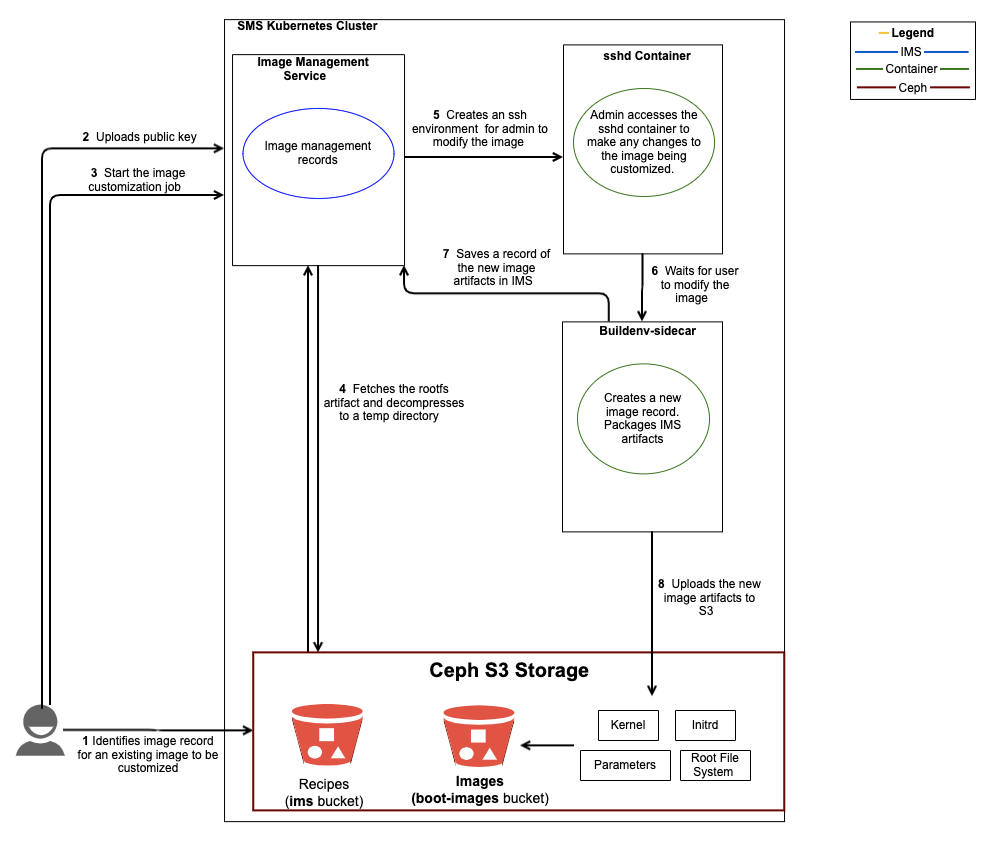

# Image Management Workflows

Overview of how to create an image and how to customize and image.

The following workflows are intended to be high-level overviews of image management tasks. These workflows depict how services interact with each other during image management and help to provide a quicker and deeper
understanding of how the system functions.

The workflows in this section include:

* [Create a New Image](#create-a-new-image)
* [Customize an Image](#customize-an-image)

## Create a New Image

**Use Case:** The system administrator creates an image root from a customized recipe. The new image can be used to boot compute nodes.

**Components:** This workflow is based on the interaction of the Image Management Service \(IMS\) with other services during the image build process. The process of image creation builds an image from a recipe.
An administrator may choose to use the Cray-provided recipes or customize Kiwi recipes to define the image to be built.

Mentioned in this workflow:

* Image Management Service \(IMS\) allows administrators and users to build or customize \(pre-boot\) images from kiwi-ng recipes. This service is responsible for enabling the creation of bootable and non-bootable
  images, enabling image customization via an SSH-able environment, and packaging and association of new/customized image artifacts \(`kernel`, `rootfs`, `initrd`, etc\) with a new IMS image record.
* Nexus is needed for image creation and image customization. Nexus provides local RPM repositories for use when building or customizing an image. You can define `zypper` or Yum package repositories and provide
  the RPM content for installing and updating software for every compute and non-compute node in the system.
* The Simple Storage Service \(Ceph S3\) is an artifact repository that stores boot artifacts. Recipes are stored in the `ims` bucket and images are stored in the `boot-images` bucket.



**Workflow Overview:** The following sequence of steps occurs during this workflow.

1. **Administrator downloads an existing recipe from S3**

    To create a custom recipe, the administrator can first download an existing recipe from S3. A Kiwi recipe consists of multiple files and directories, which together define the repositories, packages and
    post-install actions to take during the Kiwi build process.

1. **Administrator modifies the recipe and uploads to S3**

    Modify the recipe by editing the files and subdirectories in the image-recipe directory. Edit the `config.xml` file to modify the name of the recipe, the set of RPM packages being installed or the RPM
    repositories being referenced. The recipe should be uploaded to S3 in a `.tgz` archive via CLI.

1. (`ncn-mw#`) **Administrator registers the recipe with IMS**

    Registering the recipe creates a recipe record for your custom recipe in IMS.

    ```bash
    cray ims recipes list
    ```

1. (`ncn-mw#`) **Administrator uploads public key**

    A public key is uploaded to allow them to access SSH shells that IMS provides.

    ```bash
    cray ims public-keys create --name "username public key" --public-key ~/.ssh/id_rsa.pub
    ```

1. (`ncn-mw#`) **Administrator starts the creation job**

    Create a new IMS image by providing request body parameter, job\_type="create". The following steps 6-10 happen automatically as a part of the image creation process.

    ```bash
    cray ims jobs create \
        --job-type create \
        --image-root-archive-name cray-sles15-barebones \
        --artifact-id $IMS_RECIPE_ID \
        --public-key-id $IMS_PUBLIC_KEY_ID \
        --enable-debug False
    ```

1. **IMS to Ceph S3**

    IMS fetches the recipe from S3 and decompresses the recipe to a temporary directory.

1. **IMS to Nexus**

    IMS waits for repositories to be available from Nexus. The repositories are needed to build the image.

1. **IMS creates a custom RPM**

    IMS creates a custom RPM to install the CA root certificate from the system into the image. The build-ca-rpm container creates an RPM with the private root-CA certificate for the system and this RPM is
    installed automatically by Kiwi-NG. The CA root certificate is required to enable secure HTTPS access to the RPM repositories when building the image root.

1. **IMS calls Kiwi-NG to build the image**

    IMS calls Kiwi-NG to build the image root from the recipe and accesses packages in `zypper`/`yum` repositories. The building of the image using kiwi happens in the `build-image` container. After kiwi is
    done building the image \(either success or fail\), the `buildenv-sidecar` container packages the artifacts, or in the case of failure, enables the debug shell if enable-debug is True. In the `buildenv-sidecar`
    container, the image artifacts are packaged and new image artifact records are created for each.

    If there is a failure and enable-debug is true, a debug SSH shell is established. Admin can inspect image build root. Use commands touch `/mnt/image/complete` in a non-jailed environment or touch `/tmp/complete`
    in a jailed \(`chroot`\) environment to exit.

1. **Save the new image record in IMS**

    The metadata for the new image artifacts is stored in IMS.

1. **Upload the new image artifacts to Ceph S3**

    The new image artifacts are uploaded to Ceph S3.

### Customize an Image

**Use Case:** The system administrator customizes an existing image and makes desired changes.

**Components:** This workflow is based on the interaction of the Image Management Service \(IMS\) with Ceph S3 during the image customization process. The customization workflow sets up a temporary image
customization environment within a Kubernetes pod and mounts the image to be customized in that environment. A system administrator then makes the desired changes to the image root within the customization
environment. IMS then compresses the customized image root and uploads it and its associated `initrd` image and `kernel` image \(needed to boot a node\) to Ceph S3.

Mentioned in this workflow:

* Image Management Service \(IMS\) allows administrators and users to build or customize \(pre-boot\) images from kiwi-ng recipes. This service is responsible for enabling the creation of bootable and non-bootable
  images, enabling image customization via an SSH-able environment, and packaging and association of new/customized image artifacts \(`kernel`, `rootfs`, `initrd`, etc\) with a new IMS image record.
* The Simple Storage Service \(Ceph S3\) is an artifact repository that stores artifacts. Recipes are stored in the `ims` bucket and images are stored in the `boot-images` bucket.



**Workflow Overview:** The following sequence of steps occurs during this workflow.

1. (`ncn-mw#`) The administrator identifies an existing image to be customized.

    Retrieve a list of `ImageRecords` indicating images that have been registered with IMS. IMS uses the `ImageRecord` to read the image's `manifest.yaml` to find the image's root file system \(`rootfs`\) artifact.
    Note the id of the image that you want to customize.

    ```bash
    cray ims images list
    ```

1. (`ncn-mw#`) The administrator uploads a public key.

    A public key is uploaded to allow them to access SSH shells that IMS provides.

    ```bash
    cray ims public-keys create --name "username public key" --public-key ~/.ssh/id_rsa.pub
    ```

1. (`ncn-mw#`) The administrator starts the image customization job.

    Create a new IMS image by providing the `--job-type customize` argument to the `cray ims jobs create` command. The following steps \(4-8\) happen automatically as a part of the image customization process.

    ```bash
    cray ims jobs create \
        --job-type customize \
        --image-root-archive-name my_customized_image \
        --kernel-file-name vmlinuz \
        --initrd-file-name initrd \
        --artifact-id $IMS_IMAGE_ID \
        --public-key-id $IMS_PUBLIC_KEY_ID \
        --enable-debug False
    ```

1. IMS to Ceph S3.

    IMS downloads the image root \(`rootfs`\) from Ceph S3 and decompresses the image root to a temporary directory.

1. IMS creates an SSH environment for image customization.

    IMS spins up an `sshd` container so that the administrator can modify the image. The administrator accesses the `sshd` container and makes changes to the image. For example, it may be necessary to modify the
    timezone, or modify the programming environment, etc. Use `touch /mnt/image/complete` in a non-jailed environment or `touch /tmp/complete` in a jailed \(`chroot`\) environment to exit. The shell can be run in
    either a jailed or non-jailed mode.

    The output is a new image. Note that the original image also exists. IMS customizes a copy of the original image.

1. `buildenv-sidecar` container packages new image artifacts.

    The `buildenv-sidecar` container waits for the administrator to exit the SSH session. Upon completion, new records are created for each image artifact. It also adds the root CA certificate to the image and packages
    the new image artifacts \(`kernel`, `initrd`, `rootfs`\).

1. Save the new image record in IMS.

    The metadata for the new image artifacts is stored in IMS.

1. Upload the new image artifacts to Ceph S3.

    The new image artifacts are uploaded to Ceph S3.
