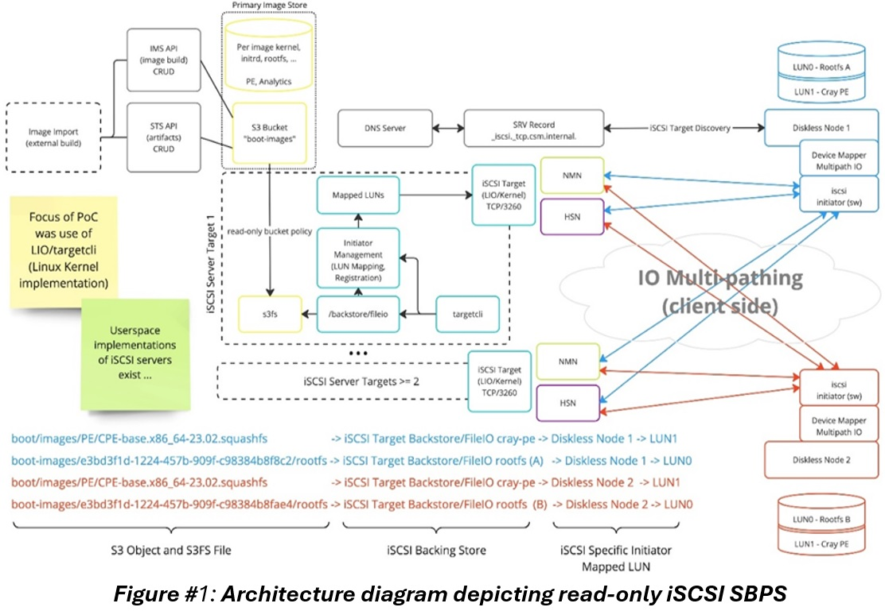
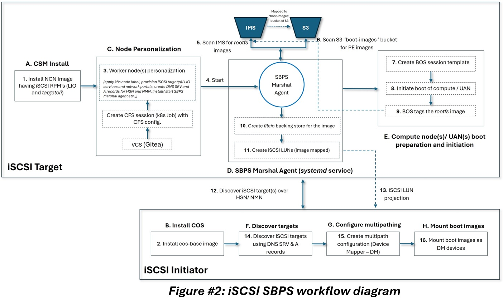

# iSCSI SBPS (Scalable Boot Content Projection Service)

* [Introduction](#introduction)
* [iSCSI SBPS solution details](#iscsi-sbps-solution-details)
* [Steps to achieve SBPS](#steps-to-achieve-sbps)
* [Steps to switch from DVS to iSCSI](#steps-to-switch-from-dvs-to-iscsi)
* [Glossary](#glossary)

## Introduction

iSCSI based boot content projection solution named Scalable Boot Content Projection Service (SBPS)
is an alternate boot content projection solution and planning to replace current DVS (Cray Data Virtualization Service)
to project boot content like `rootfs` and `programming environment` (PE) images. SBPS is aimed to offer better
reliability, availability, security, ease and speed of deployment and ease of management than DVS.
SBPS solution is offered from CSM 1.6 onwards and this solution is spread across different components BOS, USS/COS
and the core service SBPS Marshal agent is delivered as an RPM gets deployed as part of CFS `ansible` play books.
In CSM 1.6, both DVS and SBPS will co-exist but SBPS will be default and DVS is planned to deprecate in CSM 1.7.

**SBPS Key features:**

* Provides open source friendly solution for read-only content projection (`rootfs` and `PE`) as it uses LIO (Linux IO) which is open source.
* Horizontally scalable content projection service (iSCSI target side)
* Delivers active/active IO operation from iSCSI initiator(s) to content projection service
* Delivers seamless failover and failback for iSCSI initiator(s) on iSCSI target(s) or partial network failure
* Supports projection over HSN (High Speed Network) and NMN (Node Management Network) without significant reconfiguration
* Does not require additional hardware infrastructure (iSCSI target)
* Co-exists with DVS until it is deprecated (Plan to deprecate DVS for `rootfs` projection in CSM 1.7)
* Enables future work related to image access control, multi-tenancy, and related zero trust principles
* Does not require duplication of images from S3
* Supports monitoring of content projection service for performance and reliability engineering
* Aligns with future plans for similar functionality in next generation systems management solutions
* Easy to deploy and manage

**Note:** Using HSN for boot content projection is recommended and use NMN for any debugging purposes. In the case of HSN not configured, then usage of NMN is recommended if it meets the bandwidth requirements.

## iSCSI SBPS solution details



As shown in figure #1, The basic configuration involves two iSCSI target/server (worker node) nodes
and two iSCSI initiator/client (compute/UAN) nodes connected via HSN and/or NMN where I/O `multipathing`
is configured. The `rootfs` and `PE` images are hosted in IMS and S3 respectively and both of these
images are mapped to `boot-images` bucket of S3. DNS SRV and A [DNS - Domain Name Service, SRV - Service,
A - Address] records are created and used for target node(s) discovery from initiator node during its boot.

**iSCSI Target/Server:**
As shown in figure #1 this includes standard Linux kernel, `s3fs` to mount the `boot-images` bucket onto worker node,
LIO (Linux IO) - an open-source implementation of SCSI target which supports `fileio` backing store, `targetcli` -
LIO command-line interface to manage iSCSI devices like creation of `LUNs`, listing of `LUNs`, creation of `fileio backstore`,
saving/clearing the configuration etc as shown in the Figure #1 and the SBPS core service named "SBPS Marshal Agent" runs as
Linux `systemd` service. The Marshal agent scans IMS and S3 storage for `rootfs` and `PE` images, creates `fileio backing store`
for the images to be projected. The `rootfs` images to be projected are tagged by BOS (Boot Orchestration Service) when the boot
of initiator node(s) is triggered. Then the Marshal Agent creates iSCSI `LUNs` for each of the `fileio` backing store where the
images to be projected are mapped to these `LUNs`.

**iSCSI Initiator/Client:**
iSCSI initiator includes standard Linux kernel, user space iSCSI initiator services and DM (Device Mapper)
`multipathing` software. DNS SRV and A records are used to discover the target nodes during the boot and
are part of BOS (Boot orchestration service) session template boot parameters. This BOS session template
is used to trigger the boot of initiator node(s). The `LUNs` created on the target node which has the
`rootfs`/ `PE` images mapped are thus projected to initiator node(s) when the boot is triggered.
Basically, the `rootfs` image projected is used as part of booting the initiator node and `PE` image(s)
projected are used post boot. These `LUNs` get mounted onto the initiator node as DM multi-path `LUNs`
as depicted in the figure #1. DM multipath software provides I/O `multipathing` for high availability
(failover and failback) and I/O load balancing.



Example output snippet of `targetcli ls` command on worker node where iSCSI LUNS are created for the images scanned:

```bash
ncn-w002:~ # targetcli ls
o- / ......................................................................................................................... [...]
  o- backstores .............................................................................................................. [...]
  | o- block .................................................................................................. [Storage Objects: 0]
  | o- fileio ................................................................................................ [Storage Objects: 28]
  | | o- 0331b9aaef49840 ......... [/var/lib/cps-local/boot-images/PE/CPE-amd.x86_64-24.03.squashfs (122.2MiB) write-thru activated]
  | | | o- alua ................................................................................................... [ALUA Groups: 1]
  | | |   o- default_tg_pt_gp ....................................................................... [ALUA state: Active/optimized]
  | | o- 0f3847fd8e25624 ....... [/var/lib/cps-local/boot-images/PE/CPE-intel.x86_64-24.03.squashfs (114.8MiB) write-thru activated]
  | | | o- alua ................................................................................................... [ALUA Groups: 1]
  | | |   o- default_tg_pt_gp ....................................................................... [ALUA state: Active/optimized]
  | | o- 1373e69e2028baa ......... [/var/lib/cps-local/boot-images/PE/CPE-amd.x86_64-24.11.squashfs (503.4MiB) write-thru activated]
  | | | o- alua ................................................................................................... [ALUA Groups: 1]
  | | |   o- default_tg_pt_gp ....................................................................... [ALUA state: Active/optimized]
  | | o- 2babe2c96d6f900 ......... [/var/lib/cps-local/boot-images/PE/CPE-base.aarch64-23.12.squashfs (1.9GiB) write-thru activated]
  | | | o- alua ................................................................................................... [ALUA Groups: 1]
  | | |   o- default_tg_pt_gp ....................................................................... [ALUA state: Active/optimized]
  | | o- 380840014ffe295  [/var/lib/cps-local/boot-images/f731d8d5-0fed-41d7-996e-6a0d19b6ff6d/rootfs (10.8GiB) write-thru activated]
  | | | o- alua ................................................................................................... [ALUA Groups: 1]
  | | |   o- default_tg_pt_gp ....................................................................... [ALUA state: Active/optimized]
  | | o- 719593b460753ac ........ [/var/lib/cps-local/boot-images/PE/CPE-aocc.x86_64-24.11.squashfs (131.6MiB) write-thru activated]
  | | | o- alua ................................................................................................... [ALUA Groups: 1]
  | | |   o- default_tg_pt_gp ....................................................................... [ALUA state: Active/optimized]
  | | o- 76e638d3bfc3107 ...... [/var/lib/cps-local/boot-images/PE/CPE-nvidia.aarch64-23.12.squashfs (64.0KiB) write-thru activated]
  | | | o- alua ................................................................................................... [ALUA Groups: 1]
  | | |   o- default_tg_pt_gp ....................................................................... [ALUA state: Active/optimized]
  | | o- 7c0bba5c5301c97  [/var/lib/cps-local/boot-images/5b43428e-4381-4f39-9335-6dababb76d86/rootfs (2.9GiB) write-thru activated]
  | | | o- alua ................................................................................................... [ALUA Groups: 1]
  | | |   o- default_tg_pt_gp ....................................................................... [ALUA state: Active/optimized]
  | | o- 7cccd5c7adc8cc6 ....... [/var/lib/cps-local/boot-images/PE/CPE-intel.x86_64-23.12.squashfs (114.4MiB) write-thru activated]
  | | | o- alua ................................................................................................... [ALUA Groups: 1]
  | | |   o- default_tg_pt_gp ....................................................................... [ALUA state: Active/optimized]
  | | o- 818ff2c161855b6 ........ [/var/lib/cps-local/boot-images/PE/CPE-aocc.x86_64-24.03.squashfs (117.9MiB) write-thru activated]
  | | | o- alua ................................................................................................... [ALUA Groups: 1]
  | | |   o- default_tg_pt_gp ....................................................................... [ALUA state: Active/optimized]
  | | o- 85801b9e9c9cea7 ......... [/var/lib/cps-local/boot-images/PE/CPE-base.aarch64-24.03.squashfs (2.0GiB) write-thru activated]
  | | | o- alua ................................................................................................... [ALUA Groups: 1]
  | | |   o- default_tg_pt_gp ....................................................................... [ALUA state: Active/optimized]
  | | o- 8edfc76b6dae21f ...... [/var/lib/cps-local/boot-images/PE/CPE-nvidia.x86_64-24.03.squashfs (134.1MiB) write-thru activated]
  | | | o- alua ................................................................................................... [ALUA Groups: 1]
  | | |   o- default_tg_pt_gp ....................................................................... [ALUA state: Active/optimized]
  | | o- 953aa229aafffa6 ....... [/var/lib/cps-local/boot-images/PE/CPE-intel.x86_64-24.11.squashfs (128.6MiB) write-thru activated]
  | | | o- alua ................................................................................................... [ALUA Groups: 1]
  | | |   o- default_tg_pt_gp ....................................................................... [ALUA state: Active/optimized]
  | | o- 979b7868c15ee00 ...... [/var/lib/cps-local/boot-images/PE/CPE-nvidia.x86_64-23.12.squashfs (123.2MiB) write-thru activated]
  | | | o- alua ................................................................................................... [ALUA Groups: 1]
  | | |   o- default_tg_pt_gp ....................................................................... [ALUA state: Active/optimized]
  | | o- 9de1fe8a016602f ......... [/var/lib/cps-local/boot-images/PE/CPE-base.aarch64-24.07.squashfs (2.0GiB) write-thru activated]
  | | | o- alua ................................................................................................... [ALUA Groups: 1]
  | | |   o- default_tg_pt_gp ....................................................................... [ALUA state: Active/optimized]
  | | o- 9f7ee65eadd1d3c ..... [/var/lib/cps-local/boot-images/PE/CPE-nvidia.aarch64-24.07.squashfs (272.3MiB) write-thru activated]
  | | | o- alua ................................................................................................... [ALUA Groups: 1]
  | | |   o- default_tg_pt_gp ....................................................................... [ALUA state: Active/optimized]
  | | o- a50dd52157e1636 ......... [/var/lib/cps-local/boot-images/PE/CPE-amd.x86_64-23.12.squashfs (121.9MiB) write-thru activated]
  | | | o- alua ................................................................................................... [ALUA Groups: 1]
  | | |   o- default_tg_pt_gp ....................................................................... [ALUA state: Active/optimized]
  | | o- a6db212e5a329fa .......... [/var/lib/cps-local/boot-images/PE/CPE-base.x86_64-24.03.squashfs (2.4GiB) write-thru activated]
  | | | o- alua ................................................................................................... [ALUA Groups: 1]
  | | |   o- default_tg_pt_gp ....................................................................... [ALUA state: Active/optimized]
  | | o- aac0f352b7a30d6 ....... [/var/lib/cps-local/boot-images/PE/CPE-intel.x86_64-24.07.squashfs (110.1MiB) write-thru activated]
  | | | o- alua ................................................................................................... [ALUA Groups: 1]
  | | |   o- default_tg_pt_gp ....................................................................... [ALUA state: Active/optimized]
  | | o- b91b33a9f98a0be ........ [/var/lib/cps-local/boot-images/PE/CPE-aocc.x86_64-24.07.squashfs (113.2MiB) write-thru activated]
  | | | o- alua ................................................................................................... [ALUA Groups: 1]
  | | |   o- default_tg_pt_gp ....................................................................... [ALUA state: Active/optimized]
  | | o- c1d98cf92b0647f ........ [/var/lib/cps-local/boot-images/PE/CPE-aocc.x86_64-23.12.squashfs (117.9MiB) write-thru activated]
  | | | o- alua ................................................................................................... [ALUA Groups: 1]
  | | |   o- default_tg_pt_gp ....................................................................... [ALUA state: Active/optimized]
  | | o- cfaa140ac182849 ...... [/var/lib/cps-local/boot-images/PE/CPE-nvidia.x86_64-24.07.squashfs (333.5MiB) write-thru activated]
  | | | o- alua ................................................................................................... [ALUA Groups: 1]
  | | |   o- default_tg_pt_gp ....................................................................... [ALUA state: Active/optimized]
  | | o- d265658496338c0 ......... [/var/lib/cps-local/boot-images/PE/CPE-amd.x86_64-24.07.squashfs (298.2MiB) write-thru activated]
  | | | o- alua ................................................................................................... [ALUA Groups: 1]
  | | |   o- default_tg_pt_gp ....................................................................... [ALUA state: Active/optimized]
  | | o- d797313856f7502 .......... [/var/lib/cps-local/boot-images/PE/CPE-base.x86_64-24.07.squashfs (2.4GiB) write-thru activated]
  | | | o- alua ................................................................................................... [ALUA Groups: 1]
  | | |   o- default_tg_pt_gp ....................................................................... [ALUA state: Active/optimized]
  | | o- da65cccd2e89d0c ...... [/var/lib/cps-local/boot-images/PE/CPE-nvidia.x86_64-24.11.squashfs (555.7MiB) write-thru activated]
  | | | o- alua ................................................................................................... [ALUA Groups: 1]
  | | |   o- default_tg_pt_gp ....................................................................... [ALUA state: Active/optimized]
  | | o- de4cc04e7dacfb9 .......... [/var/lib/cps-local/boot-images/PE/CPE-base.x86_64-24.11.squashfs (7.7GiB) write-thru activated]
  | | | o- alua ................................................................................................... [ALUA Groups: 1]
  | | |   o- default_tg_pt_gp ....................................................................... [ALUA state: Active/optimized]
  | | o- e41757ef248d642 .......... [/var/lib/cps-local/boot-images/PE/CPE-base.x86_64-23.12.squashfs (2.4GiB) write-thru activated]
  | | | o- alua ................................................................................................... [ALUA Groups: 1]
  | | |   o- default_tg_pt_gp ....................................................................... [ALUA state: Active/optimized]
  | | o- e837346fddf2004 ...... [/var/lib/cps-local/boot-images/PE/CPE-nvidia.aarch64-24.03.squashfs (92.5MiB) write-thru activated]
  | |   o- alua ................................................................................................... [ALUA Groups: 1]
  | |     o- default_tg_pt_gp ....................................................................... [ALUA state: Active/optimized]
  | o- pscsi .................................................................................................. [Storage Objects: 0]
  | o- ramdisk ................................................................................................ [Storage Objects: 0]
  o- iscsi ............................................................................................................ [Targets: 1]
  | o- iqn.2023-06.csm.iscsi:ncn-w002 .................................................................................... [TPGs: 1]
  |   o- tpg1 .................................................................................................. [gen-acls, no-auth]
  |     o- acls .......................................................................................................... [ACLs: 0]
  |     o- luns ......................................................................................................... [LUNs: 28]
  |     | o- lun0 .... [fileio/a50dd52157e1636 (/var/lib/cps-local/boot-images/PE/CPE-amd.x86_64-23.12.squashfs) (default_tg_pt_gp)]
  |     | o- lun1 .... [fileio/0331b9aaef49840 (/var/lib/cps-local/boot-images/PE/CPE-amd.x86_64-24.03.squashfs) (default_tg_pt_gp)]
  |     | o- lun2 .... [fileio/d265658496338c0 (/var/lib/cps-local/boot-images/PE/CPE-amd.x86_64-24.07.squashfs) (default_tg_pt_gp)]
  |     | o- lun3 .... [fileio/1373e69e2028baa (/var/lib/cps-local/boot-images/PE/CPE-amd.x86_64-24.11.squashfs) (default_tg_pt_gp)]
  |     | o- lun4 ... [fileio/c1d98cf92b0647f (/var/lib/cps-local/boot-images/PE/CPE-aocc.x86_64-23.12.squashfs) (default_tg_pt_gp)]
  |     | o- lun5 ... [fileio/818ff2c161855b6 (/var/lib/cps-local/boot-images/PE/CPE-aocc.x86_64-24.03.squashfs) (default_tg_pt_gp)]
  |     | o- lun6 ... [fileio/b91b33a9f98a0be (/var/lib/cps-local/boot-images/PE/CPE-aocc.x86_64-24.07.squashfs) (default_tg_pt_gp)]
  |     | o- lun7 ... [fileio/719593b460753ac (/var/lib/cps-local/boot-images/PE/CPE-aocc.x86_64-24.11.squashfs) (default_tg_pt_gp)]
  |     | o- lun8 .. [fileio/2babe2c96d6f900 (/var/lib/cps-local/boot-images/PE/CPE-base.aarch64-23.12.squashfs) (default_tg_pt_gp)]
  |     | o- lun9 .. [fileio/85801b9e9c9cea7 (/var/lib/cps-local/boot-images/PE/CPE-base.aarch64-24.03.squashfs) (default_tg_pt_gp)]
  |     | o- lun10 . [fileio/9de1fe8a016602f (/var/lib/cps-local/boot-images/PE/CPE-base.aarch64-24.07.squashfs) (default_tg_pt_gp)]
  |     | o- lun11 .. [fileio/e41757ef248d642 (/var/lib/cps-local/boot-images/PE/CPE-base.x86_64-23.12.squashfs) (default_tg_pt_gp)]
  |     | o- lun12 .. [fileio/a6db212e5a329fa (/var/lib/cps-local/boot-images/PE/CPE-base.x86_64-24.03.squashfs) (default_tg_pt_gp)]
  |     | o- lun13 .. [fileio/d797313856f7502 (/var/lib/cps-local/boot-images/PE/CPE-base.x86_64-24.07.squashfs) (default_tg_pt_gp)]
  |     | o- lun14 .. [fileio/de4cc04e7dacfb9 (/var/lib/cps-local/boot-images/PE/CPE-base.x86_64-24.11.squashfs) (default_tg_pt_gp)]
  |     | o- lun15 . [fileio/7cccd5c7adc8cc6 (/var/lib/cps-local/boot-images/PE/CPE-intel.x86_64-23.12.squashfs) (default_tg_pt_gp)]
  |     | o- lun16 . [fileio/0f3847fd8e25624 (/var/lib/cps-local/boot-images/PE/CPE-intel.x86_64-24.03.squashfs) (default_tg_pt_gp)]
  |     | o- lun17 . [fileio/aac0f352b7a30d6 (/var/lib/cps-local/boot-images/PE/CPE-intel.x86_64-24.07.squashfs) (default_tg_pt_gp)]
  |     | o- lun18 . [fileio/953aa229aafffa6 (/var/lib/cps-local/boot-images/PE/CPE-intel.x86_64-24.11.squashfs) (default_tg_pt_gp)]
  |     | o- lun19  [fileio/76e638d3bfc3107 (/var/lib/cps-local/boot-images/PE/CPE-nvidia.aarch64-23.12.squashfs) (default_tg_pt_gp)]
  |     | o- lun20  [fileio/e837346fddf2004 (/var/lib/cps-local/boot-images/PE/CPE-nvidia.aarch64-24.03.squashfs) (default_tg_pt_gp)]
  |     | o- lun21  [fileio/9f7ee65eadd1d3c (/var/lib/cps-local/boot-images/PE/CPE-nvidia.aarch64-24.07.squashfs) (default_tg_pt_gp)]
  |     | o- lun22  [fileio/979b7868c15ee00 (/var/lib/cps-local/boot-images/PE/CPE-nvidia.x86_64-23.12.squashfs) (default_tg_pt_gp)]
  |     | o- lun23  [fileio/8edfc76b6dae21f (/var/lib/cps-local/boot-images/PE/CPE-nvidia.x86_64-24.03.squashfs) (default_tg_pt_gp)]
  |     | o- lun24  [fileio/cfaa140ac182849 (/var/lib/cps-local/boot-images/PE/CPE-nvidia.x86_64-24.07.squashfs) (default_tg_pt_gp)]
  |     | o- lun25  [fileio/da65cccd2e89d0c (/var/lib/cps-local/boot-images/PE/CPE-nvidia.x86_64-24.11.squashfs) (default_tg_pt_gp)]
  |     | o- lun26  [fileio/7c0bba5c5301c97 (/var/lib/cps-local/boot-images/5b43428e-4381-4f39-9335-6dababb76d86/rootfs) (default_tg_pt_gp)]
  |     | o- lun27  [fileio/380840014ffe295 (/var/lib/cps-local/boot-images/f731d8d5-0fed-41d7-996e-6a0d19b6ff6d/rootfs) (default_tg_pt_gp)]
  |     o- portals .................................................................................................... [Portals: 3]
  |       o- 10.102.104.28:3260 ............................................................................................... [OK]
  |       o- 10.150.0.4:3260 .................................................................................................. [OK]
  |       o- 10.252.1.13:3260 ................................................................................................. [OK]
  o- loopback ......................................................................................................... [Targets: 0]
  o- vhost ............................................................................................................ [Targets: 0]
  o- xen-pvscsi ....................................................................................................... [Targets: 0]
```

In the above `targetcli ls` command output, we can see that four `fileio` backing store are created for
two `rootfs` images and two iSCSI `LUNs` are created which has the `rootfs` image id being mapped. And there
are 26 `PE` or `squashfs` `fileio` backing store created and 26 iSCSI `LUNs` created which have `PE`
or `squashfs` image id being mapped. Both of these iSCSI `LUNs` are ready for projection.

Sample initiator node snippet after the projection:

```bash
nid001032:~ # multipath -ll
11218.831779 | /etc/multipath.conf line 10: ignoring deprecated option "disable_changed_wwids", using built-in value: "yes"
PE_CPE-base.x86_64-24.11.squashfs (36001405de4cc04e7dacfb9ada0a6b4cc) dm-0 LIO-ORG,de4cc04e7dacfb9
size=7.7G features='1 queue_if_no_path' hwhandler='1 alua' wp=ro
`-+- policy='round-robin 0' prio=50 status=active
  |- 1:0:0:14 sdo  8:224  active ready running
  |- 2:0:0:14 sdaq 66:160 active ready running
  |- 3:0:0:14 sdbs 68:96  active ready running
  `- 4:0:0:14 sdcu 70:32  active ready running
f731d8d5-0fed-41d7-996e-6a0d19b6ff6d_rootfs (36001405380840014ffe295091e8689db) dm-24 LIO-ORG,380840014ffe295
size=11G features='1 queue_if_no_path' hwhandler='1 alua' wp=ro
`-+- policy='round-robin 0' prio=50 status=active
  |- 1:0:0:27 sdab 65:176 active ready running
  |- 2:0:0:27 sdbd 67:112 active ready running
  |- 3:0:0:27 sdcf 69:48  active ready running
  `- 4:0:0:27 sddh 70:240 active ready running
```

## Steps to achieve SBPS

1. Node personalization
2. Run GOSS Test suite
3. Creation of BOS session template
4. Image tagging
5. Boot compute / UAN's
6. Monitor iSCSI Metrics

### Node Personalization (Worker node)

Node personalization is the pre-requisite step of SBPS solution where we need to first setup/ configure worker nodes as iSCSI targets (servers)
with necessary provisioning, configuration and enable required components. The required RPMs for `targetcli` command / LIO are part of NCN node image in CSM 1.6 and SBPS Marshal agent gets installed during node personalization via CFS Ansible play books.

This can be done in two ways:

a) Auto setup with bootprep:

By default worker node personalization of iSCSI SBPS is done during CSM install/ upgrade (using IUF). It is initiated during bootprep
(management-nodes-rollout) in order to do worker node personalization automatically during boot time.

b) Manual setup with CFS config/ session:

Worker node personalization can be done post CSM install with CFS config/ session.
Please refer [Node Personalisation](https://github.com/Cray-HPE/docs-csm/blob/release/1.6/operations/configuration_management/iSCSI_SBPS_Node_Personalization.md) for the details.

### Steps to configure and run GOSS tests

In order to verify the readiness of the iSCSI targets before triggering the boot of compute nodes/ UAN's, we need to run GOSS tests as
sanity checks on iSCSI targets.

Please refer [GOSS tests for SBPS](https://github.com/Cray-HPE/sbps-marshal/blob/main/GOSS_tests_for_sbps.md) for the details.

### Creation of BOS session template

Once the node personalization is done and GOSS tests are run successfully, create BOS Session Template with SBPS boot parameters.

There are two ways to create BOS session template:

* Using `cray bos` command(manual). Please refer [BOS Session Template](https://github.com/Cray-HPE/docs-csm/blob/release/1.6/operations/boot_orchestration/Create_a_Session_Template_to_Boot_Compute_Nodes_with_SBPS.md) for the details

* Using `sat` command(automated). Below are the steps:

a) obtain system name and site domain as below:

```bash
(`ncn-mw#`) craysys metadata get system-name
<my-system>
(`ncn-mw#`) craysys metadata get site-domain
<my-site-domain>
```

b)Populate above values into `product_vars.yaml` and then create BOS session template using 'sat' command.

e.g.

```bash
sat bootprep run --vars-file "session_vars.yaml" --format json --bos-version v2 .bootprep-csm-1.6.0/compute-and-uan-bootprep.yaml
```

Please refer [BOS Session Template](https://github.com/Cray-HPE/docs-csm/blob/release/1.6/operations/system_admin_toolkit/usage/SAT_Bootprep.md)
for further details.

**Note:** This way of creating BOS session template uses vcs/bootprep/compute-and-uan-bootprep.yaml where SBPS will be chosen by default.

### Image tagging

To initiate the boot of compute node/ UANs, the images (`rootfs`/ `PE` ) are tagged to determine which
`rootfs`/ `PE` image to be projected for compute/ UANs as there will be many `rootfs`/ `PE` images.
SBPS Marshal agent uses key/value pair of `sbps-project`/true to identify the image(s) tagged.

**`rootfs` image tagging:**
The `rootfs` images are tagged by BOS automatically when the boot of compute / UAN's is initiated . Please refer
[BOS Tagging](https://github.com/Cray-HPE/docs-csm/blob/release/1.6/operations/boot_orchestration/BOS_Workflows.md) for details.
We can also tag the `rootfs` images using `cracli` utility of IMS manually.

**PE image tagging:**
To tag the `PE` images, we need to import the `PE` image to IMS and then use `craycli` utility of IMS to tag it.
Please refer [Import Image to IMS](https://github.com/Cray-HPE/docs-csm/blob/release/1.6/operations/image_management/Import_External_Image_to_IMS.md) for the steps to import an image to IMS.

Please refer the section `Manage Image Labels` of the below document on details to `tag`/`untag` an image using `craycli` utility (manual):
[Manage Image Labels](https://github.com/Cray-HPE/docs-csm/blob/release/1.6/operations/image_management/Image_Management_Workflows.md)

As per this document below are few examples to `tag`/`untag` an image using `craycli`.

Illustration to `tag`/`describe`/`untag` an image with image id `bbe0e9eb-fa8f-4896-9f54-95dbd26de9bb` is as below:

*Tag:*

```bash
# cray ims images update bbe0e9eb-fa8f-4896-9f54-95dbd26de9bb --metadata-operation set --metadata-key sbps-project --metadata-value true
```

*Describe:*

```bash
# cray ims images describe bbe0e9eb-fa8f-4896-9f54-95dbd26de9bb --format json
{
  "arch": "x86_64",
  "created": "2024-07-18T22:05:16.565885",
  "id": "bbe0e9eb-fa8f-4896-9f54-95dbd26de9bb",
  "link": {
    "etag": "3325f830ba9ec291005a4087be4f666f",
    "path": "s3://boot-images/bbe0e9eb-fa8f-4896-9f54-95dbd26de9bb/manifest.json",
    "type": "s3"
  },
  "metadata": {
    "sbps-project": "true"  <---------------- Tagged with key/value pair sbps-project/true
  },
  "name": "secure-storage-ceph-6.1.94-x86_64.squashfs"
}

Or

# cray ims images list --format=json | jq '.[] | select(.id == "bbe0e9eb-fa8f-4896-9f54-95dbd26de9bb")'
 {
  "arch": "x86_64",
  "created": "2024-07-18T22:05:16.565885",
  "id": "bbe0e9eb-fa8f-4896-9f54-95dbd26de9bb",
  "link": {
    "etag": "3325f830ba9ec291005a4087be4f666f",
    "path": "s3://boot-images/bbe0e9eb-fa8f-4896-9f54-95dbd26de9bb/manifest.json",
    "type": "s3"
  },
  "metadata": {
    "name": "secure-storage-ceph-6.1.94-x86_64.squashfs",
    "sbps-project": "true"
  },
  "name": "secure-storage-ceph-6.1.94-x86_64.squashfs"
}
```

*`untag:`*

```bash
cray ims images update bbe0e9eb-fa8f-4896-9f54-95dbd26de9bb --metadata-operation remove --metadata-key sbps-project
```
**Note #1:** Please make sure to untag an image only with unused images. Untagging in-use images will stop the content projection by SBPS Marshal agent which may lead to any kind of failures with compute / UAN nodes. 

**Note #2:** As mentioned in `Image tagging` step, `rootfs` are tagged automatically by BOS, for untagging an image, we need to use above `craycli`
utility of IMS as untagging of an image is not supported by BOS.

### Steps to boot compute/ UAN node

Follow the below steps in order to boot compute/ UANs.

#### To boot a single node

```bash
cray bos sessions create --template-name <bos_session_template_name> --operation reboot --limit <xname_of_the_node>
```

e.g.

```bash
cray bos sessions create --template-name sbps-bos-template --operation reboot --limit x3000c0s19b2n0
```

where `sbps-bos-template` is the name of the BOS session template and `x3000c0s19b2n0` is the xname of the compute node.

This command initiates the boot of a single node `x3000c0s19b2n0`, using `--limit` option.

#### To boot all the compute nodes in the given cluster

```bash
cray bos sessions create --template-name <bos_session_template_name> --operation reboot
```

Command to view console of the compute/UAN node:

e.g.

```bash
kubectl -n services exec -it cray-console-node-0 -c cray-console-node -- conman -j x3000c0s19b2n0
```

When the compute/ UANs boot is initiated without `--limit` option, boot is triggered for all the nodes, so we need to open the console for each node separately.

### Steps to retrieve iSCSI (LIO) metrics

In order to monitor iSCSI SBPS target statistics, we need to monitor metrics series like aggregate LUN read rate, read rate per LUN, throughput
statistics on LIO portal network endpoints etc.

Please refer [iSCSI Metrics](https://github.com/Cray-HPE/sbps-marshal/blob/main/iscsi_metrics.md) for details.

## Steps to switch from DVS to iSCSI

This involves below sequence of operations:

* Disable DVS
* Uninstall CPS
* Enable iSCSI SBPS

To perform above opeations, please refer the section `Switch from DVS to iSCSI` documented in the publication
_HPE Cray Supercomputing User Services Software Administration Guide: CSM on HPE Cray Supercomputing EX Systems (S-8063)_.

## Steps to coninue using DVS based projection

If user wants to continue using DVS then during the BOS session template creation (manually using `cray bos` command)
below parameter values have to be used: 

    rootfs_provider: "cpss3"
    rootfs_provider_passthrough: "dvs:api-gw-service-nmn.local:300:hsn0,nmn0:0"     

If `sat` command is used to create the BOS session template, then please comment out the two lines marked SBPS and uncomment the above 
two lines marked CPS in vcs/bootprep/compute-and-uan-bootprep.yaml and then initiate the compute/UAN node boot. Please refer the section
`Content Projection Service` in the publication _HPE Cray Supercomputing User Services Software Administration Guide: CSM on HPE Cray 
EX Systems (S-8063)_ for more details on DVS based boot content projection of `rootfs`/`PE` images.

**Note:**: Rest of the steps in [Steps to achieve SBPS](#steps-to-achieve-sbps) viz., Image Tagging, Monitor iSCSI metrics need to be skipped. 

### Glossary

**iSCSI target:** A server that responds to iSCSI commands and hosts storage resources

**iSCSI client:** A client which initiates I/O requests and receives responses from iSCSI target

**BOS:** Boot Orchestration Service

**IMS:** Image Management Service

**CPE:** Cray Programming Environment

**CPS:** Content Projection Service

**DVS:** Cray Data Virtualization Service

**IUF:** Install and Upgrade Framework
