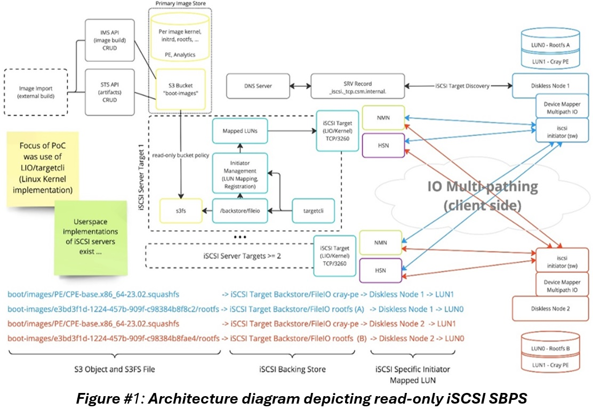
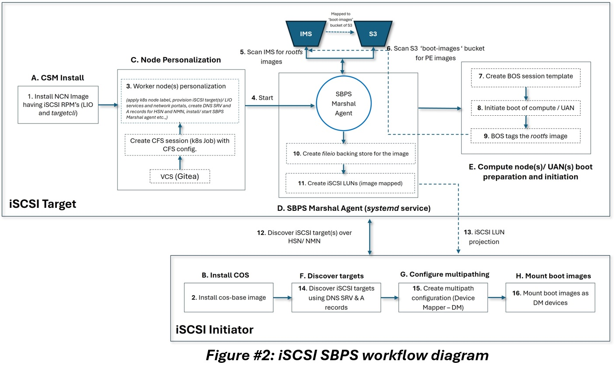

# iSCSI SBPS (Scalable Boot Content Projection Service)

* [Introduction](#introduction)
* [iSCSI SBPS solution details](#iscsi-sbps-solution-details)
* [Steps to achieve SBPS](#steps-to-achieve-sbps)
* [Glossary](#glossary)

## Introduction

iSCSI based boot content projection solution named Scalable Boot Content Projection Service (SBPS)
is a boot content projection solution that replaces the Cray
[Content Projection Service (CPS)](../../glossary.md#content-projection-service-cps) and
[Data Virtualization Service (DVS)](../../glossary.md#data-virtualization-service-dvs).
SBPS projects boot content like `rootfs` and [Cray Programming Environment (CPE)](../../glossary.md#cray-programming-environment-cpe) images.
SBPS is aimed to offer better reliability, availability, security, ease and speed of deployment and ease of management than CPS/DVS.
SBPS was introduced in CSM 1.6. In CSM 1.7.0 support is removed for projecting root filesystems and PE images using
CPS and DVS. Also, in CSM 1.7.0, the iSCSI SBPS selective worker node personalization feature is introduced.

The SBPS solution is spread across different components, including:

* [Boot Orchestration Service (BOS)](../../glossary.md#boot-orchestration-service-bos)
* [User Services Software (USS)](../../glossary.md#user-services-software-uss)
* The core service SBPS Marshal Agent is delivered as an RPM that gets deployed by the
  [Configuration Framework Service (CFS)](../../glossary.md#configuration-framework-service-cfs)

### Key features

* Provides open source friendly solution for read-only content projection (`rootfs` and `PE`) as it uses LIO (Linux IO) which is open source.
* Horizontally scalable content projection service (iSCSI target side)
* Delivers active/active IO operation from iSCSI initiator(s) to content projection service
* Delivers seamless failover and failback for iSCSI initiator(s) on iSCSI target(s) or partial network failure
* Supports projection over [High Speed Network (HSN)](../../glossary.md#high-speed-network-hsn) and
  [Node Management Network (NMN)](../../glossary.md#node-management-network-nmn) without significant reconfiguration
* Does not require additional hardware infrastructure (iSCSI target)
* Co-exists with DVS
* Enables future work related to image access control, [multi-tenancy](../multi-tenancy/Overview.md),
  and related zero trust principles
* Does not require duplication of images from [S3](../../glossary.md#simple-storage-service-s3)
* Supports monitoring for performance and reliability engineering
* Aligns with future plans for similar functionality in next generation systems management solutions
* Easy to deploy and manage

**Note:** Using HSN for boot content projection is recommended, and use NMN for any debugging purposes.
In the case that the HSN is not configured, use the NMN if it meets the bandwidth requirements.

## iSCSI SBPS solution details



As shown in figure #1, the basic configuration involves two iSCSI target/server (worker node) nodes
and two iSCSI initiators/clients (compute nodes or UANs) connected via HSN and/or NMN where I/O multipath
is configured. The `rootfs` and `PE` images are hosted in the [Image Management Service (IMS)](../../glossary.md#image-management-service-ims)
and S3 respectively and both of these images are mapped to `boot-images` bucket of S3. DNS records are created and used for target node
discovery from an initiator node during its boot.

### iSCSI target/server

* Standard Linux kernel
* `s3fs` to mount the `boot-images` bucket onto the worker node
* LIO (Linux IO) - an open-source implementation of SCSI target which supports `fileio` backing store
* `targetcli` - LIO command-line interface to manage iSCSI devices like creation of `LUNs`, listing of `LUNs`, creation of `fileio backstore`,
  saving/clearing the configuration, and so on
* The SBPS core service named SBPS Marshal Agent runs as a Linux `systemd` service
    * The agent scans IMS and S3 storage for `rootfs` and `PE` images
    * It creates `fileio backing store` for the images to be projected
    * The `rootfs` images to be projected are tagged by BOS when the boot of initiator nodes is triggered
    * Then the agent creates iSCSI `LUNs` for each of the `fileio` backing store where the images to be projected are mapped to these `LUNs`

### iSCSI initiator/client

* Standard Linux kernel
* User space iSCSI initiator services
* DM (Device Mapper) multipath software
* DNS SRV and A records are used to discover the target nodes during the boot and are part of BOS session template boot parameters
    * This BOS session template is used to trigger the boot of initiator nodes
    * The `LUNs` created on the target node which has the `rootfs`/ `PE` images mapped are thus projected to initiator nodes when the boot is triggered
    * Basically, the `rootfs` image projected is used as part of booting the initiator node and `PE` images projected are used post boot
    * These `LUNs` get mounted onto the initiator node as DM multipath `LUNs`
    * DM multipath software provides I/O multipath for high availability (failover and failback) and I/O load balancing



(`ncn-w#`) Example output snippet of `targetcli ls` command on worker node where iSCSI LUNS are created for the images scanned:

```bash
targetcli ls
```

```text
o- / ......................................................................................................................... [...]
  o- backstores .............................................................................................................. [...]
  | o- block .................................................................................................. [Storage Objects: 0]
  | o- fileio ................................................................................................ [Storage Objects: 28]
  | | o- 0331b9aaef49840 ......... [/var/lib/cps-local/boot-images/PE/CPE-amd.x86_64-24.03.squashfs (122.2MiB) write-thru activated]
  | | | o- alua ................................................................................................... [ALUA Groups: 1]
  | | |   o- default_tg_pt_gp ....................................................................... [ALUA state: Active/optimized]
  | | o- 0f3847fd8e25624 ....... [/var/lib/cps-local/boot-images/PE/CPE-intel.x86_64-24.03.squashfs (114.8MiB) write-thru activated]
  | | | o- alua ................................................................................................... [ALUA Groups: 1]
  | | |   o- default_tg_pt_gp ....................................................................... [ALUA state: Active/optimized]
  | | o- 1373e69e2028baa ......... [/var/lib/cps-local/boot-images/PE/CPE-amd.x86_64-24.11.squashfs (503.4MiB) write-thru activated]
  | | | o- alua ................................................................................................... [ALUA Groups: 1]
  | | |   o- default_tg_pt_gp ....................................................................... [ALUA state: Active/optimized]
  | | o- 2babe2c96d6f900 ......... [/var/lib/cps-local/boot-images/PE/CPE-base.aarch64-23.12.squashfs (1.9GiB) write-thru activated]
  | | | o- alua ................................................................................................... [ALUA Groups: 1]
  | | |   o- default_tg_pt_gp ....................................................................... [ALUA state: Active/optimized]
  | | o- 380840014ffe295  [/var/lib/cps-local/boot-images/f731d8d5-0fed-41d7-996e-6a0d19b6ff6d/rootfs (10.8GiB) write-thru activated]
  | | | o- alua ................................................................................................... [ALUA Groups: 1]
  | | |   o- default_tg_pt_gp ....................................................................... [ALUA state: Active/optimized]
  | | o- 719593b460753ac ........ [/var/lib/cps-local/boot-images/PE/CPE-aocc.x86_64-24.11.squashfs (131.6MiB) write-thru activated]
  | | | o- alua ................................................................................................... [ALUA Groups: 1]
  | | |   o- default_tg_pt_gp ....................................................................... [ALUA state: Active/optimized]
  | | o- 76e638d3bfc3107 ...... [/var/lib/cps-local/boot-images/PE/CPE-nvidia.aarch64-23.12.squashfs (64.0KiB) write-thru activated]
  | | | o- alua ................................................................................................... [ALUA Groups: 1]
  | | |   o- default_tg_pt_gp ....................................................................... [ALUA state: Active/optimized]
  | | o- 7c0bba5c5301c97  [/var/lib/cps-local/boot-images/5b43428e-4381-4f39-9335-6dababb76d86/rootfs (2.9GiB) write-thru activated]
  | | | o- alua ................................................................................................... [ALUA Groups: 1]
  | | |   o- default_tg_pt_gp ....................................................................... [ALUA state: Active/optimized]
  | | o- 7cccd5c7adc8cc6 ....... [/var/lib/cps-local/boot-images/PE/CPE-intel.x86_64-23.12.squashfs (114.4MiB) write-thru activated]
  | | | o- alua ................................................................................................... [ALUA Groups: 1]
  | | |   o- default_tg_pt_gp ....................................................................... [ALUA state: Active/optimized]
  | | o- 818ff2c161855b6 ........ [/var/lib/cps-local/boot-images/PE/CPE-aocc.x86_64-24.03.squashfs (117.9MiB) write-thru activated]
  | | | o- alua ................................................................................................... [ALUA Groups: 1]
  | | |   o- default_tg_pt_gp ....................................................................... [ALUA state: Active/optimized]
  | | o- 85801b9e9c9cea7 ......... [/var/lib/cps-local/boot-images/PE/CPE-base.aarch64-24.03.squashfs (2.0GiB) write-thru activated]
  | | | o- alua ................................................................................................... [ALUA Groups: 1]
  | | |   o- default_tg_pt_gp ....................................................................... [ALUA state: Active/optimized]
  | | o- 8edfc76b6dae21f ...... [/var/lib/cps-local/boot-images/PE/CPE-nvidia.x86_64-24.03.squashfs (134.1MiB) write-thru activated]
  | | | o- alua ................................................................................................... [ALUA Groups: 1]
  | | |   o- default_tg_pt_gp ....................................................................... [ALUA state: Active/optimized]
  | | o- 953aa229aafffa6 ....... [/var/lib/cps-local/boot-images/PE/CPE-intel.x86_64-24.11.squashfs (128.6MiB) write-thru activated]
  | | | o- alua ................................................................................................... [ALUA Groups: 1]
  | | |   o- default_tg_pt_gp ....................................................................... [ALUA state: Active/optimized]
  | | o- 979b7868c15ee00 ...... [/var/lib/cps-local/boot-images/PE/CPE-nvidia.x86_64-23.12.squashfs (123.2MiB) write-thru activated]
  | | | o- alua ................................................................................................... [ALUA Groups: 1]
  | | |   o- default_tg_pt_gp ....................................................................... [ALUA state: Active/optimized]
  | | o- 9de1fe8a016602f ......... [/var/lib/cps-local/boot-images/PE/CPE-base.aarch64-24.07.squashfs (2.0GiB) write-thru activated]
  | | | o- alua ................................................................................................... [ALUA Groups: 1]
  | | |   o- default_tg_pt_gp ....................................................................... [ALUA state: Active/optimized]
  | | o- 9f7ee65eadd1d3c ..... [/var/lib/cps-local/boot-images/PE/CPE-nvidia.aarch64-24.07.squashfs (272.3MiB) write-thru activated]
  | | | o- alua ................................................................................................... [ALUA Groups: 1]
  | | |   o- default_tg_pt_gp ....................................................................... [ALUA state: Active/optimized]
  | | o- a50dd52157e1636 ......... [/var/lib/cps-local/boot-images/PE/CPE-amd.x86_64-23.12.squashfs (121.9MiB) write-thru activated]
  | | | o- alua ................................................................................................... [ALUA Groups: 1]
  | | |   o- default_tg_pt_gp ....................................................................... [ALUA state: Active/optimized]
  | | o- a6db212e5a329fa .......... [/var/lib/cps-local/boot-images/PE/CPE-base.x86_64-24.03.squashfs (2.4GiB) write-thru activated]
  | | | o- alua ................................................................................................... [ALUA Groups: 1]
  | | |   o- default_tg_pt_gp ....................................................................... [ALUA state: Active/optimized]
  | | o- aac0f352b7a30d6 ....... [/var/lib/cps-local/boot-images/PE/CPE-intel.x86_64-24.07.squashfs (110.1MiB) write-thru activated]
  | | | o- alua ................................................................................................... [ALUA Groups: 1]
  | | |   o- default_tg_pt_gp ....................................................................... [ALUA state: Active/optimized]
  | | o- b91b33a9f98a0be ........ [/var/lib/cps-local/boot-images/PE/CPE-aocc.x86_64-24.07.squashfs (113.2MiB) write-thru activated]
  | | | o- alua ................................................................................................... [ALUA Groups: 1]
  | | |   o- default_tg_pt_gp ....................................................................... [ALUA state: Active/optimized]
  | | o- c1d98cf92b0647f ........ [/var/lib/cps-local/boot-images/PE/CPE-aocc.x86_64-23.12.squashfs (117.9MiB) write-thru activated]
  | | | o- alua ................................................................................................... [ALUA Groups: 1]
  | | |   o- default_tg_pt_gp ....................................................................... [ALUA state: Active/optimized]
  | | o- cfaa140ac182849 ...... [/var/lib/cps-local/boot-images/PE/CPE-nvidia.x86_64-24.07.squashfs (333.5MiB) write-thru activated]
  | | | o- alua ................................................................................................... [ALUA Groups: 1]
  | | |   o- default_tg_pt_gp ....................................................................... [ALUA state: Active/optimized]
  | | o- d265658496338c0 ......... [/var/lib/cps-local/boot-images/PE/CPE-amd.x86_64-24.07.squashfs (298.2MiB) write-thru activated]
  | | | o- alua ................................................................................................... [ALUA Groups: 1]
  | | |   o- default_tg_pt_gp ....................................................................... [ALUA state: Active/optimized]
  | | o- d797313856f7502 .......... [/var/lib/cps-local/boot-images/PE/CPE-base.x86_64-24.07.squashfs (2.4GiB) write-thru activated]
  | | | o- alua ................................................................................................... [ALUA Groups: 1]
  | | |   o- default_tg_pt_gp ....................................................................... [ALUA state: Active/optimized]
  | | o- da65cccd2e89d0c ...... [/var/lib/cps-local/boot-images/PE/CPE-nvidia.x86_64-24.11.squashfs (555.7MiB) write-thru activated]
  | | | o- alua ................................................................................................... [ALUA Groups: 1]
  | | |   o- default_tg_pt_gp ....................................................................... [ALUA state: Active/optimized]
  | | o- de4cc04e7dacfb9 .......... [/var/lib/cps-local/boot-images/PE/CPE-base.x86_64-24.11.squashfs (7.7GiB) write-thru activated]
  | | | o- alua ................................................................................................... [ALUA Groups: 1]
  | | |   o- default_tg_pt_gp ....................................................................... [ALUA state: Active/optimized]
  | | o- e41757ef248d642 .......... [/var/lib/cps-local/boot-images/PE/CPE-base.x86_64-23.12.squashfs (2.4GiB) write-thru activated]
  | | | o- alua ................................................................................................... [ALUA Groups: 1]
  | | |   o- default_tg_pt_gp ....................................................................... [ALUA state: Active/optimized]
  | | o- e837346fddf2004 ...... [/var/lib/cps-local/boot-images/PE/CPE-nvidia.aarch64-24.03.squashfs (92.5MiB) write-thru activated]
  | |   o- alua ................................................................................................... [ALUA Groups: 1]
  | |     o- default_tg_pt_gp ....................................................................... [ALUA state: Active/optimized]
  | o- pscsi .................................................................................................. [Storage Objects: 0]
  | o- ramdisk ................................................................................................ [Storage Objects: 0]
  o- iscsi ............................................................................................................ [Targets: 1]
  | o- iqn.2023-06.csm.iscsi:ncn-w002 .................................................................................... [TPGs: 1]
  |   o- tpg1 .................................................................................................. [gen-acls, no-auth]
  |     o- acls .......................................................................................................... [ACLs: 0]
  |     o- luns ......................................................................................................... [LUNs: 28]
  |     | o- lun0 .... [fileio/a50dd52157e1636 (/var/lib/cps-local/boot-images/PE/CPE-amd.x86_64-23.12.squashfs) (default_tg_pt_gp)]
  |     | o- lun1 .... [fileio/0331b9aaef49840 (/var/lib/cps-local/boot-images/PE/CPE-amd.x86_64-24.03.squashfs) (default_tg_pt_gp)]
  |     | o- lun2 .... [fileio/d265658496338c0 (/var/lib/cps-local/boot-images/PE/CPE-amd.x86_64-24.07.squashfs) (default_tg_pt_gp)]
  |     | o- lun3 .... [fileio/1373e69e2028baa (/var/lib/cps-local/boot-images/PE/CPE-amd.x86_64-24.11.squashfs) (default_tg_pt_gp)]
  |     | o- lun4 ... [fileio/c1d98cf92b0647f (/var/lib/cps-local/boot-images/PE/CPE-aocc.x86_64-23.12.squashfs) (default_tg_pt_gp)]
  |     | o- lun5 ... [fileio/818ff2c161855b6 (/var/lib/cps-local/boot-images/PE/CPE-aocc.x86_64-24.03.squashfs) (default_tg_pt_gp)]
  |     | o- lun6 ... [fileio/b91b33a9f98a0be (/var/lib/cps-local/boot-images/PE/CPE-aocc.x86_64-24.07.squashfs) (default_tg_pt_gp)]
  |     | o- lun7 ... [fileio/719593b460753ac (/var/lib/cps-local/boot-images/PE/CPE-aocc.x86_64-24.11.squashfs) (default_tg_pt_gp)]
  |     | o- lun8 .. [fileio/2babe2c96d6f900 (/var/lib/cps-local/boot-images/PE/CPE-base.aarch64-23.12.squashfs) (default_tg_pt_gp)]
  |     | o- lun9 .. [fileio/85801b9e9c9cea7 (/var/lib/cps-local/boot-images/PE/CPE-base.aarch64-24.03.squashfs) (default_tg_pt_gp)]
  |     | o- lun10 . [fileio/9de1fe8a016602f (/var/lib/cps-local/boot-images/PE/CPE-base.aarch64-24.07.squashfs) (default_tg_pt_gp)]
  |     | o- lun11 .. [fileio/e41757ef248d642 (/var/lib/cps-local/boot-images/PE/CPE-base.x86_64-23.12.squashfs) (default_tg_pt_gp)]
  |     | o- lun12 .. [fileio/a6db212e5a329fa (/var/lib/cps-local/boot-images/PE/CPE-base.x86_64-24.03.squashfs) (default_tg_pt_gp)]
  |     | o- lun13 .. [fileio/d797313856f7502 (/var/lib/cps-local/boot-images/PE/CPE-base.x86_64-24.07.squashfs) (default_tg_pt_gp)]
  |     | o- lun14 .. [fileio/de4cc04e7dacfb9 (/var/lib/cps-local/boot-images/PE/CPE-base.x86_64-24.11.squashfs) (default_tg_pt_gp)]
  |     | o- lun15 . [fileio/7cccd5c7adc8cc6 (/var/lib/cps-local/boot-images/PE/CPE-intel.x86_64-23.12.squashfs) (default_tg_pt_gp)]
  |     | o- lun16 . [fileio/0f3847fd8e25624 (/var/lib/cps-local/boot-images/PE/CPE-intel.x86_64-24.03.squashfs) (default_tg_pt_gp)]
  |     | o- lun17 . [fileio/aac0f352b7a30d6 (/var/lib/cps-local/boot-images/PE/CPE-intel.x86_64-24.07.squashfs) (default_tg_pt_gp)]
  |     | o- lun18 . [fileio/953aa229aafffa6 (/var/lib/cps-local/boot-images/PE/CPE-intel.x86_64-24.11.squashfs) (default_tg_pt_gp)]
  |     | o- lun19  [fileio/76e638d3bfc3107 (/var/lib/cps-local/boot-images/PE/CPE-nvidia.aarch64-23.12.squashfs) (default_tg_pt_gp)]
  |     | o- lun20  [fileio/e837346fddf2004 (/var/lib/cps-local/boot-images/PE/CPE-nvidia.aarch64-24.03.squashfs) (default_tg_pt_gp)]
  |     | o- lun21  [fileio/9f7ee65eadd1d3c (/var/lib/cps-local/boot-images/PE/CPE-nvidia.aarch64-24.07.squashfs) (default_tg_pt_gp)]
  |     | o- lun22  [fileio/979b7868c15ee00 (/var/lib/cps-local/boot-images/PE/CPE-nvidia.x86_64-23.12.squashfs) (default_tg_pt_gp)]
  |     | o- lun23  [fileio/8edfc76b6dae21f (/var/lib/cps-local/boot-images/PE/CPE-nvidia.x86_64-24.03.squashfs) (default_tg_pt_gp)]
  |     | o- lun24  [fileio/cfaa140ac182849 (/var/lib/cps-local/boot-images/PE/CPE-nvidia.x86_64-24.07.squashfs) (default_tg_pt_gp)]
  |     | o- lun25  [fileio/da65cccd2e89d0c (/var/lib/cps-local/boot-images/PE/CPE-nvidia.x86_64-24.11.squashfs) (default_tg_pt_gp)]
  |     | o- lun26  [fileio/7c0bba5c5301c97 (/var/lib/cps-local/boot-images/5b43428e-4381-4f39-9335-6dababb76d86/rootfs) (default_tg_pt_gp)]
  |     | o- lun27  [fileio/380840014ffe295 (/var/lib/cps-local/boot-images/f731d8d5-0fed-41d7-996e-6a0d19b6ff6d/rootfs) (default_tg_pt_gp)]
  |     o- portals .................................................................................................... [Portals: 3]
  |       o- 10.102.104.28:3260 ............................................................................................... [OK]
  |       o- 10.150.0.4:3260 .................................................................................................. [OK]
  |       o- 10.252.1.13:3260 ................................................................................................. [OK]
  o- loopback ......................................................................................................... [Targets: 0]
  o- vhost ............................................................................................................ [Targets: 0]
  o- xen-pvscsi ....................................................................................................... [Targets: 0]
```

The above `targetcli ls` command output shows the following:

* Four `fileio` backing store are created for two `rootfs` images
* Two iSCSI `LUNs` are created which have the `rootfs` image ID being mapped
* 26 `PE` or `squashfs` `fileio` backing store are created
* 26 iSCSI `LUNs` created which have the `PE` or `squashfs` image ID being mapped
* These iSCSI `LUNs` are ready for projection

(`nid#`) Sample initiator node snippet after the projection:

```bash
multipath -ll
```

```text
11218.831779 | /etc/multipath.conf line 10: ignoring deprecated option "disable_changed_wwids", using built-in value: "yes"
PE_CPE-base.x86_64-24.11.squashfs (36001405de4cc04e7dacfb9ada0a6b4cc) dm-0 LIO-ORG,de4cc04e7dacfb9
size=7.7G features='1 queue_if_no_path' hwhandler='1 alua' wp=ro
`-+- policy='round-robin 0' prio=50 status=active
  |- 1:0:0:14 sdo  8:224  active ready running
  |- 2:0:0:14 sdaq 66:160 active ready running
  |- 3:0:0:14 sdbs 68:96  active ready running
  `- 4:0:0:14 sdcu 70:32  active ready running
f731d8d5-0fed-41d7-996e-6a0d19b6ff6d_rootfs (36001405380840014ffe295091e8689db) dm-24 LIO-ORG,380840014ffe295
size=11G features='1 queue_if_no_path' hwhandler='1 alua' wp=ro
`-+- policy='round-robin 0' prio=50 status=active
  |- 1:0:0:27 sdab 65:176 active ready running
  |- 2:0:0:27 sdbd 67:112 active ready running
  |- 3:0:0:27 sdcf 69:48  active ready running
  `- 4:0:0:27 sddh 70:240 active ready running
```

## Steps to achieve SBPS

1. [Worker node personalization](#1-worker-node-personalization)
1. [Run GOSS test suite](#2-run-goss-test-suite)
1. [Create BOS session template](#3-create-bos-session-template)
1. [IMS image tagging](#4-ims-image-tagging)
1. [Boot compute nodes or UANs](#5-boot-compute-nodes-or-uans)
1. [Monitor iSCSI metrics](#6-monitor-iscsi-metrics)

### 1. Worker node personalization

Node personalization is the prerequisite step of SBPS solution where we need to first setup/configure worker nodes as iSCSI targets (servers)
with necessary provisioning, configuration and enable required components. The required RPMs for `targetcli` command / LIO are part of NCN node image.
The SBPS Marshal Agent gets installed during node personalization using CFS.

#### Selective worker node personalization

In CSM 1.6, all worker nodes are configured and enabled as iSCSI SBPS targets using
[Management Node Personalization](../configuration_management/Management_Node_Personalization.md)

Starting in CSM 1.7.0, selective iSCSI worker node personalization is introduced.
All worker nodes are still **configured** for iSCSI, but selective node personalization gives
administrators control over which worker nodes are enabled as iSCSI SBPS targets.

The default behavior is still the same as in CSM 1.6, so if no action is taken to use this
feature, then all worker nodes will continue to be enabled as iSCSI targets.

For details on iSCSI selective worker node personalization, 
see [Managing selective node personalization](Managing_selective_node_personalization.md).

#### Automatic setup with bootprep

By default worker node personalization of iSCSI SBPS is done during CSM install/upgrade
(using the [Install and Upgrade Framework (IUF)](../../glossary.md#install-and-upgrade-framework-iuf)).
It is initiated during bootprep (`management-nodes-rollout`) in order to do worker node personalization
automatically during boot time.

After the workers have run node personalization, administrators may verify the iSCSI configuration
using [Node Personalization Verification](Node_Personalization_Verification.md)

### 2. Run GOSS test suite

In order to verify the readiness of the iSCSI targets before triggering the boot of compute nodes or
UANs, it is important to run GOSS tests as sanity checks on iSCSI targets.

Refer to [GOSS tests for SBPS](https://github.com/Cray-HPE/sbps-
marshal/blob/main/GOSS_tests_for_sbps.md) for the details.

### 3. Create BOS session template

Once the node personalization is done and GOSS tests are run successfully, create BOS Session Template with SBPS boot parameters.

There are two ways to create BOS session template:

#### Using BOS directly

For details, refer to
[Create a Session Template to Boot Compute Nodes with SBPS](../boot_orchestration/Create_a_Session_Template_to_Boot_Compute_Nodes_with_SBPS.md).

#### Using SAT

1. (`ncn-mw#`) Obtain system name and site domain.

    * System name

        ```bash
        craysys metadata get system-name
        ```

    * Site domain

        ```bash
        craysys metadata get site-domain
        ```

1. (`ncn-mw#`) Populate above values into `product_vars.yaml` and then create BOS session template using `sat` command.

    For example:

    ```bash
    sat bootprep run --vars-file "session_vars.yaml" --format json --bos-version v2 .bootprep-csm-1.6.0/compute-and-uan-bootprep.yaml
    ```

Refer to [SAT Bootprep](../system_admin_toolkit/usage/SAT_Bootprep.md) for further details.

**Note:** This way of creating BOS session template uses `vcs/bootprep/compute-and-uan-bootprep.yaml` where SBPS will be chosen by default.

### 4. IMS image tagging

To initiate the boot of compute nodes or UANs, the images (`rootfs`/ `PE` ) are tagged to determine which
`rootfs`/ `PE` image is to be projected.
The SBPS Marshal agent uses key/value pair of `sbps-project`/`true` to identify the images tagged.

#### `rootfs` image tagging

The `rootfs` images are tagged by BOS automatically when the boot of computes nodes or UANs is initiated.
Refer to
[BOS Workflows](../boot_orchestration/BOS_Workflows.md) for details.
It is also possible to tag the `rootfs` images in IMS manually using the Cray CLI.

#### PE image tagging

To tag the `PE` images, first import the `PE` image to IMS, and then use the Cray CLI to tag it in IMS.
Refer [Import External Image to IMS](../image_management/Import_External_Image_to_IMS.md) for the steps to import an image to IMS.

For details on how to add or remove an IMS image tag using the Cray CLI, refer to
[Manage image labels](../image_management/Image_Management_Workflows.md#manage-image-labels).

Below are few examples.

##### Add IMS image tag

(`ncn-mw#`) Tag IMS image with ID `bbe0e9eb-fa8f-4896-9f54-95dbd26de9bb`.

```bash
cray ims images update bbe0e9eb-fa8f-4896-9f54-95dbd26de9bb --metadata-operation set --metadata-key sbps-project --metadata-value true
```

##### Describe IMS image

(`ncn-mw#`) Describe IMS image with ID `bbe0e9eb-fa8f-4896-9f54-95dbd26de9bb`.

```bash
cray ims images describe bbe0e9eb-fa8f-4896-9f54-95dbd26de9bb --format json
```

Example output:

```format json
{
  "arch": "x86_64",
  "created": "2024-07-18T22:05:16.565885",
  "id": "bbe0e9eb-fa8f-4896-9f54-95dbd26de9bb",
  "link": {
    "etag": "3325f830ba9ec291005a4087be4f666f",
    "path": "s3://boot-images/bbe0e9eb-fa8f-4896-9f54-95dbd26de9bb/manifest.json",
    "type": "s3"
  },
  "metadata": {
    "sbps-project": "true"  <---------------- Tagged with key/value pair sbps-project/true
  },
  "name": "secure-storage-ceph-6.1.94-x86_64.squashfs"
}
```

##### Remove IMS image tag

(`ncn-mw#`) Remove tag from IMS image with ID `bbe0e9eb-fa8f-4896-9f54-95dbd26de9bb`.

```bash
cray ims images update bbe0e9eb-fa8f-4896-9f54-95dbd26de9bb --metadata-operation remove --metadata-key sbps-project
```

> * Only remove tags from images that are not currently in use. Removing tags from images that are currently in use will
>   stop the content projection by SBPS Marshal agent, causing undesirable behavior on compute nodes or UANs using the content.
> * As mentioned in [`rootfs` image tagging](#rootfs-image-tagging), BOS automatically tags the `rootfs` image for projection.
>   BOS does not support automatically removing the tag, so it must be done manually.

### 5. Boot compute nodes or UANs

Follow the below steps in order to boot compute nodes or UANs.

#### Single node

(`ncn-mw#`) Use a command similar to the following to boot a single node.

```bash
cray bos sessions create --template-name <bos_session_template_name> --operation reboot --limit <xname_of_the_node>
```

For example, the following command creates a BOS session to boot the node with xname `x3000c0s19b2n0` using the BOS session template named `sbps-bos-template`.

```bash
cray bos sessions create --template-name sbps-bos-template --operation reboot --limit x3000c0s19b2n0
```

#### Multiple nodes

(`ncn-mw#`) Use a command similar to the following to boot every node targeted by a session template.

```bash
cray bos sessions create --template-name <bos_session_template_name> --operation reboot
```

#### Node console

For more information on accessing the consoles of the booting nodes, see:

* [Access Compute Node Logs](../conman/Access_Compute_Node_Logs.md)
* [Log in to a Node Using ConMan](../conman/Log_in_to_a_Node_Using_ConMan.md)

When booting compute nodes or UANs without the `--limit` option, the boot is triggered for all the nodes targeted by the session template.
It is necessary to open the console for each node separately.

### 6. Monitor iSCSI metrics

In order to monitor iSCSI SBPS target statistics, one may monitor metrics series like aggregate LUN read rate, read rate per LUN, throughput
statistics on LIO portal network endpoints, and so on.

Refer to [iSCSI Metrics](https://github.com/Cray-HPE/sbps-marshal/blob/main/iscsi_metrics.md) for details.

## Glossary

* iSCSI client: A client which initiates I/O requests and receives responses from iSCSI target
* iSCSI target: A server that responds to iSCSI commands and hosts storage resources
