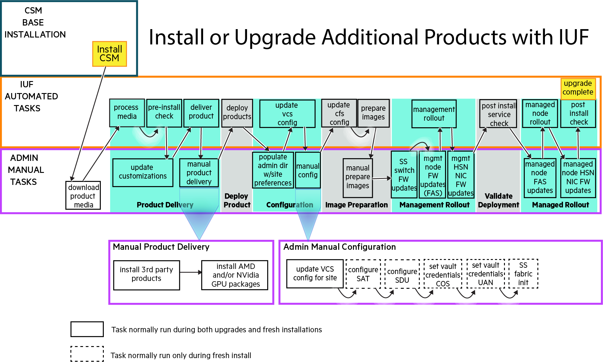

# Install or upgrade additional products with IUF

This procedure is used to accomplish either of the following:

- Initial installation of additional HPE Cray EX software products on an HPE Cray EX system on which
  CSM is already installed.
- Upgrade of additional HPE Cray EX software products when CSM itself is not being upgraded.

This procedure is _not_ used to perform an upgrade of CSM and additional HPE Cray EX software
products. See [Upgrade CSM and additional products with IUF](upgrade_csm_and_additional_products_with_iuf.md)
for that procedure.

All stages of `iuf` are executed in this procedure. All of the new product software provided in the
recipe release is deployed and all management NCNs and managed compute and application nodes are
rebooted to new images and CFS configurations. Manual operations are documented for procedures that
are not currently managed by IUF.

The initial install workflow comprises the following procedures. The diagram shows the workflow and
the steps below it provide detailed instructions which must be executed in the order shown.

1. Perform an install of CSM

   **`NOTE`** Skip this step if CSM is already installed.

   Follow the [Cray System Management Install](../../../install/README.md) instructions

1. Prepare for the install procedure and download product media

   1. Follow the IUF [Prepare for the install or upgrade](preparation.md) instructions to set
      environment variables used during the install process

   1. Download the desired HPE product media defined by the HPC CSM Software Recipe to `${MEDIA_DIR}`, which was defined in the previous step

1. Product Delivery

   Follow the IUF [Product delivery](product_delivery.md) instructions

1. Deploy product

   Follow the IUF [Deploy product](deploy_product.md) instructions

1. Configuration

   Follow these IUF instructions in order:

   1. [Configuration](configuration.md)
   1. [Manual configuration of the Slingshot Fabric Manager](configuration_of_SFM.md)

1. Image preparation

   Follow the IUF [Image preparation](image_preparation.md) instructions

1. Management Rollout

   Follow the IUF [Management rollout](management_rollout.md) instructions

1. Validate deployment

   Follow the IUF [Validate deployment](validate_deployment.md) instructions

1. Managed rollout

   Follow the IUF [Managed rollout](managed_rollout.md) instructions

The IUF initial install workflow is now complete. Exit any typescript sessions created during the
install procedure and remove any installation artifacts, if desired.
