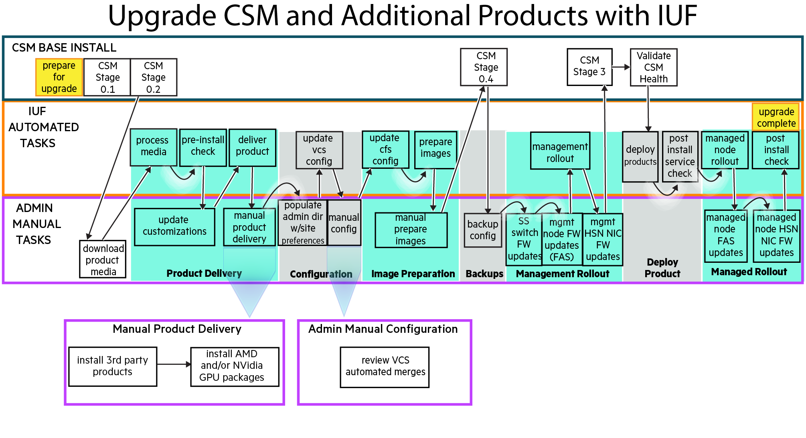

# Upgrade CSM and additional products with IUF

This procedure is used when performing an upgrade of Cray System Management (CSM) along with
additional HPE Cray EX software products at the same time. This procedure would be used when
upgrading from one HPC CSM Software Recipe release to another.

This procedure is _not_ used to perform an initial install or upgrade of HPE Cray EX software products
when CSM itself is not being upgraded. See
[Install or upgrade additional products with IUF](install_or_upgrade_additional_products_with_iuf.md) for that procedure.

This procedure streamlines the rollout of new images to management nodes. These images are based
on the new images provided by the CSM product and customized by the additional HPE Cray EX software
products, including the Cray Operating System (COS) and Slingshot Host Software (SHS).

The steps in this procedure alternate between CSM upgrade instructions that do not utilize the IUF
and instructions for upgrading additional HPE Cray EX software products whose installation is
managed by the IUF.

All stages of `iuf` are executed in this procedure. All of the new product software provided in the
recipe release is deployed and all management NCNs and managed compute and application nodes are
rebooted to new images and CFS configurations. Manual operations are documented for procedures that
are not currently managed by IUF.

The upgrade workflow comprises the following procedures. The diagram shows the workflow and
the steps below it provide detailed instructions which must be executed in the order shown.

1. CSM preparation, Stage 0.1, and Stage 0.2
   Read the _Important Notes_ section of the
   [CSM 1.4.0 or later to 1.5.0 Upgrade Process](../../../upgrade/Upgrade_Management_Nodes_and_CSM_Services.md)
   documentation and then follow only these CSM instructions in order:

   1. [Prepare for Upgrade](../../../upgrade/prepare_for_upgrade.md)
   1. [Stage 0.1 - Prepare assets](../../../upgrade/Stage_0_Prerequisites.md#stage-01---prepare-assets)
   1. [Stage 0.2 - Prerequisites](../../../upgrade/Stage_0_Prerequisites.md#stage-02---prerequisites)

1. Prepare for the upgrade procedure and download product media

   1. Follow the IUF [Prepare for the install or upgrade](preparation.md) instructions to set
      environment variables used during the upgrade process

   1. Download the desired HPE product media defined by the HPC CSM Software Recipe to `${MEDIA_DIR}`, which was defined in the previous step

1. Product delivery

   Follow the IUF [Product delivery](product_delivery.md) instructions

1. Configuration

   Follow the IUF [Configuration](configuration.md) instructions

1. Image preparation

   Follow the IUF [Image preparation](image_preparation.md) instructions

1. CSM Stage 0.4

   Follow the CSM
   [Stage 0.4 - Backup workload manager data](../../../upgrade/Stage_0_Prerequisites.md#stage-04---backup-workload-manager-data)
   instructions

1. Backup

   Follow the IUF [Backup](backup.md) instructions

1. Management rollout

   Follow the IUF [Management rollout](management_rollout.md) instructions

1. CSM Stage 3 and CSM health validation

   Follow these CSM instructions in order:

   1. [Stage 3 - CSM Service Upgrades](../../../upgrade/Stage_3.md)
   1. [Validate CSM Health During Upgrade](../../../upgrade/Validate_CSM_Health_During_Upgrade.md)

1. Deploy product

   Follow these IUF instructions in order:

   1. [Deploy product](deploy_product.md)
   1. [Validate deployment](validate_deployment.md)

1. Managed rollout

   Follow the IUF [Managed rollout](managed_rollout.md) instructions

The IUF upgrade workflow is now complete. Exit any typescript sessions created during the upgrade
procedure and remove any installation artifacts, if desired.
